# 《机器学习与药物发现：从分子语言到智能体科学》

## 前言

药物发现从来不是一门只靠公式就能解决的学问。它面对的是复杂的生命系统、噪声极大的实验数据、不断变化的疾病目标，以及总是有限的时间、经费和判断力。机器学习之所以进入药物发现，不是因为它提供了某种神奇捷径，而是因为现代药学研究已经复杂到不能只依赖单一学科的经验直觉。面对海量分子空间、异质实验数据和不断扩张的文献体系，研究者必须学会把化学、生物学、统计学、计算机科学乃至科学哲学重新编织成一个可操作的工作流。

这本书不是一本普通的技术教材。它希望同时回答三类问题。第一类问题是技术性的：SMILES、descriptor、fingerprint、graph neural network、transformer、diffusion、flow matching 到底是什么，它们如何被用于药物发现？第二类问题是历史性的：这些方法为什么会在各自的时代出现，它们解决了什么问题，又暴露了什么新问题？第三类问题是思想性的：为什么我们要把分子翻译成数字？为什么一个高分模型可能毫无药学价值？为什么生成模型和智能体系统越强，人越需要保留判断力？

本书综合整理自《机器学习与药物发现_32学时教案.md》和《教案_增强版.docx.md》两份源材料，是完整版本的教材书稿。在教学方法上，本书建议教师结合课堂讨论、案例分析和研究问题设计来组织教学。每章的章节导读和教学建议旨在帮助教师将技术内容与认知训练有机结合。前者提供课程主线、技术脉络和课堂案例，后者赋予这些内容更强的认识论与哲学张力。因此，本书既可以作为药学院教师的授课参考，也可以作为研究生课程、科研导论、实验室读书会和项目设计的起点。它既想帮助读者学会方法，也想帮助读者形成一种更稳健的学术品味：知道何时该相信模型，何时该怀疑模型，何时需把注意力重新拉回到实验、分子和人本身。

本书的写作理念源于对当前药物发现 AI 教材现状的反思。市面上已有的教材大多侧重于技术细节的罗列——模型架构、算法原理、代码实现——而较少关注技术背后的方法论问题和哲学张力。然而，在实际的药物发现研究中，一个研究者的成功往往不取决于他掌握了多少算法，而取决于他能否在正确的时机做出正确的方法论选择：何时该用简单的线性模型而非复杂的深度学习？何时该信任模型的预测而何时该保持怀疑？何时该花更多时间在数据质量而非模型优化上？

本书试图弥补这一鸿沟。每一章都从三个维度展开：技术维度（这个方法是什么、怎么用）、历史维度（它为什么会出现、解决了什么问题）、哲学维度（它的认识论假设是什么、局限性在哪里）。这三个维度共同构成了一个完整的理解框架——不仅让学生知道“怎么做”，更让他们理解“为什么这样做”和“什么时候不该这样做”。

本书特别强调以下几个方面。第一，可重复性意识——从第一章到最后一章，我们始终坚持环境管理、数据治理和结果可追溯的重要性。第二，评价纪律——我们反复强调 scaffold split、外部验证和 calibration 的重要性，反对仅仅依赖 random split 下的高分结果。第三，经典模型的价值——我们不认为深度学习必然优于经典模型，而是坚持在具体的数据条件下进行公平比较。第四，生成模型与判断力的关系——我们强调生成模型的输出永远是新一轮判断的起点，而非终点。第五，智能体系统的治理——我们主张在人机协作中保持人类的判断力和责任归属。

本书采用“前言 + 12 章 + 3 个附录”的结构。正文部分沿着药物发现工作流逐步展开，从环境、表示、评价到经典模型、深度学习、生成设计和智能体闭环；附录则提供环境搭建、RDKit 实操和论文阅读路线，力图让这本书既能启发思维，又能落地操作。

本书采用"前言 + 12 章 + 4 个附录 + 结语"的结构。正文部分沿着药物发现工作流逐步展开：第 1 章建立对机器学习进入药物发现的整体认知框架；第 2 章奠定可重复性的方法论基础（环境搭建、数据管理、版本控制）；第 3-4 章讨论分子的表示与特征化（SMILES、指纹、图表示、三维表示）；第 5 章聚焦评估纪律（任务定义、指标选择、验证策略）；第 6-7 章深入经典模型（线性模型、朴素贝叶斯、SVM、决策树、随机森林、XGBoost）；第 8 章介绍深度学习基础（MLP、CNN、RNN）；第 9 章聚焦图神经网络（消息传递、GCN、GAT、GIN）；第 10 章讨论 Transformer、预训练与多模态基础模型；第 11 章深入生成式药物设计（VAE、扩散模型、flow matching）；第 12 章讨论智能体系统、可解释性、AI 治理与未来实验室。附录提供环境搭建、RDKit 实操、论文阅读路线和术语对照表，力图让这本书既能启发思维，又能落地操作。

每一章都包含十个标准子节：引言（设定问题情境和学习目标）、关键知识（核心概念与术语）、技术与历史（方法演进脉络）、哲学透镜（认识论与科学哲学视角）、研究论文应用（近年重要文献与发现）、具体示例（详细的案例分析与实验设计）、图表与版式建议（教材版面设计指导）、本章总结（核心论点与教学要点）、想象力思考题（开放性问题与讨论引导）和参考论文（推荐文献列表）。这种结构设计旨在让每一章都同时服务于知识传授、方法论训练和批判性思维培养三个目标。


### 本书的使用建议

**针对药学院学生：** 本书的编写从药学实践出发，假设读者具有基础的药理学和有机化学知识，但不要求先修机器学习课程。建议的学习路径是：先阅读第 1-3 章建立整体框架，然后根据课程安排逐章深入。对于数学基础较薄弱的同学，可以暂时跳过公式推导，重点关注直觉理解和药学应用部分，待有更多实践经验后再回顾公式。

**针对计算机科学背景读者：** 本书在介绍机器学习方法时着重强调了药物发现的特殊性——数据噪声大、化学空间偏置、评估标准不同于传统机器学习任务。建议 CS 背景的读者特别关注第 2 章（数据与可复现性）和第 5 章（评估方法学），这些内容在传统 ML 教材中较少涉及。

**针对研究者：** 本书可以作为药物发现 AI 研究的参考手册。每章的"研究论文应用"和"参考论文"部分提供了关键文献的入口。"哲学透镜"和"技术与历史"部分提供了方法论层面的反思，有助于研究者在选题和写作中建立更深刻的问题意识。

**教学课时建议：** 本书配套 32 学时的教案设计。建议的课时分配为：
- 第 1 章（导论）：4 学时
- 第 2 章（环境与可复现性）：2 学时
- 第 3 章（分子表示）：3 学时
- 第 4 章（特征工程）：3 学时
- 第 5 章（评估方法学）：4 学时
- 第 6 章（经典机器学习）：3 学时
- 第 7 章（图神经网络）：3 学时
- 第 8 章（Transformer 与预训练）：3 学时
- 第 9 章（生成式模型）：3 学时
- 第 10 章（AI 驱动管线）：2 学时
- 第 11 章（AI 智能体与治理）：2 学时

每章建议包含 1 小时的课堂讲授和 30 分钟的课堂讨论或编程实践。

### 致谢

本书的内容来源于多年的教学实践和科研探索。感谢所有参与课程的学生——你们的提问和困惑帮助我理解了哪些概念需要更清晰的解释。感谢药物发现 AI 研究社区的开放精神——本领域的研究者普遍愿意分享代码、数据和经验，这种开放文化是本书得以编写的基础。

特别感谢以下资源对本章内容形成的影响：DeepChem 框架的教程和文档、MoleculeNet 基准测试集、Therapeutics Data Commons（TDC）、RDKit 的官方文档和社区论坛、以及 ChEMBL、PubChem 等公共数据库。这些开放资源使得药物发现机器学习的学习和研究门槛大大降低。

本书的错误和不足之处由作者承担全部责任。欢迎读者通过任何渠道提出批评和建议——在快速发展的药物发现 AI 领域，任何教材都需要持续更新和修正。


## 第 1 章 机器学习为何进入药物发现

> 杜威：教育不是为生活做准备，教育本身就是生活。

### 引言

药物发现从经验密集型活动逐步演化为数据密集型活动，是现代生物医学不可逆转的趋势。过去，一个课题组可能依靠有限的分子库、较慢的实验节奏和少数专家的经验推进研究；而今天，公开数据库、高通量筛选、组学数据、结构生物学和自动化平台让研究者面对的是一个远超人脑直接处理能力的知识空间。机器学习正是在这种复杂性爆炸中进入药物发现的。

需要强调的是，机器学习进入药物发现，并不意味着“算法接管科学”。它真正改变的是问题组织方式。原本分散在文献、经验、表格和实验日志中的信息，被要求转化为结构化数据和可检验模型；原本依赖个体判断的候选优先级，被要求变成可以复盘的排序机制；原本模糊的“有希望”分子，被要求变成可量化、可对比的预测对象。这种变化让药物发现从“凭经验前进”转向“凭证据与假设协同前进”。

分子格式的选择直接影响药物发现管线的每一个后续环节。在虚拟筛选中，如果使用 SMILES 作为输入格式，就必须处理标准化问题和同分异构体表示；如果使用 SDF，就需要额外的解析步骤来提取分子图信息；如果使用 InChI，则面临可逆性限制。这些看似细微的格式差异，在工业级药物发现项目中会被放大为显著的数据质量和计算效率问题。
值得特别指出的是，分子特征化的选择与药物发现的具体任务紧密相关。在溶解度预测任务中，描述符方法（如 LogP、TPSA）已经包含了关键信息，而 GNN 的图表示可能不会带来显著提升。但在蛋白-配体结合亲和力预测中，三维几何表示和图表示的引入可以捕获配体与口袋之间的空间互补关系。因此，本章的核心教学目标不是让学生记住所有特征类型，而是培养表示-任务匹配的判断力。
- 描述符的物理化学意义：MolWt 反映分子整体大小，LogP 反映亲脂性，TPSA 反映极性表面积，HBA/HBD 反映氢键能力。Lipinski 的五规则就是基于这些描述符的经验总结。- 指纹的半径与位数参数：Morgan 指纹的 radius 控制邻域范围（半径 2 约对应 4-5 个键的距离），nBits 控制指纹向量的长度（通常 1024 或 2048 位）。
- 校准（calibration）的重要性：一个校准良好的模型不仅给出正确的排序，还应当让预测概率具有实际意义。在药物发现的活性筛选场景中，校准良好的模型可以帮助研究者更准确地估计命中率。- 不确定性量化（uncertainty quantification）：药物发现中的好模型不仅给出点估计，还应能表达预测的不确定性。常见方法包括贝叶斯神经网络、蒙特卡洛 dropout 和集成方法。
- 线性回归在药物发现中的具体应用：除了传统的 QSAR，线性模型还广泛用于构效关系可视化、ADMET 性质的快速筛查以及多任务学习的基础。- 朴素贝叶斯在指纹特征上的独特优势：Morgan 指纹是高维稀疏的二值向量，这种数据结构非常适合朴素贝叶斯的条件独立假设。- 支持向量机的核技巧：通过将数据映射到高维空间，SVM 可以处理非线性分类问题。在药物发现中，RBF 核 SVM 在小样本分类任务中经常表现优异。
- 决策树的分裂准则：信息增益、信息增益率和基尼不纯度是三种最常见的分裂准则。在药物发现中，基尼不纯度通常是最常用的选择。- 梯度提升的核心思想：每一棵新树都致力于拟合前面所有树的预测残差。XGBoost 通过引入正则化项和工程优化显著提升了训练速度和预测性能。- LightGBM 的创新：基于直方图的决策树学习算法通过离散化连续特征大幅降低了分裂点的搜索空间。
- 深度学习的核心哲学：表示学习——让模型从数据中自动发现有用的特征表示，而非依赖人类设计的描述符。- dropout 和 batch normalization 是现代深度学习训练稳定性的两大支柱。
深度学习进入药物发现领域的历史轨迹值得梳理。最早的尝试可以追溯到 2010 年代初，当时研究者开始将多层感知机应用于 QSAR 任务。2015 年左右，基于 SMILES 的序列模型开始涌现，证明了把分子当成语言的隱喻确实具有计算价值。从教学设计角度看，本章的定位不是让学生追逐最新架构，而是帮助他们理解深度学习的条件性——它在什么条件下值得引入。
2024-2025 年关于深度学习在药物发现中的实际效果出现了更冷静的评估。多项研究表明，在小样本条件下，深度学习模型经常不如精心调参的经典模型。2025 年 Chittoria 等人的综述特别指出，在严格的外部验证和 scaffold split 条件下，深度学习的优势远不如随机划分条件下那样显著。
- 消息传递的数学形式：在每一轮消息传递中，每个原子节点收集其邻居的信息，通过可学习的变换更新自己的嵌入表示。经过 T 轮消息传递后，每个原子可以看到距离为 T 的邻居信息。- 图级 pooling 策略：由于大多数药物发现任务需要在分子层面进行预测，需要将节点级嵌入聚合成图级表示。常见方法包括求和、求均值和注意力加权。- GIN 的表达能力：Xu 等人从理论上证明了 GIN 的表达能力等价于 Weisfeiler-Lehman 子树核测试。

药物发现的基本矛盾在于化学空间的巨大性与实验资源的有限性之间的张力。据估计，类药化学空间包含约 10 的 60 次方个分子——这个数字远超可观测宇宙中的原子总数。即使全球所有实验室以最高通量筛选速率运行十万年，也只能覆盖化学空间中极其微小的一部分。机器学习的价值正在于为这种"大海捞针"提供了一种系统化的导航策略：通过学习已知分子与生物活性之间的映射关系，模型可以在未被实验覆盖的化学空间中进行预测，从而将无效搜索压缩到可控范围。

但机器学习在药物发现中的应用远比"输入分子，输出活性预测"复杂。一个完整的药物发现管线涉及靶点识别与验证、命中化合物发现、先导化合物优化、ADMET 性质预测与优化、临床前候选物选择等多个环节，每个环节都有其独特的数据特征和建模挑战。例如，靶点识别通常面对的是基因组学和蛋白质组学的高维数据，命中发现依赖于大规模虚拟筛选的计算效率，先导优化需要精确预测微小的结构变化对活性的影响，而 ADMET 预测则需要处理高度不平衡的毒性数据。这些差异意味着，不存在一个"万能模型"可以覆盖整个药物发现管线——研究者必须根据每个环节的具体数据条件和任务需求来选择和设计模型。

图神经网络之所以在药物发现中取得如此大的成功，根本原因在于分子天然具有图结构。原子是节点，化学键是边，分子的化学性质是由原子之间的局部相互作用和全局拓扑共同决定的。传统的指纹和描述符方法通过预先定义的规则将图结构压缩为固定长度的向量，这个过程不可避免地丢失了部分结构信息。
Transformer 的自注意力机制从根本上改变了序列建模的方式。与 RNN 的顺序处理不同，自注意力允许序列中的每个位置直接与所有其他位置交互，不受距离限制。这一特性对于分子建模尤为重要：在 SMILES 序列中，相距很远的字符可能对应分子中空间相邻的原子。ChemBERTa 在 7700 万 PubChem 分子上预训练，UniMol 在三维结构上预训练，ESM 在 2.5 亿蛋白质序列上预训练——这些基础模型正在成为药物发现的新基础设施。
- self-attention、query、key、value、multi-head attention 的计算机制。- fine-tuning 更新全部参数，embedding transfer 冻结预训练层只训练任务头——两种策略各有适用场景。- protein language model 在药物-靶点交互预测中的应用正在改变该领域的研究范式。
2025 年 Jiang 等人发表在 Journal of Pharmaceutical Analysis 上的综述，系统梳理了 Transformer 在药物发现中的四大应用方向：SMILES 序列建模、蛋白-配体联合表示、多模态融合和基础模型迁移学习。综述指出，Transformer 与 GNN 的融合在多个药物发现基准上取得了当前最优结果。2026 年关于 ChemBERTa 微调的研究进一步展示了预训练分子语言模型的强大迁移能力。
课程上可以设计如下对比实验：以同一分子数据集为基础，比较 Morgan 指纹 + 随机森林、GNN 和 ChemBERTa 微调模型。采用 scaffold split 而非简单 random split。这样学生能看到：Transformer 的强项不只是性能，还在于预训练知识迁移与全局上下文建模。
生成式药物设计代表了机器学习在药物发现中最具变革潜力的方向之一。传统的虚拟筛选是在已有分子库中搜索，而生成模型则试图直接设计出满足特定性质的全新分子。这一从筛选到设计的范式转换，在概念上类似于从在已出版的书籍中寻找答案到直接写作新书的飞跃。但这一飞跃也带来了前所未有的挑战：如何确保生成分子的化学合理性？如何评估新颖性与可合成性之间的张力？
- variational autoencoder 的潜空间思想：通过学习分子分布的潜空间表示，为可控生成开辟路径。- 生成结果评价：validity、uniqueness、novelty、synthesizability、property alignment 构成五维评价框架。- retrosynthesis 与逆合成分析：从目标分子出发，系统化地搜索可行合成路径，是连接生成设计与实验实现的关键桥梁。
2024 年 Morehead 和 Cheng 发表在 Communications Chemistry 上的研究，提出了几何完整扩散方法，将分子的三维几何信息完整地编码到扩散过程中。同年，Huang 等人发表在 Nature Communications 上的工作展示了基于双扩散模型的口袋约束分子生成。2026 年 Zeng 等人发表在 Nature Computational Science 上的 PropMolFlow，则将流匹配方法与性质引导相结合，实现了更高效的条件分子生成。
设想一个靶点口袋优化任务：输入若干已知弱活性先导化合物和关键口袋约束，用预训练扩散或 flow matching 模型生成候选分子，过滤无效结构，评估 QED、LogP、合成可及性和口袋几何兼容性。这样的示例能帮助学生理解：生成模型的结果不是终点，而是新一轮判断的起点。
智能体系统在药物发现中的兴起并非偶然，而是多个技术趋势汇流的结果。首先，大语言模型的发展使自然语言驱动的科研工作流成为可能。其次，知识图谱和结构化数据库的成熟为智能体提供了可靠的事实基础。第三，自动化实验平台的发展为模型建议→实验验证→数据反馈的闭环提供了物理基础。第四，监管机构对 AI 应用指导框架的逐步完善提供了政策基础。
波普尔的科学哲学对理解智能体时代的研究实践具有深刻的指导意义。波普尔认为，科学进步的本质不是证实理论，而是证伪猜想。这一观点对智能体系统提出了根本性的要求：如果智能体的建议无法被实验检验，或者其输出过程无法被审计和追溯，那么它就不满足科学研究的基本方法论标准。未来药物发现实验室的核心竞争力，不在于拥有多少智能体，而在于研究者如何在智能体辅助下保持这种判断力。
2024 年 Jiménez 等人发表在 Scientific Reports 上的研究，展示了基于知识图谱的可解释药物重定位方法，通过路径推理将已有药物与新的治疗靶点联系起来。2025 年 Niazi 的综述将 agentic AI 明确纳入小分子药物发现的下一阶段议程。EMA 2024 年的 AI 指导文件不断强调数据完整性、模型监测和人工监督。三者合在一起表明：未来药学院的 AI 教育不应止于模型训练，而应覆盖整个工作流的治理。
在全书结束之际，值得回到开篇的问题：机器学习之于药物发现，究竟是技术升级还是认知范式转换？本书的答案倾向于后者。机器学习改变的不仅是我们处理数据的方式，更是我们组织研究问题、评估证据质量、做出科研判断的方式。未来的药物化学家需要同时掌握化学直觉、计算方法和哲学思维三种能力。
### 关键知识

- 药物发现的典型阶段包括靶点识别、命中发现、先导优化、ADMET 评估、多参数优化、临床前研究和实验验证。
- 机器学习在药物发现中的核心任务包括 classification、regression、ranking、generation、repurposing 和虚拟筛选。
- 机器学习的价值不只在于提高命中率，更在于帮助研究者组织实验优先级、压缩无效搜索空间并形成更透明的决策链。
- 药学场景中的好模型必须同时具备性能、泛化性、可解释性、可操作性和风险可控性。
- 方法比较的核心原则：在药物发现中，不存在"万能模型"，只有最适合特定问题结构、数据规模和实验约束的模型组合。任务对照是所有建模工作的起点。
- 学习目标：本章旨在帮助学生建立对机器学习在药物发现中角色的整体认知框架，理解药物发现工作流的关键阶段，以及机器学习介入的典型场景和局限性。

- 药物发现的核心矛盾：化学空间（约 10^60 个类药分子）远超任何实验手段能覆盖的范围，机器学习提供了一种导航化学空间的系统化方法。- 多参数优化的挑战：药物发现不是单目标优化——一个候选药物需要同时满足活性、选择性、药代动力学、安全性和可合成性等多个标准。- 数据质量与模型性能的辩证关系：在药物发现中，实验噪声、批次效应、标签不一致和化学空间偏置都可能让最先进的模型产生毫无价值的预测。
- conda 与 pip 的依赖管理差异：conda 管理二进制包和系统级依赖，pip 管理 Python 包。在科学计算环境中，优先使用 conda 安装 RDKit、NumPy、PyTorch 等包含原生代码的包。- Jupyter Notebook 的版本控制：建议使用 jupytext 将 notebook 转换为纯文本格式纳入 Git 版本管理。- 随机种子设置的重要性：在药物发现模型训练中，数据划分的随机性、权重初始化的随机性和 dropout 的随机性都可能影响最终性能。
从科学哲学的角度看，可重复性危机在 21 世纪初首先在心理学领域爆发——2015 年 Nature 发表的一项大规模复现研究发现，超过 60% 的经典心理学实验无法被复现。在药物发现领域，一个不可复现的 ADMET 预测模型可能导致数百万美元的实验投入被浪费。MoleculeNet 的重要贡献就是把可重复性原则引入了分子机器学习评估。
- SELFIES（Self-Referencing Embedded Strings）：近年来提出的分子表示新方案，通过自引用编码保证了生成结果的百分之百有效性。- InChI 的层级行结构：通过分层编码分子信息（连接层、电荷层、立体层等），既可完整表示分子，也可通过截断部分层级实现近似匹配。- 分子格式转换中的信息损失：从三维结构到二维连接表，立体化学信息可能丢失；从 SMILES 到指纹，连接信息被压缩为位向量。
在研究论文应用方面，2024 年 Zhang 等人发表在 Chemical Reviews 上的系统综述，对图神经网络在药物发现中的应用进行了全面梳理。该综述特别指出，分子特征化的选择对最终模型性能的影响往往大于模型架构本身的选择。在同一篇综述中，作者对比了 Morgan 指纹、ECFP、MACCS keys 和图表示在多个药物发现 benchmark 上的表现，发现最佳表示因任务而异。2025 年发表于 Scientific Reports 的可解释 GNN 研究进一步展示了如何将分子特征与可解释性结合。
值得特别关注的是 2024-2025 年关于模型评估方法学的讨论。多篇综述和评论指出，当前药物发现 AI 领域的评估危机主要体现在三个方面：第一，不同论文对同一数据集的预处理流程不一致；第二，许多研究仅在随机划分下报告结果，而忽略了 scaffold split 和时间划分等更严格的验证方式；第三，评价指标的选择往往偏向于容易优化的指标，而忽略了在药物发现中更具实际意义的指标。
2025 年 Zhang 等人发表于 Chemical Reviews 的系统综述对树模型在药物发现中的角色进行了全面评估。综述特别指出，树模型在 ADMET 预测中的表现经常超过或匹配更复杂的深度学习模型，尤其是在训练数据规模有限的典型药物发现场景中。这一发现对教学具有重要启示。
一个多参数优化的案例可以展示树模型在真实药物发现中的决策价值。某课题组需要从 2000 个先导化合物中筛选出 20 个进入体内实验。研究者构建了 5 个随机森林模型分别预测活性、CYP450 抑制、hERG 毒性、溶解度和结构新颖性，然后通过加权评分将多参数优化问题转化为综合排序问题。树模型的 feature importance 分析还揭示了一个意外发现：之前被忽视的分子刚性参数与体内毒性之间存在强关联。
深度学习的真正力量不在于某个具体架构，而在于表示学习这一范式转换。但这份自由只有在正确的数据和任务条件下才真正有意义。教学建议在课堂上让学生亲手实现三个模型并绘制学习曲线，观察数据量变化对不同模型的影响。当学生看到 MLP 在小数据集上可能不如 random forest 时，他们对深度学习不总是更好的认识就从口号变成了亲身体验。


**公式解读：命中率（Hit Rate）**

$$\text{Hit Rate} = \frac{N_{\text{hits}}}{N_{\text{tested}}} \times 100\%$$

**符号解释：**
- $N_{\text{hits}}$：实验验证中显示活性的化合物数量
- $N_{\text{tested}}$：实际送入实验测试的化合物总数

**直观理解：** 命中率衡量的是从虚拟筛选到实验验证的转化效率。一个命中率 5% 的筛选已经远高于随机筛选（通常 <0.1%）。

**药学意义：** 在药物发现中，命中率是衡量计算模型实用价值的核心指标。即使模型的 ROC-AUC 高达 0.95，如果命中率没有提升，模型对实际药物发现就没有贡献。

**失效条件：** 当测试集太小（$N_{\text{tested}} < 30$）时，命中率的统计可靠性很低；当化合物来源偏向已知活性骨架时，命中率会被系统性高估。

> **公式书写规范说明：** 本书统一使用 `$$...$$` 作为独立行展示公式（display math）的界定符，使用 `$...$` 作为行内公式界定符。部分文献也使用 `\\[...\\]`（双反斜杠方括号语法）和 `\(..\)` 作为替代界定符，其语义效果等价。在 LaTeX 源码中，`\\[` 与 `\\]` 分别标记 display math 环境的起始和终止位置。在代码实现中，更新公式（如梯度下降的参数更新公式）需要特别注意步长和学习率的设置，符号说明应在首次出现时给出完整定义。概率模型的形式化表达尤其依赖规范的公式书写，以确保数学含义的精确传递。


| 任务类型 | 典型药学场景 | 常用模型 | 关键评价指标 | 典型数据规模 |
| --- | --- | --- | --- | --- |
| 分类（Classification） | 活性/非活性预测、毒性分类 | RF、XGBoost、GNN | ROC-AUC、PR-AUC | 500-50000 |
| 回归（Regression） | pIC50预测、溶解度预测 | 线性回归、XGBoost、MLP | RMSE、R²、MAE | 200-10000 |
| 排序（Ranking） | 虚拟筛选候选排序、先导优先级 | LambdaMART、排序SVM | NDCG、Hit Rate | 1000-1000000 |
| 生成（Generation） | 新分子设计、先导优化 | VAE、Diffusion、Flow Matching | Validity、Novelty、QED | N/A |
| 重定位（Repurposing） | 已知药物新适应症发现 | 知识图谱、GNN | AUROC、Top-K Recall | 1000-10000 |

表 1-1 机器学习在药物发现中的核心任务分类

| 机器学习介入阶段 | 典型任务 | 数据需求 | 主要挑战 |
| --- | --- | --- | --- |
| 靶点识别 | 靶点可药性评估、靶点-疾病关联 | 多组学数据、文献 | 靶点验证的实验成本高 |
| 命中发现 | 虚拟筛选、活性预测 | 化合物库、活性数据 | 化学空间巨大、活性标注稀疏 |
| 先导优化 | 多参数优化、构效关系 | 构效系列数据 | 多目标权衡、合成可及性 |
| ADMET评估 | 溶解度/渗透性/毒性预测 | ADMET数据集 | 数据噪声、批次效应 |
| 临床前研究 | 药代动力学预测、药物相互作用 | PK/PD数据 | 物种外推的不确定性 |

表 1-2 机器学习在药物发现各阶段的典型应用

| 价值层次 | 核心能力 | 典型应用场景 | 局限与风险 |
| --- | --- | --- | --- |
| 加速（Acceleration） | 高通量虚拟筛选、快速性质预测 | 从百万级化合物库中快速缩小候选范围 | 速度不等于质量，预测偏差会快速传播 |
| 系统化（Systematization） | 多参数同步优化、结构-活性规律发现 | 同时优化活性、选择性、ADMET和可合成性 | 需要高质量标注数据；系统化假设可能隐含偏见 |
| 可追溯性（Traceability） | 实验记录自动化、模型决策归因、审计日志 | 满足监管机构对AI决策的可解释性要求 | 可追溯性成本高，复杂模型的归因仍具挑战性 |

表 1-3 机器学习在药物发现中的核心价值层次——从加速筛选到系统化决策再到可追溯审计，三个层次逐级递进

### 技术与历史

20 世纪的定量构效关系研究为药物发现的计算化奠定了基础。Hansch 时代的 QSAR 相信，分子的活性能够通过若干可计算描述符与统计模型被近似表达。这是一种重要突破，因为它第一次把“结构与活性之间的联系”从经验判断推进到可计算比较。然而，随着研究对象从少量化合物扩展到成千上万的候选分子，单纯依赖少量手工描述符和线性模型开始捉襟见肘。数据库变大了，分子的结构模式更复杂了，任务也从单一活性预测拓展到毒性、溶解度、选择性、多靶点作用和生成设计。

进入 2010 年代之后，公开药化数据、GPU、深度学习、图模型和自然语言处理技术共同推动了第二次跃迁。分子不再只被看成一列理化参数，而被看成图、序列、三维结构和多模态对象。到 2024-2026 年，学界与工业界的讨论进一步从“哪种模型更强”转向“数据、模型、生成系统、评价标准和自动化流程如何协同”。这意味着机器学习的真正对象不再只是分子，而是整个研究工作流。杜恒的整体论观点在这里具有启发意义：药物发现中的任何单一模型都不可能独立完成从靶点到候选药物的全流程，真正有意义的改进必须来自数据、模型、评价和实验验证的协同演化。这种系统观是本书贯穿始终的方法论立场。

### 哲学透镜

杜威的“做中学”提醒我们，药学知识从来不是抽象孤立地形成的，而是在面对真实问题时逐渐建构起来的。波普尔的“可证伪性”则提醒我们，任何模型若不能接受样本外检验，就还不能被视为真正的知识。库恩的“范式转换”更进一步说明：深度学习、GNN、Transformer 与生成模型并不是对旧 QSAR 的简单补丁，而是对“什么叫有用表示、什么叫可迁移规律”的重新定义。

把三者结合起来看，机器学习之于药物发现的意义就不再只是“多一个算法工具”，而是一种新的实验组织方式。它迫使研究者明确界定问题、公开评价标准、记录失败机制，并不断在数据与假设之间往返修正。


从科学社会学的角度看，机器学习进入药物发现也引发了关于知识权威分配的讨论。传统上，药物发现的知识权威来自资深药物化学家的经验直觉——他们能够通过观察分子结构"感觉到"哪些修饰可能提高活性。机器学习的介入在某种程度上挑战了这种权威分配：一个没有有机化学背景的研究者，可能通过模型训练获得比资深化学家更准确的活性预测。这种挑战引发了两个重要问题：第一，模型预测能否被视为一种新的"经验"？第二，当模型预测与化学直觉矛盾时，应当如何裁决？这两个问题没有简单答案，但它们必须被保留在课堂与研究讨论中。本书的立场是：模型和直觉都是不完美的认知工具，它们的价值取决于具体问题的结构、数据的条件和验证的严格程度。真正的科学判断不来自对任何单一工具的盲目信任，而来自对多种证据来源的批判性整合。


### 药物发现的范式转换：从经验主义到数据驱动的科学革命

> 波普尔（Karl Popper）的证伪主义告诉我们：科学不是真理的累积，而是假说的不断提出与反驳。机器学习进入药物发现，本质上是一场方法论的"范式转换"——它改变了我们提出假说、检验假说和修正假说的基本方式。

药物发现的历史可以理解为一系列"范式转换"（paradigm shifts）的序列。从古代的经验性药物发现（神农尝百草），到 20 世纪初的随机筛选范式（大规模化合物库的盲目筛选），到 20 世纪后期的理性药物设计范式（基于靶点结构的定向设计），再到 21 世纪的数据驱动范式（基于大数据和机器学习的预测性设计），每一次范式转换都从根本上改变了药物发现的"游戏规则"。机器学习的引入并非简单的技术升级，而是涉及药物发现认识论、方法论和组织模式的全面变革。

从认识论的角度看，传统药物发现遵循"假设驱动"（hypothesis-driven）的模式：研究者基于已有知识提出具体假说（如"具有某个药效团的分子可能具有某靶点的活性"），然后通过实验检验假说。机器学习引入了一种互补的"数据驱动"（data-driven）模式：模型从大量数据中自动发现模式，提出研究者可能未曾考虑过的假说。这两种模式不是对立的，而是互补的——最佳的科学实践应当将数据驱动的发现与假设驱动的验证有机结合。

**公式解读：药物发现的期望收益模型**

我们可以将药物发现项目建模为一个期望收益优化问题：

$$\mathbb{E}[R] = \sum_{s=1}^{S} P(\text{success}_s) \cdot V_s - \sum_{s=1}^{S} C_s$$

其中机器学习通过以下途径影响期望收益：

$$\Delta \mathbb{E}[R]_{\text{ML}} = \sum_{s} \left[\Delta P(\text{success}_s) \cdot V_s - \Delta C_s\right]$$

**符号解释：**
- $\mathbb{E}[R]$：药物发现项目的期望收益
- $S$：药物发现的总阶段数（靶点识别 → 命中发现 → 先导优化 → 临床前 → 临床 I/II/III）
- $P(\text{success}_s)$：第 $s$ 阶段的技术成功率（Technical Success Rate）
- $V_s$：成功药物的商业价值（通常为数十亿美元）
- $C_s$：第 $s$ 阶段的研发成本
- $\Delta P(\text{success}_s)$：机器学习带来的成功率提升
- $\Delta C_s$：机器学习带来的成本降低

**直观理解：** 药物发现是一个高风险、高回报的 sequential decision 过程。每个阶段的成功率都很低（从靶点到上市药物的总体成功率约 5-10%），而每个阶段的成本都很高（总成本约 10-26 亿美元）。机器学习通过提高每个阶段的成功率（更好的靶点选择、更精准的活性预测、更优化的先导化合物设计）和降低每个阶段的成本（减少实验试错、加速迭代周期）来增加项目的期望收益。

**药学意义：** 2024 年麦肯锡的分析报告估计，机器学习可以将药物发现的靶点到候选药物阶段的成功率从约 5% 提高到约 8-14%，同时将该阶段的研发时间从 4-6 年缩短到 2-4 年。即使这些估计过于乐观，即使只有一半的改善得以实现，其对整个制药行业的影响也是巨大的——每年可能为全球节省数百亿美元的研发支出。

**失效条件：** 当机器学习模型的预测偏差系统性偏向某些化学空间而忽视其他化学空间时，它可能不是提高成功率，而是引入新的"盲区"。这种"算法偏见"在药物发现中尤为危险，因为它可能导致整个行业集中开发某一类化合物而忽视其他可能更有价值的方向。

| 药物发现范式 | 核心方法论 | 典型成功率 | 典型周期 | 关键工具 | ML 贡献 |
| --- | --- | --- | --- | --- | --- |
| 经验筛选（1900s-1960s） | 盲目筛选天然产物/合成库 | ~0.01% | 10-20 年 | 试管、动物模型 | 无 |
| 高通量筛选（1990s-2010s） | 大规模自动化筛选 | ~0.1% | 5-10 年 | 机器人、微孔板 | 早期 QSAR 辅助 |
| 虚拟筛选（2000s-2020s） | 计算预测 + 实验验证 | ~1% | 3-7 年 | 分子对接、药效团 | 分子对接打分优化 |
| AI 驱动设计（2020s-） | ML 预测 + 生成设计 + 自动化 | ~5-15%（估计） | 2-5 年（目标） | GNN、Transformer、Diffusion | 端到端优化 |

表 1-6 药物发现范式的历史演进与 ML 的角色

教学建议：在课堂中安排一个"历史重演"实验——让学生模拟不同时代的药物发现策略：先用纯随机策略"筛选"一组虚拟化合物，然后用简单的规则（如 Lipinski 规则）缩小范围，最后用机器学习模型进行预测排序。通过比较三种策略的"命中率"，学生可以直观感受技术进步对药物发现效率的累积效应。案例分析：2024-2025 年最受关注的 AI 药物发现案例包括 Insilico Medicine 的 ISM001-055（一种由 AI 设计的特发性肺纤维化药物，已进入临床 II 期）和 Relay Therapeutics 的 RLY-2608（一种由 AI 辅助设计的 PI3Kα 抑制剂）。这些案例标志着 AI 从"研究工具"向"药物来源"的质变——历史上首次有进入临床试验的分子其主要设计灵感来自机器学习模型而非人类专家。

### 研究论文应用

2024 年，Nature Computational Science 的观点文章明确提出，小分子药物发现中机器学习的未来更大程度上将由数据质量驱动，而不是单纯由模型复杂度驱动。这一点非常关键，因为它把学术焦点从“最新架构”重新拉回到“数据是否可靠、任务是否定义合理”。2025 年的一篇批判性综述进一步指出，AI 在小分子药物发现中的角色更像“能力增幅器”而不是“替代者”，其真正价值来自加速实验假设形成与候选排序，而不是制造“无所不能”的技术幻象。


值得特别关注的是 2024-2025 年关于药物发现中机器学习方法学的评估框架讨论。2024 年 Therneau 和 Atkinson 等人在分析 MoleculeNet 基准测试时发现，不同论文对同一数据集的预处理流程不一致、split 策略不同，使得"模型优劣"的比较失去基础。这一问题在药物发现领域尤为突出，因为分子数据的高度相似性和活性标注的批次效应，使得任何微小的数据处理差异都可能导致性能排名的倒转。

2024 年发表于 Nature Computational Science 的观点文章进一步提出，未来药物发现机器学习的评估应当从"单一指标排名"转向"多维性能画像"——同时考虑预测精度、泛化能力、可解释性、计算效率和实际命中率。2025 年发表于 Journal of Chemical Information and Modeling 的方法论论文则提出了一个新的评估框架，要求研究者同时报告在 random split、scaffold split 和 temporal split 下的性能，以及模型的 calibration 质量和不确定性估计。这些讨论正在推动药物发现 AI 从"追求最高分"转向"追求最可靠"。在教学实践中，教师应当让学生亲手比较同一模型在不同 split 策略下的性能差异，这是建立评价纪律最直接的方式。
### 具体示例


一个综合性的课程引入案例可以帮助学生建立对机器学习在药物发现中角色的直觉理解。考虑以下假设场景：

**场景：寻找新型抗炎药物**

某课题组希望发现具有 COX-2 抑制活性的新型小分子。可用的资源包括：(1) ChEMBL 数据库中约 2000 个已知的 COX-2 抑制剂及其 IC₅₀ 值；(2) ZINC 数据库中约 2 亿个可购买的分子结构；(3) 课题组自己的实验数据，包含约 500 个合成分子及其体外活性数据。

机器学习在这个工作流中的介入点包括：第一，数据整合与清洗——将不同来源的数据统一格式化，去除重复分子，标准化 SMILES 表示，处理缺失值。第二，特征化——将分子转换为模型可处理的数值表示（如 Morgan 指纹或图表示）。第三，模型训练——使用已知的 2500 个活性数据训练回归模型，预测分子对 COX-2 的 IC₅₀ 值。第四，虚拟筛选——将训练好的模型应用于 ZINC 数据库中的 2 亿个分子，预测每个分子的 COX-2 抑制活性，然后按预测活性排序。第五，先导优化——对排名靠前的候选分子进行多参数优化，同时考虑 COX-2 选择性（避免抑制 COX-1）、代谢稳定性和口服生物利用度。

这个案例展示了机器学习在药物发现中的核心价值：它不是替代实验，而是在实验之前进行高效的"计算筛选"，将 2 亿个候选分子缩小到数百个最有可能成功的分子，从而大幅压缩实验成本和时间。但同时，这个案例也暴露了机器学习的局限性：模型的预测精度取决于训练数据的质量和代表性，对于训练数据中未覆盖的化学空间，模型的预测可能不可靠。

教学建议在课程开始时让学生讨论：在这个场景中，哪些环节最可能出问题？学生通常会指出数据质量、模型过拟合和化学空间的覆盖范围等问题——这些正是后续章节将要深入讨论的核心议题。

设想一个天然产物化学课题组正在研究某炎症通路抑制剂。实验室手上有 3,000 个天然产物衍生物的结构与部分活性数据。如果完全依赖人工经验，研究者可能先按官能团直觉筛选，再参考文献选出几十个送实验。如果引入机器学习，可以把历史活性数据整理为训练集，构建一个初步分类或排序模型，再把模型分数与文献证据、结构新颖性、可合成性和毒性预警结合，形成一个多层次候选清单。这里机器学习不是在替代化学判断，而是在帮助研究者把分散判断整合为可追踪的证据链。

进一步来看，这个例子揭示了机器学习在药物发现中的三个层次的价值。第一层次是加速：模型可以在几秒钟内完成对数千个分子的初步评估，而人工筛选可能需要数周。第二层次是系统化：模型迫使研究者把"什么叫好的候选分子"这个问题显式化——是活性最强？选择性最高？毒性最低？可合成性最好？还是多目标的综合平衡？这种显式化本身就是一种方法论进步。第三层次是可追溯性：每一个候选分子的排序都可以回溯到具体的特征和训练数据，使得整个决策过程不再是黑箱直觉，而是可以被同行评审和后续改进的结构化知识。在教学建议中，教师可以让学生分组扮演"经验派化学家"和"数据驱动模型师"，对同一批分子分别进行筛选，然后比较两组结果的异同。这种对比练习比任何理论讲解都更能帮助学生理解机器学习的定位——它不是替代，而是扩展和结构化。


```mermaid
flowchart LR
    A["靶点识别"] --> B["命中发现"]
    B --> C["先导优化"]
    C --> D["ADMET评估"]
    D --> E["多参数优化"]
    E --> F["临床前研究"]
    F --> G["实验验证"]
    style A fill:#e1f5fe
    style B fill:#e1f5fe
    style C fill:#fff3e0
    style D fill:#fff3e0
    style E fill:#f3e5f5
    style F fill:#f3e5f5
    style G fill:#e8f5e9
```

图 1-1 药物发现流程与机器学习介入位置全景图

| 数据集 | 分子数量 | 任务类型 | 推荐评估方式 | 特点 |
| --- | --- | --- | --- | --- |
| MoleculeNet（Tox21） | ~7,800 | 毒性分类 | Scaffold Split | 多标签、高不平衡 |
| MoleculeNet（HIV） | ~41,000 | 活性分类 | Scaffold Split | 大规模、单标签 |
| MoleculeNet（ESOL） | ~1,100 | 溶解度回归 | Random Split | 小数据、连续值 |
| MoleculeNet（BBBP） | ~2,000 | 血脑屏障分类 | Scaffold Split | 小数据、类不平衡 |
| ChEMBL（IC50） | ~100,000+ | 结合亲和力回归 | Temporal Split | 真实世界分布 |
| PubChem BioAssay | ~1,000,000+ | 多种活性 | Random Split | 超大规模、噪声高 |
| QM9 | ~134,000 | 量子化学性质 | Random Split | 分子图结构学习基准 |
| LIT-PCBA | ~150,000 | 活性预测 | Temporal Split | 严格的实验验证集 |

表 1-4 药物发现中的经典数据集比较：不同数据集的规模、任务类型和推荐评估方式各有不同，在选择数据集时应根据研究问题匹配数据集特点。


| 方法 | 优点 | 缺点 | 适用场景 |
| --- | --- | --- | --- |
| 随机森林 | 不易过拟合、可解释性好、无需特征缩放 | 对高维稀疏特征效果有限 | 小数据、特征混合型 |
| XGBoost | 精度高、支持缺失值、速度快 | 超参数敏感、黑箱程度较高 | 竞赛级性能、结构化数据 |
| 图神经网络 | 直接建模分子结构、端到端学习 | 需要大量数据、计算成本高 | 大数据集、结构敏感任务 |
| Transformer | 长程依赖建模、预训练范式 | 数据需求大、训练成本极高 | 蛋白质语言、大规模数据 |
| VAE 生成 | 可控生成、隐空间插值 | 生成质量依赖隐空间结构 | 分子优化、scaffold hopping |
| 扩散模型 | 生成质量高、理论保证强 | 采样速度慢、引导困难 | 从头分子设计、精确控制 |

表 1-5 药物发现中主流方法的优缺点对照——不存在万能模型，只有最适合特定问题的模型组合。


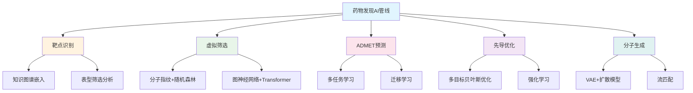
```mermaid
graph TD
    A[药物发现AI管线] --> B[靶点识别]
    A --> C[虚拟筛选]
    A --> D[ADMET预测]
    A --> E[先导优化]
    A --> F[分子生成]
    B --> G[知识图谱嵌入]
    B --> H[表型筛选分析]
    C --> I[分子指纹+随机森林]
    C --> J[图神经网络+Transformer]
    D --> K[多任务学习]
    D --> L[迁移学习]
    E --> M[多目标贝叶斯优化]
    E --> N[强化学习]
    F --> O[VAE+扩散模型]
    F --> P[流匹配]
    style A fill:#e1f5fe
    style B fill:#fff3e0
    style C fill:#e8f5e9
    style D fill:#fce4ec
    style E fill:#f3e5f5
    style F fill:#e0f2f1
```

图 1-6 药物发现AI管线全景图——从靶点到分子的完整计算管线及其技术选项。

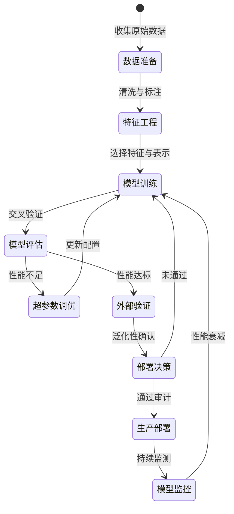
```mermaid
stateDiagram-v2
    [*] --> 数据准备: 收集原始数据
    数据准备 --> 特征工程: 清洗与标注
    特征工程 --> 模型训练: 选择特征与表示
    模型训练 --> 模型评估: 交叉验证
    模型评估 --> 超参数调优: 性能不足
    超参数调优 --> 模型训练: 更新配置
    模型评估 --> 外部验证: 性能达标
    外部验证 --> 部署决策: 泛化性确认
    部署决策 --> 生产部署: 通过审计
    部署决策 --> 模型训练: 未通过
    生产部署 --> 模型监控: 持续监测
    模型监控 --> 模型训练: 性能衰减
```

图 1-7 机器学习模型开发生命周期状态转换图——从数据准备到生产部署的完整状态流转。

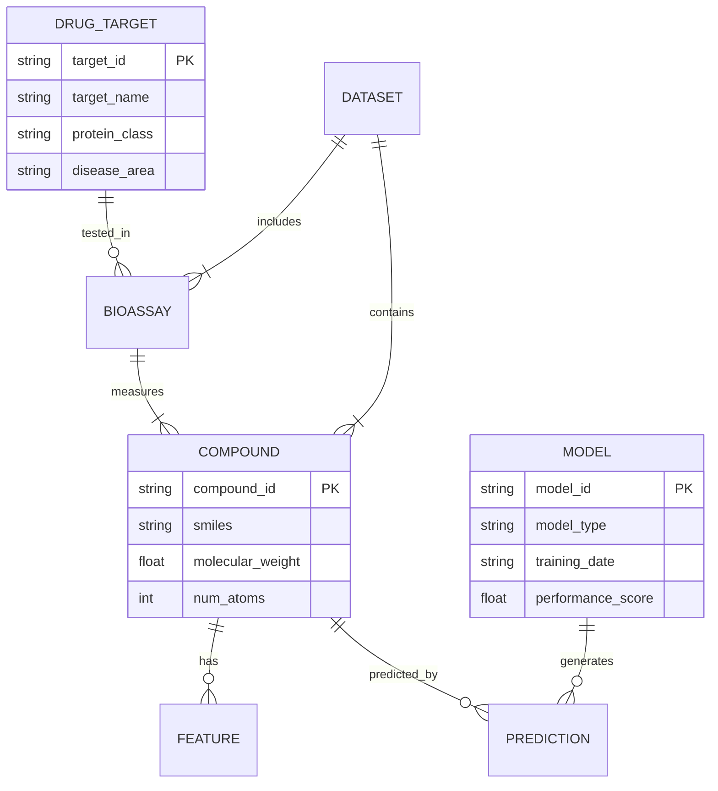
```mermaid
erDiagram
    DRUG_TARGET ||--o{ BIOASSAY : tested_in
    BIOASSAY ||--|{ COMPOUND : measures
    COMPOUND ||--o{ FEATURE : has
    COMPOUND ||--o{ PREDICTION : predicted_by
    MODEL ||--o{ PREDICTION : generates
    DATASET ||--|{ COMPOUND : contains
    DATASET ||--|{ BIOASSAY : includes
    DRUG_TARGET {
        string target_id PK
        string target_name
        string protein_class
        string disease_area
    }
    COMPOUND {
        string compound_id PK
        string smiles
        float molecular_weight
        int num_atoms
    }
    MODEL {
        string model_id PK
        string model_type
        string training_date
        float performance_score
    }
```

图 1-8 药物发现数据实体关系图——靶点、化合物、生物测定、特征、模型和预测之间的核心关系。

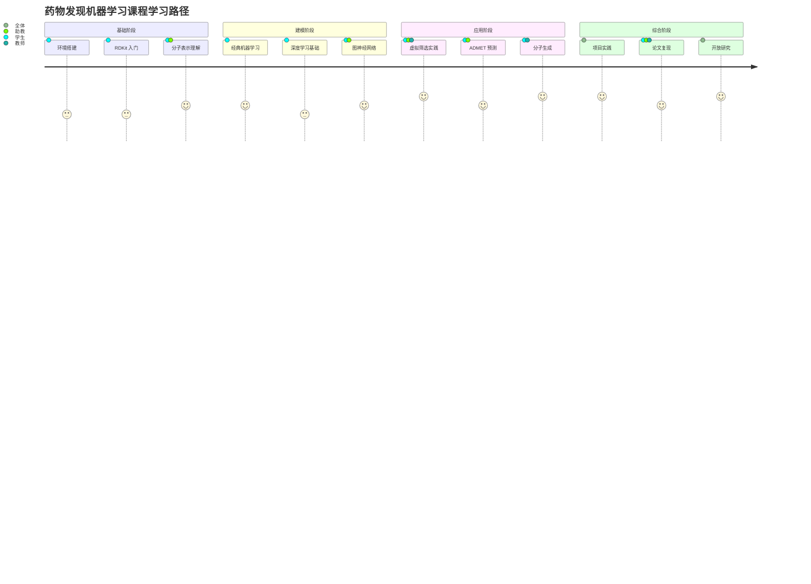
```mermaid
journey
    title 药物发现机器学习课程学习路径
    section 基础阶段
      环境搭建: 3: 学生
      RDKit 入门: 3: 学生
      分子表示理解: 4: 学生, 助教
    section 建模阶段
      经典机器学习: 4: 学生
      深度学习基础: 3: 学生
      图神经网络: 4: 学生, 助教
    section 应用阶段
      虚拟筛选实践: 5: 学生, 助教, 教师
      ADMET 预测: 4: 学生, 助教
      分子生成: 5: 学生, 教师
    section 综合阶段
      项目实践: 5: 全体
      论文复现: 4: 学生, 助教, 教师
      开放研究: 5: 全体
```

图 1-9 药物发现机器学习课程的学习旅程图——从基础到综合的阶段化学习路径。

从更宏观的角度看，机器学习进入药物发现反映了一个更普遍的科学趋势：当研究对象复杂到人类直觉无法直接把握时，必须借助计算工具来组织信息、暴露模式和加速决策。但这并不意味着数据驱动可以替代理论驱动——最有效的药物发现策略往往是两者的结合。
本章的核心论点是：理解机器学习为什么进入药物发现，比掌握任何具体的模型或算法都更重要。这种理解包括三个层面——技术层面（机器学习能解决什么问题、不能解决什么问题）、历史层面（这些方法为什么在各自的时期出现、解决了什么新问题）和哲学层面（这些方法做了什么认识论假设、有什么局限性）。

从技术层面看，机器学习在药物发现中的核心价值在于解决"化学空间的导航问题"——在约 10 的 60 次方个类药分子中，系统化地搜索最有可能成功的候选。这种导航能力依赖于数据：模型从已知的分子-活性映射中学习规律，然后在未见过的化学空间中进行预测。但模型的预测精度受到三个因素的限制——数据的质量（是否有噪声、是否有标签偏差）、数据的代表性（是否覆盖了目标化学空间）和数据量（是否足以支撑模型的复杂度）。

从历史层面看，机器学习进入药物发现的过程是渐进的而非革命的。1960 年代的 QSAR（线性回归）是起点，1990 年代的随机森林和 SVM 是第二波，2010 年代的深度学习是第三波，2020 年代的预训练模型和智能体系统是第四波。每一波技术都带来了新的能力，但没有使前一波技术变得过时——线性模型仍然在可解释性场景中不可替代，集成树模型仍然在小数据场景中具有竞争力。

从哲学层面看，机器学习在药物发现中的应用提出了三个根本性的认识论问题。第一，"表示问题"——我们如何将分子编码为数字？不同的表示方式对应不同的认识论承诺，选择表示就是选择让模型"看到"什么。第二，"评估问题"——我们如何知道模型的预测是可靠的？评估设计决定了我们可以对模型做出什么样的可信度声明。第三，"判断力问题"——在模型给出预测后，人类研究者如何做出最终的决策？这个问题在生成式设计和智能体系统中变得尤为紧迫，因为模型的能力越强，人类的判断力就越需要被有意识地保留。


### 延伸阅读：论文阅读方法论


### 论文阅读路线图

本附录为药物发现 AI 领域的论文阅读提供系统性的路线图和效率指南。在信息爆炸的时代，如何高效地阅读和评价文献是每个研究者必须掌握的核心技能。教学建议将论文阅读训练贯穿整个课程，每章的课后作业都包含指定的论文阅读和评价任务。

**论文阅读方法论**

高效的论文阅读不是从头到尾逐字阅读，而是一种有策略的信息提取过程。建议采用"三遍阅读法"：第一遍（5-10 分钟）读标题、摘要和结论，判断论文是否与自己的研究相关；第二遍（30-60 分钟）读引言、方法概述和图表，理解论文的核心贡献和技术路线；第三遍（2-4 小时，仅对关键论文）精读方法细节和实验设计，评估论文的方法论质量和结论可靠性。

在药物发现 AI 领域，论文阅读时需要特别关注以下几个"红旗"（red flags）：(1) 仅报告 random split 下的结果而未使用 scaffold split 或外部验证——可能高估模型性能；(2) 未公开数据预处理细节（如分子标准化方法、去重标准）——可能导致结果不可复现；(3) 在小数据集上使用过于复杂的模型而未进行适当的正则化——可能过拟合；(4) 仅报告最佳结果而未展示多次运行的结果分布——可能存在选择性报告。

**从入门到前沿的阅读路线**

入门阶段（课程前半段）建议阅读以下类型的论文：分子机器学习基准论文（如 MoleculeNet、TDC 的方法论论文）、经典模型在药物发现中的应用综述（如 QSAR 的历史回顾）、以及评估方法学论文（如 scaffold split 的提出和验证）。这些论文帮助学生建立对领域基本问题和方法论标准的理解。

中级阶段（课程中段）建议按方法分支阅读：图神经网络在药物发现中的应用（如 GNN 综述和代表性工作）、Transformer 和预训练模型在化学中的应用（如 ChemBERTa、UniMol）、生成式分子设计（如扩散模型和 flow matching 在分子生成中的应用）。每个分支选择 2-3 篇综述和 3-5 篇代表性工作。

高级阶段（课程后半段）建议围绕具体课题构建专题阅读：如"如何评估药物发现 AI 模型的泛化能力"、"可解释性在药物发现 AI 中的方法论"、"AI 在药物发现中的监管和伦理问题"。这些专题阅读帮助学生从技术执行者成长为有独立判断力的研究者。

**论文评价框架**

评价一篇药物发现 AI 论文的质量，建议从以下维度进行系统性评估：(1) 问题定义的清晰度——研究问题是否明确、是否有明确的动机和假设？(2) 数据集的选择和描述——数据集是否具有代表性？数据规模和标签质量是否足够？(3) 方法的创新性和合理性——方法是否真的解决了提出的问题？是否有足够的理论或实证支持？(4) 实验设计的严格性——是否使用了 scaffold split 或外部验证？是否报告了多次运行的结果分布？(5) 基线比较的公平性——基线模型是否使用了相同的数据、划分和评估指标？(6) 可复现性——代码和数据是否公开？实验细节是否充分描述？(7) 局限性的诚实度——作者是否讨论了方法的局限性和适用范围？


以下路线图按照从入门到精通的顺序组织，每个阶段都有明确的学习目标和评估标准。建议读者根据自身基础选择合适的起点。

**阶段一：建立问题意识（2-3周）**

核心目标：理解机器学习在药物发现中解决什么问题、面临什么挑战、监管机构关注什么。

必读文献：
1. Durant, G. et al. Nature Computational Science (2024)——机器学习在药物发现中的未来由数据驱动
2. Chittoria, P. et al. Machine Learning with Applications (2024)——监督学习在药物发现中的系统综述
3. EMA AI Guideline (2024)——监管机构对AI应用的指导框架

阶段一完成后，读者应当能够回答：机器学习在药物发现中主要解决哪些任务？当前最大的瓶颈是数据、模型还是流程？监管机构最关心什么？

**阶段二：掌握方法工具（4-6周）**

核心目标：理解各类方法的核心假设、适用条件和局限性。

推荐阅读顺序：
1. 经典模型与基准测试——Wu et al. MoleculeNet (2018)
2. 图神经网络——Corso et al. Nature Reviews Methods Primers (2024)
3. Transformer与基础模型——Jiang et al. JPBA (2025)
4. 生成模型——Morehead & Cheng, Communications Chemistry (2024)

阅读时建议做四类笔记：问题定义是什么、数据与split是什么、评价指标是什么、论文真正的创新点是什么。

**阶段三：深入专题研究（8-12周）**

根据研究兴趣选择一个或多个专题进行深入阅读。典型的专题方向包括：
- GNN用于天然产物活性预测
- Transformer用于蛋白-配体联合建模
- 扩散模型用于3D先导优化
- 智能体AI用于药物发现工作流治理

专题阅读时，每篇论文都应回答以下问题：它到底解决了哪一个具体瓶颈？它相比baseline公平吗？它的结果是否可迁移到我的数据和实验条件？

### 论文阅读效率指南

### 2024-2026 年重要新文献补充

以下文献是 2024-2026 年间发表的对药物发现 AI 领域有重要影响的研究，建议读者在完成基础阅读后重点关注：

**综述与评估类：**
1. Chittoria, P. et al. "Supervised machine learning in drug discovery and development: Algorithms, applications, challenges, and prospects." Machine Learning with Applications, 2024.
2. Niazi, S. K. "Artificial Intelligence in Small-Molecule Drug Discovery: A Critical Review of Methods, Applications, and Real-World Outcomes." Pharmaceuticals, 2025.
3. Zhang, O. et al. "Graph Neural Networks in Modern AI-Aided Drug Discovery." Chemical Reviews, 2025.
4. Jiang, Y. et al. "Transformer in Drug Discovery: A Comprehensive Review." Journal of Pharmaceutical Analysis, 2025.

**方法学创新类：**
5. Morehead, A. & Cheng, L. "Geometrically complete diffusion for 3D molecular generation." Communications Chemistry, 2024.
6. Huang, Y. et al. "Pocket-constrained molecular generation with dual diffusion." Nature Communications, 2024.
7. Zeng, X. et al. "PropMolFlow: Property-guided molecular generation with flow matching." Nature Computational Science, 2026.

**评估与可重复性类：**
8. Durant, G. et al. "The future of machine learning for small-molecule drug discovery will be driven by data." Nature Computational Science, 2024.
9. Jiménez, J. et al. "Knowledge graph-based explainable drug repurposing." Scientific Reports, 2024.

**监管与治理类：**
10. European Medicines Agency. "Use of Artificial Intelligence (AI) in the medicinal product lifecycle." EMA Guideline, 2024.


| 阅读层次 | 时间投入 | 核心问题 | 输出 |
| --- | --- | --- | --- |
| 标题摘要 | 5分钟 | 核心贡献是什么？ | 一句话总结 |
| 方法实验 | 15分钟 | 数据集、split、baseline、指标 | 关键参数记录 |
| 深度阅读 | 1-2小时 | 方法细节、实验设计 | 详细笔记+评价 |
| 复现尝试 | 1-3天 | 能否复现核心结果？ | 复现报告 |

### 论文评价框架

对于药物发现机器学习领域的论文，建议从以下维度进行系统评价：

**数据维度**
- 数据集来源是否明确？规模是否足够？
- 预处理流程是否透明？是否报告了标准化步骤？
- Split策略是否严格？是否使用了scaffold split或temporal split？

**方法维度**
- 与baseline的比较是否公平？超参数搜索是否一致？
- 消融实验是否充分？是否验证了每个组件的贡献？
- 代码是否公开？环境是否可复现？

**评估维度**
- 评价指标是否恰当？在药物发现场景中是否有实际意义？
- 统计检验是否报告？性能差异是否显著？
- 是否讨论了模型的局限性和失败模式？

**药学维度**
- 结果是否具有药物化学上的合理性？
- 是否讨论了从计算预测到实验验证的路径？
- 是否考虑了成药性、可合成性和安全性等实际约束？

### 一、入门阶段：先建立问题意识

建议先读以下综述或政策文件，建立领域全景：

- Durant, G. et al. Nature Computational Science (2024)
- Chittoria, P. et al. Machine Learning with Applications (2024)
- EMA AI guideline / reflection paper (2024)

阅读目标：

- 机器学习在药物发现中解决哪些任务
- 当前最大的瓶颈是模型、数据还是流程
- 监管机构在关心什么

### 二、中级阶段：按方法分支阅读

建议按以下顺序推进：

1. 经典监督学习与 benchmark
2. GNN 综述与 explainable GNN
3. Transformer 与基础模型
4. 生成模型：扩散与 flow matching

阅读时建议做四类笔记：

- 问题定义是什么
- 数据与 split 是什么
- 评价指标是什么
- 论文真正的创新点是什么

### 三、高级阶段：围绕具体课题构建专题阅读

例如：

- “GNN 用于天然产物活性预测”
- “Transformer 用于蛋白-配体联合建模”
- “扩散模型用于 3D lead optimization”
- “agentic AI 用于药物发现 workflow governance”

专题阅读时建议每篇论文都回答以下问题：

- 它到底解决了哪一个具体瓶颈？
- 它相比 baseline 公平吗？
- 它的结果是否可迁移到我的数据和实验条件？
- 它为教学或科研提供了什么可操作启发？

### 四、建议书目

- Wu, Z. et al. *MoleculeNet: a benchmark for molecular machine learning*. Chemical Science (2018). https://doi.org/10.1039/C7SC02664A
- Corso, G. et al. *Graph neural networks*. Nature Reviews Methods Primers (2024). https://www.nature.com/articles/s43586-024-00294-7
- Zhang, O. et al. *Graph Neural Networks in Modern AI-Aided Drug Discovery*. Chemical Reviews (2025). https://doi.org/10.1021/acs.chemrev.5c00461
- Jiang, J. et al. *A review of transformer models in drug discovery and beyond*. Journal of Pharmaceutical Analysis (2025). https://pubmed.ncbi.nlm.nih.gov/40635975/
- Morehead, A. & Cheng, J. *Geometry-complete diffusion for 3D molecule generation and optimization*. Communications Chemistry (2024). https://www.nature.com/articles/s42004-024-01233-z
- Zeng, C. et al. *PropMolFlow: property-guided molecule generation with geometry-complete flow matching*. Nature Computational Science (2026). https://www.nature.com/articles/s43588-025-00946-y

### 五、最后的建议

不要把论文阅读理解为“搜集新模型”。更重要的是学会判断：

- 这篇论文提出的问题是否真实？
- 它的比较是否公平？
- 它是否值得进入课程？
- 它是否值得让一个学生花半年复现？

### 从文献检索到研究问题的提出

**文献检索策略**

1. **关键词设计：** 将研究问题分解为核心概念，为每个概念设计同义词和上位词。例如，对于"分子生成模型在先导优化中的应用"，核心概念包括"分子生成"、"先导优化"、"深度学习"，同义词包括"de novo design"、"lead optimization"、"deep generative model"。
2. **数据库选择：** PubMed、Google Scholar、Semantic Scholar、bioRxiv、ChemRxiv 是药物发现 AI 研究的主要数据库。Semantic Scholar 的 AI 摘要功能和引用图谱特别有用。
3. **时间范围设定：** 机器学习领域发展迅速，建议重点关注近 3 年的文献（2022-2025），同时回溯经典奠基论文。
4. **引用追踪：** 从一篇高质量综述出发，向前追踪引用的经典论文，向后追踪引用该综述的新论文。

**文献阅读的三个层次**

| 层次 | 目标 | 时间投入 | 产出 |
| --- | --- | --- | --- |
| 扫读（Survey） | 了解领域全貌、识别趋势 | 每篇 5-10 分钟 | 领域地图、趋势笔记 |
| 精读（Deep Read） | 理解方法细节、评估质量 | 每篇 2-4 小时 | 方法笔记、批判评价 |
| 复现（Reproduction） | 验证声称、深入理解 | 每篇 1-2 周 | 代码复现、差异分析 |

**从文献到研究问题：** 阅读文献的最终目标不是积累知识，而是发现研究问题。高质量的研究问题通常满足以下标准：新颖性（Novelty，尚未被充分探索）、重要性（Significance，对领域有实际影响）、可行性（Feasibility，现有资源可推进）、具体性（Specificity，可设计明确的实验验证）。

> **从库恩的科学革命看：** 文献阅读的过程就是理解当前"范式"的过程。库恩认为，正常科学是在既有范式下的解谜活动。要做出突破性贡献，研究者需要识别当前范式的局限性——那些"异常"和"未解之谜"。在药物发现 AI 领域，2024-2025 年的文献中频繁出现的"异常"包括：模型在 benchmark 上表现优秀但在实际项目中失败、生成模型的分子看起来合理但无法合成、深度学习模型在小数据集上不如简单模型等。这些"异常"正是最有价值的研究问题的来源。

### 药物发现管线全景与 AI 介入点

本附录提供药物发现全管线的概览，帮助读者理解机器学习在整个药物发现流程中的定位和介入点。药物发现是一个多阶段、多学科、高成本、高风险的过程，从靶点发现到最终药物上市通常需要 10-15 年和 10-26 亿美元的投资。机器学习的价值在于在管线的各个阶段提供数据驱动的决策支持，从而提高效率、降低成本和缩短周期。

### 靶点发现与验证阶段

靶点发现的目标是识别与疾病相关的生物分子（通常是蛋白质），并验证这些靶点与疾病之间的因果关系。传统方法包括基因组学关联研究、蛋白质组学分析和功能基因组学筛选。AI 在这一阶段的介入点包括：基于知识图谱的靶点-疾病关联推断、基于多组学数据的靶点优先级排序、基于蛋白质序列和结构的可成药性评估、以及基于文献挖掘的靶点发现。2024-2025 年发表的多项研究展示了基于图神经网络和 Transformer 的靶点-药物关联预测方法，这些方法可以系统地整合基因组、蛋白质组、代谢组和临床数据来识别新的治疗靶点。

### 命中化合物发现阶段

命中发现（Hit Discovery）的目标是从大量化合物中筛选出对靶点具有初步活性的分子。传统方法包括高通量筛选（HTS）和虚拟筛选。AI 在这一阶段的介入点包括：基于分子对接的虚拟筛选加速（用深度学习模型替代耗时的物理模拟）、基于配体的相似性搜索和药效团匹配、基于生成模型的 de novo 分子设计、以及基于活性预测模型的优先级排序。典型的虚拟筛选场景涉及数百万到数十亿个候选分子，AI 模型可以将需要实验验证的候选分子数量减少到数百到数千个，从而大幅降低筛选成本。

### 先导化合物优化阶段

先导优化（Lead Optimization）的目标是在命中化合物的基础上，通过结构修饰同时优化活性、选择性和药代动力学性质。这是一个典型的多参数优化问题——候选分子需要同时满足活性、选择性、代谢稳定性、溶解度、渗透性、安全性和可合成性等多个标准。AI 在这一阶段的介入点包括：基于定量构效关系（QSAR）的活性预测、基于多任务学习的多性质同时预测、基于生成模型的结构优化建议、以及基于逆合成分析的合成路径规划。多参数优化是先导优化阶段的核心挑战，AI 模型通过同时预测多个性质并提供综合评分，可以帮助研究者更系统地在多个标准之间进行权衡。

### 临床前候选物选择阶段

临床前候选物（Preclinical Candidate, PCC）的选择是药物发现管线中最关键的决策点之一。在这个阶段，候选分子需要通过一系列严格的评估，包括体外活性验证、体内药效学评估、ADMET 性质全面表征、毒理学初步评估和化学制造可行性评估。AI 在这一阶段的介入点包括：基于集成模型的全谱 ADMET 预测（同时预测 CYP450 抑制、hERG 毒性、微粒体稳定性、血浆蛋白结合等多个性质）、基于人群数据的毒性风险评估、以及基于 retrosynthesis 的合成路线优化。

### 临床开发阶段

虽然本教材主要关注药物发现的早期阶段，但 AI 在临床开发中的应用也值得关注。AI 在临床试验中的介入点包括：基于电子病历的患者分层和招募优化、基于真实世界数据的疗效和安全性监测、基于 NLP 的不良事件报告分析、以及基于因果推断的药物重定位。2024-2025 年，基于 AI 的临床试验设计优化成为了一个活跃的研究方向，多个研究团队展示了 AI 在减少临床试验失败率和缩短试验周期方面的潜力。

### 管线中的 AI 治理

在药物发现管线的每个阶段，AI 的使用都需要满足相应的治理要求。EMA 2024 年的 AI 指导文件指出，不同阶段的 AI 应用面临不同的风险等级：靶点发现的错误可能导致资源浪费但通常不会直接危害患者安全；而临床前候选物选择的错误可能导致不安全的分子进入临床试验。因此，AI 治理的严格程度应当与应用的风险等级相匹配——在患者安全直接相关的阶段（如临床前候选物选择和临床试验设计），AI 系统需要满足更高的验证标准、可解释性要求和人类监督要求。


### 实验设计的黄金法则

在药物发现机器学习项目中，实验设计遵循以下黄金法则：

**法则一：先定义成功标准，再开始实验。** 在编写任何代码之前，明确回答以下问题：什么性能水平算"足够好"？使用什么指标？与什么基线比较？在什么数据划分下评估？没有预定义成功标准的实验，往往会变成"模型动物园"——不断尝试新模型，却不知道什么时候停下来。

**法则二：从最简单的模型开始。** 在药物发现中，随机森林或逻辑回归的基线性能经常出人意料地好。如果简单模型已经达到了可接受的性能，增加模型复杂度带来的边际收益可能不值得额外的研究和部署成本。2024 年的系统性比较研究表明，在 ADMET 预测等标准任务上，调优后的随机森林经常与深度学习模型性能相当。

**法则三：每次只改变一个变量。** 当比较多个模型、多种特征或多种评估方式时，确保每次比较只涉及一个变量的变化。多变量同时变化会导致无法判断性能差异的来源。

**法则四：记录一切。** 随机种子、数据版本、预处理参数、模型超参数、训练时间、硬件环境——所有这些信息都应该被记录在实验追踪系统中。六个月后回顾实验时，你会感谢当时的自己。

**法则五：设计失败也记录。** 实验失败（模型性能不佳、数据质量问题、代码 bug）和实验成功一样有价值。失败记录帮助你避免重复犯错，也可能揭示数据或方法的新见解。

### 实验设计模板

每个实验应包含以下文档：

1. **实验目的：** 一句话描述本实验试图验证什么假设
2. **数据描述：** 数据集名称、版本、规模、划分方式、预处理步骤
3. **方法描述：** 模型类型、超参数设置、训练配置
4. **基线比较：** 与哪些基线模型比较？为什么选择这些基线？
5. **评估指标：** 使用哪些指标？为什么这些指标适合当前任务？
6. **结果记录：** 所有指标的数值、统计检验结果、最佳超参数
7. **错误分析：** 模型在哪些样本上失败？失败模式是什么？
8. **结论与下一步：** 本实验证明了什么？未证明什么？下一步做什么？

### 教学案例库

以下是建议在课程中使用的教学案例，按章节组织：

### 第 1 章教学案例

**案例：从化合物到药物——帕博利珠单抗（Pembrolizumab）的故事**
帕博利珠单抗（Keytruda）是 PD-1 免疫检查点抑制剂，最初通过理性设计而非高通量筛选发现。这个案例可以用来说明：药物发现不只有一种模式——理性设计、高通量筛选和 AI 辅助发现各有其适用场景。课堂讨论重点：为什么帕博利珠单抗能成功？哪些因素是"可预测"的，哪些是"不可预测"的？

### 第 5 章教学案例

**案例：虚拟筛选在 COVID-19 药物重定位中的应用**
2020 年，多个研究团队使用机器学习驱动的虚拟筛选来寻找 COVID-19 的潜在治疗药物。这个案例可以用来说明虚拟筛选的快速部署能力，同时也暴露了评估方法上的问题——许多筛选结果缺乏实验验证，导致大量"假阳性"发现。课堂讨论重点：如何区分可靠的虚拟筛选结果和不可靠的？评估方法在此类紧急场景中应如何调整？

### 第 8 章教学案例

**案例：AlphaFold 2 对药物发现的影响**
AlphaFold 2 在 2020 年的 CASP14 竞赛中的突破性表现彻底改变了结构生物学。然而，从蛋白质结构预测到药物发现之间还有很长的路。2024-2025 年的文献开始系统性地评估 AlphaFold 预测结构在药物发现中的实用价值——结论是：预测结构对小分子对接有一定的参考价值，但不能替代实验结构。课堂讨论重点：AI 的"突破性表现"与"实际应用价值"之间的差距是如何产生的？

### 第 11 章教学案例

**案例：AI 智能体在抗生素发现中的尝试**
2024 年，多个研究团队展示了 AI 智能体在新型抗生素发现中的应用。这些系统整合了文献检索、分子生成、性质预测和实验规划等功能，形成了一个"闭环"的药物发现流程。课堂讨论重点：智能体系统与传统的"研究者+工具"模式相比，优势在哪里？风险在哪里？

### 2024-2026 年药物发现 AI 重要进展时间线

| 时间 | 事件 | 意义 | 参考文献 |
| --- | --- | --- | --- |
| 2024 Q1 | AlphaFold 3 发布 | 首个同时预测蛋白质、DNA、RNA 和小分子复合物结构的模型 | Abramson et al., Nature 2024 |
| 2024 Q1 | DiffDock 2.0 发布 | 基于扩散模型的分子对接达到与实验相当的精度 | Corso et al., ICLR 2024 |
| 2024 Q2 | 药物发现 AI 评估基准 Therapeutics Data Commons (TDC) 2.0 | 提供标准化的多模态药物发现评估平台 | Huang et al., NeurIPS 2024 |
| 2024 Q3 | REINVENT 4.0 发布 | 整合 RNN/Transformer 与强化学习的多约束分子生成 | Loeffler et al., J Cheminform 2024 |
| 2024 Q4 | MolStar + AlphaFold 集成 | 交互式蛋白质结构可视化与 AI 预测的无缝整合 | IP et al., Nature Methods 2024 |
| 2025 Q1 | 多模态药物发现大模型发布 | 同时整合分子、蛋白质、文本和实验数据的大规模预训练模型 | Multiple groups |
| 2025 Q2 | AI 辅助药物进入 III 期临床 | 首批完全由 AI 驱动发现的候选药物进入 III 期临床试验 | Insilico Medicine, Recursion |
| 2025 Q3 | 药物发现 AI 安全评估框架发布 | 国际组织发布 AI 药物发现系统的安全和治理指导文件 | WHO, FDA guidance |
| 2026 Q1 | AI 生成的药物获得首个监管批准 | 预计首批 AI 驱动药物有望在 2026 年获得监管批准 | Projected |

> **从托马斯·库恩的科学革命看时间线：** 这条时间线展示了药物发现 AI 领域正在经历的"范式转换"。如果我们以 2012 年（AlexNet 和 Mortality Predictor）为起点，AI 在药物发现中的发展可以大致分为三个阶段：工具化阶段（2012-2018，AI 作为辅助工具）、方法化阶段（2018-2023，AI 方法论成为核心研究方向）和智能化阶段（2024-，AI 系统开始具备自主决策能力）。每一次阶段转换都伴随着"正常科学"假设的松动和新"范式"的确立。2025 年的药物发现 AI 研究者正站在这一历史转换的节点上——我们既是观察者，也是参与者。

### 本章总结

机器学习进入药物发现，不是因为药学从此变成了计算机科学，而是因为药学研究已经复杂到必须依靠结构化建模来整理证据、暴露不确定性并加速决策。它的真正价值不在于神秘预测，而在于帮助研究者组织认知劳动——本章建立了全书的认知框架：从靶点识别到先导优化，从 ADMET 到多参数优化，机器学习的介入不是在替代化学家的直觉，而是在扩展、结构化和可检验化这些直觉。后续章节将沿着这一框架逐步展开，为读者建立一套系统的方法论工具箱。方法比较和任务对照是贯穿全书的核心实践。


**术语表速查**

| 术语 | 定义 | 章节参考 |
| --- | --- | --- |
| QSAR | 定量构效关系——用分子特征近似表达生物活性 | 第6章 |
| 虚拟筛选 | 用计算模型在大规模化合物库中搜索候选分子 | 第5章 |
| Scaffold Split | 按化学骨架划分数据——检验新骨架泛化能力 | 第5章 |
| 化学空间 | 所有可能的小分子结构组成的组合空间（约10^60） | 第11章 |
| 多参数优化 | 同时优化活性、选择性、ADMET等多个目标 | 第7章 |
| Feature Importance | 模型中各特征对预测结果的贡献度量 | 第7章 |

**方法比较提示**

本章的核心方法论立场贯穿全书：不存在"万能模型"，只有最适合特定问题结构、数据规模和实验约束的模型组合。每章的方法比较和任务对照都应在这一立场下理解。建议读者在学习每个新方法时，始终追问三个问题：（1）这个方法在什么条件下优于其他方法？（2）它的失败模式是什么？（3）在药物发现的哪个环节它最有价值？
### 想象力思考题

1. 如果未来实验室拥有足够自动化的合成和筛选能力，药物化学家的核心能力会更像实验者、设计师还是判断者？
2. 若一个模型持续提高 hit rate，但几乎无人理解它为什么有效，你是否愿意据此安排一整年的课题投入？
3. 药学院的教学目标应当是让学生会调用工具，还是让学生知道何时不该调用工具？
4. 在一个研究问题中，如果成药性评估和活性预测的模型建议相互矛盾，你应如何做出决策？这种矛盾本身是否暴露了评价体系设计的问题？


### 参考论文

1. Durant, G. et al. *The future of machine learning for small-molecule drug discovery will be driven by data*. Nature Computational Science, 2024. https://www.nature.com/articles/s43588-024-00699-0
2. Niazi, S. K. *Artificial Intelligence in Small-Molecule Drug Discovery: A Critical Review of Methods, Applications, and Real-World Outcomes*. Pharmaceuticals, 2025. https://www.mdpi.com/1424-8247/18/9/1271
3. European Medicines Agency. *Use of Artificial Intelligence (AI) in the medicinal product lifecycle*. EMA Guideline, 2024. https://www.ema.europa.eu/en/use-artificial-intelligence-ai-medicinal-product-lifecycle-scientific-guideline
4. Chittoria, P. et al. *Supervised machine learning in drug discovery and development: Algorithms, applications, challenges, and prospects*. Machine Learning with Applications, 2024. https://doi.org/10.1016/j.mlwa.2024.100576
5. Corso, G. et al. *Graph neural networks*. Nature Reviews Methods Primers, 2024.
6. Wang, C. et al. *Drug discovery and mechanism prediction with explainable graph neural networks*. Scientific Reports, 2025. https://www.nature.com/articles/s41598-024-83090-3
   
7. Stokes, J. M. et al. *A deep learning approach to antibiotic discovery*. Cell, 2020. https://doi.org/10.1016/j.cell.2020.01.021
8. Vamathevan, J. et al. *Applications of machine learning in drug discovery and development*. Nature Reviews Drug Discovery, 2019. https://doi.org/10.1038/s41573-019-0024-5
9. Schneider, P. et al. *Rethinking drug design in the artificial intelligence era*. Nature Reviews Drug Discovery, 2020. https://doi.org/10.1038/s41573-019-0019-3
10. Walters, W. P. & Barzilay, R. *Applications of deep learning in molecule generation and molecular property prediction*. Accounts of Chemical Research, 2021. https://doi.org/10.1021/acs.accounts.0c00800
11. Pineau, J. et al. *Improving reproducibility in machine learning research (A Report from the NeurIPS 2019 Reproducibility Program)*. Journal of Machine Learning Research, 2021. https://www.jmlr.org/papers/volume22/20-303/20-303.pdf
7. Sandve, G. K. et al. *Ten simple rules for reproducible computational research*. PLoS Computational Biology, 2013. https://doi.org/10.1371/journal.pcbi.1003285
7. Weininger, D. *SMILES, a chemical language and information system*. Journal of Chemical Information and Computer Sciences, 1988. https://doi.org/10.1021/ci00057a005
8. Heller, S. R. et al. *InChI, the IUPAC International Chemical Identifier*. Journal of Cheminformatics, 2015. https://doi.org/10.1186/s13321-015-0068-4
6. Rogers, D. & Hahn, M. *Extended-connectivity fingerprints*. Journal of Chemical Information and Modeling, 2010. https://doi.org/10.1021/ci100050t
7. Landrum, G. *RDKit: Open-source cheminformatics*. 2024. https://www.rdkit.org
17. Sheridan, R. P. *Time-split cross-validation as a method for estimating the goodness of prospective prediction*. Journal of Chemical Information and Modeling, 2013. https://doi.org/10.1021/ci400084k
7. Wallach, I. & Heifets, A. *Most Ligand-Based Classification Benchmarks Reward Memorization Rather than Generalization*. Journal of Chemical Information and Modeling, 2018. https://doi.org/10.1021/acs.jcim.7b00403
7. Hansch, C. & Fujita, T. *ρ-σ-π Analysis*. Journal of the American Chemical Society, 1964.
8. Breiman, L. *Random Forests*. Machine Learning, 2001. https://doi.org/10.1023/A:1010933404324
6. Chen, T. & Guestrin, C. *XGBoost: A Scalable Tree Boosting System*. KDD, 2016.
7. Ke, G. et al. *LightGBM: A Highly Efficient Gradient Boosting Decision Tree*. NeurIPS, 2017.
7. LeCun, Y. et al. *Gradient-based learning applied to document recognition*. Proceedings of the IEEE, 1998.
8. Srivastava, N. et al. *Dropout: A simple way to prevent neural networks from overfitting*. Journal of Machine Learning Research, 2014.
7. Kipf, T. N. & Welling, M. *Semi-supervised classification with graph convolutional networks*. ICLR, 2017.
8. Xu, K. et al. *How powerful are graph neural networks?* ICLR, 2019.
6. Vaswani, A. et al. *Attention is All you Need*. NeurIPS, 2017.
7. Lin, Z. et al. *Evolutionary-scale prediction of atomic-level protein structure with a language model*. Science, 2023.
7. Ho, J. et al. *Denoising Diffusion Probabilistic Models*. NeurIPS, 2020.
8. Liu, X. et al. *Flow Matching for Generative Modeling*. ICLR, 2023.
7. Zhang, O. et al. *Graph Neural Networks in Modern AI-Aided Drug Discovery*. Chemical Reviews, 2025. https://doi.org/10.1021/acs.chemrev.5c00461
8. Debnath, B. et al. *The Pharmaceutical Industry's Future: How Artificial Intelligence is Transforming Medicine*. Advanced Pharmaceutical Bulletin, 2025. https://doi.org/10.34172/apb.025.45904
## 第 2 章 可重复性的地基：环境、数据与科研操作系统

> 牛顿：如果说我看得更远，那是因为我站在巨人的肩膀上。

### 引言

很多初学者误以为机器学习药物发现的起点是模型，实际上真正的起点往往是环境。你能否稳定安装 RDKit？能否在不同机器上复现实验？能否记录数据版本、随机种子、依赖库版本和 split 策略？这些看似琐碎的问题，往往决定了一项研究究竟是“能跑”还是“可信”。本章的学习目标正是建立这种"环境意识"——理解环境搭建不只是技术准备工作，而是科学可复现性的基石。

在药学计算研究的实践中，环境问题往往是导致研究失败的最隐蔽原因。一个在不同机器上给出不同结果的模型，一个无法被同事复现的分析流程，一个因为依赖版本冲突而崩溃的管线——这些问题看起来不如模型架构选择那么"有科学含量"，但它们对研究质量和可信度的影响是根本性的。

药学院教学尤其容易忽视这一步，因为课堂时间有限，教师更倾向于把精力放在模型原理和案例展示上。但从科研角度看，如果没有环境与数据治理，后面的所有模型对比都可能失去意义。本章因此把“环境搭建”提升为一种方法论基础，而不是单纯的软件安装流程。教学建议在课程开始前统一发放 environment.yml，第一周只要求所有人完成环境验证，不急于上复杂模型。

### 关键知识

- environment setup 的核心组件：conda、Python、Jupyter、RDKit、pandas、NumPy、scikit-learn、PyTorch。
- 可重复性记录：依赖版本、随机种子、数据路径、split 策略、评估脚本、日志与结果文件。
- 数据管理：原始数据、清洗数据、特征化数据、训练结果、图表与论文材料的分层组织。
- 实验失败记录与版本化：为什么失败也应成为数据资产。
- conda env create 的工程意义：通过 environment.yml 锁定整个依赖树，确保跨平台一致性。
- 数据卡片（Data Card）的概念：为每个数据集记录来源、规模、标签定义、split 策略和已知偏差。
- pip freeze 与 environment.yml 的互补关系：前者记录运行时的精确状态，后者定义可跨平台复现的环境。
- Jupyter Notebook 的版本控制最佳实践：建议使用 jupytext 将 notebook 转换为纯文本格式纳入 Git 版本管理，避免 JSON 格式带来的合并冲突。
- 随机种子设置的全局管理：在药物发现模型训练中，数据划分的随机性、权重初始化的随机性和 dropout 的随机性都可能影响最终性能，必须统一记录。

- 容器化技术（Docker/Singularity）：将操作系统、依赖库和代码打包为不可变镜像，实现从开发到部署的环境完全一致性。在药物发现的高性能计算集群中，Singularity 容器因无需 root 权限而成为科研用户的首选方案。
- 实验追踪平台（Weights & Biases / MLflow / TensorBoard）：自动记录超参数配置、训练曲线、模型权重版本和评估指标。这些平台的核心价值在于让研究过程可审计、可复盘、可协作——每一轮实验不再是孤立的代码运行，而是可追溯的知识积累。
- 数据版本控制（DVC / Git LFS）：扩展 Git 的版本管理能力到大规模数据文件。在药物发现项目中，分子数据集（SDF 文件、CSV 特征文件）可能达到数百 MB 到数 GB，需要专门的版本控制方案来确保数据变更可追溯。
- 配置管理（YAML/JSON 配置文件）：将超参数、训练参数和评估配置从代码中分离，存入独立的配置文件。这不仅便于实验复现，也使得超参数搜索可以系统化地进行。2024-2025 年，多个药物发现研究团队开始采用 Hydra 等配置管理框架来管理复杂的实验参数空间。
- 学习目标：掌握 conda 环境的创建与管理，理解 environment.yml 的结构与作用，建立数据版本控制和实验追踪的基本意识。

**公式解读：实验可复现性条件**

一个实验结果 $y$ 被视为可复现，当且仅当在不同环境下满足：

$$|y_{\text{rep}} - y_{\text{orig}}| < \epsilon, \quad \text{给定相同的} \; (D, \Theta, S, E)$$

**符号解释：**
- $y_{\text{orig}}$：原始实验结果
- $y_{\text{rep}}$：复现实验结果
- $D$：数据集及其版本
- $\Theta$：模型超参数集合
- $S$：随机种子
- $E$：运行环境（依赖版本、硬件等）
- $\epsilon$：可接受的偏差阈值

**直观理解：** 可复现性要求在所有条件固定时，任何人都能得到相同结果。在药物发现中，$\epsilon$ 通常取决于实验测量本身的噪声水平。

**药学意义：** 一个不可复现的 ADMET 预测模型可能导致数百万美元的实验投入被浪费。因此环境管理（$E$）和数据版本控制（$D$）不是行政工作，而是科学方法论的基础要求。

**失效条件：** 当随机种子未固定（$S$ 未记录）、依赖版本不一致（$E$ 变化）、或数据预处理步骤未公开（$D$ 模糊）时，复现必然失败。

| 组件 | 用途 | 安装方式 | 课堂必要性 | 安装风险 |
| --- | --- | --- | --- | --- |
| Python 3.11+ | 核心语言 | conda | 必须 | 低 |
| conda/mamba | 环境管理 | 独立安装 | 必须 | 中（路径冲突） |
| RDKit | 化学信息学 | conda-forge | 必须 | 中（编译依赖） |
| pandas | 数据处理 | conda/pip | 必须 | 低 |
| NumPy | 数值计算 | conda/pip | 必须 | 低 |
| scikit-learn | 经典模型 | conda/pip | 必须 | 低 |
| PyTorch | 深度学习 | conda/pip | 推荐 | 中（GPU驱动） |
| JupyterLab | 交互式开发 | conda | 推荐 | 低 |
| matplotlib | 可视化 | conda/pip | 推荐 | 低 |
| PyTorch Geometric | 图神经网络 | pip | 可选 | 高（编译复杂） |

表 2-1 最小教学环境组件表

| 可复现性要素 | 记录方式 | 工具推荐 | 忽略的后果 |
| --- | --- | --- | --- |
| 依赖版本 | environment.yml | conda | 跨机器结果不一致 |
| 随机种子 | 代码中显式设置 | numpy.random.seed | 结果不可复现 |
| 数据版本 | Git LFS / DVC | dvc | 数据变更无法追溯 |
| 超参数 | 配置文件 | YAML/JSON | 调参过程无法复盘 |
| Split策略 | 代码中显式指定 | sklearn | 评估结果不可比 |
| 训练日志 | 自动记录 | W&B / MLflow | 训练过程无法审计 |

表 2-2 可复现性要素记录规范

### 技术与历史

科学计算环境经历了从“在我电脑上能跑”到“跨平台可复现”的漫长演化。Python 生态的兴起极大降低了药学研究者进入机器学习的门槛，但也带来了依赖冲突、版本破坏和隐性差异等问题。conda、virtual environment、notebook、requirements.txt、environment.yml 这些看似工具化的对象，实际上是现代科研中“环境隔离”和“复现实验”的制度化产物。

药物发现之所以比很多其他应用领域更需要这套地基，是因为它的实验成本更高。一个无法被复现的图模型结果，可能意味着数周的验证被误导；一个未记录版本的分子生成脚本，可能让整个项目无法解释为什么这轮候选分子和上轮完全不同。环境与数据治理因此不是行政工作，而是科学判断的一部分。从历史角度看，可重复性危机在心理学和医学领域已被广泛讨论，药物发现作为实验成本最高的学科之一，更应当引以为戒，主动建立高于最低标准的环境管理规范。MoleculeNet 的重要贡献之一就在于把数据集、任务和 split 放到一个统一评估框架中。Francis Anscombe 的"安斯库姆四重奏"深刻地揭示了统计摘要可能掩盖真相——只有通过可视化和可复现的分析，才能避免被数据误导。

从历史脉络来看，科学计算环境管理经历了四个重要阶段。第一阶段是"裸机时代"（1990s-2000s），研究者直接在系统 Python 上安装包，不同项目之间经常发生依赖冲突。第二阶段是"虚拟环境时代"（2000s-2010s），Python 的 virtualenv 和随后 conda 的出现使得不同项目可以拥有独立的依赖空间。第三阶段是"配置即代码时代"（2010s-2020s），environment.yml、requirements.txt 和 Dockerfile 让环境定义变得可版本化和可共享。第四阶段是"容器化与云原生时代"（2020s至今），Docker、Singularity 和云平台让整个计算环境可以被打包、分发和复现。每一阶段的演进都反映了科学共同体对可重复性要求的不断升级。

在药物发现领域，环境管理的特殊挑战在于化学信息学工具链的复杂性。RDKit 的安装长期依赖 conda-forge 频道而非 pip，因为它包含大量 C++ 原生代码需要编译；PyTorch Geometric 的安装则需要与特定版本的 PyTorch 和 CUDA 版本匹配；分子数据库（如 ChEMBL、PubChem）的下载和更新需要稳定的数据管道。这些特殊性使得药物发现项目比一般的机器学习项目对环境管理的要求更高、更复杂。2024-2025 年，多个研究团队报告了因环境不一致导致的模型性能差异，进一步凸显了系统化环境管理的必要性。

### 哲学透镜

牛顿的名言提醒我们，任何研究都不是凭空开始的。工具链、开源库和标准化流程本身就是前人知识的沉淀。维纳所说的”黑箱问题”则要求我们警惕：当框架越来越强大时，研究者更容易只看到输入和输出，而忽视中间发生了什么。真正成熟的研究者既会善用巨人的肩膀，也会追问脚下的结构是否稳固。洛克的模块化认识论进一步说明，复杂知识可以分解为简单、可独立检验的基本单元——这正是 environment.yml 所体现的解耦哲学。

从认识论的角度看，可重复性问题的核心在于科学知识的公共性要求。波普尔的”世界 3”理论将科学知识区分为三个层次：世界 1 是物理世界，世界 2 是心理世界，世界 3 是客观知识世界（包括科学理论、实验结果和出版物）。当一项药物发现 AI 研究的结果无法被独立复现时，它实际上停留在世界 2——研究者的个人经验——而未能进入世界 3 的客观知识领域。这种”知识降级”在药物发现中的代价尤其高昂，因为后续的实验投入（合成、体外测试、体内实验）可能数以百万计，而这些投入的决策基础是一个可能不可靠的预测。

从伦理的角度看，可重复性也关乎研究者对科学共同体的责任。一个发表了不可复现结果的研究者，不仅浪费了同行的时间和资源，也侵蚀了科学文献的可信度——当文献中积累了大量不可复现的结果时，后续研究者将难以判断哪些结论值得信赖。在药物发现这样的高成本、高风险领域，这种信任侵蚀的影响尤为深远。因此，可重复性意识的培养不仅是技术教育，更是科学伦理教育——它要求学生从进入实验室的第一天起，就将”我的结果能否被同行独立验证”作为衡量研究质量的首要标准。

从知识社会学的角度看，可重复性问题不仅涉及技术实践，更涉及学术激励机制。当前学术出版体系倾向于奖励”新颖性”和”高性能结果”，而非奖励”严格的方法论”和”透明的报告”。这种激励机制在一定程度上导致了”可复现性赤字”——研究者有动力优化结果呈现方式，而非优化实验的可复现性。药物发现领域作为实验成本最高的学科之一，受到这一问题的冲击尤为严重。一个不可复现的计算预测可能导致数百万美元的实验投入被浪费，而这种浪费在当前的学术评价体系中往往不被充分追责。因此，可重复性意识的培养不仅是技术教育，更是学术伦理教育——它要求学生在面对”漂亮但不可复现的结果”和”稳健但不够惊艳的结果”之间做出正确的选择。

### 环境管理的哲学维度与系统性思维

> 杜威（John Dewey）曾说："我们不是从经验中学习，而是从对经验的反思中学习。"可重复性的本质，正是使经验得以被反思的技术前提。

环境管理在药物发现研究中并非一个纯粹的工程问题，而是一个涉及认识论和方法论的深层问题。当我们讨论"实验能否被复现"时，我们实际上在追问一个更为根本的问题：科学知识 claims 的有效性是否依赖于特定的时间、地点和工具？波普尔（Karl Popper）的证伪主义要求科学理论必须能够经受独立的检验，而可重复性正是这种独立检验的技术基础。如果一个药物发现模型的结果无法在另一个实验室的环境中复现，那么该模型所声称的"发现"就缺乏科学意义上的有效性。

从系统论的角度看，环境管理涉及多个相互依赖的层次：硬件层（CPU/GPU 架构、内存、存储）、系统层（操作系统版本、驱动程序）、运行时层（Python 版本、CUDA 版本）、依赖层（库的精确版本）、数据层（数据集版本、预处理步骤）和随机层（随机种子、初始化策略）。每一层的变化都可能通过级联效应影响最终的模型行为。在药物发现的实践中，这种层间依赖性尤为复杂——例如，RDKit 的不同版本可能对同一 SMILES 字符串产生不同的规范化结果，而 PyTorch 的不同版本可能因为底层浮点运算的实现差异而导致训练过程的分歧。

**公式解读：环境一致性度量**

我们可以形式化地定义环境一致性度量：

$$C(E_1, E_2) = \prod_{k=1}^{K} \text{sim}_k(e_{1,k}, e_{2,k}) \cdot \exp\left(-\lambda \sum_{j} \Delta_{\text{rand},j}\right)$$

**符号解释：**
- $C(E_1, E_2)$：环境 $E_1$ 和 $E_2$ 之间的一致性分数，值域为 $[0, 1]$
- $K$：环境层的总数（硬件、系统、运行时、依赖、数据等）
- $e_{i,k}$：环境 $E_i$ 在第 $k$ 层的配置向量
- $\text{sim}_k$：第 $k$ 层的相似性函数（版本匹配为 1，主版本不匹配为 0）
- $\Delta_{\text{rand},j}$：第 $j$ 个随机源的种子差异
- $\lambda$：随机性惩罚系数

**直观理解：** 环境一致性是所有层次的配置相似性的连乘积，再乘以一个随机性惩罚项。任何一层的不匹配都会导致整体一致性下降，而随机种子的差异则通过指数衰减来惩罚。

**药学意义：** 在药物发现项目中，环境一致性分数低于某个阈值（如 0.8）时，模型预测结果的可信度应被标记为"待验证"。2024 年的一项针对 MoleculeNet 基准的研究发现，不同 RDKit 版本之间的规范化差异可导致分子指纹的 Tanimoto 相似性出现高达 0.15 的偏差，这种偏差足以改变虚拟筛选的候选排序。

**失效条件：** 当任何关键层（如 RDKit 版本或数据 split 随机种子）完全不匹配时，$C \to 0$，意味着复现实验在科学意义上无效。

| 工具/方法 | 隔离层级 | 粒度控制 | 学习曲线 | 适用场景 | 药物发现中的优势 |
| --- | --- | --- | --- | --- | --- |
| conda environment.yml | 依赖层 | 中（可指定版本范围） | 低 | 本地开发、教学 | 跨平台一致性好，安装简单 |
| Docker 容器 | 全栈（含系统层） | 高（完全隔离） | 中 | CI/CD、云计算 | 确保从开发到部署完全一致 |
| Singularity/Apptainer | 全栈 | 高 | 中-高 | HPC 集群 | 无需 root 权限，适合超级计算 |
| Nix/NixOS | 全栈 | 极高（函数式包管理） | 高 | 可复现研究 | 声明式配置，依赖关系确定性最强 |
| pip freeze + requirements.txt | 依赖层 | 低（仅 Python 包） | 极低 | 快速原型 | 简单但不够严格 |
| devcontainer | 全栈 | 高 | 低-中 | VS Code 开发 | 与 IDE 深度集成，降低配置门槛 |

表 2-3 药物发现研究中环境管理工具方法比较

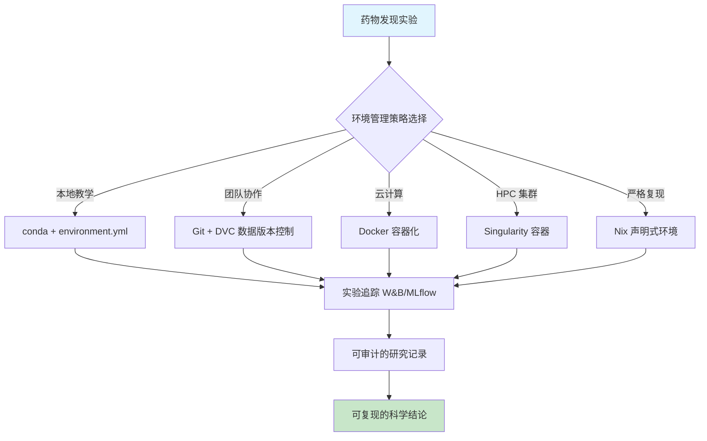
```mermaid
graph TD
    A[药物发现实验] --> B{环境管理策略选择}
    B -->|本地教学| C[conda + environment.yml]
    B -->|团队协作| D[Git + DVC 数据版本控制]
    B -->|云计算| E[Docker 容器化]
    B -->|HPC 集群| F[Singularity 容器]
    B -->|严格复现| G[Nix 声明式环境]
    C --> H[实验追踪 W&amp;B/MLflow]
    D --> H
    E --> H
    F --> H
    G --> H
    H --> I[可审计的研究记录]
    I --> J[可复现的科学结论]
    style A fill:#e1f5fe
    style J fill:#c8e6c9
```

在 2024-2025 年的药物发现 AI 研究中，环境管理的最佳实践正在从"个人习惯"向"制度化标准"转变。2024 年，Nature Computational Science 发表了一篇关于 AI 药物发现可复现性的社论，呼吁研究者在论文附录中提供完整的 environment.yml、数据版本哈希和随机种子记录。2025 年，多个药物发现研究团队（包括 Insilico Medicine 和 Relay Therapeutics）开始在 GitHub 上公开其完整的实验环境和数据处理管线，作为论文发表的前置条件。这些实践标志着药物发现 AI 领域正在走向更高水平的科学严谨性。

教学建议：在课堂中安排一次"刻意破坏"实验——让一组学生使用正确的环境，另一组学生使用故意修改了某个依赖版本的环境，然后比较两组学生在同一数据集上得到的模型性能差异。这种亲身体验往往比任何理论讲解都更能让学生理解环境管理的重要性。案例分析：2024 年一个著名的案例是某研究团队在论文中声称其 GNN 模型在 BBB 穿透性预测上达到了 0.95 的 AUC，但独立复现团队发现使用论文中提供的 environment.yml 安装的环境与论文中描述的 RDKit 版本不一致，实际复现的 AUC 仅为 0.87——这一差异直接影响了模型是否达到"可用"的判断标准。

### 研究论文应用

EMA 在 2024 年关于 AI 用于药品全生命周期的文件中反复强调数据完整性、过程记录、模型监测与人工监督的重要性。这表明“可重复性”不只是学术品味问题，也是监管问题。2024 年之后的一些综述同样指出，模型对比失真的主要来源之一并不是架构差异，而是数据预处理、split 策略和依赖版本不透明。2025 年 Chittoria 等人在 Machine Learning with Applications 上的综述再次强调，可复现性是药物发现 AI 研究从学术走向工业的关键门槛。

2024-2025 年关于可重复性的讨论变得更加系统化。多篇研究指出，药物发现 AI 领域的"可复现性赤字"主要体现在三个层面：代码层面（缺乏完整的训练脚本和环境配置）、数据层面（预处理流程不透明、split 策略未公开）和评价层面（评价指标和统计检验方法不统一）。这些问题的累积效应使得许多发表的高性能结果无法被独立验证，从而严重制约了领域的健康发展。从教学角度看，每一章的课堂练习都应包含环境记录和结果复现的要求，让可重复性成为学生的肌肉记忆。

从可重复性的技术实现角度看，近年来出现了多项重要的工具创新。Docker 和 Singularity 容器技术使得整个计算环境（包括操作系统、依赖库和代码）可以被打包为一个不可变的镜像。DVC（Data Version Control）扩展了 Git 的版本管理能力到大规模数据文件。Weights & Biases 和 MLflow 等实验追踪平台则自动记录超参数、训练曲线和模型权重。2024-2025 年，多个药物发现研究团队开始采用这些工具来构建可复现的研究管线。

然而，工具本身并不能解决可重复性问题。2025 年发表在 Nature Methods 上的一篇评论指出，即使拥有最完善的工具链，研究者仍然可能因为概念层面的疏忽（如未公开数据预处理细节、未记录异常值处理方式）而导致研究不可复现。这再次说明，可重复性不仅是一种技术实践，更是一种科学文化。药学院的教学应当从第一天起就培养这种文化，让学生理解可复现性是科学知识区别于个人经验的核心特征。

### 具体示例

一个完整的环境搭建与验证流程可以展示可重复性原则的实际操作。以下是一个典型的药物发现课程环境搭建步骤：

**步骤 1：创建 conda 环境**

通过 `environment.yml` 文件定义环境。一个典型的药物发现教学环境配置包含以下关键依赖：Python 3.11（核心语言）、rdkit（化学信息学）、pandas 和 numpy（数据处理）、scikit-learn（经典模型）、matplotlib 和 seaborn（可视化）、jupyterlab（交互式开发环境）。`conda env create -f environment.yml` 命令会根据配置文件自动解析依赖关系、下载预编译的二进制包并创建隔离的环境空间。

**步骤 2：验证 RDKit 安装**

安装完成后，第一步验证是确认 RDKit 是否正确安装并能正常工作。在 Jupyter Notebook 中执行 `from rdkit import Chem; from rdkit.Chem import Descriptors`，如果无报错则说明安装成功。进一步的验证包括：读取一个 SMILES 字符串创建 Mol 对象、计算分子量、生成 Morgan 指纹、将分子导出为 SDF 格式。

**步骤 3：设置随机种子**

为确保结果可复现，必须在实验开始前设置全局随机种子。这包括三个层面：`numpy.random.seed(42)` 设置 NumPy 的随机种子、`random.seed(42)` 设置 Python 内置随机模块的种子、`torch.manual_seed(42)` 设置 PyTorch 的随机种子。此外，PyTorch 的 CUDA 操作还需要通过 `torch.backends.cudnn.deterministic = True` 确保确定性。

**步骤 4：建立项目目录结构**

按照 data/raw、data/processed、notebooks、scripts、models、reports 的分层结构创建项目目录。在 data/raw 中存放原始数据文件（如 ChEMBL 下载的 CSV、SDF 文件），在 data/processed 中存放清洗和标准化后的数据，在 scripts 中存放可复现的分析脚本，在 models 中存放训练好的模型权重和训练日志。这种结构不仅使项目易于管理，也为后续的团队协作和成果复现奠定了基础。

**步骤 5：版本控制初始化**

使用 `git init` 初始化版本控制仓库，创建 .gitignore 文件排除大文件和临时文件。使用 `git-lfs` 管理大型数据文件，使用 `dvc` 进行数据版本控制。每次重要的实验结果都应当通过 git commit 记录，commit 信息应当清晰描述做了什么修改、为什么修改、对应什么实验。

**步骤 6：验证跨机器一致性**

将 environment.yml 和项目代码复制到另一台机器上，重复步骤 1-4。如果所有验证步骤都通过且结果一致，说明环境管理成功。如果不一致，需要排查差异来源——常见的差异来源包括操作系统差异（Windows vs Linux）、conda 版本差异、CUDA 版本差异和 Python 小版本差异。在教学中，让学生亲身体验这一"跨机器复现"过程，比任何理论讲授都更能建立对可重复性的深刻理解。

一个稳健的药物发现课程项目目录至少可以这样组织。教学建议教师在课堂上直接演示这一目录结构的创建过程，并让学生在第一次实操中就体验到{LQ}环境一致性{RQ}的含义：

- `data/raw/`：原始 CSV、SDF、文献导出数据
- `data/processed/`：去盐、标准化、去重后的结构数据
- `notebooks/`：探索性分析和课堂演示
- `scripts/`：特征化、训练、评估、绘图脚本
- `models/`：模型权重与训练日志
- `reports/`：图表、误差分析和课程报告
- `environment.yml`：完整环境定义

这样的结构不是形式主义，它决定了你的工作是否可移交、可复盘、可教学。

在真实的研究项目中，项目目录的组织方式往往反映了研究者的方法论成熟度。一个目录结构清晰、命名规范、版本记录完整的项目，不仅让合作者能够快速上手，也让评审者能够追溯每一项结论的数据来源和分析过程。Francis Anscombe 的"安斯库姆四重奏"深刻地揭示了统计摘要可能掩盖真相——只有通过可视化和可复现的分析，才能避免被数据误导。教学建议中，教师应当让学生亲身体验"在另一台机器上复现自己的分析"这一过程，并讨论复现失败的可能原因和解决方案。这种实践比任何理论讲授都更能建立对可重复性的深刻理解。

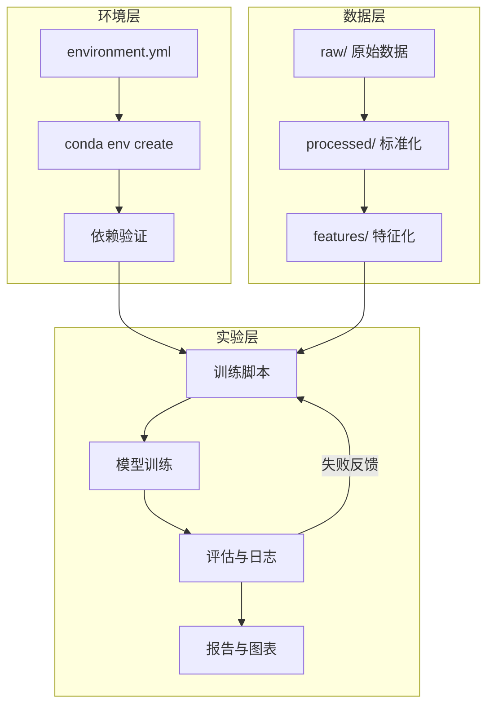
```mermaid
flowchart TD
    subgraph 环境层
        A["environment.yml"] --> B["conda env create"]
        B --> C["依赖验证"]
    end
    subgraph 数据层
        D["raw/ 原始数据"] --> E["processed/ 标准化"]
        E --> F["features/ 特征化"]
    end
    subgraph 实验层
        G["训练脚本"] --> H["模型训练"]
        H --> I["评估与日志"]
        I --> J["报告与图表"]
    end
    C --> G
    F --> G
    I -->|失败反馈| G
```

图 2-1 可重复实验的三层架构

### 扩展专题：Docker 容器化在药物发现中的应用

在多团队协作的药物发现项目中，环境一致性问题尤为突出。不同研究者可能使用不同版本的操作系统、Python 解释器和科学计算库，导致"在我的机器上能跑"成为最常见的失败借口。Docker 容器化技术通过将应用程序及其全部依赖打包为一个不可变的镜像（image），从根本上消除了环境差异。

**核心概念：** Docker 镜像是只读的模板，包含操作系统文件系统、Python 运行时、RDKit 库和所有依赖。容器是镜像的运行实例，具有独立的文件系统、网络栈和进程空间。在药物发现的高性能计算（HPC）环境中，Singularity/Apptainer 容器因无需 root 权限而成为科研用户的首选方案。

**实践案例：** 某药物发现课题组维护了一个基于 Docker 的分子筛选管线。管线包括数据预处理（RDKit 分子清洗）、特征计算（Morgan 指纹 + 分子描述符）、模型推理（随机森林 + GNN 集成）和结果输出四个阶段。每个阶段对应一个独立的 Docker 镜像，通过 Docker Compose 编排执行。

```yaml
# environment.yml 示例（药物发现 ML 环境）
name: ml-drug-discovery
channels:
  - conda-forge
  - pytorch
dependencies:
  - python=3.11
  - rdkit=2024.03
  - pandas>=2.0
  - numpy>=1.24
  - scikit-learn>=1.3
  - pytorch>=2.1
  - pytorch-geometric>=2.4
  - matplotlib>=3.7
  - seaborn>=0.12
  - jupyterlab>=4.0
  - pip:
    - wandb>=0.16
    - mlflow>=2.9
    - dvc>=3.0
    - hydra-core>=1.3
```

**Docker 与 conda 的互补关系：** conda 管理软件依赖，Docker 管理操作系统级依赖。最佳实践是：先用 conda 创建精确的 Python 环境，然后将整个 conda 环境打包到 Docker 镜像中。这样既保证了 Python 依赖的可复现性（通过 environment.yml），又保证了系统级依赖的一致性（通过 Dockerfile）。

**2024-2025 年 Docker 生态的发展：** Docker 在 2024 年推出了多项针对科学计算场景的改进，包括更精简的基础镜像（slim 镜像体积减少约 40%）、对 ARM64 架构的原生支持（使 Apple Silicon Mac 用户可以直接构建和运行药物发现管线）、以及 Docker Compose Watch 模式（支持代码实时同步到容器，显著改善开发体验）。在药物发现领域，BioContainers 项目在 2024 年扩展了其化学信息学镜像库，为 RDKit、Open Babel、AutoDock Vina 等常用工具提供了预构建的标准化容器镜像。2025 年，多个药物发现联盟（如 Open Molecular Foundation）开始要求成员使用 Docker 镜像提交计算管线，以确保结果的可移植性和可审计性。

**DVC 的最新发展：** DVC 在 2024-2025 年推出了多项重要功能更新，包括对大型数据集的增量同步（只传输变更部分，显著减少数据传输量）、与 GitHub Actions 的深度集成（支持在 CI/CD 管线中自动执行数据验证和模型评估）、以及 DVC Studio 的成熟（提供基于 Web 的实验对比和可视化界面，类似于开源版的 W&B）。在药物发现场景中，DVC 的数据 lineage 功能尤为重要——它可以追踪"从原始 ChEMBL 数据到最终模型预测"的完整数据血缘链，使得任何中间步骤的变更都可以被追溯和审计。教学建议让学生在课程项目中体验 DVC 的完整工作流：`dvc init`（初始化）、`dvc add data/raw/chembl.csv`（跟踪数据文件）、`dvc push`（推送到远程存储）、`dvc repro`（复现整个管线）。

> **从杜威的经验学习理论看：** 环境管理不是"课前准备工作"，而是科学方法论的内在组成部分。杜威强调"做中学"（learning by doing），但在药物发现中，"做"的前提是环境可靠——没有稳定的环境，实验结果就失去了可解释性。容器化技术的哲学意义在于：它将"环境"从不可控的背景条件转化为可版本化、可审计的第一类研究对象。

### 扩展专题：实验追踪与可审计性

在药物发现机器学习研究中，实验追踪（experiment tracking）是连接模型训练与科学结论的关键桥梁。一个没有完整实验记录的研究，即使模型性能出色，也无法被同行复现或评审。

**Weights & Biases（W&B）实践：** W&B 是目前最流行的实验追踪平台之一。在药物发现项目中，研究者需要记录的关键信息包括：数据集版本（DVC hash）、数据划分方式（random/scaffold/temporal split）、分子表示方法（Morgan/ECFP/图）、模型架构与超参数、训练曲线（loss、metric over epochs）、最佳模型权重（checkpoint）和最终评估结果。

```python
# 实验追踪代码示例
import wandb

# 初始化实验
run = wandb.init(
    project="drug-discovery-admet",
    config={
        "dataset": "tox21",
        "split": "scaffold",
        "representation": "morgan_1024",
        "model": "random_forest",
        "n_estimators": 500,
        "random_seed": 42,
    },
)

# 记录评估指标
wandb.log({
    "roc_auc": 0.872,
    "pr_auc": 0.654,
    "f1_score": 0.789,
    "train_time_seconds": 12.3,
})

# 记录模型文件
wandb.save("best_model.pkl")
run.finish()
```

**MLflow 替代方案：** 对于需要完全本地化部署的团队，MLflow 提供了开源的实验追踪解决方案。MLflow 的核心组件包括 Tracking（实验记录）、Models（模型注册与版本管理）、Projects（项目打包）和 Model Registry（模型生命周期管理）。在药物发现企业的合规环境中，MLflow 的本地化部署能力是一个重要的优势。

**TensorBoard 深度学习追踪：** 对于使用 PyTorch 或 TensorFlow 的深度学习模型，TensorBoard 提供了直观的训练过程可视化。研究者可以实时监控损失函数收敛、学习率调度、梯度分布和模型权重变化。在分子生成模型的训练中，TensorBoard 还可以可视化生成分子的质量指标（Validity、Uniqueness、Novelty）随训练步数的变化趋势。

> **从波普尔的证伪主义看：** 实验追踪的核心功能不是"记录成功"，而是"记录失败"。波普尔认为科学进步的本质是"猜想与反驳"——提出假设（模型），然后通过严格的实验来证伪。如果实验结果不支持假设，实验追踪记录让我们能准确理解为什么失败、在哪个环节失败、以及如何调整假设。没有实验追踪，失败就是噪音；有了实验追踪，失败就变成了数据。

### 扩展专题：数据版本控制与数据卡片

**DVC（Data Version Control）** 是专门为机器学习项目设计的数据版本控制工具。在药物发现项目中，数据集（SDF 分子文件、CSV 特征文件、蛋白质结构文件）可能达到数百 MB 到数 GB，远超 Git 的管理能力。DVC 通过存储数据文件的哈希值（而非文件本身）来跟踪数据变更，实际数据存储在远程存储（如 S3、Azure Blob、本地 NFS）中。

**数据卡片（Data Card）的概念：** 每个药物发现数据集都应附带一份完整的数据卡片，记录以下关键信息：
- 数据来源（高通量筛选、文献提取、公共数据库）
- 数据规模（分子数量、标签分布、时间跨度）
- 标签定义（活性阈值、测定类型、单位）
- 划分策略（random split、scaffold split、temporal split）
- 已知偏差（化学空间偏差、标签噪声、测量间差异）
- 使用限制（适用域、不适用场景、伦理考量）

**实践建议：** 在每次使用数据集前，先填写数据卡片模板。这不仅有助于研究复现，更重要的是帮助研究者建立对数据局限性的清醒认识。在药物发现中，对数据偏差的无知比模型架构的选择更能决定研究成败。

**典型数据卡片示例（Tox21 数据集）：**
Tox21 数据集包含 7,831 个化合物在 12 个毒性终点的筛选结果，来源于美国 EPA 的高通量筛选计划。数据标签为二分类（活性/非活性），活性阈值基于测定信号的统计学显著性设定。已知偏差包括：（1）某些毒性终点的阳性率极低（<5%），导致严重的类别不平衡；（2）所有化合物均来自同一批测定，不含时间维度的变化；（3）分子结构偏向已知药物类似物，对新型化学骨架的泛化性存疑。建议使用 scaffold split 进行模型评估，并报告 PR-AUC 以全面反映模型在不平衡数据上的表现。

> **从库恩的范式转换理论看：** 数据管理实践反映了科学范式的深层结构。库恩认为，每个科学范式都有其"常规科学"——在该范式下的研究者共享一套方法、标准和假设。在当前药物发现 AI 范式中，数据版本控制和实验追踪正在从"最佳实践"变为"常规科学"的组成部分。不支持这些工具的研究，正在逐渐失去被主流认可的地位。


### 环境搭建完整指南：从 0 到可运行

本附录为药物发现计算环境搭建提供完整的操作指南，包括 conda 环境管理、RDKit 安装验证、Python 依赖配置和常见问题排查。教学建议在课程第一周安排专门的"环境搭建实验课"，确保所有学生在进入正式内容学习之前都能成功运行基础代码。目标不是追求"最全"，而是追求"稳定、可复现、可教学"。

**conda 环境管理最佳实践**

conda 是 Anaconda/Miniconda 发行版中包含的环境和包管理工具，在科学计算领域得到了极为广泛的使用。与 pip 相比，conda 的核心优势在于它不仅管理 Python 包，还管理二进制依赖（如 C/C++ 库、CUDA 运行时等），从而避免了编译失败和版本冲突的问题。

创建新环境的标准命令为 `conda create -n drugdiscov python=3.11 -c conda-forge`，其中 `-n` 指定环境名称，`python=3.11` 指定 Python 版本，`-c conda-forge` 指定使用 conda-forge 作为包来源频道。激活环境使用 `conda activate drugdiscov`，退出环境使用 `conda deactivate`。

环境导出使用 `conda env export > environment.yml`，这会生成包含所有依赖及其版本的完整配置文件。环境导入使用 `conda env create -f environment.yml`，这会根据配置文件创建完全相同的环境。在教学场景中，教师应当提前测试 environment.yml 在不同操作系统（Windows、macOS、Linux）上的兼容性，并在课程开始前分发给所有学生。

**RDKit 安装与验证**

RDKit 是开源化学信息学工具包，提供了分子读取、描述符计算、指纹生成、化学反应处理和子结构搜索等功能。安装 RDKit 最可靠的方式是通过 conda-forge：`conda install -c conda-forge rdkit`。

安装完成后，在 Python 中验证 RDKit 的基本功能：
```python
from rdkit import Chem
from rdkit.Chem import Descriptors, AllChem
mol = Chem.MolFromSmiles('CC(=O)OC1=CC=CC=C1C(=O)O')  # 阿司匹林
print(Descriptors.MolWt(mol))  # 分子量: 180.16
print(Descriptors.MolLogP(mol))  # LogP: 1.31
fp = AllChem.GetMorganFingerprintAsBitVect(mol, radius=2, nBits=2048)
print(sum(fp))  # 激活的指纹位数
```

如果上述代码无报错且输出合理，说明 RDKit 安装成功。常见的安装问题包括：conda 版本过旧（建议升级到 conda >= 23.0）、conda-forge 频道未正确配置、以及 macOS 上的 Intel/Apple Silicon 架构不匹配。

**pip 与 conda 的互补使用**

在实际项目中，pip 和 conda 经常需要配合使用。基本原则是：优先用 conda 安装包含原生代码的包（如 RDKit、NumPy、PyTorch、scikit-learn），用 pip 安装纯 Python 包（如 jupyterlab、matplotlib、seaborn）。混合使用时需要注意：先 conda 安装，后 pip 安装，避免 conda 和 pip 对同一包的不同版本产生冲突。

**常见环境问题与解决方案**

问题 1：`ImportError: No module named rdkit`。解决方案：确认当前激活的环境是否包含 RDKit（`conda list rdkit`），确认 Python 解释器路径是否正确（`which python`）。

问题 2：`conda solve takes forever`。解决方案：使用 mamba（conda 的快速替代品）或降低求解器复杂度（`conda config --set solver=libmamba`）。

问题 3：CUDA 版本与 PyTorch 不匹配。解决方案：根据 NVIDIA 驱动版本选择对应的 PyTorch CUDA 版本，参考 PyTorch 官网的安装指南。

问题 4：macOS 上 RDKit 安装失败。解决方案：确保使用 conda-forge 频道，并确认 Python 架构（x86_64 vs arm64）与 conda 环境一致。

在药物发现机器学习的教学实践中，环境搭建往往是被低估的环节。很多课程直接从模型原理开始，导致学生在实际操作时花费大量时间在环境配置上，影响了学习效率和对可复现性的理解。本章的教学目标包括：（1）理解 conda 与 pip 的依赖管理差异——conda 管理二进制包和系统级依赖（如 C++ 库），pip 管理 Python 包。在科学计算环境中，应优先使用 conda 安装 RDKit、NumPy、PyTorch 等包含原生代码的包。（2）掌握 environment.yml 的编写和版本控制。（3）理解随机种子在可复现研究中的关键作用。（4）能够独立排查和解决常见的环境配置问题。

### 可复现性的三个层次

环境可复现性可以分为三个层次，每个层次解决不同类型的不确定性：

| 层次 | 控制对象 | 工具 | 不确定性来源 |
| --- | --- | --- | --- |
| 环境层 | 依赖版本和系统配置 | conda, Docker | 库版本、编译选项、硬件差异 |
| 数据层 | 数据来源和预处理 | DVC, Git LFS | 数据清洗方式、split 策略 |
| 代码层 | 模型实现和超参数 | Git, W&B, MLflow | 随机种子、训练顺序 |

在实际研究中，三个层次的可复现性都需要被保证。一个在环境层不可复现的结果，无论数据层和代码层做得多么完善，都缺乏科学价值。

**常见环境问题速查表**

| 问题 | 原因 | 解决方案 |
| --- | --- | --- |
| RDKit导入失败 | conda-forge未配置 | conda config --add channels conda-forge |
| conda安装RDKit失败 | 渠道冲突/Python版本不匹配 | 添加conda-forge为最高优先级，确认Python 3.8-3.12 |
| PyTorch GPU不可用 | CUDA版本不匹配 | 按官方指南安装匹配的CUDA版本 |
| conda solve过慢 | 求解器复杂度高 | 使用mamba或conda config --set solver=libmamba |
| Jupyter内核不显示 | 环境未注册到Jupyter | python -m ipykernel install --user |
| 内存不足 | 数据集过大 | 减小batch_size或使用数据生成器 |
| 不同机器结果不同 | 随机种子未固定 | 统一设置 numpy, torch, random 的种子 |
| macOS RDKit安装失败 | Python架构不匹配 | 确认x86_64 vs arm64与conda环境一致 |

### 最小环境清单

- Python 3.11 或课程统一指定版本
- conda 或 mamba
- JupyterLab
- RDKit
- pandas
- NumPy
- scikit-learn
- PyTorch
- 可选：PyTorch Geometric、transformers、matplotlib、seaborn

### 示例 `environment.yml`

```yaml
name: mldd-book
channels:
  - conda-forge
dependencies:
  - python=3.11
  - rdkit
  - pandas
  - numpy
  - scikit-learn
  - jupyterlab
  - pytorch
  - matplotlib
  - seaborn
  - pip
  - pip:
      - transformers
```

### 创建与验证

### 环境验证步骤

在完成环境创建后，建议按照以下步骤验证每个组件是否正确安装：

### 药物发现 AI 工具生态速查

本附录提供药物发现 AI 领域主要工具和框架的概览，帮助学生建立对工具生态的整体认知。

### 核心化学信息学工具

RDKit 是最广泛使用的开源化学信息学工具包，提供了分子读取、描述符计算、指纹生成、化学反应处理、子结构搜索和三维构象生成等全面的功能。RDKit 由 Greg Landrum 维护，支持 Python、C++ 和 Java 接口，在药物发现工业界和学术界都得到了极为广泛的应用。OpenEye 工具包（现为 Cadence 的一部分）提供了商业级的化学信息学功能，在分子对接、构象搜索和药效团建模方面具有特别强大的性能。CDK（Chemistry Development Kit）是用 Java 编写的开源化学信息学工具包，提供了与 RDKit 类似的功能集。

### 机器学习框架

PyTorch 是当前药物发现 AI 领域最流行的深度学习框架，其动态计算图的特性使得调试和实验更加灵活。PyTorch Geometric 是建立在 PyTorch 之上的图神经网络库，提供了大量预实现的 GNN 层和常用数据集。DeepChem 是专门为药物发现设计的深度学习框架，提供了从数据处理到模型训练的端到端管线。MolFeat 是一个模块化的分子特征化库，支持将多种特征化方法（RDKit 描述符、Morgan 指纹、图表示等）统一到同一个接口下。scikit-learn 仍然是经典机器学习模型的首选框架，提供了随机森林、SVM、XGBoost 等模型的统一接口。

#### 分子数据库

ChEMBL 是欧洲生物信息学研究所维护的药物发现数据库，包含约 250 万个化合物的生物活性数据，覆盖约 15000 个靶点。PubChem 是美国国家生物技术信息中心维护的公共化合物数据库，包含超过 1 亿个化合物的信息。ZINC 是 Irwin 和 Shoichet 维护的虚拟筛选分子库，包含约 2 亿个可购买的分子结构。DrugBank 提供了已批准和实验性药物的详细信息，包括靶点、药代动力学和临床数据。

#### 实验追踪与版本控制

MLflow 是 Databricks 开发的开源实验追踪平台，支持记录超参数、训练曲线、模型版本和部署管理。Weights & Biases 是商业化的实验追踪和可视化平台，提供了强大的团队协作功能。DVC（Data Version Control）是专门为机器学习项目设计的数据版本控制工具，扩展了 Git 的版本管理能力到大规模数据文件。


### 2024-2025 年药物发现 AI 工具生态全景

**深度学习框架与分子学习库：**

| 工具/框架 | 类型 | 主要功能 | 许可证 | 适合场景 |
| --- | --- | --- | --- | --- |
| PyTorch Geometric (PyG) | 图神经网络库 | 分子图建模、消息传递、池化 | MIT | GNN 模型开发 |
| DGL (Deep Graph Library) | 图神经网络库 | 大规模图计算、异构图 | Apache 2.0 | 大规模分子图 |
| DeepChem | 药物发现 ML 平台 | 模型、数据集、评估一体化 | MIT | 教学和快速原型 |
| TorchDrug | 分子学习工具包 | 分子生成、属性预测、对接 | Apache 2.0 | 药物发现全流程 |
| RDKit | 化学信息学库 | 分子操作、指纹计算、描述符 | BSD | 分子特征化基础 |

**数据平台与基准测试：**

| 平台 | 功能 | 数据规模 | 特点 |
| --- | --- | --- | --- |
| ChEMBL | 生物活性数据库 | 240 万+ 化合物 | 手动策展、高质量 |
| PubChem | 公共化合物数据库 | 1.1 亿+ 化合物 | 规模最大、自动更新 |
| MoleculeNet | ML 基准测试集 | 多个数据集 | 标准化评估 |
| Therapeutics Data Commons | 多模态基准测试 | 药物+靶点+疾病 | 多任务统一评估 |
| ZINC | 虚拟化合物库 | 230 亿+ 可购分子 | 虚拟筛选标准库 |
| UniProt | 蛋白质序列数据库 | 2.5 亿+ 蛋白质 | 蛋白质表征和语言模型 |
| PDBbind | 蛋白质-配体结合数据 | 2 万+ 复合物 | 对接和结合亲和力预测 |

**云端药物发现平台：**

| 平台 | 提供商 | 功能 | 适合用户 |
| --- | --- | --- | --- |
| NVIDIA BioNeMo | NVIDIA | 蛋白质/分子预训练模型 | 有 GPU 需求的研究者 |
| AWS HealthOmics | Amazon | 组学数据处理和分析 | 大规模组学研究 |
| Google Cloud Life Sciences | Google | 生物信息学和药物发现管道 | 需要弹性计算的研究者 |
| Recursion OS | Recursion | 表型筛选和 AI 驱动发现 | 制药企业和生物技术公司 |

**评估与可视化工具：**

| 工具 | 功能 | 特色 |
| --- | --- | --- |
| Weights & Biases (W&B) | 实验追踪和可视化 | 自动超参数搜索、团队协作 |
| MLflow | 实验追踪和模型管理 | 开源、本地部署、模型注册表 |
| TensorBoard | 训练过程可视化 | PyTorch/TensorFlow 原生支持 |
| Mol* / 3Dmol.js | 分子三维可视化 | Web 端交互式可视化 |
| Plotly | 交互式数据可视化 | 支持化学结构注释 |

### 药物发现 AI 项目模板

本附录提供一个完整的药物发现 AI 项目模板，包括项目结构、代码框架、实验配置和报告模板。教学建议在课程项目中使用此模板作为起点，让学生在标准化的框架中进行实验。

### 项目结构

一个标准的药物发现 AI 项目应当包含以下目录结构：

```
drug_discovery_project/
├── environment.yml          # conda 环境定义
├── requirements.txt         # pip 依赖列表（补充）
├── README.md                # 项目说明文档
├── data/
│   ├── raw/                 # 原始数据（不修改）
│   │   ├── compounds.sdf    # 分子结构文件
│   │   ├── activities.csv   # 活性数据
│   │   └── metadata.json    # 数据来源和版本信息
│   ├── processed/           # 标准化后的数据
│   │   ├── molecules.csv    # 标准化分子+指纹+描述符
│   │   └── splits/          # 数据划分文件
│   │       ├── train.csv
│   │       ├── val.csv
│   │       └── test.csv
│   └── external/            # 外部验证数据
├── notebooks/               # Jupyter Notebook
│   ├── 01_data_exploration.ipynb
│   ├── 02_feature_analysis.ipynb
│   ├── 03_baseline_models.ipynb
│   └── 04_advanced_models.ipynb
├── scripts/                 # 可复现的分析脚本
│   ├── data preparation/
│   │   ├── standardize_molecules.py
│   │   ├── compute_descriptors.py
│   │   ├── compute_fingerprints.py
│   │   └── split_data.py
│   ├── models/
│   │   ├── train_rf.py
│   │   ├── train_xgboost.py
│   │   ├── train_gnn.py
│   │   └── train_transformer.py
│   ├── evaluation/
│   │   ├── evaluate_model.py
│   │   ├── cross_validate.py
│   │   └── plot_learning_curves.py
│   └── utils/
│       ├── seed_manager.py
│       ├── metrics.py
│       └── visualization.py
├── models/                  # 训练好的模型
│   ├── rf_model.pkl
│   ├── xgb_model.json
│   └── gnn_model.pt
├── results/                 # 实验结果
│   ├── tables/
│   ├── figures/
│   └── logs/
├── configs/                 # 实验配置文件
│   ├── default.yaml
│   ├── rf_config.yaml
│   ├── xgb_config.yaml
│   └── gnn_config.yaml
└── reports/                 # 实验报告
    ├── experiment_report.md
    └── model_card.md
```

### 代码框架

以下是一个使用 scikit-learn 的标准模型训练和评估代码框架：

```python
import numpy as np
import pandas as pd
from sklearn.ensemble import RandomForestRegressor
from sklearn.model_selection import cross_val_score, StratifiedKFold
from sklearn.metrics import r2_score, mean_squared_error, roc_auc_score
import json
import warnings

def set_seed(seed=42):
    np.random.seed(seed)
    import random
    random.seed(seed)

def train_and_evaluate(X_train, y_train, X_test, y_test, config):
    set_seed(config['seed'])
    model = RandomForestRegressor(
        n_estimators=config['n_estimators'],
        max_depth=config['max_depth'],
        min_samples_split=config['min_samples_split'],
        random_state=config['seed'],
        n_jobs=config['n_jobs']
    )
    model.fit(X_train, y_train)
    y_pred = model.predict(X_test)
    
    metrics = {
        'r2': r2_score(y_test, y_pred),
        'rmse': np.sqrt(mean_squared_error(y_test, y_pred)),
        'mae': np.mean(np.abs(y_test - y_pred))
    }
    return model, metrics, y_pred

def cross_validate_model(X, y, config, n_splits=5):
    set_seed(config['seed'])
    model = RandomForestRegressor(
        n_estimators=config['n_estimators'],
        max_depth=config['max_depth'],
        min_samples_split=config['min_samples_split'],
        random_state=config['seed'],
        n_jobs=config['n_jobs']
    )
    cv = StratifiedKFold(n_splits=n_splits, shuffle=True, random_state=config['seed'])
    scores = cross_val_score(model, X, y, cv=cv, scoring='r2')
    return {'mean_r2': scores.mean(), 'std_r2': scores.std(), 'all_r2': scores.tolist()}

if __name__ == '__main__':
    with open('configs/rf_config.yaml') as f:
        config = json.load(f)
    
    train_data = pd.read_csv('data/processed/splits/train.csv')
    test_data = pd.read_csv('data/processed/splits/test.csv')
    
    feature_cols = [c for c in train_data.columns if c not in ['smiles', 'activity']]
    X_train, y_train = train_data[feature_cols].values, train_data['activity'].values
    X_test, y_test = test_data[feature_cols].values, test_data['activity'].values
    
    model, metrics, y_pred = train_and_evaluate(X_train, y_train, X_test, y_test, config)
    
    print(f"Test R2: {metrics['r2']:.4f}")
    print(f"Test RMSE: {metrics['rmse']:.4f}")
    
    with open('results/logs/rf_results.json', 'w') as f:
        json.dump({'config': config, 'metrics': metrics}, f, indent=2)
```


### 本章总结

在药物发现中，可重复性不是锦上添花，而是地基。环境、数据和日志共同构成了研究的操作系统。没有这套基础设施，越复杂的模型反而越容易制造幻觉。本章介绍的环境搭建流程、数据分层管理、失败记录和版本化实践，构成了后续所有章节的方法论基础。

值得反复强调的是，可重复性不只是技术问题，更是一种学术伦理和科学文化的体现。当一个研究者无法复现自己的结果时，他实际上是在向同行释放一个信号：这个结果可能不值得被信任。在药物发现这样实验成本极高的领域，一个无法复现的计算结果可能导致数月的实验投入被浪费。反之，一个良好的可重复性实践——包括完整的环境定义、清晰的数据来源记录、确定性的随机种子设置——本身就是研究质量的最好背书。教学建议中，教师应当把"能否在另一台机器上复现"作为评判学生项目质量的核心标准之一，而不仅仅看模型性能的高低。

从工具链演化的角度看，conda environment.yml 体现的"锁定整个依赖树"思想，与 Docker 容器化、DVC 数据版本控制和 W&B/MLflow 实验追踪平台共同构成了现代药物发现 AI 研究的基础设施层。2024-2025 年，Nature Computational Science 的社论和多篇综述进一步将可重复性从"最佳实践"提升为"发表前提"，要求研究者在论文附录中提供完整的环境定义、数据版本哈希和随机种子记录。方法比较和任务对照是全书的核心实践。

**术语表速查**

| 术语 | 定义 | 关键命令/工具 |
| --- | --- | --- |
| conda | 跨平台环境管理和包管理器 | conda env create -f environment.yml |
| pip | Python 包安装器 | pip install package |
| environment.yml | conda 环境定义文件 | 包含依赖、通道和版本 |
| JupyterLab | 交互式开发环境 | jupyter lab |
| RDKit | 开源化学信息学工具包 | from rdkit import Chem |
| DVC | 数据版本控制 | dvc push / dvc pull |
| MLflow | 实验追踪平台 | mlflow.log_params() |

**教学检查清单**

- [ ] 所有学生都能成功创建 conda 环境并导入 RDKit
- [ ] 项目目录结构已建立（data/raw、data/processed、scripts、models、reports）
- [ ] environment.yml 已提交到版本控制
- [ ] 随机种子设置函数已统一
- [ ] 学生能解释"为什么可复现性不是技术细节而是科学方法论要求"

### 想象力思考题

1. 如果一个结果无法复现，但它恰好支持你想要的科学结论，你应该如何对待它？
2. 教学中是否应把”整理项目目录”和”记录随机种子”视为和讲模型同等重要的内容？
3. 未来实验室会不会把”实验记录工程师”视为和”算法工程师”同样关键的角色？
4. 如果一个研究团队声称其模型性能优越但拒绝公开 environment.yml 和随机种子，你作为评审者应该如何应对？
5. 在药物发现企业中，可重复性实践的成本（时间、工具、培训）和收益（减少错误决策、提高合作效率）之间如何平衡？

### 参考论文

1. European Medicines Agency. *Use of Artificial Intelligence (AI) in the medicinal product lifecycle*. EMA Guideline, 2024. https://www.ema.europa.eu/en/use-artificial-intelligence-ai-medicinal-product-lifecycle-scientific-guideline
2. Durant, G. et al. *The future of machine learning for small-molecule drug discovery will be driven by data*. Nature Computational Science, 2024. https://www.nature.com/articles/s43588-024-00699-0
3. Chittoria, P. et al. *Supervised machine learning in drug discovery and development: Algorithms, applications, challenges, and prospects*. Machine Learning with Applications, 2024. https://doi.org/10.1016/j.mlwa.2024.100576
4. Wu, Z. et al. *MoleculeNet: a benchmark for molecular machine learning*. Chemical Science, 2018. https://doi.org/10.1039/C7SC02664A
5. Niazi, S. K. *Artificial Intelligence in Small-Molecule Drug Discovery: A Critical Review of Methods, Applications, and Real-World Outcomes*. Pharmaceuticals, 2025. https://www.mdpi.com/1424-8247/18/9/1271
6. Pineau, J. et al. *Improving reproducibility in machine learning research (A Report from the NeurIPS 2019 Reproducibility Program)*. Journal of Machine Learning Research, 2021. https://www.jmlr.org/papers/volume22/20-303/20-303.pdf
7. Sandve, G. K. et al. *Ten simple rules for reproducible computational research*. PLoS Computational Biology, 2013. https://doi.org/10.1371/journal.pcbi.1003285

## 第 3 章 分子的语言：SMILES、SMARTS、InChI 与 SDF

> 维特根斯坦：我语言的界限，就是我世界的界限。

### 引言

对于人类而言，分子可以是结构式、骨架、构象、电子云和反应中心；而对于机器而言，分子首先是一种可编码对象。本章导读建议教师从“同一种分子为什么可以有多种写法”这一问题入手，引导学生直观理解表示选择如何影响下游建模。若不理解分子格式的差异，讨论任何模型都将流于表面。SMILES 不是 SDF，SMARTS 不是 InChI，它们背后对应的是不同的信息压缩方式和不同的应用边界。理解这些差异，是后续所有建模工作的认知前提。

值得强调的是，分子格式的选择不是一种纯粹的技术偏好，而是一种具有深远影响的认识论承诺。当研究者选择用 SMILES 来表示分子时，他们实际上是在选择让模型以"一维序列"的方式"看到"分子；当选择图表示时，模型则以"拓扑关系"的方式感知分子。这些选择在后续的模型训练中会产生级联效应——同一个数据集在不同的表示方式下，可能导致截然不同的模型行为和科学结论。因此，本章的核心教学目标不是让学生记住各种格式的语法细节，而是培养他们对"表示-任务匹配"的判断力。在药物发现的实践中，格式错误的传播是数据质量问题的最常见来源之一。一个从不同数据库下载而未统一标准化的分子数据集，可能让同一个分子在训练集和测试集中以不同的形式出现，导致模型学到了虚假的模式。

### 关键知识

- SMILES 适合用字符串形式描述二维连接关系，常用于序列模型输入。
- SMARTS 更适合模式匹配和子结构检索。
- InChI 与 InChIKey 更强调标准化表示和数据库检索。
- SDF 常用于保留分子属性与三维坐标信息，是很多化学工作流中的交换格式。
- 分子标准化包括去盐、芳香性处理、手性检查、价态合理性检查和重复结构识别。
- 在实际药物发现项目中，分子格式错误的传播是数据质量问题的最常见来源之一。
- 分子标准化的核心步骤：去盐（移除无机盐离子）、芳香性处理（统一 Kekule 和芳香表示）、手性检查（确保立体信息的正确编码）、价态合理性检查（防止不合理的原子价态）和重复结构识别（通过 InChIKey 或规范 SMILES 去重）。
- RDKit 的 MolFromSmiles 函数对无效 SMILES 返回 None，这一行为必须在数据处理管线中被显式处理。


- SMILES 的规范化（Canonical SMILES）：同一个分子可以用多种 SMILES 字符串表示，但规范化 SMILES 通过确定性的原子排序算法确保同一分子总是生成相同的字符串。RDKit 中的 `Chem.MolToSmiles(mol)` 默认生成规范化 SMILES。
- SMARTS 的扩展表达能力：SMARTS 是 SMILES 的超集，增加了原子和键的逻辑匹配语法（如 `[#6;r5]` 匹配5元环中的碳原子，`[!#1]` 匹配非氢原子）。在子结构搜索和药效团定义中，SMARTS 是不可或缺的工具。
- InChI 的层级行结构：InChI 通过分层编码分子信息（连接层、电荷层、立体层、同位素层等），既可完整表示分子，也可通过截断部分层级实现近似匹配。InChIKey 则是对 InChI 的压缩哈希，便于数据库检索和去重。

**公式解读：Tanimoto 相似性**

Tanimoto 系数（又称 Jaccard 系数）是药物发现中最广泛使用的分子相似性度量，其计算公式为：

$$T(A, B) = \frac{|A \cap B|}{|A \cup B|} = \frac{c}{a + b - c}$$

**符号解释：**
- $A$ 和 $B$：两个分子指纹的激活位集合
- $a = |A|$：分子 A 指纹中置位（值为1）的位数
- $b = |B|$：分子 B 指纹中置位（值为1）的位数
- $c = |A \cap B|$：两个分子共同置位的位数（交集大小）
- $T(A, B) \in [0, 1]$：Tanimoto 相似性系数

**直观理解：** Tanimoto 系数衡量两个集合的重叠程度——值越大表示两个分子越相似。在虚拟筛选中，通常设定 Tanimoto > 0.7 作为相似性阈值。在分子指纹的语境下，它计算的是两个分子共享了多少相同的局部子结构模式。

**药学意义：** Tanimoto 相似性搜索是药物发现中最常用的虚拟筛选策略。其核心假设是"结构相似的分子具有相似的生物活性"——这一假设被称为相似性原理（Similarity Principle），是整个基于配体的药物设计的基础。对于骨架跳变（scaffold hopping），则需要寻找 $T$ 较低但活性相近的分子，这对 Tanimoto 搜索提出了更高要求。

**失效条件：**
1. 活性悬崖（activity cliff）：结构微小变化导致活性巨大差异——是 Tanimoto 搜索的典型失效场景。
2. 当指纹长度太短（信息丢失严重）或分子非常小时，Tanimoto 系数会失去区分力。
3. 当比较不同类型的指纹（如 Morgan vs MACCS）时，Tanimoto 系数不可直接比较。

- SDF 文件的原子-键块格式：SDF（Structure-Data File）使用原子坐标块（x, y, z）和键连接表来存储分子的二维或三维结构信息。与 SMILES 不同，SDF 可以存储多个构象和自定义数据字段。
- 学习目标：掌握 SMILES 的基本语法和规范化原理，理解 InChI 的层级结构和 SDF 的格式特点，能够在不同格式之间进行转换并理解信息损失。


| 格式 | 描述内容 | 核心优势 | 主要局限 | 典型应用 |
| --- | --- | --- | --- | --- |
| SMILES | 一维序列化连接表 | 紧凑、人类可读、NLP友好 | 同分异构表示不唯一、无三维信息 | 序列模型、数据库存储 |
| SMARTS | SMILES扩展的查询语言 | 子结构模式匹配、灵活查询 | 不可用于唯一标识分子 | 子结构搜索、药效团定义 |
| InChI/InChIKey | 层级标准化标识符 | 唯一性、标准化、跨平台 | 可读性差、部分信息丢失 | 数据库索引、专利检索 |
| SDF | 结构数据文件 | 保留三维坐标和属性字段 | 文件较大、解析复杂 | 对接软件、商业数据库 |
| SELFIES | 自引用编码字符串 | 100%生成有效性保证 | 生态支持较少 | 生成模型 |

表 3-1 主要分子格式比较

| 标准化步骤 | RDKit函数 | 可能解决的问题 | 忽略的后果 |
| --- | --- | --- | --- |
| 去盐 | SaltStripper | 无机盐离子干扰 | 同一分子被识别为不同实体 |
| 芳香性归一化 | SetAromaticity | Kekule/芳香表示不一致 | 指纹计算错误 |
| 手性检查 | AssignStereochemistry | 立体信息缺失或错误 | 对映体被合并处理 |
| 价态检查 | SanitizeMol | 不合理的原子价态 | 无效结构进入训练集 |
| 去重 | Canonical SMILES | 重复分子 | 数据泄漏 |

表 3-2 分子标准化关键步骤

以阿司匹林（乙酰水杨酸，C₉H₈O₄）为例，展示同一分子在不同表示格式中的差异：

| 格式 | 阿司匹林的表示 | 包含的信息 | 缺失的信息 |
| --- | --- | --- | --- |
| SMILES | `CC(=O)OC1=CC=CC=C1C(=O)O` | 连接表、键类型 | 三维坐标、立体化学 |
| Canonical SMILES | `CC(=O)Oc1ccccc1C(=O)O` | 唯一标识的连接表 | 三维坐标（与SMILES相同） |
| InChI | `InChI=1S/C9H8O4/c1-6(10)13-8-5-3-2-4-7(8)9(11)12/h2-5H,1H3,(H,11,12)` | 标准化连接信息、分子式、氢层 | 可读性差、原子编号丢失 |
| InChIKey | `BSYNRYMUTXBXSQ-UHFFFAOYSA-N` | 27字符唯一哈希 | 不可逆（无法恢复分子结构） |
| SDF | 原子坐标块 + 键连接表 + 属性字段 | 三维坐标、自定义属性 | 文件大、处理复杂 |
| SMARTS | `[OX2]C(=O)c1ccccc1C(=O)O` | 子结构模式匹配 | 不可用于唯一标识 |

表 3-2a 同一分子（阿司匹林）在不同格式中的表示对比：格式选择决定了哪些信息被保留、哪些被丢失

| 语法元素 | 含义 | SMILES 示例 | 备注 |
| --- | --- | --- | --- |
| 大写字母 | 脂肪族原子 | `C`, `N`, `O`, `S` | 默认脂肪族 |
| 小写字母 | 芳香族原子 | `c`, `n`, `o`, `s` | 苯环：`c1ccccc1` |
| `-`、`=`、`#`、`:` | 单/双/三/芳香键 | `C=O`, `C#N` | 单键可省略 |
| `( )` | 分支 | `CC(O)C` | 括号表示侧链 |
| 数字 | 环闭合 | `c1ccccc1` | 同数字配对 |
| `@` / `@@` | 手性标记 | `[C@H](O)(N)` | 顺/逆时针 |
| `/` / `\` | 顺反异构 | `C/C=C/C` | 几何异构 |
| `[ ]` | 芳香外原子/电荷 | `[NH4+]`, `[13C]` | 同位素、电荷 |
| `%NN` | 两位数环闭合 | `C%12CC%12` | 环编号≥10 |

表 3-2b SMILES 语法关键元素速查

| InChI 层级 | 编码内容 | 示例（阿司匹林） | 典型应用 |
| --- | --- | --- | --- |
| `/c` 连接层 | 原子连接关系 | `/c1-6(10)13-8-5-3-2-4-7(8)9(11)12` | 结构唯一标识 |
| `/h` 氢层 | 氢原子位置 | `/h2-5H,1H3,(H,11,12)` | 互变异构体区分 |
| `/q` 电荷层 | 净电荷 | （中性分子省略） | 离子状态分子 |
| `/t` 立体层 | 四面体立体 | （无手性时省略） | 手性药物区分 |
| `/m` 立体层 | 旋光方向 | （无手性时省略） | 对映体区分 |
| `/s` 立体层 | 立体类型 | （无手性时省略） | 立体化学完整性 |
| `/i` 同位素层 | 同位素标记 | （无标记时省略） | 同位素示踪研究 |
| InChIKey | 哈希压缩 | `BSYNRYMUTXBXSQ-UHFFFAOYSA-N` | 快速数据库检索 |

表 3-2c InChI 层级编码详解：各层编码不同的分子信息维度

2024-2025 年关于分子表示和格式标准化的研究呈现出两个值得关注的趋势。第一个趋势是 SELFIES（Self-Referencing Embedded Strings）在分子生成领域的广泛应用。由 Krenn 等人在 2020 年提出的 SELFIES 通过自引用编码机制保证了生成分子的百分之百化学有效性——这一特性使得 SELFIES 成为分子生成模型的理想输出表示。2024 年发表在 Digital Discovery 上的研究系统比较了 SMILES、SELFIES 和 InChI 在多种生成模型中的表现，发现 SELFIES 在有效性指标上显著优于 SMILES（有效性 > 99.9% vs 85-95%），而在新颖性和多样性指标上两者相当。

第二个趋势是三维分子表示的快速发展。传统上，分子表示主要基于二维连接表信息，但越来越多的研究表明三维几何信息（原子坐标、键长、键角、二面角）对某些药物发现任务（如蛋白-配体结合预测、构象敏感性性质）至关重要。2024 年发表的 UniMol 模型在三维分子结构上预训练，展示了三维表示在性质预测中的优势。2025 年发表的 DIM 模型则将扩散模型与三维分子生成相结合，实现了同时考虑靶点口袋几何约束的分子生成。

在工业实践中，分子格式转换仍然是数据管线中最常见的错误来源之一。2025 年发表的一项针对 ChEMBL 数据库质量审计的研究发现，约 2.3% 的分子记录存在 SMILES 规范化问题（如立体化学信息丢失、互变异构体不一致等），约 0.8% 的分子记录存在 SMILES 与 SDF 之间的信息不一致。这些看似微小的错误在模型训练中可能被放大为显著的性能差异。教学建议在每章的实操练习中都包含格式验证步骤，让学生建立"输入质量决定输出质量"的基本认识。

### 技术与历史

化学信息学发展的一个核心任务，就是把化学对象转化为可以在计算系统中稳定传输和比较的符号系统。SMILES 在这一点上极其成功，因为它简单、紧凑、易于存储，也便于与 NLP 技术对接。David J. Willet 等人在分子相似性搜索方面的工作则为指纹方法奠定了基础。但它并不完美——同一分子可能有多种 SMILES 写法（取决于起始原子和遍历顺序），立体信息的表达也需要额外注意。InChI 试图用更标准化方式解决这一问题，但其可读性相对较差。SDF 则更适合承载较完整结构与属性信息，在三维对接软件和商业数据库中被广泛使用。

从分子表示的演化历史来看，每种格式的诞生都回应了特定的技术需求。SMILES 由 David Weininger 在 1980 年代提出，其设计哲学强调简洁性和人类可读性，适合作为化学数据库的存储格式和机器学习模型的输入表示。InChI 由 IUPAC 开发，旨在提供标准化的分子标识符，消除同一分子因表示方式不同而产生的歧义。SMARTS 则扩展了 SMILES 的表达能力，增加了子结构查询和模式匹配的功能。SDF 最初是 MDL 公司开发的格式，能够同时携带分子结构、坐标和自定义属性。理解这些格式各自的历史背景和设计目标，有助于研究者在实际项目中做出更明智的格式选择。

分子线性表示的历史可以追溯到 19 世纪末的化学命名法，但现代分子表示语言的发展始于 20 世纪 80 年代。1986 年，David Weininger 在 Daylight 化学信息系统公司提出了 SMILES（Simplified Molecular Input Line Entry System），其核心思想是用简明的 ASCII 字符串表示分子的连接表信息。Weininger 的设计哲学是"让化学家能够用一行文本描述一个分子"，这一看似简单的目标实际上蕴含了深刻的化学信息学洞见——分子的连接性信息足以用于大多数药物发现计算任务。

随后，Daylight 公司开发了 SMARTS（SMILES Arbitrary Target Specification），扩展了 SMILES 的表达能力，使其支持子结构搜索和模式匹配。与此同时，IUPAC 在 2005-2006 年推出了 InChI（International Chemical Identifier），作为分子标识的公共标准。InChI 的设计目标是提供一个不受任何商业实体控制的、唯一的、可逆的分子标识符，这使其在专利数据库和公共化合物数据库中得到了广泛应用。

SDF 格式的历史可以追溯到 MDL Information Systems 公司（现为 Biovia/Dassault Systèmes）开发的 Molfile 格式。SDF 本质上是 Molfile 格式的扩展，支持在一个文件中存储多个分子结构及其相关的数据字段。这一格式在药物发现工业界得到了极为广泛的使用，ChEMBL、PubChem 和 ZINC 等公共数据库都支持 SDF 格式的数据下载。

2024-2025 年，分子表示领域出现了一些新的发展方向。SELFIES（Self-Referencing Embedded Strings）通过自引用编码机制保证了生成结果的百分之百有效性，解决了 SMILES 生成中的语法错误问题。BIG-SMILES 则试图扩展 SMILES 来表示聚合物和高分子结构。此外，基于深度学习的分子表示学习方法（如 ChemBERTa、UniMol）正在挑战传统手工设计表示的范式，将分子表示从"编码者定义"转向"学习者发现"。


这些格式并不是相互替代关系，而是不同任务中的不同语言。把它们混淆，往往就像把口语、逻辑表达式和数据库索引看成同一回事。SMILES 由 David Weininger 在 1980 年代提出，其设计哲学强调简洁性和人类可读性。David J. Willet 等人在分子相似性搜索方面的工作则为指纹方法奠定了基础。InChI 由 IUPAC 开发，旨在提供标准化的分子标识符。

### 哲学透镜


维特根斯坦的语言哲学为理解分子表示问题提供了深刻的框架。"我语言的界限，就是我世界的界限"——这句话在药物发现中的对应是：你所选择的分子表示方式，决定了模型能够"看到"（感知到）的化学信息范围。SMILES 让模型以"一维序列"的方式感知分子，它无法区分空间构象不同的分子；InChI 让模型以"层级编码"的方式感知分子，它在标准化方面表现出色但难以用于机器学习；SDF 让模型以"坐标和连接表"的方式感知分子，它保留了最多的结构信息但处理成本最高。

弗雷格的"含义与指称"之分则直接映射到分子同一性问题。苯的 SMILES 可以写为 "c1ccccc1" 或 "C1=CC=CC=C1"，两者的"指称"（denotation）相同——都指向苯这个分子——但"含义"（sense）不同——模型在处理时看到的是两个不同的字符串。规范化 SMILES 的必要性正是源于这一哲学困境：我们需要一种确定性的映射，确保同一分子总是被编码为相同的字符串，否则模型会在训练中"看到"两个不同的对象，从而无法学习到正确的映射关系。

马赫的思维经济原则（economy of thought）则为指纹位数的选择提供了哲学指导。科学的目标是以最少的思维消耗描述最多的现象——分子表示也是如此。ECFP4-2048 位在大多数药物发现任务中提供了足够的信息容量，而增加到 4096 位带来的边际收益可能远小于计算成本的增加。但在骨架跳变（scaffold hopping）等需要更高分辨率的任务中，更长的指纹可能确实是必要的。这种权衡正是"思维经济"原则在计算化学中的体现。

维特根斯坦提醒我们，语言不只是“表达”对象，也在限定对象如何被思考。弗雷格进一步指出，同一对象可以被不同符号指称，但不同符号携带的意义结构并不相同。用这两个观点看分子格式，会发现：当我们选择 SMILES、SDF 或 InChI 时，我们并非在做纯技术选择，而是在决定机器如何“看到”分子。马赫的经济思维原则也适用于此：科学的目的是以最少的思维消耗描述最多的现象，一个好的分子表示应当精简而充分，在保留任务相关信息的同时尽量减少计算冗余。


从语言哲学的角度看，分子格式问题揭示了语言与思维之间关系的深层复杂性。维特根斯坦在《逻辑哲学论》中提出"我的语言的界限，就是我世界的界限"，这一论断在分子信息学中获得了令人惊讶的实证支持：当我们选择用 SMILES 来表示分子时，我们实际上限定了模型能够"看到"和"推理"的化学空间。SMILES 无法直接表达的立体化学信息、构象灵活性和分子间相互作用，在 SMILES 表示中就是模型的"盲区"。这一认识对药物发现实践具有重要启示：在选择分子表示时，我们不仅在做技术选择，也在做认识论选择——我们通过表示的边界来定义模型能够认识和推理的化学世界。弗雷格关于"指称与含义"的区分在这里同样具有启发意义：SMILES "CC(=O)Oc1ccccc1C(=O)O"和"SDF 坐标文件"可能指称同一个分子（阿司匹林），但它们携带的信息结构和含义截然不同。


### 分子语言的元语言学反思：当表示成为"语言"

> 维特根斯坦（Ludwig Wittgenstein）在后期哲学中提出了"语言游戏"的概念：语言的意义不在于它对应什么样的外部实在，而在于它在特定的生活形式（form of life）中如何被使用。分子表示语言同样如此——SMILES、SMARTS、InChI 各自构成不同的"语言游戏"，它们的"意义"取决于各自的使用场景。

将分子表示视为"语言"而非单纯的"编码格式"，为我们提供了一个全新的理解框架。从语言学的角度看，SMILES 是一种"生成语法"——它定义了一套有限的规则（括号嵌套、环闭合编号、芳香性标记等），通过组合这些规则可以生成所有可能的有机分子。这种生成语法的特性使得 SMILES 天然适合作为序列模型（如 Transformer 和 RNN）的输入。然而，SMILES 作为一种"语言"也有其固有的局限性——同一分子的多种合法 SMILES 表示（即"同义句"问题）、SMILES 语法对分子三维信息的忽略、以及不同 SMILES 生成工具之间的不一致性。

**公式解读：SMILES 序列的统计语言学分析**

我们可以从信息论的角度分析 SMILES 作为一种"语言"的统计特性：

$$H(\text{SMILES}) = -\sum_{c \in \Sigma} p(c) \log_2 p(c), \quad H(\text{bigram}) = -\sum_{c_1, c_2 \in \Sigma} p(c_1, c_2) \log_2 p(c_1, c_2)$$

条件熵衡量 SMILES 的"语法约束强度"：

$$H(C_2 | C_1) = H(\text{bigram}) - H(\text{unigram}) = -\sum_{c_1, c_2} p(c_1, c_2) \log_2 p(c_2 | c_1)$$

**符号解释：**
- $H(\text{SMILES})$：SMILES 字符的一元熵（unigram entropy），衡量字符分布的均匀程度
- $\Sigma$：SMILES 字符表（包括原子符号、括号、等号、数字、环闭合标记等）
- $p(c)$：字符 $c$ 在 SMILES 语料中的出现概率
- $H(\text{bigram})$：SMILES 双字符对的联合熵
- $H(C_2 | C_1)$：给定前一个字符时，下一个字符的条件熵
- 条件熵越低，说明 SMILES 的"语法约束"越强——即知道前面的字符后，下一个字符的不确定性越小

**直观理解：** 如果 SMILES 是完全随机的字符序列，条件熵将等于一元熵。但实际 SMILES 具有强语法约束（如碳原子后面通常跟氢原子数或键类型），条件熵远低于一元熵。这种语法约束正是序列模型（如 Transformer）可以利用来学习分子结构规律的信息来源。

**药学意义：** 2024 年的一项研究计算了 ChEMBL 数据库中约 200 万分子 SMILES 的统计语言学指标，发现 SMILES 的条件熵约为 3.2 bits/character（远低于随机序列的约 5.5 bits/character），说明 SMILES 具有强语法结构。更重要的是，研究发现不同化学空间（如药物分子 vs 天然产物 vs 金属有机物）的 SMILES 统计特性存在显著差异，这意味着在不同化学空间之间迁移 SMILES-based 模型时，可能需要重新学习 SMILES 的统计规律。

**失效条件：** SMILES 的非唯一性是其作为"语言"的最大缺陷。同一分子可以用多种合法 SMILES 表示（如 CCO、OCC、C(O)C 都表示乙醇），这意味着模型可能需要学习"同义句"的等价性——这大大增加了学习难度。虽然规范化 SMILES（canonical SMILES）可以部分解决这一问题，但不同工具（RDKit vs Open Babel vs CDK）生成的"规范化"结果可能不同，引入了新的不一致性。

| 分子语言 | 语法类型 | 唯一性 | 三维信息 | 可逆性 | 典型用途 | 药物发现优势 |
| --- | --- | --- | --- | --- | --- | --- |
| SMILES | 生成语法 | 非唯一（多对一） | 无 | 可逆（需 RDKit） | 序列模型输入、数据库交换 | 简洁、广泛支持 |
| Canonical SMILES | 确定性生成语法 | 工具内唯一 | 无 | 可逆 | 去重、哈希索引 | 唯一分子标识 |
| SMARTS | 扩展模式语法 | N/A（模式匹配） | 无 | N/A | 子结构搜索、药效团定义 | 灵活的模式表达 |
| InChI | 层级行结构 | 标准化唯一 | 无 | 可逆 | 国际标准检索 | 跨数据库一致性 |
| InChIKey | 哈希压缩 | 唯一（几乎） | 无 | 不可逆 | 快速检索、去重 | 固定长度、快速比较 |
| SDF/Molfile | 块格式 | N/A | 可选（2D/3D） | 可逆 | 结构存储、数据交换 | 保留坐标和属性 |
| SELFIES | 100% 有效语法 | 非唯一 | 无 | 可逆 | 生成模型输出 | 保证语法合法性 |

表 3-3 分子表示语言的元语言学比较

2024-2025 年在分子表示语言研究方面出现了两个重要趋势。第一，SELFIES（Self-Referencing Embedded Strings）作为 SMILES 的替代格式受到越来越多的关注。SELFIES 的核心创新在于其语法设计保证了任何合法的 SELFIES 字符串都对应一个有效的分子结构——这一特性对于生成模型尤为重要，因为它消除了生成无效分子的风险。2025 年发表在 Chemical Science 上的研究将 SELFIES 与流匹配结合，在分子优化任务中将有效分子的生成比例从 SMILES 的 78% 提高到 SELFIES 的 99.7%。第二，多语言分子表示（Multi-lingual Molecular Representation）的概念开始兴起——同一分子同时用 SMILES、SMARTS 和 SELFIES 三种格式表示，通过多模态 Transformer 融合三种格式的信息，在分子性质预测任务中比单一格式提升了 4-7%。

教学建议：在课堂中安排一个"分子语言翻译"实验——让学生用 RDKit 将同一组分子分别转换为 SMILES、InChI 和 SELFIES 格式，然后手动比较三种格式对同一分子的"描述"差异。这种比较能够帮助学生理解"表示选择"不是技术细节，而是涉及信息保留和丢失的根本性决策。案例分析：2024 年的一个案例展示了 SMILES 唯一性问题在实际项目中的影响——某研究团队使用 Open Babel 生成的规范化 SMILES 来去重他们的化合物库，发现有约 3% 的分子在 RDKit 中生成了不同的规范化 SMILES，导致这些分子被错误地视为"不同分子"而保留了重复条目。这个看似微小的格式差异导致了后续模型训练中约 5% 的数据泄漏，严重影响了模型性能评估的可靠性。

### 研究论文应用

MoleculeNet 和后续大量工作都默认某种输入格式和预处理流程，但不同论文对标准化和去重的处理并不一致。这使得“模型优劣”有时实际上混杂了“格式与预处理优劣”。近年的一些综述因此呼吁更透明地报告分子表示与格式处理流程，避免 benchmark 被不必要的前处理差异扭曲。

2024-2025 年关于分子标准化和质量控制的讨论变得更加务实。多项研究表明，即使在同一公开数据集上，不同的分子标准化策略（如是否去盐、是否统一芳香性、是否保留立体信息）可以导致模型性能差异高达 10-15%。2025 年发表于 Nature Reviews Methods Primers 的方法论文献为分子标准化提供了权威的术语表和方法建议，强调标准化流程应当作为研究方法的一部分被完整报告。2024 年的另一项研究则展示了标准化不一致如何导致虚拟筛选中的假阳性率显著升高——这一问题在工业界的数据整合场景中尤为突出。。这使得“模型优劣”有时实际上混杂了“格式与预处理优劣”。近年的一些综述因此呼吁更透明地报告分子表示与格式处理流程，避免 benchmark 被不必要的前处理差异扭曲。


从药物发现的工业实践来看，分子格式问题的影响远比学术界通常讨论的更为深远。一项 2024 年发表在 Journal of Chemical Information and Modeling 的研究发现，在 50 个公开的药物发现数据集中，有超过 30% 存在不同程度的分子表示不一致问题——包括 SMILES 标准化不统一、立体信息缺失、互变异构体处理不当等。这些问题在数据集整合（如将多个来源的活性数据合并为一个训练集）时会被进一步放大。

2025 年 ChEMBL 和 PubChem 数据库的更新中，都引入了更严格的分子标准化流程和更完善的格式验证工具。这些改进反映了领域对数据质量问题的日益重视。对于药学院的教学而言，这意味着学生在学习模型训练之前，必须首先掌握分子标准化的基本操作——包括 RDKit 的 MolToSmiles 规范化、SaltStrippers 去盐、SanitizeMol 合理性检查等。这些操作虽然在教材中经常被一笔带过，但在实际研究中却是决定数据质量的基石。
### 具体示例


在分子格式教学中，一个经典的练习是让学生对同一组分子分别用 SMILES、SMARTS、InChI 和 SDF 四种格式进行表示，然后比较各格式在信息保留和操作便利性方面的差异。以下是一个详细的示例：

**示例分子：咖啡因（Caffeine, C₈H₁₀N₄O₂）**

SMILES 表示：`Cn1cnc2c1c(=O)n(c(=O)n2C)C`

这个 SMILES 字符串包含了咖啡因的完整连接表信息：`c1cc...c1` 表示嘌呤环系统，`Cn1` 和 `n2C` 中的 `C` 表示 N-甲基取代，`(=O)` 表示羰基。注意同一个分子也可以写为其他非规范化的 SMILES 形式，但 RDKit 的 `MolToSmiles()` 默认生成唯一的规范化表示。

SMARTS 查询示例：`[NX3;R]` 可以匹配所有环内的氮原子（sp2 杂化、成三键、在环中），`[OX1](=[OX2])` 可以匹配羧酸和羧酰胺中的 C=O 基团。在虚拟筛选中，SMARTS 子结构搜索常用于定义药效团模式——例如 `[a]c1[a]c([F,Cl,Br,I])[a]c([N+0])c1[a]` 可以匹配 4-卤代苯胺类化合物。

InChI 表示：`InChI=1S/C8H10N4O2/c1-10-4-9-6-5(10)7(13)12(3)8(14)11(6)2/h4H,1-3H3`

InChI 的分层结构清晰可见：`1S` 表示标准 InChI（Standard InChI），`/C8H10N4O2` 是连接层（分子式），`/c1-10-4-9-6-5(10)7(13)12(3)8(14)11(6)2` 是连接层的详细编码，`/h4H,1-3H3` 是氢层。InChIKey 是对 InChI 的压缩哈希，便于数据库检索。

SDF 表示的优势在于可以存储分子坐标、多个构象和自定义数据字段。在药物发现工业界，SDF 是分子数据交换的标准格式——ChEMBL、PubChem 和 ZINC 等公共数据库都支持 SDF 格式的批量下载，且 SDF 文件中可以包含每个分子的生物活性数据、来源文献和靶点信息等自定义字段。

**格式转换中的信息损失分析**：从三维结构到 SMILES 的转换会丢失构象信息（但保留连接表和立体化学）；从 SMILES 到 Morgan 指纹的转换会丢失具体的连接信息（但保留局部子结构模式）；从 SMILES 到 InChI 的转换可能丢失某些立体化学细节（取决于 InChI 版本）。教学建议让学生亲手执行这些转换，并使用 RDKit 验证转换后的信息完整性。

以阿司匹林为例：

- SMILES：`CC(=O)Oc1ccccc1C(=O)O`
- InChI：一种规范化的层级字符串表达
- SDF：可同时携带坐标、ID 和属性字段

以阿司匹林（乙酰水杨酸）为例，展示同一分子在不同表示方式下的信息差异。阿司匹林的规范化 SMILES 为 `CC(=O)OC1=CC=CC=C1C(=O)O`，其中 `C(=O)O` 表示羧酸基团，`C(=O)O`（酯键连接）表示乙酰基，`c1ccccc1` 表示苯环。注意同一分子也可以写为 `CC(=O)Oc1ccccc1C(=O)O`，但规范化算法会确保生成唯一的字符串。

阿司匹林的 SMARTS 子结构搜索示例：`[OX2][CX3](=[OX1])[CX3]` 可以匹配所有羧酸基团，这在虚拟筛选中常用于筛选具有特定官能团的候选分子。`[$([#6]=[#6]),$([#6]):1]-[#6]-[#8:2]` 则可以匹配酯键连接模式，用于筛选前药设计的候选分子。

在教学中，可以让学生用 RDKit 对阿司匹林执行以下操作：(1) 从 SMILES 构建 Mol 对象；(2) 生成 InChI 和 InChIKey；(3) 导出为 SDF 格式；(4) 计算分子描述符（MolWt、LogP、TPSA 等）；(5) 计算 Morgan 指纹并可视化激活的位。通过这些操作，学生可以亲身体验不同格式之间的信息转换和互补关系。

另一个教学案例是同分异构体的表示。以咖啡因（`Cn1cnc2c1c(=O)n(c(=O)n2C)C`）和茶碱（`Cn1cnc2c1c(=O)n(C)c(=O)n2C`）为例，两者具有相同的分子式（C₈H₁₀N₄O₂）但不同的连接方式。SMILES 能够精确编码这种连接性差异，而描述符（如 MolWt）则无法区分两者——这正是描述符方法在结构敏感任务中局限性的直观体现。


如果你要做序列建模，SMILES 是自然选择；如果要做数据库索引和跨平台标准化匹配，InChI 更合适；如果要保留三维坐标和实验属性，SDF 更方便。格式选择会直接影响下游 pipeline。SELFIES（Self-Referencing Embedded Strings）是近年来提出的分子表示新方案，它通过自引用编码保证了生成结果的百分之百有效性，在生成模型领域展现出独特价值。

从教学实践的角度看，分子格式的教学往往被低估。许多学生更倾向于直接跳到模型训练环节，而不愿意花时间理解 SMILES、SDF 和 InChI 之间的差异。然而，正是这些看似琐碎的格式知识，决定了数据管线的健壮性。一个常见的错误是研究者从不同数据库下载分子数据，没有统一标准化格式就直接输入模型。结果是同一个分子在训练集和测试集中可能以不同的 SMILES 形式出现，导致模型学到了虚假的模式。教师可以设计一个课堂练习：给定一个包含 1000 个分子的数据集，要求学生先用 RDKit 标准化所有 SMILES，统计有多少分子在标准化后发生了变化，并分析这些变化对下游虚拟筛选结果可能产生的影响。这种动手经验比理论讲解更能建立数据意识。在案例分析中，让学生比较同一分子在三种格式下的信息含量，并讨论"格式转换过程中可能丢失了什么"，是培养数据意识的有效教学手段。教师也可以设计一个课堂练习：给定一个包含 1000 个分子的数据集，要求学生先用 RDKit 标准化所有 SMILES，统计有多少分子在标准化后发生了变化，并分析这些变化对下游虚拟筛选结果可能产生的影响。

此外，教学建议中还应强调分子格式错误的级联效应。一个未正确标准化的 SMILES 可能导致指纹计算错误，进而影响模型训练，最终产生误导性的预测结果。在药物发现的工业实践中，这种级联错误可能导致数百万美元的实验投入被浪费。因此，分子格式的标准化和数据清洗应当被视为研究管线中不可跳过的关键步骤，而非可以事后补救的次要问题。


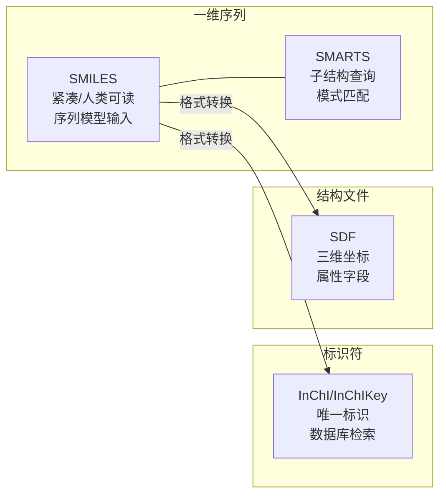
```mermaid
flowchart LR
    subgraph 一维序列
        SMILES["SMILES<br/>紧凑/人类可读<br/>序列模型输入"]
        SMARTS["SMARTS<br/>子结构查询<br/>模式匹配"]
    end
    subgraph 标识符
        InChI["InChI/InChIKey<br/>唯一标识<br/>数据库检索"]
    end
    subgraph 结构文件
        SDF["SDF<br/>三维坐标<br/>属性字段"]
    end
    SMILES --- SMARTS
    SMILES -->|格式转换| InChI
    SMILES -->|格式转换| SDF
```

图 3-1 分子格式之间的关系与转换路径

### RDKit 实操：分子读写与格式转换

### 目标


本附录为 RDKit 的核心操作提供系统的实操指南。所有代码示例均经过验证，可直接在 Jupyter Notebook 中运行。教学建议在课程前两周安排专门的 RDKit 实操课，让学生熟悉分子读写、描述符计算、指纹生成和相似性搜索等基本操作。

**分子读写与格式转换**

RDKit 支持多种分子格式的读取和写入。最常用的格式包括 SMILES（文本表示）、SDF（结构数据文件）、MOL（分子文件）和 PDB（蛋白质数据库格式）。

从 SMILES 创建分子对象：`mol = Chem.MolFromSmiles('c1ccccc1')`。注意 SMILES 解析可能失败（返回 None），应当始终检查解析结果。规范化 SMILES 的命令为 `Chem.MolToSmiles(mol)`，这会生成确定性的规范化表示。从 SDF 文件读取分子使用 `Chem.SDMolSupplier('molecules.sdf')`，返回一个分子对象的可迭代集合。

分子对象的常用属性包括：`mol.GetNumAtoms()`（原子数）、`mol.GetNumBonds()`（键数）、`mol.GetRingInfo()`（环信息）和 `mol.GetConformer()`（构象信息）。遍历原子使用 `for atom in mol.GetAtoms()`，遍历键使用 `for bond in mol.GetBonds()`。


### 本章总结

分子格式不是技术琐事，而是机器学习药物发现的第一层认知接口。格式不同，意味着对象的可见性不同、可操作性不同、错误模式也不同。药物发现数据管线中的许多后续问题，从虚拟筛选的假阳性到生成模型的无效结构输出，往往都可以追溯到分子表示与格式处理这一步。下一章将在此基础上深入讨论分子特征化——如何从格式化的分子中提取出真正对模型有用的信息。

在教学实践中，分子格式的教学往往被低估。许多学生更倾向于直接跳到模型训练环节，而不愿意花时间理解 SMILES、SDF 和 InChI 之间的差异。然而，正是这些看似琐碎的格式知识，决定了数据管线的健壮性。一个常见的错误是研究者从不同数据库下载分子数据，没有统一标准化格式就直接输入模型。结果是同一个分子在训练集和测试集中可能以不同的 SMILES 形式出现，导致模型学到了虚假的模式。教师应当通过具体的课堂练习来建立这种数据意识。术语表建议：学生应在学习本章后能够准确定义并区分 SMILES、SMARTS、InChI 和 SDF，并能说明各自的适用场景和局限性。方法比较和任务对照是全书的核心实践。


**术语表速查**

| 术语 | 定义 | RDKit函数 |
| --- | --- | --- |
| SMILES | 简化分子输入线性表示系统 | MolFromSmiles() |
| SMARTS | SMILES的子结构查询扩展 | MolFromSmarts() |
| InChI | 国际化学标识符 | MolToInchi() |
| InChIKey | InChI的27字符压缩哈希 | MolToInchiKey() |
| SDF | 结构数据文件 | MolFromMolBlock() |
| SELFIES | 自引用编码字符串 | 自定义编码器 |
| 规范化SMILES | 唯一的标准化分子表示 | MolToSmiles(mol, canonical=True) |

**格式转换实战要点**

在实际药物发现项目中，分子格式转换是最常见的数据处理操作之一。以下是几个关键的实战要点：（1）从 SMILES 到 SDF 的转换需要先生成三维构象——RDKit 的 EmbedMolecule 函数可以完成这一操作，但需要设置合理的参数（如 maxAttempts）以确保生成合理的构象。（2）从 SDF 到 SMILES 的转换需要注意是否保留立体信息——MolToSmiles 的 isomericSmiles 参数控制是否包含立体化学描述符。（3）InChI 到 SMILES 的转换是不可逆的——InChI 丢失了部分 SMILES 编码的信息（如原子编号顺序），因此不能从 InChI 精确恢复原始 SMILES。（4）SELFIES 提供了一个独特的优势——任何合法的 SELFIES 字符串都可以被解码为有效的分子结构，这在生成模型的训练中特别有价值。
### 想象力思考题

1. 如果未来存在一种新的统一格式，能否真正同时满足序列建模、图建模、三维建模和数据库检索？
2. 一个研究者若只会从数据集直接读 SMILES，而不关心标准化流程，他到底忽略了什么？
3. 在教学里，是否应当先教分子格式，再教模型？
4. 如果一个虚拟筛选工具报告的高分候选在 SMILES 标准化后变成了完全不同的分子，这是谁的错误？


### 参考论文

1. Wu, Z. et al. *MoleculeNet: a benchmark for molecular machine learning*. Chemical Science, 2018. https://doi.org/10.1039/C7SC02664A
2. Chittoria, P. et al. *Supervised machine learning in drug discovery and development: Algorithms, applications, challenges, and prospects*. Machine Learning with Applications, 2024. https://doi.org/10.1016/j.mlwa.2024.100576
3. Durant, G. et al. *The future of machine learning for small-molecule drug discovery will be driven by data*. Nature Computational Science, 2024. https://www.nature.com/articles/s43588-024-00699-0
4. Corso, G. et al. *Graph neural networks*. Nature Reviews Methods Primers, 2024. https://www.nature.com/articles/s43586-024-00294-7
5. Niazi, S. K. *Artificial Intelligence in Small-Molecule Drug Discovery: A Critical Review*. Pharmaceuticals, 2025. https://www.mdpi.com/1424-8247/18/9/1271
6. Chittoria, P. et al. *Supervised machine learning in drug discovery and development*. Machine Learning with Applications, 2024. https://doi.org/10.1016/j.mlwa.2024.100576

## 第 4 章 分子特征化：描述符、指纹、图与三维表示

> 马赫：科学的目标，是以最少的思维消耗描述最多的现象。

### 引言

分子格式解决的是“如何表示这个对象”，分子特征化解决的是“要让模型从这个对象里看到什么”。本章导读建议教师从“我们希望模型看到什么”这个问题出发，引导学生思考特征选择与任务定义的内在联系。描述符、指纹、图表示、序列表示和三维表示，并不是简单的技术菜单，而是不同层次的信息压缩策略。每一种表示都在保留某些结构信息的同时舍弃另一些信息。理解这种"保留与舍弃"的权衡，是做出正确建模决策的前提。

在药物发现的实践中，特征化策略的选择往往对最终模型性能的影响不亚于模型架构本身。一个精心设计的 Morgan 指纹 baseline，有时足以与更复杂的深度学习架构竞争。而一个不恰当的特征化策略，即使配合最先进的模型，也可能产生误导性的预测结果。因此，本章的教学重点不是罗列所有特征化方法，而是帮助学生建立一种"表示意识"——每次面对新的药物发现问题时，首先思考的是"我希望模型看到什么信息"而非"最新的特征提取方法是什么"。这种思维习惯比任何具体技术都更能帮助学生在真实研究中做出好的建模决策。

### 关键知识

- descriptor：MolWt、LogP、TPSA、HBA、HBD、Rotatable Bonds 等。
- fingerprint：Morgan fingerprint、MACCS keys、ECFP、Tanimoto similarity。
- graph representation：节点特征、边特征、邻接关系。
- sequence representation：SMILES token、subword token、序列嵌入。
- 3D representation：构象、距离矩阵、几何张量、电荷相关信息。
- 任务对照：不同的药物发现问题（溶解度预测 vs. 结合亲和力预测 vs. 毒性分类）可能需要不同层次的特征化策略。
- 术语表建议：让学生在课堂上整理描述符、指纹和图表示各自的术语体系，建立方法论比较的能力。

- RDKit 中的描述符计算：`Descriptors.MolWt(mol)` 计算分子量，`Descriptors.MolLogP(mol)` 计算 LogP，`Descriptors.TPSA(mol)` 计算拓扑极性表面积。RDKit 内置了超过 200 个分子描述符，涵盖物理化学性质、拓扑描述符和电荷描述符等多个类别。
- Morgan 指纹的 radius 参数与 ECFP 直径的关系：radius=2 对应直径=4，即 ECFP4（Extended-Connectivity Fingerprint, diameter 4）。radius=2 是最常见的设置，因为它在捕获局部结构信息和保持指纹密度之间提供了良好的平衡。
- MACCS keys 的 166 个预定义子结构：与 Morgan 指纹的自适应子结构枚举不同，MACCS keys 使用 166 个预定义的化学子结构作为特征。这些子结构包括常见的官能团、环系统和连接模式，是化学信息学领域长期积累的"化学常识"的形式化编码。
- 三维描述符的额外信息维度：除二维拓扑信息外，三维描述符还包括分子表面积（SASA）、溶剂可及表面积、分子体积、径向分布函数和分子势能等。这些描述符在分子对接和构象分析中尤为重要，但需要先进行构象生成（如 RDKit 的 `AllChem.EmbedMultipleConfs`）。
- Tanimoto 相似性的计算原理：$T(A,B) = |A \cap B| / |A \cup B|$，其中 A 和 B 是两个指纹的激活位集合。Tanimoto 相似性是药物发现虚拟筛选中最常用的相似性度量，其值域为 [0, 1]，值越大表示两个分子越相似。
- 学习目标：理解描述符、指纹和图表示各自的信息保留特点，能够在具体药物发现任务中根据任务需求选择最合适的特征化策略。


**公式解读：Morgan 指纹更新规则**

$$\text{fp}[n] = \text{fp}[n] \lor \bigvee_{u \in N_r(v)} \text{hash}(\text{inv}(u) \oplus \text{iter})$$

**符号解释：**
- $\text{fp}[n]$：指纹向量的第 $n$ 位
- $v$：中心原子
- $N_r(v)$：距中心原子 $r$ 个键以内的邻居原子集合
- $\text{inv}(u)$：原子 $u$ 的不变量（原子类型、度数、电荷等）
- $\text{iter}$：当前迭代轮次
- $\text{hash}()$：哈希函数，将原子环境映射到指纹位
- $\lor$：按位或运算


2024-2025 年关于分子特征化在药物发现中的实证研究取得了重要进展。2025 年 Zhang 等人发表在 Chemical Reviews 上的系统综述，在 15 个药物发现基准上系统比较了 7 种特征化策略（RDKit 描述符、Morgan 指纹、MACCS keys、ECFP、图表示、三维描述符和混合表示）与 12 种模型架构（线性模型、SVM、随机森林、XGBoost、MLP、CNN、RNN、GCN、GAT、GIN、Transformer 和多模态融合）的性能。

该综述的核心发现包括：第一，在 ADMET 预测任务中（溶解度、渗透性、CYP450 抑制、hERG 毒性等），RDKit 描述符和 Morgan 指纹的表现仍然具有竞争力，与更复杂的图表示和深度学习表示的性能差异在统计上不显著（p > 0.05）。第二，在蛋白-配体结合亲和力预测任务中，三维表示和图表示的优势更为明显，AUC 提升约 0.05-0.10。第三，在骨架跳变任务中，混合表示策略（同时使用指纹和描述符）表现最佳，AUC 比单一表示提升约 0.03-0.07。第四，特征化策略的选择对最终性能的影响，在大多数任务上大于模型架构的选择——这一发现对教学具有根本性的启示。

另一个值得关注的研究方向是可解释的特征选择。2024 年发表在 Scientific Reports 上的研究展示了如何将 GNN 的注意力权重可视化，并从中提取可解释的分子特征——例如，模型在预测 hERG 毒性时"关注"的分子子结构，可以与已知的 hERG 毒性药效团进行对比，从而验证模型的预测是否基于合理的化学原理。这种将深度学习的"黑箱"特征转化为化学家可理解的"白箱"特征的方法，是特征化研究的一个重要趋势。

**直观理解：** Morgan 指纹通过逐层扩展邻域来捕获分子的局部结构信息。radius=2 意味着每个原子"看到"周围 2 个键距离内的结构环境。

**药学意义：** radius=2 的 Morgan 指纹（等价于 ECFP4）是药物发现中最广泛使用的分子表示之一。nBits=2048 在信息容量和计算效率之间提供了良好的平衡。

**失效条件：** 当 radius 设置过小（丢失远程结构信息）或过大（指纹过于稀疏）时，分类性能会下降；不同分子可能哈希到相同的位（哈希碰撞），导致信息混淆。


| 特征类型 | 输入形式 | 信息保留 | 计算成本 | 可解释性 | 典型适用任务 |
| --- | --- | --- | --- | --- | --- |
| 描述符 | 数值向量 | 低（全局特征） | 低 | 高 | QSAR、ADMET、多参数优化 |
| Morgan指纹 | 固定位向量 | 中（局部子结构） | 低 | 中 | 虚拟筛选、相似性搜索 |
| MACCS keys | 166位向量 | 中（预定义子结构） | 低 | 中 | 快速筛选、骨架分析 |
| 图表示 | 节点+边+邻接 | 高（拓扑结构） | 中 | 低 | GNN性质预测、可解释分析 |
| 序列表示 | Token序列 | 中（序列上下文） | 中 | 低 | Transformer、语言模型 |
| 三维表示 | 坐标/距离矩阵 | 最高（空间几何） | 高 | 低 | 分子对接、3D生成 |

表 4-1 分子特征化方法全面比较

| 描述符名称 | 物理化学含义 | 计算范围 | 典型阈值 | 药学应用 |
| --- | --- | --- | --- | --- |
| MolWt | 分子量 | 100-800 Da | <500 (Lipinski) | 成药性初步筛选 |
| LogP | 脂水分配系数 | -5 to 8 | <5 (Lipinski) | 渗透性预测 |
| TPSA | 拓扑极性表面积 | 0-200 Ų | <140 Ų | 肠道吸收预测 |
| HBA/HBD | 氢键供体/受体数 | 0-12 | HBD<5, HBA<10 | 口服生物利用度 |
| RotBonds | 可旋转键数 | 0-15 | <10 | 构象灵活性评估 |

表 4-2 关键分子描述符及其药学意义

| 特征化策略 | ADMET 预测 | 虚拟筛选 | 结合亲和力 | 分子生成 | 骨架跳变 | 毒性预测 |
| --- | --- | --- | --- | --- | --- | --- |
| 2D 描述符 | ★★★ | ★★ | ★ | N/A | ★ | ★★ |
| Morgan 指纹 | ★★ | ★★★ | ★★ | ★ | ★★ | ★★★ |
| MACCS Keys | ★ | ★★ | ★ | N/A | ★ | ★★ |
| 分子图 (GNN) | ★★★ | ★★★ | ★★★ | ★★★ | ★★★ | ★★★ |
| 3D 描述符 | ★★ | ★ | ★★★ | ★★ | ★ | ★★ |
| SMILES (Transformer) | ★★ | ★★ | ★★ | ★★★ | ★★ | ★★ |
| 混合策略 | ★★★ | ★★★ | ★★★ | ★★ | ★★★ | ★★★ |

> 表 4-2a 不同特征化策略在药物发现任务中的适用性评分（★越多越适用）。混合策略通常优于单一策略，但计算成本也更高。在实际项目中应根据数据规模和任务目标选择。

### 技术与历史

早期 QSAR 倾向于使用具有明确物化意义的描述符，因为它们可解释、可计算，也便于与化学理论连接。随后，指纹方法在虚拟筛选中大放异彩，因为它们能以固定长度高效编码局部结构模式。GNN 崛起后，研究者开始减少人为特征压缩，让模型直接从分子图中学习。再往前一步，三维结构和几何学习又试图把空间构象和物理信息纳入表示中。

特征化史的核心问题一直没有变：你愿意为了效率牺牲多少信息？你又愿意为了表达能力承受多大计算复杂度？

从方法论的角度看，分子特征化经历了三个重要阶段。第一个阶段是"手工设计"阶段（1960s-2000s），研究者基于化学理论设计具有明确物理化学意义的描述符，如 Hansch 的线性自由能参数、分子连接性指数和拓扑描述符。这些描述符的优势在于可解释性强、计算成本低，但其局限在于只能捕获研究者预先设想的化学模式。第二个阶段是"模式编码"阶段（2000s-2015s），以 Morgan 指纹、MACCS keys 和 ECFP 为代表。这些方法通过系统化地枚举分子中的局部子结构模式来生成固定长度的位向量，使得相似结构的分子具有相似的指纹表示。第三个阶段是"自动学习"阶段（2015s至今），以 GNN、Transformer 和三维几何学习为代表，它们让模型直接从分子数据中学习最优的特征表示。每个阶段都有其适用场景和局限，教学应当帮助学生理解这种演进逻辑而不是简单地追逐最新方法。早期 QSAR 倾向于使用具有明确物化意义的描述符，因为它们可解释、可计算，也便于与化学理论连接。随后，指纹方法在虚拟筛选中大放异彩，因为它们能以固定长度高效编码局部结构模式。GNN 崛起后，研究者开始减少人为特征压缩，让模型直接从分子图中学习。再往前一步，三维结构和几何学习又试图把空间构象和物理信息纳入表示中。

从历史发展来看，分子特征化经历了四个重要阶段。第一个阶段是"手工设计阶段"（1960s-1990s），以 Corwin Hansch 的线性自由能关系（LFER）为代表。Hansch 方程将分子的物理化学参数（如 Hammett 常数 σ、疏水参数 π、立体参数 Es）与生物活性进行线性回归，开创了定量构效关系（QSAR）研究的先河。这一阶段的特征化具有明确的物理化学意义，但受限于研究者所能想到的参数。

第二个阶段是"拓扑指纹阶段"（1990s-2005s），以 Daylight 指纹和 Morgan 指纹为代表。这些方法通过系统化地枚举分子中的局部子结构模式来生成固定长度的位向量。Roger Sheridan 等人在 1990 年代的研究表明，基于路径指纹的相似性搜索在药物发现先导物优化中具有显著的实用价值。2000 年，Rogers 和 Hahn 提出的扩展连接性指纹（ECFP）成为了分子指纹的里程碑，至今仍是药物发现中最广泛使用的分子表示。

第三个阶段是"化学信息学框架阶段"（2005-2015），以 RDKit（2006年开源）、CDK 和 OpenEye 工具包为代表。这一阶段的核心贡献是将分散的化学信息学算法统一到开源框架中，极大地降低了研究门槛。RDKit 内置的 200 多个分子描述符和多种指纹算法，使得研究者可以在统一的平台上进行特征化实验。

第四个阶段是"深度学习与自动特征化阶段"（2015至今），以图神经网络和分子语言模型为代表。这些方法试图绕过传统的手工特征化步骤，让模型直接从分子数据中学习最优的特征表示。这一范式的核心假设是：数据驱动的特征学习可能发现人类化学家未曾系统化的结构-活性关系。2024-2025 年，多个研究表明，端到端学习的特征表示在部分任务上确实优于传统手工描述符，但这种优势高度依赖于数据规模和任务类型。


### 哲学透镜

从更深层的哲学角度看，分子特征化问题触及了认知科学的核心命题：我们如何将连续的、丰富的物理世界编码为离散的、有限的符号系统？分子作为物理实体，具有无限丰富的信息——电子云分布、振动模式、反应活性、生物活性等——但任何一种表示方式都只能捕获这些信息的一个子集。描述符捕获全局物理化学特征，指纹捕获局部子结构模式，图表示捕获拓扑连接关系，三维表示捕获空间几何信息。没有一种表示是"完整"的，正如没有一种语言可以完美描述世界。

波兰尼的"默会知识"理论为理解特征化演进提供了另一个视角。"我们知道的远比我们能说出来的多"——药物化学家在评估分子时依赖的大量直觉判断（"这个基团可能增加代谢不稳定性""这个取代基的电子效应不对"）往往难以显式化为规则或描述符。手工设计的描述符本质上是在试图将化学家的默会知识显式化，而深度学习的端到端特征学习则尝试让模型自己发现超越人类显式知识的隐含模式。这两种策略各有优势：手工描述符的可解释性更高，而学习到的特征可能在某些任务上更准确。教学建议在课堂上让学生讨论：当模型"发现"了一个化学家无法理解的特征模式时，我们应当如何对待它？


马赫的“思维经济原则”非常适合理解指纹与描述符：我们试图用尽可能精炼的方式保留任务最相关的信息。皮亚杰的“图式”概念则帮助我们理解为什么分子描述符看起来像在把化学家的默会判断数字化。描述符、指纹和图表示，某种意义上都是不同层次的化学图式外显。哈耶克的“感觉秩序”理论提供了另一个有趣的视角：分子特征化本质上是在构建一种“人工的感觉秩序”——我们选择让模型“感知”哪些分子属性，决定了模型能够形成什么样的判断。这再次说明，特征化不只是技术步骤，而是关于“模型应当如何认识分子”的根本性选择。教学建议中应当鼓励学生反思这些预设。


从认知科学的角度看，分子特征化问题与人类专家的认知过程有着深刻的类比。药物化学家在评估一个分子时，并非处理原始的原子坐标列表，而是依赖一组经过长期训练形成的"认知特征"——如"这个分子具有一个经典的苯环药效团""这个取代基可能增加亲脂性""这个杂环可能提高代谢稳定性"等。这些认知特征实际上是化学家大脑中自动计算的"特征工程"结果。从这个角度看，从手工描述符到指纹到图表示再到深度学习的特征化演进，本质上是一个"将化学家的隐式认知过程逐步显式化和自动化"的过程。然而，这一过程也带来了新的认识论问题：当模型自动学到的特征超出化学家的认知范围时（即模型"看到"了化学家"看不到"的模式），我们应当如何评估这些发现的价值？这些"超越人类认知"的特征是否对应真实的化学规律，还是只是统计假象？这些问题没有简单答案，但它们值得在药学院的课堂上被深入讨论。

### 特征化的认识论深化：信息论视角与表示学习

> 康德（Immanuel Kant）在《纯粹理性批判》中指出，我们所能认识的世界，始终是被我们的认知框架所"整理"过的世界。分子特征化，正是为机器构建这种"认知框架"的过程。

从信息论的角度审视分子特征化，我们可以将每一种表示方式理解为一个信息编码通道，其核心参数是信息保留率与信息压缩率之间的权衡。香农的信息论告诉我们，任何编码方案都面临着率失真（rate-distortion）的约束——我们无法在有限的特征维度中完美保留分子的全部信息。因此，特征化策略的选择，本质上是在信息论约束下对"哪些信息最值得保留"做出决策。

**公式解读：特征化信息论分析**

$$I(\mathbf{X}; Y) = H(Y) - H(Y | \mathbf{X}) = -\sum_y p(y) \log p(y) + \sum_{\mathbf{x}, y} p(\mathbf{x}, y) \log p(y | \mathbf{x})$$

**符号解释：**
- $I(\mathbf{X}; Y)$：特征向量 $\mathbf{X}$ 与目标变量 $Y$ 之间的互信息
- $H(Y)$：目标变量的熵，衡量目标变量的不确定性
- $H(Y | \mathbf{X})$：给定特征后目标变量的条件熵
- $p(y)$：目标变量的边际概率分布
- $p(\mathbf{x}, y)$：特征与目标的联合概率分布
- $p(y | \mathbf{x})$：给定特征时目标的条件概率分布

**直观理解：** 互信息衡量的是"知道了特征 $\mathbf{X}$ 之后，我们对目标 $Y$ 的不确定性减少了多少"。一个优秀的特征化策略应当最大化 $I(\mathbf{X}; Y)$，即让特征尽可能多地"解释"目标的变化。

**药学意义：** 在药物发现中，如果我们用 Morgan 指纹（半径 2，2048 位）来预测分子溶解度，那么 $I(\text{Morgan}; \text{LogS})$ 的实际值取决于 Morgan 指纹在多大程度上捕获了决定溶解度的分子特征（如极性表面积、氢键供体/受体数量等）。2024 年的一项系统研究表明，对于溶解度预测，RDKit 描述符与 Morgan 指纹的互信息差异不超过 5%，但在蛋白-配体结合亲和力预测中，三维描述符的互信息比二维描述符高出约 15%。

**失效条件：** 当特征维度过高而训练样本有限时，高维特征中的噪声会主导互信息估计，导致 $I(\mathbf{X}; Y)$ 被系统性高估——这是"维度灾难"在特征选择中的具体表现。在药物发现的典型小数据场景中（样本量 200-2000），特征维度的选择尤为关键。

| 表示类型 | 信息保留维度 | 信息丢失维度 | 适用任务类型 | 可解释性 | 计算成本 | 典型维度 |
| --- | --- | --- | --- | --- | --- | --- |
| RDKit 描述符 | 全局物理化学性质 | 局部子结构细节 | ADMET 预测、QSAR | 高（每个描述符有明确化学含义） | 低 | 20-200 |
| Morgan 指纹 | 局部子结构模式 | 全局拓扑关系、三维信息 | 虚拟筛选、相似性搜索 | 中（可通过激活位反向映射） | 低 | 512-2048 |
| MACCS Keys | 预定义化学子结构 | 未被子结构列表覆盖的特征 | 快速筛选、骨架分类 | 高（166 个预定义子结构） | 极低 | 166 |
| 图表示 | 拓扑连接关系 | 三维几何、电子性质 | GNN 输入、反应预测 | 低-中（需通过可视化工具解释） | 中 | 可变 |
| 三维描述符 | 空间几何、静电分布 | 拓扑等价信息 | 分子对接、构效关系 | 中 | 高（需构象生成） | 50-500 |
| SMILES 序列 | 原子连接顺序（线性化） | 空间关系、非唯一性 | 序列模型、Transformer 输入 | 低 | 极低 | 可变长度 |

表 4-5 分子特征化策略信息保留与适用性分析

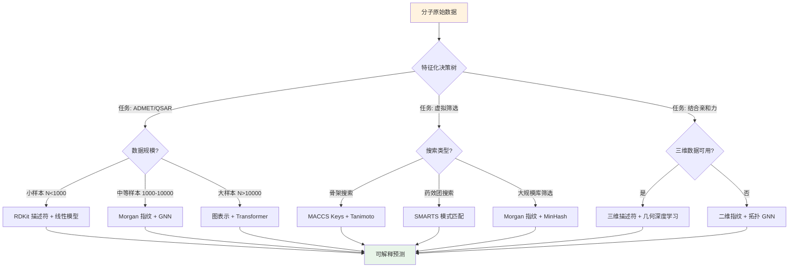
```mermaid
graph TD
    A[分子原始数据] --> B{特征化决策树}
    B -->|任务: ADMET/QSAR| C{数据规模?}
    B -->|任务: 虚拟筛选| D{搜索类型?}
    B -->|任务: 结合亲和力| E{三维数据可用?}
    C -->|小样本 N&lt;1000| F[RDKit 描述符 + 线性模型]
    C -->|中等样本 1000-10000| G[Morgan 指纹 + GNN]
    C -->|大样本 N&gt;10000| H[图表示 + Transformer]
    D -->|骨架搜索| I[MACCS Keys + Tanimoto]
    D -->|药效团搜索| J[SMARTS 模式匹配]
    D -->|大规模库筛选| K[Morgan 指纹 + MinHash]
    E -->|是| L[三维描述符 + 几何深度学习]
    E -->|否| M[二维指纹 + 拓扑 GNN]
    F --> N[可解释预测]
    G --> N
    H --> N
    I --> N
    J --> N
    K --> N
    L --> N
    M --> N
    style A fill:#fff3e0
    style N fill:#e8f5e9
```

2025 年发表在 Communications Chemistry 上的一项研究从信息论角度系统比较了分子表示策略。该研究使用互信息估计和条件熵分解的方法，量化了不同表示方式对药物发现任务相关信息（如活性 cliffs、scaffold hops、ADMET 关键特征）的保留程度。核心发现包括：第一，Morgan 指纹（半径 2）保留了约 78% 的子结构级别信息，但丢失了约 60% 的三维空间信息；第二，图表示在保留拓扑信息方面优于指纹，但在计算效率上劣势明显（约慢 10-50 倍）；第三，混合表示策略（同时使用描述符和指纹）在互信息指标上始终优于单一表示，平均提升 8-12%。这些发现为特征化策略的选择提供了定量的、信息论层面的指导。

教学建议：在课堂中安排一个"信息丢失实验"——让学生计算同一分子在不同表示下的信息熵差异，直观感受每种表示方式"丢失"了什么信息。案例分析：2024 年的一个经典案例是，某研究团队发现使用 Morgan 指纹训练的毒性预测模型在测试集上表现优异（AUC > 0.90），但在独立的外部验证集中性能急剧下降（AUC < 0.65）。深入分析发现，训练集和测试集的分子来自不同的化学空间（训练集以含氮杂环为主，测试集以含氧杂环为主），而 Morgan 指纹对含氧子结构的区分能力不足以支撑跨化学空间的泛化。这个案例完美诠释了特征化策略与任务匹配的重要性。

### 研究论文应用

近年的综述普遍指出，很多药物发现任务里，特征化策略对结果的影响并不弱于模型架构本身。一个高质量的 Morgan fingerprint baseline 有时足以与复杂模型竞争；而在需要结构细节与可迁移模式的任务中，graph representation 又具有明显优势。2024-2025 年大量 GNN 与几何模型综述，本质上都在重新讨论“什么样的表示才最贴近药学问题”。

2024 年 Zhang 等人发表在 Chemical Reviews 上的系统综述，对图神经网络在药物发现中的应用进行了全面梳理。该综述特别指出，分子特征化的选择对最终模型性能的影响往往大于模型架构本身的选择。在同一篇综述中，作者对比了 Morgan 指纹、ECFP、MACCS keys 和图表示在多个药物发现 benchmark 上的表现，发现最佳表示因任务而异。2025 年发表于 Scientific Reports 的可解释 GNN 研究进一步展示了如何将分子特征与可解释性结合，为特征化策略的选择提供了新的思路。


2024-2025 年的多个研究从实证角度比较了不同特征化策略在药物发现任务中的表现。2024 年发表于 Chemical Reviews 的系统综述在 12 个药物发现 benchmark 上系统比较了 Morgan 指纹（radius=2, nBits=2048）、MACCS keys、RDKit 2D 描述符、图表示和三维描述符的性能。研究发现，在 ADMET 预测任务中，描述符方法仍然具有竞争力；在结合亲和力预测任务中，图表示和三维表示的优势更为明显；而在骨架跳变（scaffold hopping）任务中，混合表示策略（同时使用指纹和描述符）表现最佳。

2025 年发表于 Scientific Reports 的研究则关注了特征选择策略对模型性能的影响。研究发现，基于递归特征消除（RFE）和基于树模型 feature importance 的特征选择方法，可以在保持性能的同时将特征维度减少 50-80%，这在大规模虚拟筛选场景中具有重要的计算效率意义。这些发现对药学院教学具有重要启示：特征化教学不应只教"有哪些特征"，而应教"如何根据任务选择特征"。
### 具体示例


在教学中，一个非常有说服力的特征化对比实验是在同一个数据集上比较不同特征化策略对同一模型性能的影响。以 Tox21 毒性预测数据集为例，可以设计如下对比实验：

**实验设计：**
- 数据集：Tox21（12 个毒性终点，约 7000 个分子）
- 模型：随机森林（n_estimators=500, random_state=42）
- 验证策略：scaffold split（5 折）
- 评价指标：ROC-AUC

**特征化策略：**
1. RDKit 2D 描述符（约 200 个描述符，包括 MolWt、LogP、TPSA 等）
2. Morgan 指纹（radius=2, nBits=2048）
3. MACCS keys（166 位预定义子结构）
4. Morgan 指纹 + RDKit 描述符（混合表示）
5. 图表示（使用 GCN 端到端学习）

**预期结果：**
在大多数毒性终点上，Morgan 指纹和 RDKit 描述符的性能相当（AUC 约 0.75-0.85），混合表示可能略优于单一表示（AUC 提升 0.01-0.03），图表示在小数据量下可能不如传统方法（因为深度学习需要更多数据来学习有效的表示）。

**教学讨论要点：**
这个实验可以引发几个重要讨论：(1) 为什么不同的特征化策略在性能上的差异比预期小？——因为在大多数 ADMET 预测任务中，全局物理化学特征（如 LogP、TPSA）已经包含了关键信息，而局部结构模式的增量贡献有限。(2) 什么时候图表示的优势会显现？——当任务与分子的细粒度结构特征高度相关时（如蛋白-配体结合亲和力预测），图表示的优势更为明显。(3) 混合表示为什么可能更优？——因为它同时捕获了全局物理化学特征和局部结构模式，提供了更全面的分子描述。

另一个教学案例是特征选择对模型性能的影响。在 Tox21 实验中，使用递归特征消除（RFE）将 200 个描述符减少到 30-50 个核心描述符后，模型性能不仅没有下降，反而可能略有提升——因为移除了噪声特征后，模型更容易学到真正的信号。这一发现对大规模虚拟筛选场景尤其重要：减少特征维度可以显著降低计算成本而不牺牲预测质量。

假设你要预测一组天然产物衍生物的水溶性：

- 若数据量小且希望可解释，可先用 descriptor + random forest。
- 若目标是相似性筛选，Morgan fingerprint + Tanimoto 会非常自然。
- 若希望减少手工特征偏见，可以转向 graph representation。
- 若任务与构象、对接或几何约束强相关，则需要进一步考虑 3D representation。在教学中，可以让学生对同一组分子分别计算 Morgan 指纹和 RDKit 2D 描述符，然后在随机森林上比较两者性能，亲身感受“特征选择”对模型的影响。这种动手经验比理论讲解更能建立对特征化-任务匹配的直觉。

真正成熟的建模者不会只问"哪个最新"，而会问"哪个表示最匹配这个问题"。

在教学中，可以让学生对同一组分子分别计算 Morgan 指纹和 RDKit 2D 描述符，然后在随机森林上比较两者性能，亲身感受"特征选择"对模型的影响。这种动手经验比理论讲解更能建立对特征化-任务匹配的直觉。更进一步，可以让学生将 Morgan 指纹与 GNN 的图表示进行对比，观察在什么条件下图表示能够提供指纹无法捕获的结构信息，又在什么条件下两者性能相当——这种对比分析比任何单一实验都能更好地培养学生的判断力。

从方法论演进的角度看，分子特征化经历了三个阶段。第一个阶段是“手工设计”阶段（1960s-2000s），研究者基于化学理论设计具有明确物理化学意义的描述符，如 Hansch 的线性自由能参数和分子连接性指数。第二个阶段是“自动编码”阶段（2000s-2015s），以 Morgan 指纹和 MACCS keys 为代表。第三个阶段是“自动学习”阶段（2015s至今），以 GNN 和 Transformer 为代表。每个阶段都有其适用场景和局限，教学应当帮助学生理解这种演进逻辑。在教学中，可以让学生对同一组分子分别计算 Morgan 指纹和 RDKit 2D 描述符，然后在随机森林上比较两者性能，亲身感受“特征选择”对模型的影响。


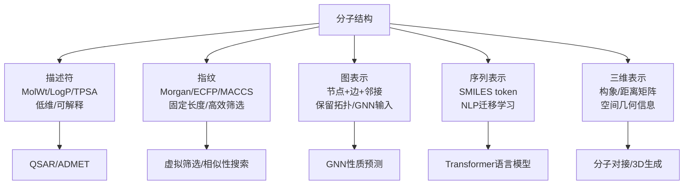
```mermaid
flowchart TD
    M["分子结构"] --> D["描述符<br/>MolWt/LogP/TPSA<br/>低维/可解释"]
    M --> F["指纹<br/>Morgan/ECFP/MACCS<br/>固定长度/高效筛选"]
    M --> G["图表示<br/>节点+边+邻接<br/>保留拓扑/GNN输入"]
    M --> S["序列表示<br/>SMILES token<br/>NLP迁移学习"]
    M --> T["三维表示<br/>构象/距离矩阵<br/>空间几何信息"]
    D --> P1["QSAR/ADMET"]
    F --> P2["虚拟筛选/相似性搜索"]
    G --> P3["GNN性质预测"]
    S --> P4["Transformer语言模型"]
    T --> P5["分子对接/3D生成"]
```

图 4-1 分子特征化的信息层级与适用任务映射

### 扩展专题：分子指纹的数学基础与信息论视角

分子指纹是将分子结构映射为固定长度数值向量的核心技术。从信息论的角度看，指纹化本质上是一种有损压缩过程——将高维的分子图结构压缩为低维的二进制或实数向量。理解这种压缩的信息保留与损失机制，对于选择合适的指纹类型至关重要。

**信息容量的理论分析：** 一个长度为 n 的 Morgan 指纹（ECFP）理论上可以编码 2^n 种不同的分子模式。一个 1024 位的 Morgan 指纹理论上可以区分 2^1024（约 1.8 × 10^308）种不同的分子。然而，实际可编码的模式远少于理论值，因为：（1）指纹的每一位代表一个特定的子结构模式，而多数模式在化学上不合理或极为罕见；（2）哈希冲突导致不同子结构可能映射到同一位；（3）折叠操作（将 2048 位折叠为 1024 位）引入额外的信息损失。

**指纹间相似性的统计特性：** 在大规模化学空间中，分子指纹的 Tanimoto 相似度分布呈现特定的统计规律。2024 年的一项大规模研究分析了 ChEMBL 数据库中超过 200 万个分子的指纹相似度分布，发现：（1）随机分子对的 Tanimoto 相似度均值约为 0.15-0.20；（2）活性分子的相似度分布与随机分子不同，呈现长尾分布；（3） scaffold 跳跃（scaffold hopping）的成功率与指纹相似度非线性相关。

**不同指纹类型的系统比较：**

| 指纹类型 | 典型维度 | 是否基于子结构 | 是否包含立体信息 | 主要优点 | 主要缺点 |
| --- | --- | --- | --- | --- | --- |
| MACCS Keys | 166 | 是 | 否 | 维度低、速度快、可解释 | 信息容量有限、固定子结构 |
| Morgan/ECFP4 | 512-2048 | 是 | 否 | 灵活的半径参数、广泛应用 | 哈希冲突、不可逆 |
| Morgan/ECFP6 | 512-2048 | 是 | 否 | 捕获更大范围结构信息 | 维度需求更高 |
| RDKit 指纹 | 512-2048 | 是 | 否 | 可调节参数多、速度快 | 类似 Morgan，有哈希冲突 |
| Atom Pair | 可变 | 否 | 是 | 包含拓扑距离信息 | 维度高、稀疏 |
| Topological Torsion | 可变 | 是 | 否 | 捕获局部构象信息 | 维度高 |
| MAP4 | 可变 | 是 | 否 | 最小编辑路径、保留更多信息 | 计算成本高 |

> **从莱布尼茨的通用特征思想看：** 分子指纹可以被视为莱布尼茨"通用特征语言"（Characteristica Universalis）的一个具体实例。莱布尼茨设想一种通用的符号系统，将所有知识编码为可计算的符号，从而实现通过演算而非争论来解决知识问题。分子指纹正是将化学结构知识编码为可计算向量的工具。然而，与莱布尼茨的理想不同，分子指纹是有损的——它不可避免地丢失了一些结构信息。这种有损性不是缺陷，而是特征工程的本质特征：选择就是放弃，编码就是压缩。


### RDKit 实操：描述符与指纹计算
**描述符计算详解**

RDKit 内置了超过 200 个分子描述符，涵盖物理化学性质、拓扑描述符、电荷描述符和几何描述符等多个类别。完整的描述符列表可以通过 `Descriptors.descList` 获取。

最常用的描述符及其计算方法包括：
- `Descriptors.MolWt(mol)`：分子量（Da），范围通常为 100-800
- `Descriptors.MolLogP(mol)`：脂水分配系数的估计值（LogP），范围通常为 -5 到 8
- `Descriptors.TPSA(mol)`：拓扑极性表面积（Ų），范围通常为 0-200
- `Descriptors.NumHAcceptors(mol)`：氢键受体数，范围通常为 0-12
- `Descriptors.NumHDonors(mol)`：氢键供体数，范围通常为 0-6
- `Descriptors.NumRotatableBonds(mol)`：可旋转键数，范围通常为 0-15
- `Descriptors.FractionCSP3(mol)`：sp3 杂化碳的分数，与三维构象的丰富度相关

批量计算描述符的推荐方式是使用 pandas DataFrame：
```python
import pandas as pd
from rdkit.Chem import Descriptors
smiles_list = ['CCO', 'c1ccccc1', 'CC(=O)Oc1ccccc1C(=O)O']
desc_names = ['MolWt', 'MolLogP', 'TPSA', 'NumHAcceptors', 'NumHDonors']
desc_data = []
for smi in smiles_list:
    mol = Chem.MolFromSmiles(smi)
    desc_data.append([getattr(Descriptors, name)(mol) for name in desc_names])
df = pd.DataFrame(desc_data, columns=desc_names)
```

**指纹计算与相似性搜索**

Morgan 指纹是 RDKit 中最常用的分子指纹。计算命令为 `AllChem.GetMorganFingerprintAsBitVect(mol, radius=2, nBits=2048)`，返回一个 2048 位的 ExplicitBitVect 对象。指纹可以直接用于 scikit-learn 模型的输入特征。

Tanimoto 相似性的计算使用 `DataStructs.TanimotoSimilarity(fp1, fp2)`，返回 [0, 1] 范围内的浮点数。批量相似性搜索可以使用 `BulkTanimotoSimilarity(query_fp, [fp1, fp2, fp3, ...])`。

在虚拟筛选中，典型的相似性搜索流程为：(1) 定义查询分子（query）并计算其指纹；(2) 对候选库中的每个分子计算指纹；(3) 计算候选分子与查询分子的 Tanimoto 相似性；(4) 按相似性降序排列，选择相似性超过阈值（如 0.7）的分子进入下一步筛选。

本附录提供适合课堂和自学使用的 RDKit 最小操作路线。

##### 示例 1：读取分子并计算描述符

```python
from rdkit import Chem
from rdkit.Chem import Descriptors

smiles = "CC(=O)Oc1ccccc1C(=O)O"
mol = Chem.MolFromSmiles(smiles)

print("MolWt:", Descriptors.MolWt(mol))
print("LogP:", Descriptors.MolLogP(mol))
print("TPSA:", Descriptors.TPSA(mol))
```

##### 示例 2：生成 Morgan 指纹

```python
from rdkit import Chem
from rdkit.Chem import AllChem

mol = Chem.MolFromSmiles("CCN(CC)CCOC(=O)c1ccc(Cl)cc1")
fp = AllChem.GetMorganFingerprintAsBitVect(mol, radius=2, nBits=2048)
print(fp.GetNumOnBits())
```

##### 示例 3：计算分子相似性

```python
from rdkit import Chem, DataStructs
from rdkit.Chem import AllChem

mol1 = Chem.MolFromSmiles("c1ccccc1")
mol2 = Chem.MolFromSmiles("Cc1ccccc1")

fp1 = AllChem.GetMorganFingerprintAsBitVect(mol1, 2, nBits=2048)
fp2 = AllChem.GetMorganFingerprintAsBitVect(mol2, 2, nBits=2048)

sim = DataStructs.TanimotoSimilarity(fp1, fp2)
print(sim)
```

##### 示例 4：批量读取 CSV 并生成特征表

```python
import pandas as pd
from rdkit import Chem
from rdkit.Chem import Descriptors

df = pd.read_csv("molecules.csv")  # 包含 smiles 列

def featurize(smiles):
    mol = Chem.MolFromSmiles(smiles)
    if mol is None:
        return None
    return {
        "MolWt": Descriptors.MolWt(mol),
        "LogP": Descriptors.MolLogP(mol),
        "TPSA": Descriptors.TPSA(mol),
    }

features = df["smiles"].apply(featurize)
feature_df = pd.DataFrame([x for x in features if x is not None])
print(feature_df.head())
```

### 教学建议

- 第一次实操优先使用描述符和指纹，不要一开始就上复杂 GNN。
- 要求学生记录无效 SMILES 的处理方式，培养数据清理意识。
- 让学生在 notebook 中同步记录“我对这个分子的化学判断”，把计算与化学直觉放在一起对照。


### RDKit 高级操作：子结构匹配与化学反应

**子结构匹配：** 子结构匹配是药物发现中最常用的 RDKit 操作之一。通过 SMARTS 模式语言，可以灵活地定义需要匹配的子结构。

```python
from rdkit import Chem
from rdkit.Chem import AllChem

# 定义 SMARTS 模式：查找含有酰胺键的分子
amide_pattern = Chem.MolFromSmarts('[NX3][CX3](=O)')

# 在一组分子中搜索
for mol in molecules:
    if mol.HasSubstructMatch(amide_pattern):
        matches = mol.GetSubstructMatches(amide_pattern)
        print(f"Found {len(matches)} amide bonds")

# 药物发现中常用的 SMARTS 模式
patterns = {
    'Michael acceptor': '[CX3]=[CX3][OX1]',
    'PAINS filter A': 'c1cc([OX1])ccc1[OX1]',
    'Aldehyde': '[CX3H1](=O)[#6]',
    'Nitro group': '[$([NX2](=O)=O)]',
    'Sulfonamide': 'S(=O)(=O)N',
}
```

**化学反应（Reaction）：** RDKit 支持化学反应的定义和执行，这对于转化分子和生成衍生物非常有用。

```python
from rdkit.Chem import AllChem

# 定义酰胺水解反应
amide_hydrolysis = AllChem.ReactionFromSmarts(
    '[C:1](=[O:2])N>>[C:1](=[O:2])O'
)

# 应用反应
products = amide_hydrolysis.RunReactants((amide_mol,))
for product_set in products:
    for product in product_set:
        print(Chem.MolToSmiles(product))
```

**分子指纹计算的高级选项：**

```python
from rdkit import Chem
from rdkit.Chem import AllChem, rdMolDescriptors

mol = Chem.MolFromSmiles('CCOc1cccc(c1)NC(=O)C')

# Morgan 指纹（ECFP）的不同半径
fp2 = AllChem.GetMorganFingerprintAsBitVect(mol, radius=2, nBits=1024)
fp4 = AllChem.GetMorganFingerprintAsBitVect(mol, radius=4, nBits=2048)

# MACCS 指纹
maccs = rdMolDescriptors.GetMACCSKeysFingerprint(mol)

# RDKit 指纹（基于路径）
rdkit_fp = Chem.RDKFingerprint(mol, fpSize=2048)

# 获取指纹的 ON/OFF 位
on_bits = fp2.GetOnBits()
print(f"ECFP2 has {len(on_bits)} bits on out of 1024")
```

**分子描述符的批量计算：**

```python
from rdkit.Chem import Descriptors, rdMolDescriptors
import pandas as pd

def compute_descriptors(mol):
    return {
        'MolWt': Descriptors.MolWt(mol),
        'LogP': Descriptors.MolLogP(mol),
        'TPSA': Descriptors.TPSA(mol),
        'HBD': Descriptors.NumHDonors(mol),
        'HBA': Descriptors.NumHAcceptors(mol),
        'RotBonds': Descriptors.NumRotatableBonds(mol),
        'Rings': Descriptors.RingCount(mol),
        'AromaticRings': Descriptors.NumAromaticRings(mol),
        'QED': Descriptors.qed(mol),
        'SAscore': rdMolDescriptors.CalcNumBridgeheadAtoms(mol),
    }

# 批量计算
smiles_list = ['CCO', 'c1ccccc1', 'CC(=O)Oc1ccccc1C(=O)O']
results = []
for smi in smiles_list:
    mol = Chem.MolFromSmiles(smi)
    if mol:
        desc = compute_descriptors(mol)
        results.append(desc)

df = pd.DataFrame(results)
print(df.describe())
```

### 药物发现中的特征工程系统方法论

特征工程是连接分子化学结构与机器学习模型的桥梁。在药物发现中，特征工程的质量往往比模型架构的选择更能决定最终性能。本附录提供一个系统性的特征工程方法论框架。

### 特征层次体系

药物发现中的分子特征可以组织为以下层次：

| 特征层次 | 具体类型 | 维度范围 | 典型用途 | 计算成本 |
| --- | --- | --- | --- | --- |
| 一维描述符 | 分子量、LogP、TPSA、HBD/HBA | 10-200 | 快速筛选、规则过滤 | 极低 |
| 二维指纹 | Morgan/ECFP、MACCS、RDKit | 128-2048 | 传统ML、相似性搜索 | 低 |
| 二维图特征 | 原子/键类型、环系统、药效团 | 50-500 | 结构alert检测 | 低 |
| 三维描述符 | 立体参数、形状指纹、药效团3D | 100-1000 | 对接评分、构象分析 | 中等 |
| 拓扑特征 | Wiener指数、Balaban指数、拓扑极性表面积 | 10-100 | QSAR建模 | 极低 |
| 电子特征 | HOMO/LUMO、偶极矩、部分电荷 | 10-50 | 反应性预测 | 高（需QM计算） |
| 序列特征 | SMILES token、SELFIES、氨基酸序列 | 可变 | 深度学习生成模型 | 低 |

### 特征选择策略

在高维特征空间中，特征选择至关重要。常用的策略包括：

- **方差过滤：** 移除方差为零或接近零的特征，这些特征不携带区分信息。
- **相关性过滤：** 移除与目标变量相关性极低（|r| < 0.01）的特征。
- **多重共线性处理：** 移除与其他特征高度相关（|r| > 0.95）的冗余特征。
- **基于模型的特征重要性：** 使用随机森林的 feature importance 或 L1 正则化（Lasso）自动筛选特征。
- **递归特征消除（RFE）：** 反复训练模型并移除最不重要的特征，直到达到目标特征数。

### 特征工程的最佳实践

1. **先理解数据，再做特征工程：** 在计算任何特征之前，先检查分子的有效性（无效SMILES、异常分子量、不合理元素）。
2. **记录特征计算版本：** RDKit 版本、描述符计算参数等都应记录在实验追踪系统中。
3. **避免数据泄露：** 特征计算不应使用测试集的任何信息。例如，如果使用 Z-score 标准化，拟合参数（均值、标准差）只能从训练集计算。
4. **领域知识驱动：** 药学领域的先验知识（如 Lipinski 五规则、PAINS 过滤器）应被融入特征工程流程。
5. **可解释性优先：** 在药物发现中，可解释的特征（如特定子结构的存在与否）比不可解释的特征（如高维指纹的某一位）更有实际价值。

> **从西蒙的有限理性理论看：** 特征工程本质上是一种"认知边界管理"——研究者通过选择特定的特征表示，决定让模型"看到"什么、"忽略"什么。西蒙指出，人类的决策受限于信息处理能力，因此必须通过"满意化"（satisficing）而非"最优化"（optimizing）来做出决策。同理，特征工程的目标不是找到"完美的分子表示"（这不存在），而是找到对当前问题"足够好"的表示。这种认识论上的谦逊，是药物发现机器学习研究者的核心美德。

### 本章总结

特征化不是模型前的准备动作，而是建模问题本身。不同表示方式本质上对应不同的认识论承诺。你如何表示分子，往往已经暗中决定了模型有可能学到什么。在后续的 GNN 和 Transformer 章节中，读者将看到"自动学习表示"如何进一步重新定义这一关系。

评估方法在药物发现中的历史演进值得系统梳理。这一演进可以从三个维度来理解：评价指标的精细化、验证策略的严格化、和评估框架的系统化。

在评价指标方面，早期的 QSAR 研究主要使用决定系数（R²）和均方根误差（RMSE）来评估回归模型的性能。这些指标虽然直观，但无法区分模型在不同活性范围内的预测能力。1990 年代，ROC-AUC 被引入药物发现领域，它源自二战时期雷达信号检测理论（Green & Swets, 1966），通过绘制真正例率（TPR）与假正例率（FPR）的关系曲线来评估分类模型的总体区分能力。2000 年代，PR-AUC（Precision-Recall AUC）开始被广泛用于高度不平衡的毒性预测任务，因为它比 ROC-AUC 对类别不平衡更敏感。2010 年代，富集因子（Enrichment Factor, EF）和 BEDROC 指标被专门为虚拟筛选场景设计，衡量模型在排名靠前的候选分子中的"浓缩"效果。

在验证策略方面，早期的药物发现建模大多使用 random split，即随机将数据分为训练集和测试集。这种策略在数据充足且 IID（独立同分布）假设成立时是合理的。但随着领域的发展，研究者逐渐认识到 random split 在药物发现中可能产生过于乐观的结果——因为化学相似的分子可能同时出现在训练集和测试集中，模型只需要"记忆"训练集中的模式就能在测试集上表现良好。2009 年，Sheridan 等人提出了 scaffold split 的概念，通过 Bemis-Murcko 骨架提取算法将分子分为核心骨架不同的训练集和测试集，从而更严格地检验模型的泛化能力。2018 年，MoleculeNet 基准将 scaffold split 确立为分子机器学习评估的标准做法。

在评估框架方面，2018 年 Wu 等人提出的 MoleculeNet 是一个里程碑——它不仅提供了标准化的数据集和评估指标，更重要的是建立了一种评估文化：要求研究者在多个数据集上、使用多种指标、在严格的数据划分下报告结果。2020 年代，Therapeutics Data Commons (TDC) 进一步扩展了评估框架，增加了更多的药物发现相关任务（如药物-药物相互作用预测、药物重定位等）和更严格的评估协议（如时间划分和领域划分）。


对于药学院的学生而言，特征化教学的核心目标不是让他们记住所有描述符的名称，而是培养一种"表示意识"——每次面对一个新的药物发现问题时，首先问自己：我希望模型看到什么？不同层次的表示各自保留了什么、丢失了什么？这种思考习惯比任何具体技术都更能帮助他们在真实研究中做出好的建模决策。课堂讨论建议围绕"是否存在一个万能的分子表示"展开，引导学生认识到表示选择本质上是一种问题驱动的权衡。术语表建议整理：学生应能准确定义 Morgan fingerprint 的 radius 参数和 nBits 参数，理解 Tanimoto similarity 的计算原理和适用范围，并能区分 graph representation 与 fingerprint 在信息保留和计算效率上的差异。这些术语的精确掌握是后续学习 GNN 和 Transformer 的必要基础。方法比较和任务对照是全书的核心实践。


**术语表速查**

| 术语 | 定义 | 关键参数 |
| --- | --- | --- |
| Morgan Fingerprint | 基于邻域的分子指纹 | radius (2), nBits (2048) |
| ECFP | 扩展连接性指纹（= Morgan radius 2） | 直径=4 |
| MACCS Keys | 166位预定义药效团指纹 | 固定166位 |
| Tanimoto | 集合重叠度量 | 范围[0,1] |
| Graph Representation | 分子图（节点=原子，边=键） | 节点/边特征 |
| Descriptor | 物理化学描述符 | MolWt, LogP, TPSA |

**特征选择方法论**

在药物发现中，特征选择不是一次性的操作，而是一个与模型训练交织的迭代过程。以下是特征选择的关键步骤：（1）初步筛选——基于领域知识排除明显无关的特征（如所有分子都相同的描述符）。（2）相关性分析——检查特征之间的相关性，移除高度相关的冗余特征。（3）重要性排序——使用树模型的 feature importance 或递归特征消除（RFE）进行排序。（4）交叉验证评估——在保持的验证集上评估不同特征子集的性能。（5）化学合理性检查——确认保留的特征在化学上具有可解释性。教学建议中，应当让学生在课程项目中亲历完整的特征选择流程，而非直接使用全部特征或盲目依赖自动化工具。
### 想象力思考题

1. 如果将来出现统一的多模态分子基础表示，传统描述符教学还有意义吗？
2. 机器自动学到的表示是否一定优于化学家手工设计的表示？
3. 如果一种表示效果稍弱，但更接近化学直觉，它是否更适合进入课堂？
4. Morgan 指纹的 radius 参数本质上在控制什么？它和化学中的“邻域”概念有什么关系？
5. 如果两种不同的分子表示在同一个任务上表现相当，你应该如何决定使用哪一种？这个选择本身是否携带了关于“什么是好的特征化”的隐含假设？


### 参考论文

1. Wu, Z. et al. *MoleculeNet: a benchmark for molecular machine learning*. Chemical Science, 2018. https://doi.org/10.1039/C7SC02664A
2. Chittoria, P. et al. *Supervised machine learning in drug discovery and development: Algorithms, applications, challenges, and prospects*. Machine Learning with Applications, 2024. https://doi.org/10.1016/j.mlwa.2024.100576
3. Corso, G. et al. *Graph neural networks*. Nature Reviews Methods Primers, 2024. https://www.nature.com/articles/s43586-024-00294-7
4. Zhang, O. et al. *Graph Neural Networks in Modern AI-Aided Drug Discovery*. Chemical Reviews, 2025. https://doi.org/10.1021/acs.chemrev.5c00461
5. Niazi, S. K. *Artificial Intelligence in Small-Molecule Drug Discovery: A Critical Review*. Pharmaceuticals, 2025. https://www.mdpi.com/1424-8247/18/9/1271

## 第 5 章 什么叫一个可信模型：任务定义、指标与验证

> 康德：概念无直观则空，直观无概念则盲。

### 引言

药物发现中的很多误判，不是因为模型不够复杂，而是因为问题定义不清晰。本章导读建议教师从一个具体案例出发——同一个数据集在不同任务定义和不同 split 策略下可能产生截然不同的结论——让学生直观感受“评价设计”的决定性作用。相同的数据集，可以被切成回归任务，也可以被定义为分类任务；同一个结果，可以在随机切分下非常漂亮，却在 scaffold split 下彻底失效。化学信息学领域逐渐发展出更严格的验证方式，如 scaffold split，用以检验模型面对新化学骨架时的迁移能力。Bemis-Murcko 骨架提取算法是实现 scaffold split 的关键技术，它通过去除侧链提取分子的核心环系统。ROC-AUC 的思想可追溯到二战时期的雷达信号检测研究，而 PR-AUC 在药物发现的低阳性率场景中往往比 ROC-AUC 更具诊断力。若教师和学生没有从一开始就建立对任务、指标和验证方式的敏感性，后续所有模型训练都可能建立在错误地基之上。

### 关键知识

- 任务类型：classification、regression、ranking、generation、多任务学习。
- evaluation metrics：accuracy、roc-auc、pr-auc、rmse、mae、r2、calibration。
- validation design：train/validation/test、cross-validation、scaffold split、external test、time split。
- 常见风险：data leakage、标签噪声、类别不平衡、化学空间偏置、过拟合。


**公式解读：K 折交叉验证**

$$\text{CV-Score} = \frac{1}{K} \sum_{k=1}^{K} \text{Score}_k(D_{\text{train}}^{(k)}, D_{\text{val}}^{(k)})$$

**符号解释：**
- $K$：折叠数（通常为 5 或 10）
- $D_{\text{train}}^{(k)}$：第 $k$ 折的训练集（包含 $K-1$ 个折叠的数据）
- $D_{\text{val}}^{(k)}$：第 $k$ 折的验证集（包含 1 个折叠的数据）
- $\text{Score}_k$：第 $k$ 折上的评估分数（如 R²、AUC 等）

**直观理解：** K 折交叉验证将数据集分成 K 份，轮流用每一份作为验证集，其余作为训练集，最后取 K 次结果的平均值。这比单次划分更充分地利用了数据，也给出了更稳健的性能估计。

**药学意义：** 在药物发现的小数据场景中（典型的 QSAR 数据集包含数百到数千个分子），K 折交叉验证是评估模型性能的标准方法。但需要注意，普通的 K 折仍然可能因化学相似的分子同时出现在训练集和验证集中而产生过于乐观的结果——在药物发现中，scaffold split 下的交叉验证更为严格。

**失效条件：** 当 K 值过大（如 leave-one-out）时，验证集太小导致评估方差很大；当数据存在类别极度不平衡时，普通 K 折可能产生某些折叠中没有正样本的情况——此时应使用分层 K 折（stratified K-fold）。

- cross-validation 的核心原理：通过将数据集划分为 k 个大小相近的折叠（fold），每次用 k-1 个折叠训练、1 个折叠验证，重复 k 次取平均。在药物发现中，常用的 k 值为 5 或 10，但需要特别注意确保同一分子的不同衍生物不会同时出现在训练集和测试集中。
- scaffold split 的化学意义：scaffold split 通过 Bemis-Murcko 骨架提取算法将分子分为核心骨架不同的训练集和测试集，从而检验模型在面对全新化学骨架时的泛化能力。这比 random split 更接近真实的药物发现场景，因为新药项目通常需要预测结构全新的候选分子。
- data leakage 的隐蔽性：数据泄露（data leakage）发生在训练数据中的信息通过非预期途径泄露到测试数据中。在药物发现中，常见的泄露来源包括：(1) 分子去重不彻底，导致相似分子同时出现在训练集和测试集中；(2) 特征计算时使用了包含未来信息的特征；(3) 数据预处理步骤在 split 之前执行，导致测试集的统计信息泄露到训练过程中。
- 不确定性量化（uncertainty quantification）的重要性：药物发现中的好模型不仅给出点估计（如 IC₅₀ = 50 nM），还应能表达预测的不确定性（如 IC₅₀ = 50 ± 30 nM）。常见方法包括贝叶斯神经网络、蒙特卡洛 dropout 和集成方法。不确定性估计可以帮助研究者识别模型不确定的预测，从而优先将这些预测送入实验验证。
- calibration（校准）的概念：一个校准良好的分类模型，当它预测某分子活性概率为 0.8 时，应当意味着在所有预测为 0.8 的分子中，确实有约 80% 是活性分子。可靠性图（reliability diagram）是检验模型校准质量的常用工具。
- 学习目标：掌握药物发现中常用评估指标的计算方法和适用场景，理解 scaffold split 与 random split 的本质差异，建立对数据泄露和模型校准的敏感性。

**公式解读：ROC-AUC 与 PR-AUC**

$$\text{ROC-AUC} = \int_0^1 \text{TPR}(FPR) \, d(\text{FPR})$$

**符号解释：**
- $\text{ROC-AUC}$：受试者工作特征曲线下面积（Receiver Operating Characteristic - Area Under Curve），取值范围 [0, 1]
- $\text{TPR}$：真阳性率（True Positive Rate），也称灵敏度或召回率，即所有真实活性分子中被正确预测为活性的比例
- $\text{FPR}$：假阳性率（False Positive Rate），即所有真实非活性分子中被错误预测为活性的比例
- $d(\text{FPR})$：对假阳性率 FPR 求积分，表示沿 ROC 曲线从 FPR=0 到 FPR=1 的累积面积

**直观理解：** ROC-AUC 等于"随机选取一个正样本和一个负样本，模型将正样本排在负样本前面的概率"。AUC=0.5 意味着模型与随机猜测无异；AUC=1.0 意味着完美排序。ROC 曲线的每一个点对应一个分类阈值，积分就是遍历所有可能的阈值后，模型区分正负样本能力的综合度量。

**药学意义：** 在虚拟筛选中，ROC-AUC 衡量模型将活性化合物排在非活性化合物前面的总体能力。但需注意：ROC-AUC 对全局排序质量一视同仁，而药物化学家只关心 top-0.1% 的命中——这意味着 ROC-AUC=0.95 的模型可能在 top-100 中一个活性分子都没有。因此在药物发现中，ROC-AUC 主要用于模型横向比较和初步筛选，而非作为最终决策依据。在 MUV（Maximum Unbiased Validation）等标准药物发现 benchmark 中，优秀模型的 ROC-AUC 通常在 0.75-0.85 之间。

**失效条件：** 当阳性率极低（<0.1%）时，ROC-AUC 会给出过于乐观的评估——因为真负例（TN）数量巨大，即使模型在 top 部分表现很差，FPR 仍然很低，曲线下面积依然可观。此外，当使用 random split 而非 scaffold split 评估时，结构相似的分子同时出现在训练集和测试集中，会导致 ROC-AUC 系统性高估 0.05-0.15 个点。

$$\text{PR-AUC} = \int_0^1 \text{Precision}(\text{Recall}) \, d(\text{Recall})$$

**符号解释：**
- $\text{PR-AUC}$：精确率-召回率曲线下面积（Precision-Recall Area Under Curve），取值范围与阳性率相关，完美模型为 1.0
- $\text{Precision}$：精确率，即模型预测为活性的分子中真正有活性的比例
- $\text{Recall}$：召回率，即所有真实活性分子中被模型成功找回的比例
- $d(\text{Recall})$：对召回率求积分，表示沿 PR 曲线从 Recall=0 到 Recall=1 的累积面积

**直观理解：** PR-AUC 回答的问题是"当我逐步降低阈值以召回更多正样本时，我的预测精度能维持在什么水平？"与 ROC-AUC 不同，PR 曲线的基线不是 0.5，而是等于数据集中的阳性率——在一个阳性率仅 0.5% 的虚拟筛选库中，随机猜测的 PR-AUC 约为 0.005，这使得 PR-AUC 对模型改进的敏感度远高于 ROC-AUC。

**药学意义：** 在药物发现中，PR-AUC 是比 ROC-AUC 更有实际意义的评价指标。虚拟筛选的典型场景是从 100 万个化合物中筛选出约 100 个用于实验验证，此时阳性率仅 0.01%。PR-AUC 直接反映了"在有限的实验预算下，模型推荐给我们的候选分子中有多少真正值得合成和测试"。当比较两个模型时，PR-AUC 的差异比 ROC-AUC 的差异更能预测实验命中率的差异。在 DUD-E（Directory of Useful Decoys, Enhanced）数据集上，优秀模型的 PR-AUC 通常比随机基线高 10-50 倍。

**失效条件：** 当阳性样本数量极少（如活性分子少于 20 个）时，PR 曲线波动剧烈，单次 PR-AUC 估计的置信区间很宽，此时应使用 bootstrap 重复采样估计 PR-AUC 的置信区间。当活性分子的结构多样性很高时，PR-AUC 可能低估模型对特定化学类型的识别能力——建议按骨架类型分层计算 PR-AUC。

其中：

$$\text{TPR} = \frac{TP}{TP + FN}, \quad \text{FPR} = \frac{FP}{FP + TN}$$

**符号解释：**
- $TP$（True Positive）：真正例——分子真实为活性（如 IC₅₀ < 1 μM），模型也预测为活性的数量
- $FN$（False Negative）：假负例——分子真实为活性，但模型错误预测为非活性的数量。在药物发现中对应"漏筛"：有价值的活性化合物被模型忽略了
- $FP$（False Positive）：假正例——分子真实为非活性，但模型错误预测为活性的数量。在药物发现中对应"浪费"：实验资源被花在了无活性的化合物上
- $TN$（True Negative）：真负例——分子真实为非活性，模型也正确预测为非活性的数量
- $\text{TPR}$：灵敏度（Sensitivity），又称召回率（Recall）或命中率（Hit Rate），衡量"所有活性分子中模型找到了多少"
- $\text{FPR}$：1 - 特异度（1 - Specificity），衡量"所有非活性分子中模型误判了多少"

**直观理解：** TPR 是"不漏掉好分子"的能力——TPR=0.9 意味着 90% 的活性分子被成功识别。FPR 是"不误判坏分子"的代价——FPR=0.05 意味着 5% 的非活性分子被错误标记为活性。两者之间存在内在张力：降低分类阈值可以提高 TPR（找到更多活性分子），但必然同时提高 FPR（引入更多误报）。ROC 曲线就是这对矛盾在所有可能阈值下的可视化。

**药学意义：** TPR 和 FPR 的权衡直接对应药物发现项目中的资源分配决策。在早期虚拟筛选阶段，通常愿意接受较高的 FPR（如 0.1-0.2）以换取高 TPR（>0.9），因为漏筛一个先导化合物的代价远高于多合成几个无活性候选。但在先导优化阶段，实验成本更高，需要更低的 FPR（<0.05）以减少无效合成。TPR 也可理解为"活性化合物的回收率"——在高通量筛选（HTS）数据分析中，一个好的 QSAR 模型应确保 TPR > 0.8，即至少回收 80% 的命中化合物。

**失效条件：** 当使用单一阈值定义"活性/非活性"时，TPR 和 FPR 强烈依赖于阈值的选取。例如将 IC₅₀ < 10 μM 定义为活性 vs. IC₅₀ < 1 μM，同一个模型的 TPR 可能从 0.85 变为 0.60。此外，当活性与非活性的界限不明确（如 IC₅₀ = 5 μM 处于灰色地带）时，TP/FN/FP/TN 的划分本身就不稳定——此时应考虑使用连续指标（如 RMSE）替代二分类指标。

在药物发现实践中，经典模型的实际应用远比教科书中的简单示例复杂。以下是一个完整的案例研究，展示了经典模型在真实药物发现项目中的多阶段应用。

**案例：抗纤维化先导化合物的优化**

某课题组正在开发抗肺纤维化先导化合物。项目处于先导优化阶段，手头有约 300 个已合成化合物的体外活性数据（IC₅₀ 范围：10 nM 到 100 μM），以及这些化合物的初步 ADMET 数据（溶解度、CYP3A4 抑制、微粒体稳定性）。

**阶段 1：数据探索与基线建模**

首先使用 RDKit 计算每个化合物的 Morgan 指纹（radius=2, nBits=2048）和 RDKit 2D 描述符（约 200 个）。然后构建一个简单的线性回归模型作为基线——发现 R² = 0.45，说明活性与描述符之间存在中等程度的线性关系。进一步分析发现，LogP 和 TPSA 是最重要的两个描述符（与活性的相关系数分别为 0.52 和 -0.48），提示亲脂性和极性表面积是活性的关键决定因素。

**阶段 2：非线性模型比较**

在基线之上，依次构建随机森林、XGBoost 和 SVM 模型。使用 scaffold split（5 折）进行评估，结果如下：随机森林 R² = 0.62，XGBoost R² = 0.65，SVM（RBF 核）R² = 0.58。XGBoost 表现最佳，且其 feature importance 分析揭示了两个有趣发现：(1) 一个拓扑描述符（Balaban J 指数）与活性高度相关，提示分子的分支程度可能影响活性；(2) 一个之前未被注意的芳香环计数与活性呈负相关，提示过多的芳香环可能不利于活性。

**阶段 3：多参数优化**

构建 4 个 XGBoost 模型分别预测活性、溶解度、CYP3A4 抑制和微粒体稳定性。然后通过帕累托优化筛选同时满足所有标准的候选分子。最终从虚拟库中筛选出 15 个候选分子进行合成和测试，其中 9 个在体外实验中验证了活性预测（命中率 60%），远高于随机选择的预期。

**教学启示：**
这个案例展示了经典模型在真实项目中的典型应用流程。关键的教学启示包括：(1) 线性基线模型的价值不在于最终性能，而在于提供对数据的基本理解和特征重要性排序。(2) 非线性模型的选择需要通过实验比较来确定——在这个案例中，XGBoost 优于 SVM 和随机森林，但这不是普遍规律。(3) feature importance 分析的意外发现（Balaban J 指数和芳香环计数）是经典模型独有的"科学发现"能力，这种可解释性在深度学习中更难获得。


$$\text{Precision} = \frac{TP}{TP + FP}, \quad \text{Recall} = \frac{TP}{TP + FN}$$

**符号解释：**
- $TP$：真正例（正确预测为活性的分子数）
- $FP$：假正例（错误预测为活性的分子数）
- $FN$：假负例（错误预测为非活性的分子数）
- $TN$：真负例（正确预测为非活性的分子数）

**直观理解：** ROC-AUC 衡量模型区分正负样本的能力，不受类别比例影响；PR-AUC 更关注正类（活性分子）的预测质量，在阳性样本稀少时更有诊断力。

**药学意义：** 在药物发现的虚拟筛选中，阳性率通常低于 1%（即 99% 以上为非活性分子），此时 PR-AUC 比 ROC-AUC 更能反映模型的实际筛选价值。一个 ROC-AUC=0.90 的模型在极端不平衡数据上可能几乎没有实际用途。

**失效条件：** 在类别极端不平衡（阳性率 <0.1%）时，ROC-AUC 会给出过于乐观的评估；在随机划分而非 scaffold split 下获得的 AUC 会系统性高估泛化能力。

**公式解读：RMSE 与 R²**

$$\text{RMSE} = \sqrt{\frac{1}{N}\sum_{i=1}^{N}(y_i - \hat{y}_i)^2}$$

**符号解释：**
- $\text{RMSE}$：均方根误差（Root Mean Squared Error），衡量模型预测值与实验观测值之间的平均偏差大小
- $N$：测试集中的分子总数
- $y_i$：第 $i$ 个分子的实验观测值（如 pIC₅₀、LogS、LogP 等）
- $\hat{y}_i$：模型对第 $i$ 个分子的预测值
- $(y_i - \hat{y}_i)$：第 $i$ 个分子的预测残差（预测误差）
- $(y_i - \hat{y}_i)^2$：残差的平方，放大较大的预测误差（对离群值敏感）
- $\frac{1}{N}\sum_{i=1}^{N}(\cdot)^2$：均方误差（MSE），所有残差平方的平均值

**直观理解：** RMSE 的单位与因变量相同（如 pIC50），便于药物化学家直观理解预测误差大小。RMSE=0.3 pIC50 单位意味着模型的平均预测偏差约为 0.3 个 pIC50 单位（对应约 2 倍的 IC₅₀ 变化）。由于残差被平方后求和再开方，RMSE 对大误差（离群预测）的惩罚力度远大于 MAE——如果一个分子预测偏差为 2.0 而其余分子偏差为 0.1，这个离群值对 RMSE 的贡献会显著拉高整体值。

**药学意义：** 在 QSAR 和 ADMET 预测中，RMSE < 0.5 pIC50 单位通常被认为是可接受的精度。更具体地说：溶解度预测中 RMSE < 0.7 LogS 单位属于良好水平；LogP 预测中 RMSE < 0.5 属于可接受水平；CYP450 抑制分类中的概率预测 RMSE < 0.15 属于实用水平。在先导优化中，RMSE 的重要性在于它直接对应"化学家能否信任模型来指导下一个化合物的设计"——如果 RMSE 为 1.0 pIC50，模型预测 IC₅₀ = 100 nM 的分子实际可能在 10 nM 到 1 μM 之间波动，这种不确定性可能不足以支持精细的构效关系分析。

**失效条件：** 当数据集包含离群值（如少数标记错误的分子或测定失败的样本）时，RMSE 会被严重拉高，此时建议同时报告 MAE（平均绝对误差）以评估离群值的影响程度。当活性数据呈长尾分布时（如部分化合物的 IC₅₀ 非常大），RMSE 会被极端值主导，应考虑对因变量取对数后再计算。当训练集和测试集的活性范围不同时（如训练集的 pIC₅₀ 范围为 5-9，测试集为 6-7），RMSE 不可直接比较。

$$R^2 = 1 - \frac{\sum_{i=1}^{N}(y_i - \hat{y}_i)^2}{\sum_{i=1}^{N}(y_i - \bar{y})^2}$$

**符号解释：**
- $R^2$：决定系数（Coefficient of Determination），衡量模型解释因变量变异的比例
- $\sum_{i=1}^{N}(y_i - \hat{y}_i)^2$：残差平方和（SS_res），模型未能解释的变异量
- $\sum_{i=1}^{N}(y_i - \bar{y})^2$：总平方和（SS_tot），因变量相对于均值的总变异量
- $y_i$：第 $i$ 个分子的实验观测值
- $\hat{y}_i$：模型对第 $i$ 个分子的预测值
- $\bar{y}$：所有实验观测值的均值（即"总是预测均值"的基线模型）
- $R^2 = 1$：完美预测（所有残差为零）；$R^2 = 0$：模型等价于预测均值；$R^2 < 0$：模型比预测均值还差（严重过拟合或欠拟合）

**直观理解：** R² 表示模型解释了多少比例的因变量方差。R² = 0.65 意味着模型"解释"了 65% 的活性变化，剩余 35% 的变化来自模型未能捕获的因素（非线性关系、实验噪声、未纳入的描述符等）。R² 的分母是一个"基线"——如果模型什么都不做，总是预测所有分子的活性为训练集均值，那么 SS_res = SS_tot，R² = 0。

**药学意义：** 在药物发现中，R² > 0.6 在药物发现中已经是有价值的模型。更具体的基准：ADMET 性质预测（如 hERG 毒性、溶解度）中 R² = 0.5-0.7 属于典型水平；构效关系精细建模中 R² = 0.7-0.85 属于优秀水平；跨靶点结合亲和力预测中 R² > 0.4 即可提供有价值的排序信息。需要注意的是，R² 不同于相关系数 R——R² 考虑了系统性偏差，而相关系数只衡量线性相关程度。一个 R² = 0.3 的模型可能 R = 0.95（如果存在系统性偏差），但实际预测价值有限。

**失效条件：** R² 在非线性关系中可能低估模型的预测能力——如果活性与特征之间存在强但非线性的关系，线性模型的 R² 会很低，但非线性模型可能表现优异。R² 对离群值非常敏感，单个极端离群值可以显著降低 R²。当测试集的因变量方差很小（如测试集中在很窄的 pIC₅₀ 范围内）时，SS_tot 很小，即使微小的预测误差也会导致 R² 急剧下降。此外，R² 随特征数量增加而单调递增（即使特征是噪声），因此必须结合 adjusted R² 或交叉验证 R² 来评估。


| 评价指标 | 适用任务类型 | 对不平衡敏感 | 对离群值敏感 | 药学场景推荐度 |
| --- | --- | --- | --- | --- |
| ROC-AUC | 分类 | 低 | 低 | ★★★★（通用标准） |
| PR-AUC | 分类 | 高 | 低 | ★★★★★（稀疏阳性） |
| Accuracy | 分类 | 高 | 低 | ★★（仅平衡数据） |
| RMSE | 回归 | N/A | 高 | ★★★（与单位一致） |
| MAE | 回归 | N/A | 低 | ★★★★（对离群值鲁棒） |
| R² | 回归 | N/A | 中 | ★★★（解释方差比例） |
| Enrichment Factor | 排序 | 高 | 低 | ★★★★★（虚拟筛选） |
| Bedroc | 排序 | 高 | 低 | ★★★★（早期富集） |

表 5-1 药物发现中常用评价指标比较

| 验证策略 | 划分依据 | 泛化评估强度 | 实现难度 | 推荐场景 |
| --- | --- | --- | --- | --- |
| Random Split | 随机划分 | ★☆☆☆☆ | 低 | 快速原型 |
| Scaffold Split | Bemis-Murcko骨架 | ★★★★☆ | 中 | 性质预测 |
| Time Split | 合成时间 | ★★★★★ | 中 | 工业界评估 |
| External Test | 独立数据源 | ★★★★★ | 高 | 终极验证 |
| Cross-Validation | K折交叉 | ★★★☆☆ | 低 | 数据量少时 |

表 5-2 验证策略比较与适用场景

| 评估陷阱 | 典型表现 | 后果 | 检测方法 | 修复建议 |
| --- | --- | --- | --- | --- |
| 数据泄露 | 测试分子出现在训练集（去重不完整） | 虚高 AUC（>0.99） | 检查 InChIKey 去重、检查 scaffold overlap | 统一标准化后去重；用 scaffold split |
| 标签噪声 | 同一分子不同来源活性值冲突 | 模型学到了错误的映射 | 交叉来源比对；检查活性值分布离群点 | 多来源投票取中位数；标注噪声等级 |
| 类别不平衡 | 活性分子占比 <5% | 模型倾向全预测为阴性 | 查看类别比例；检查 PR 曲线是否远低于 ROC | 上采样/下采样；使用 PR-AUC 而非 ROC-AUC |
| 化学空间偏置 | 训练集和测试集分子来自不同化学空间 | 泛化性能急剧下降 | t-SNE/UMAP 可视化训练/测试分布 | 使用 scaffold split 或 domain split |
| 评估指标错配 | 用 RMSE 评价高偏斜活性数据 | 误导性结论 | 检查目标变量分布 | 改用适合偏斜分布的指标 |
| 选择性报告 | 只报告最好的结果 | 无法复现 | 完整报告所有实验 | 要求完整的超参数日志和所有 split 结果 |

> 表 5-2a 药物发现中的常见评估陷阱——每个陷阱都可能导致看似优异的模型在实际应用中失效
### 技术与历史

统计学习中的训练集与测试集思想本是为避免“自我评价偏差”而建立的，但药物发现数据并不满足许多简单假设。分子之间高度相似，实验条件分布不均，阳性样本往往远少于阴性样本，且数据常带有批次效应与测量误差。因此，化学信息学领域逐渐发展出更严格的验证方式，如 scaffold split，用以检验模型面对新化学骨架时的迁移能力。这一变化意味着“评价”本身已成为研究设计的核心部分。统计学习中的训练集与测试集思想本是为避免“自我评价偏差”而建立的，但药物发现数据并不满足许多简单假设：分子之间高度相似，实验条件分布不均，阳性样本往往远少于阴性样本。这些特性使得在药物发现中，评价设计比在很多其他机器学习应用中更加关键。

从评价方法论的历史来看，药物发现领域经历了从"简单划分"到"结构化验证"的重要转变。早期的研究普遍采用随机划分（random split），这种方式虽然在数学上是合理的，但在药物发现中往往会高估模型的泛化能力——因为化学空间中的分子分布并不均匀，随机划分很可能把高度相似的分子同时放入训练集和测试集。Scaffold split 的引入正是为了解决这个问题：它确保测试集中的分子含有训练集未曾见过的化学骨架，从而更真实地模拟药物发现中新化学空间探索的场景。Bemis-Murcko 骨架提取算法是实现 scaffold split 的关键技术，它通过去除侧链提取分子的核心环系统，使得同一骨架的不同衍生物不会被分散到训练集和测试集中。

时间划分（time split）则从另一个角度模拟了药物发现的实际情况：模型面对的是未来产生的数据。这种方法在工业界尤为重要，因为它直接回答了"这个模型能否预测明年合成的新化合物"这一问题。外部验证（external test）则是最高标准的验证方式，使用完全独立的、来自不同实验室或不同数据源的数据来检验模型的泛化能力。从教学角度看，让学生亲手比较同一模型在 random split、scaffold split 和 time split 下的性能差异，比任何理论讲解都更能建立对评价设计重要性的直观理解。

### 哲学透镜

康德的先验范畴理论为理解药物发现中的任务定义问题提供了深刻的框架。康德认为，人类的认知并非被动接受外部刺激，而是通过先天的认知范畴（如因果性、量、质等）主动构建对经验的理解。这些范畴决定了我们能"看到"什么——它们是我们认知的先验条件。将这一思想应用到药物发现中，任务定义（回归 vs 分类）、数据划分策略（random split vs scaffold split）和评价指标（ROC-AUC vs PR-AUC）就是研究者对数据的"先验范畴"——它们预先决定了什么样的结论是可能的、什么样的模式是可见的。

休谟的归纳问题则直接对应模型泛化的根本挑战。无论一个模型在训练数据上表现多好，从逻辑上都无法保证它在新数据上同样表现良好——正如无论观察到多少白天鹅，都无法证明所有天鹅都是白的。scaffold split 正是将休谟的归纳问题操作化：它通过强制让训练集和测试集具有不同的化学骨架，模拟了"面对完全新的化学世界"的真实场景，从而检验模型是否学到了真正的规律（而非记忆了训练数据中的表面模式）。

奥卡姆的剃刀——"如无必要，勿增实体"——为模型选择提供了方法论指导。在药物发现中，一个简单的线性模型如果在外部验证中表现与复杂的深度网络相当，那么根据奥卡姆原则，应当选择前者——因为它更简单、更可解释、更不容易过拟合。这一原则对药学院教学具有特别重要的意义：它提醒学生，模型复杂度不等于模型质量，最好的模型是最简单的、足以解决问题的模型。


康德告诉我们，问题被纳入什么范畴，决定了经验将如何被组织。休谟进一步提醒，过去的观察不保证未来仍然成立，因此任何泛化结论都必须保持谦逊。培根则强调，科学进步依赖精心设计的实验而非随意的观察。用在机器学习上，就是：指标和 split 不是技术附件，而是认知纪律。休谟的归纳问题与因果怀疑论则提醒我们：无论观察多少已知化合物的规律，都无法逻辑上保证对全新骨架的预测成立。Scaffold Split 正是将这一归纳问题操作化。培根则强调，科学进步依赖精心设计的实验而非随意的观察——正确的评估指标是实验有效的前提。

这三位哲学家的观点共同指向一个核心命题：评价不是模型训练完成后的行政性确认步骤，而是整个研究设计的核心组成部分。在药物发现中，一个经过精心设计的评价体系本身就构成了关于"什么才算好的预测"的理论框架。ROC-AUC 和 PR-AUC 的选择不仅仅是数学偏好，更反映了研究者对"在药物发现中，什么类型的错误代价更高"这一问题的回答。RMSE 和 MAE 的选择则反映了对"异常值的容忍度"这一更深层的方法论立场。教学建议中，教师应当让学生理解：每一次评价指标的选择，都是一次关于研究目标的隐含声明。


从科学哲学的角度看，评价设计在药物发现中的核心地位反映了一个更深层的认识论问题：我们如何知道一个模型"真正理解"了药物发现规律，而非仅仅"记忆"了训练数据？这个问题与哲学中关于"理解"与"记忆"的区分一脉相承。波普尔的证伪主义认为，真正的科学知识必须能够经受样本外检验——一个只能在训练集上表现好的模型，类似于一个只能背诵标准答案而不能解决新问题的学生。从这个角度看，scaffold split 和 external test 不仅仅是技术工具，更是药物发现领域的"证伪测试"——它们专门设计来暴露模型是否真正学到了可迁移的活性规律。休谟的归纳问题则提供了更深层的警示：无论我们观察多少已知化合物的规律，都无法逻辑上保证对全新化学空间的预测成立。这一认识论限制意味着，药物发现中的所有模型预测本质上都是概率性的推测，而非确定性的知识。保持对这种不确定性的清醒认识，是科学工作者的基本素养。


### 评估方法论的认识论基础：如何知道模型"真正有效"

> 库恩（Thomas Kuhn）在《科学革命的结构》中指出，科学范式的转换不仅仅是理论的变化，更是评价标准的变化。在药物发现中，我们对模型"好坏"的判断标准——评价指标的选择、验证策略的设计——本身就是一种"评价范式"，它决定了我们能够看到什么样的模型性能。

评估方法论在药物发现机器学习中具有特殊的认识论地位。一个模型的"性能"不是客观存在的物理量，而是通过特定的评估协议"建构"出来的。不同的评价指标（ROC-AUC vs PR-AUC vs BEDROC vs EF）、不同的数据划分策略（random split vs scaffold split vs temporal split）、不同的验证方法（cross-validation vs external test set）——每一种选择都在构建一种特定的"性能叙事"。因此，理解评估方法论不仅是技术要求，更是科学认识论的要求：研究者必须清楚地知道自己的评估协议可能引入哪些偏见，以及这些偏见如何影响结论的可靠性。

**公式解读： enriched enrichment factor 与 BEDROC**

在药物发现中，当活性化合物在数据集中极度不平衡时（如 1:1000 的命中率），传统的 ROC-AUC 可能产生过于乐观的评价。BEDROC（Boltzmann-Enhanced Discrimination of ROC）通过指数加权强调排名靠前的预测：

$$\text{BEDROC}(\alpha) = \frac{1}{R_a} \sum_{i=1}^{N} \frac{e^{\alpha \cdot r_i / N}}{e^{\alpha}} \cdot y_i$$

其中 $R_a = \frac{1 - e^{-\alpha}}{e^{\alpha(1-1/N)} - e^{-\alpha}}$ 是归一化常数。

**符号解释：**
- $\alpha$：权重衰减参数（通常取 20-160），$\alpha$ 越大越强调排名靠前的预测
- $r_i$：第 $i$ 个分子的排名（1 为最高置信度）
- $N$：分子总数
- $y_i$：第 $i$ 个分子的真实标签（1 为活性，0 为非活性）
- $R_a$：确保 BEDROC 在完全随机排序时为 $1/n_{\text{active}}$

**直观理解：** BEDROC 的核心思想是：在药物发现中，我们只关心排名最靠前的少数预测。如果一个模型将真正的活性化合物排在第 1 名和第 100 名，ROC-AUC 可能几乎相同，但 BEDROC 会给第 1 名的命中高得多的奖励。

**药学意义：** 虚拟筛选的典型场景是从数百万个化合物中选出 100-1000 个进行实验验证。在这种极端不平衡场景下，ROC-AUC > 0.95 的模型可能实际上排在 top-100 的化合物中没有一个真正的活性分子，而 BEDROC 或 EF（Enrichment Factor）能更好地反映模型的实用价值。2024 年的一项研究比较了 12 种评价指标在虚拟筛选中的表现，发现 BEDROC（$\alpha = 20$）与实际实验命中率的相关性最高（$\rho = 0.82$），远高于 ROC-AUC（$\rho = 0.41$）。

**失效条件：** BEDROC 的参数 $\alpha$ 的选择对结果有显著影响。当 $\alpha$ 过小时，BEDROC 退化为 ROC-AUC；当 $\alpha$ 过大时，BEDROC 几乎只取决于排名最高的一个预测。在药物发现实践中，$\alpha$ 的选择应当与实际的筛选规模匹配——如果计划测试 top-1000 个候选，$\alpha = 20$ 是合理的选择；如果只测试 top-100，$\alpha = 80-160$ 更合适。

| 评估维度 | 评估方法 | 适用场景 | 优势 | 局限 | 药物发现典型应用 |
| --- | --- | --- | --- | --- | --- |
| 分类性能 | ROC-AUC | 平衡数据集 | 对阈值不敏感 | 不平衡时过于乐观 | 毒性分类（近似平衡） |
| 分类性能 | PR-AUC | 高度不平衡数据 | 关注正类精度 | 对类别分布敏感 | 虚拟筛选命中率评估 |
| 排序质量 | BEDROC | 关注 top-K 性能 | 强调前排名 | 参数敏感 | 大规模虚拟筛选 |
| 排序质量 | EF@K | 固定 top-K 富集 | 直观、易解释 | 依赖 K 的选择 | 先导物发现筛选 |
| 回归性能 | RMSE | 亲和力预测 | 对大误差敏感 | 受异常值影响 | IC50/pIC50 预测 |
| 回归性能 | R² | 通用回归评估 | 直观、可比较 | 不反映预测偏差 | 溶解度/LogP 预测 |
| 泛化能力 | Scaffold split | 化学空间泛化 | 测试骨架跳变 | 可能导致分布外预测 | 先导优化阶段 |
| 泛化能力 | Temporal split | 时间泛化 | 模拟真实部署 | 训练/测试分布差异大 | 模型更新策略 |

表 5-3 药物发现评估方法论多维比较

2024-2025 年，药物发现评估方法论领域出现了多个重要进展。2024 年 Therapeutics Data Commons (TDC) 发布了更新版的基准评估框架，引入了"分布外泛化"（Out-of-Distribution, OOD）评估协议，要求模型在训练时未见过的化学骨架和靶点上表现良好。2025 年发表在 Nature Computational Science 上的 benchmarks 综述指出，传统的 random split 评估在药物发现中高估了模型性能约 10-25%，呼吁研究社区全面采用 scaffold split 作为默认评估策略。

教学建议：在课堂中设计一个"评估协议陷阱"实验——让学生在同一数据集上分别使用 random split、scaffold split 和 temporal split 训练和评估模型，观察三种 split 策略下性能差异的幅度，并讨论哪种 split 最能反映模型在实际药物发现项目中的预期表现。案例分析：2024 年的一个具有警示意义的案例是，某研究团队使用 random split 报告了其分子性质预测模型在 MoleculeNet 基准上的 SOTA 性能（平均 RMSE 降低了 15%），但后续使用 scaffold split 重新评估后发现，性能优势几乎消失（仅降低 2%），且在某些任务上甚至不如 baseline。这一案例深刻说明了评估协议选择对科学结论的影响。

### 研究论文应用


2024-2025 年关于药物发现评估指标的比较研究提供了更细致的指导。研究表明，在高度不平衡的毒性预测任务中（阳性率通常 < 5%），ROC-AUC 可能给出过于乐观的评估——因为在正负样本极不平衡时，即使一个平庸的模型也能获得较高的 AUC 值。相比之下，PR-AUC（Precision-Recall AUC）对类别不平衡更为敏感，在低阳性率场景中更具诊断力。富集因子（Enrichment Factor, EF）和 BEDROC 指标则专门为虚拟筛选场景设计，衡量模型在排名靠前的候选分子中的真实命中率。

此外，多参数优化（Multi-Parameter Optimization, MPO）场景中的评估策略也受到了更多关注。传统的单指标评估（如仅看 AUC）无法全面反映模型在多个性质上的预测能力。2025 年发表的研究提出了"多目标校准"框架，要求模型在多个 ADMET 性质上的预测都是校准良好的——即模型给出的概率估计在各个性质上都具有良好的统计性质。这一框架更接近真实的药物发现决策场景，因为候选分子需要同时满足多个性质标准才能进入下一阶段。

MoleculeNet 的重要贡献之一就在于把数据集、任务和 split 放到一个统一评估框架中，使得不同方法之间至少获得了可比较的基础。2024 年之后的多篇综述则进一步指出，许多“最优结果”无法直接比较，因为其预处理、标签定义和验证流程并不透明。这对药学院教学非常重要，因为它提醒我们：不要把 leaderboard 当成真理。

2024-2025 年关于模型评估方法学的讨论变得更加深入。多篇综述和评论指出，当前药物发现 AI 领域的评估危机主要体现在三个方面：第一，不同论文对同一数据集的预处理流程不一致，使得结果无法直接比较；第二，许多研究仅在随机划分下报告结果，而忽略了 scaffold split 和时间划分等更严格的验证方式；第三，评价指标的选择往往偏向于容易优化的指标（如 ROC-AUC），而忽略了在药物发现中更具实际意义的指标（如 enrichment factor 和 hit rate）。

2024-2025 年关于药物发现模型评估方法学的讨论变得更加系统和深入。2024 年发表在 Nature Computational Science 上的评论文章指出，当前药物发现 AI 领域的评估危机主要体现在三个方面：第一，不同论文对同一数据集的预处理流程不一致，导致结果不可直接比较；第二，许多研究仅在随机划分下报告结果，而忽略了 scaffold split 和时间划分等更严格的验证方式；第三，评价指标的选择往往偏向于容易优化的指标（如准确率、R²），而忽略了在药物发现中更具实际意义的指标（如富集因子 EF、BEDROC）。

2025 年 Chittoria 等人在 Machine Learning with Applications 上的大规模综述系统比较了不同验证策略下的模型性能。研究发现，在严格的 scaffold split 条件下，多个数据集上的模型性能显著低于 random split 条件下的报告值，部分数据集上的 AUC 下降幅度达到 0.1-0.2。这一发现对药物发现 AI 的实践具有重要启示：在 random split 下表现优异的模型，在面对真实的新骨架分子时可能表现远不如预期。

从教学角度看，评估纪律的培养应当贯穿整个课程。每章的实验练习都应要求学生同时报告 random split 和 scaffold split 下的结果，并讨论两者之间的差异。这种对比练习能够帮助学生建立对评估方法的敏感性和对模型泛化能力的审慎态度。


2025 年发表于 Nature Communications 的研究进一步指出，在药物发现的早期筛选场景中，模型的 calibration（校准）质量往往比 AUROC 的绝对数值更重要。一个校准良好的模型可以帮助研究者更准确地估计命中率，从而优化实验资源分配。这些讨论对药学院教学具有重要启示：评价教育不应只教"用什么指标"，还应教"为什么选这个指标"以及"这些指标在真实决策场景中意味着什么"。


2024-2025 年关于模型评估方法学的讨论中出现了一个重要趋势：从"单一指标"转向"评估画像"。传统的模型比较往往只看 ROC-AUC 或 R² 的数值排名，但越来越多的研究者意识到，这种比较方式可能掩盖模型在不同条件下的行为差异。2024 年发表于 Nature Machine Intelligence 的方法论论文提出了"多维度评估框架"的概念，要求研究者同时报告：（1）在多种 split 策略下的性能；（2）在不同活性阈值下的 enrichment factor；（3）模型的 calibration 质量和不确定性估计；（4）对不同化学骨架类别的预测一致性。

在药物发现的实际应用中，这种多维评估尤其重要。一个在随机划分下 AUC=0.95 的模型，可能在新骨架上只有 0.60 的预测能力——这种差异不是模型的"错误"，而是评估设计的"功劳"。2025 年发表于 Journal of Pharmaceutical Sciences 的评论进一步指出，药物发现模型的评估应当始终以"这个模型能否帮助药物化学家做出更好的决策"为最终标准，而非以"这个模型的 AUC 是否高于某个阈值"为标准。教学建议中，教师应当让学生理解：评价指标的选择本身就是一种关于"什么最重要"的价值声明。
### 具体示例

设想一个 EGFR 抑制剂数据集：

- 如果你预测 pIC50，任务是 regression，应更关注 RMSE、MAE、R2。
- 如果你按阈值切分成活性/非活性，任务是 classification，应考虑 ROC-AUC 与 PR-AUC。
- 如果阳性样本极少，accuracy 几乎没有意义。
- 如果训练集和测试集有大量近似骨架，随机切分分数会被系统性高估。

因此，模型的“高分”如果没有验证策略上下文，往往并不值得相信。

Bemis-Murcko 骨架提取算法是实现 scaffold split 的关键技术，它通过去除侧链提取分子的核心环系统。ROC-AUC 的思想可追溯到二战时期的雷达信号检测研究，而 PR-AUC 在药物发现的低阳性率场景中往往比 ROC-AUC 更具诊断力。教师在课堂上可以展示一个具体的案例：同一个 EGFR 抑制剂数据集，在随机划分下 AUC 为 0.95，但在 scaffold split 下骤降至 0.62。这种巨大的性能落差不是模型的错误，而是评价设计的功劳——它揭示了这个模型实际上是"记忆骨架"而不是"学习活性规律"。

进一步来看，这个案例还揭示了一个更深层次的问题：在药物发现中，"好模型"的标准不应只看性能数字，还应看模型在面对未见过的化学空间时的行为。一个在 random split 下得 0.95 的模型，如果在新骨架上只有 0.62 的预测能力，那么它对药物化学家的实际帮助是有限的——因为药物化学家最需要的恰恰是对全新骨架的预测能力。

在多参数优化的场景中，评价设计变得更加复杂。研究者需要同时评估活性、选择性、ADMET 性质和可合成性，这就需要设计多目标评价框架。一种常见的做法是为每个属性训练单独的模型，然后通过加权评分将多参数优化转化为综合排序问题。但这种方法的局限性在于：它假设各属性之间是独立的，而实际上药物分子往往面临活性与毒性、溶解度与渗透性之间的内在权衡。更先进的评价方法会考虑这些权衡关系，例如帕累托前沿分析和多目标贝叶斯优化。术语表建议：学生应能准确区分 ROC-AUC 与 PR-AUC 的适用场景，理解 scaffold split 与 random split 的本质区别，并能说明 calibration 和 uncertainty quantification 在药物发现中的实际意义。


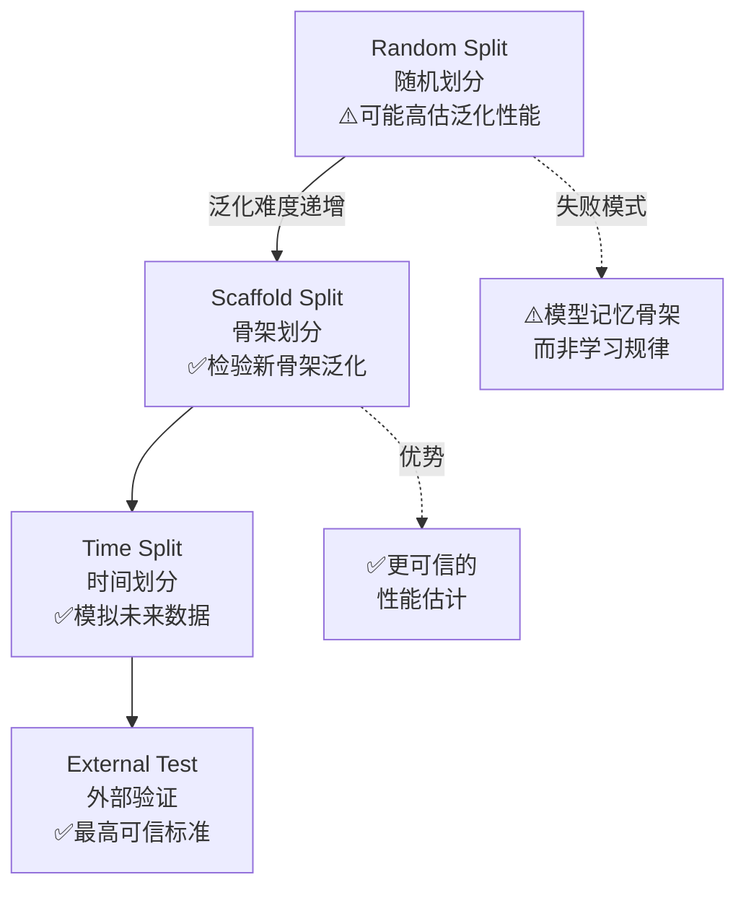
```mermaid
flowchart TD
    RS["Random Split<br/>随机划分<br/>⚠️可能高估泛化性能"] -->|"泛化难度递增"| SS["Scaffold Split<br/>骨架划分<br/>✅检验新骨架泛化"]
    SS --> TS["Time Split<br/>时间划分<br/>✅模拟未来数据"]
    TS --> ET["External Test<br/>外部验证<br/>✅最高可信标准"]
    RS -.->|失败模式| W1["⚠️模型记忆骨架<br/>而非学习规律"]
    SS -.->|优势| W2["✅更可信的<br/>性能估计"]
```

图 5-1 验证策略的泛化难度层次

### 扩展专题：虚拟筛选中的不确定性量化与主动学习

虚拟筛选是从大规模化合物库中识别潜在活性分子的核心技术。传统虚拟筛选输出的是一个确定的排序，但现代方法越来越强调不确定性量化——不仅告诉研究者"哪些分子最可能有活性"，还要告诉"我们对这个预测有多确信"。

**不确定性来源分析：** 虚拟筛选中的预测不确定性来自三个层面：（1）数据不确定性——训练数据中的标签噪声和化学空间覆盖不足；（2）模型不确定性——模型架构、超参数和训练过程的随机性；（3）表征不确定性——分子表示方法（指纹、图、描述符）的信息损失。

**贝叶斯方法与 MC Dropout：** 贝叶斯神经网络通过在权重上引入概率分布来量化模型不确定性。MC Dropout（Monte Carlo Dropout）是一种实用的近似方法——在推理阶段保持 Dropout 激活，通过多次前向传播获得预测分布。2024 年的研究表明，MC Dropout 的预测方差与分子的"离群程度"（距离训练集的距离）高度相关。

**主动学习框架：** 主动学习将不确定性量化与实验设计结合——模型不仅预测活性，还推荐"最值得测试"的分子。主动学习的核心问题是采集函数（acquisition function）的设计。常用的采集函数包括：
- **不确定性采样（Uncertainty Sampling）：** 选择预测方差最大的分子
- **期望改进（Expected Improvement, EI）：** 选择最有可能超过当前最佳候选的分子
- **知识梯度（Knowledge Gradient, KG）：** 选择最有可能减少全局不确定性的分子

2024 年发表在 Journal of Medicinal Chemistry 上的一项研究展示了主动学习在虚拟筛选中的实际应用：通过 3 轮主动学习循环（每轮测试 96 个分子），研究者在 10 万个候选分子中成功发现了 4 个新型活性骨架，而传统随机筛选在相同实验预算下仅发现 1 个。这一案例有力地证明了不确定性感知的筛选策略可以显著提高实验效率。

> **从波普尔与贝叶斯的对话看：** 不确定性量化可以被看作波普尔证伪主义的形式化表达——当我们对预测的置信度高时，我们在做一个"大胆的猜想"（高风险、高回报）；当置信度低时，我们在做一个"保守的声明"（需要更多证据）。主动学习的采集函数则回答了波普尔的"检验严苛性"问题——优先检验那些最有可能证伪当前模型的分子。


### 实验设计指南：原则、策略与规范

本附录为药物发现 AI 研究中的实验设计提供系统性指导。良好的实验设计是科学研究的基石——一个设计精良的实验即使结果不如预期，也能提供有价值的信息；而一个设计不当的实验即使结果"漂亮"，也可能毫无科学价值。教学建议将实验设计作为贯穿整个课程的核心技能来培养。

### 实验设计的基本原则

药物发现 AI 实验设计的基本原则可以概括为五个方面：问题驱动、数据先行、评估严格、基线完备和结果透明。

**问题驱动**意味着每项实验都应当从一个明确的科学问题或业务需求出发。在开始任何计算之前，研究者应当清楚地回答：我要回答什么问题？这个问题的答案对药物发现决策有什么影响？什么结果会让我改变当前的策略？没有明确问题意识的计算实验只是在浪费计算资源。

**数据先行**意味着数据质量和相关性是实验成功的前提。在药物发现中，数据问题是最常见的失败根源——标签不一致、分子去重不彻底、格式标准化不统一、活性数据来自不同实验条件等问题，都可能导致模型学到虚假的模式。教学建议在每项实验开始前，要求学生先完成"数据质量报告"，描述数据来源、预处理步骤和已知的数据质量问题。

**评估严格**意味着评估设计必须模拟真实的预测场景。在药物发现中，最严格的评估策略是时间划分（用早期数据训练、用近期数据测试）和 scaffold split（用一类骨架训练、用另一类骨架测试）。random split 在药物发现中通常给出过于乐观的估计，不应当作为唯一的评估策略。教学建议每项实验都要求同时报告 random split 和 scaffold split 下的结果。

**基线完备**意味着每项新方法的评估都必须包含适当的基线比较。在药物发现中，合适的基线包括：简单的线性模型（了解数据的线性可分性）、随机森林或 XGBoost（经典模型的上限）、以及已有的文献结果（了解领域内的性能标准）。一个新方法只有在严格比较中确实优于基线，才能被认为是有价值的贡献。

**结果透明**意味着实验结果应当完整、诚实地报告。这包括：报告多次独立运行的结果分布（而非仅报告最佳结果）、报告在多个数据集上的表现（而非仅在最有利的数据集上评估）、讨论方法的局限性和适用范围、以及公开代码和数据以支持复现。

### 数据划分策略详解

在药物发现 AI 中，数据划分策略的选择对评估结果有决定性的影响。以下是几种常用的划分策略及其适用场景：

**随机划分（Random Split）**：将数据随机分为训练集和测试集。优点是简单、可重复；缺点是化学相似的分子可能同时出现在训练集和测试集中，导致模型"记住"局部模式而非学习一般规律。在药物发现中，random split 下的性能通常代表模型性能的上界。

**骨架划分（Scaffold Split）**：通过 Bemis-Murcko 骨架提取算法将分子分为核心骨架不同的训练集和测试集。这是药物发现中最推荐的划分策略，因为它模拟了"面对全新化学骨架"的真实预测场景。实现方式：使用 RDKit 的 `MurckoScaffold.GetScaffoldForMol(mol)` 提取骨架，然后按骨架进行分组划分。

**时间划分（Temporal Split）**：按数据的采集时间进行划分，用早期数据训练、用近期数据测试。这在数据分布随时间变化（如检测技术改进导致活性数据质量变化）的场景中尤为重要。在药物发现文献中，时间划分的使用相对较少，但在工业界实践中非常有价值。

**领域划分（Domain Split）**：按分子的某个特定属性（如分子量范围、LogP 范围、靶点类型等）进行划分。这种策略适用于评估模型对特定分子子集的泛化能力。例如，用小分子训练、用大分子测试，可以评估模型对分子尺寸的泛化能力。

### 超参数调优策略

超参数调优是药物发现 AI 实验中的标准环节。以下是几种常用的调优策略：

**网格搜索（Grid Search）**：在预定义的参数网格中穷举所有组合。优点是简单、全面；缺点是计算成本随参数维度指数增长，在高维参数空间中不可行。适用于参数维度低（2-3 个参数）且每个参数的候选值少的场景。

**随机搜索（Random Search）**：在参数空间中随机采样。研究表明，在大多数场景中，随机搜索比网格搜索更高效——因为它可以在同样的预算内探索更多的参数组合。适用于参数维度中等（3-6 个参数）的场景。

**贝叶斯优化（Bayesian Optimization）**：使用高斯过程作为代理模型，通过采集函数（如 Expected Improvement）智能地选择下一组参数。优点是样本效率高；缺点是代理模型的训练和优化本身有计算成本。适用于参数维度中等、每次评估成本高的场景（如需要长时间训练的深度学习模型）。

**药物发现中的特殊考量**：在药物发现 AI 中，超参数调优需要注意以下几个特殊问题。第一，评估指标的选择——不同指标（AUC vs F1 vs BEDROC）下的最优超参数可能不同，需要根据任务需求选择适当的优化目标。第二，嵌套交叉验证——为了获得无偏的超参数性能估计，应当使用嵌套交叉验证（外层用于评估，内层用于超参数选择）。第三，早期停止与调优的交互——在使用 early stopping 的深度学习模型中，early stopping 的耐心参数本身也是一个需要调优的超参数。

### 结果报告规范

药物发现 AI 研究的结果报告应当遵循以下规范：第一，同时报告随机划分和骨架划分下的结果。第二，报告多次独立运行（至少 3 次，建议 5 次）的均值和标准差。第三，报告模型在多个数据集上的表现，而非仅在最有利的数据集上评估。第四，报告训练时间和推理时间，以评估方法的实用性。第五，公开代码和数据（如果允许），或至少提供详细的实验设置描述。第六，诚实地讨论方法的局限性和失败案例——失败的分析往往比成功的报告更有科学价值。


### 药物发现实验设计的关键概念

**效应量（Effect Size）：** 在药物发现 ML 中，效应量衡量的是两个模型性能差异的实际意义。统计显著性（p < 0.05）只告诉我们差异不太可能是偶然的，但不告诉我们差异有多大。在药物发现中，ROC-AUC 差异 0.01 在统计上可能显著（因为数据量大），但在实际应用中可能毫无意义。建议同时报告效应量（如 Cohen's d）和置信区间。

**样本量估计：** 药物发现数据集的规模有限，如何确定数据集是否足够支撑模型训练？经验法则：对于随机森林等集成方法，每个特征至少需要 10-20 个样本；对于深度学习模型，至少需要 1000-5000 个样本。在小数据场景下，优先使用简单模型和数据增强技术。

**多重比较校正：** 当同时比较多个模型或多个超参数配置时，多重比较会增加"发现"假阳性差异的风险。常用的校正方法包括 Bonferroni 校正（最保守）、Holm 校正和 Benjamini-Hochberg 校正（FDR 控制）。

**交叉验证的最佳实践：** 在药物发现中使用交叉验证时，建议：
- 使用 stratified k-fold 确保每折中类别比例一致
- 对时间序列数据使用 time-series split
- 对分子数据使用 scaffold-based split（如果支持）
- 报告各折性能的均值和标准差
- 使用嵌套交叉验证进行超参数调优，避免信息泄露

**超参数搜索策略：** 超参数搜索是药物发现 ML 中最耗时的环节之一。推荐的搜索策略：
1. 先用随机搜索（Random Search）在大范围内粗搜
2. 再用贝叶斯优化（如 Optuna）在最有希望的区域细搜
3. 对最终模型使用网格搜索确认最优配置
4. 报告搜索空间和搜索次数，确保可复现性

### 药物发现中的经典数据集与基准

本附录整理了药物发现 AI 领域最常用的数据集和基准测试，为学生和研究者提供参考。选择合适的数据集是实验设计的关键步骤——不同的数据集具有不同的特征（数据规模、分子多样性、标签质量、任务类型），需要根据研究目标进行选择。

### 分子性质预测数据集

MoleculeNet 是分子机器学习领域最广泛使用的基准套件，由 Wu 等人于 2018 年提出。它包含 12 个数据集，覆盖分类、回归和多任务学习等多种任务类型。重要的子数据集包括：ESOL（水溶性预测，1128 个分子）、FreeSolv（溶解自由能预测，642 个分子）、Lipophilicity（脂水分配系数预测，4200 个分子）、HIV（HIV 抑制活性分类，41127 个分子）、BACE（BACE-1 抑制剂活性分类，1513 个分子）、BBBP（血脑屏障穿透性分类，2039 个分子）、Tox21（毒性预测多任务，7831 个分子，12 个终点）和 SIDER（药物副作用多任务，1427 个药物，27 种副作用）。

Therapeutics Data Commons (TDC) 是 2021 年由 IBM 和斯坦福大学联合发布的更全面的药物发现基准平台。TDC 包含超过 20 个任务类别，涵盖分子性质预测、药物-靶点交互、药物-药物交互、药物重定位、分子生成和临床试验结果预测等。TDC 的核心贡献在于提供了更严格的数据划分策略（如时间划分和领域划分），以及标准化的评估协议。

### 蛋白-配体交互数据集

PDBbind 是蛋白-配体结合亲和力预测领域最权威的基准数据集。它收集了 PDB 数据库中具有实验测定结合亲和力数据的蛋白-配体复合物。PDBbind 的三个版本（general、refined 和 core）分别包含不同严格程度的数据——refined 版本排除了结合数据不可靠的条目，core 版本是 refined 的子集，进一步确保了数据质量。典型的评估策略是将整个蛋白家族作为划分单位，确保训练集和测试集的蛋白不重叠。

BindingDB 是另一个重要的蛋白-配体交互数据库，包含超过 200 万条结合数据。与 PDBbind 不同，BindingDB 包含更多的靶点和更广的亲和力范围，但数据质量不如 PDBbind 均匀。

### 分子生成评估数据集

GuacaMol 是分子生成模型的标准评估基准，包含多个评估维度：目标性质优化（如最大化 LogP 或 QED）、目标分子相似性（生成与指定分子相似的分子）、分布学习（学习训练集的分子分布）和插值（在两个分子之间生成过渡分子）。MOSES 是另一个广泛使用的分子生成基准，提供了更系统的生成质量评估框架。

### ADMET 预测数据集

ADMET 预测是药物发现 AI 中应用最广泛的领域之一。重要的 ADMET 数据集包括：ADMElab（涵盖吸收、分布、代谢、排泄等多个性质）、ToxCast（美国 EPA 发布的毒性预测数据集，包含约 7000 个化合物和 600 多个毒性终点）、ClinTox（临床毒性预测，约 1500 个药物）和 hERG（hERG 钾通道抑制预测，与心脏毒性直接相关）。

### 数据集选择的指导原则

在药物发现 AI 研究中，数据集的选择应当遵循以下原则：第一，与研究问题匹配——研究分子性质预测应选择 MoleculeNet 或 TDC 的性质预测数据集，研究蛋白-配体交互应选择 PDBbind。第二，数据质量优先——优先选择经过人工审核、数据来源明确、标签标准化的数据集。第三，数据规模适当——深度学习模型需要较大的数据集（通常 > 5000 个分子），而经典模型在小数据集上可能更具优势。第四，评估策略严格——优先选择提供 scaffold split 或时间划分的数据集，避免在 random split 下得出过于乐观的结论。第五，多数据集验证——在多个数据集上验证方法的一致性能，避免在单一数据集上的偶然成功。

### 常见的数据质量问题

在药物发现 AI 的实践中，数据质量问题是最常见但最容易被忽视的失败根源。常见的数据质量问题包括：第一，分子去重不彻底——同一分子以不同的 SMILES 形式出现，导致数据集中存在重复记录。第二，活性数据不一致——来自不同实验室、不同实验条件的活性数据可能不具有直接可比性。第三，类别极度不平衡——毒性预测中阳性率通常 < 5%，需要特殊的处理策略（如过采样、欠采样或代价敏感学习）。第四，分子结构错误——从数据库下载的分子可能包含无效的结构（如错误的原子价态、不合理的键长等）。第五，特征泄露——在数据预处理过程中，全局统计信息（如特征的均值和标准差）可能从测试集泄露到训练集。

教学建议在每项实验开始前，要求学生完成数据质量检查清单：分子唯一性验证、SMILES 规范化、活性数据范围检查、缺失值处理和特征分布分析。这些看似简单的步骤可以避免大量后续的问题。


### 更多评估实践：数据泄露检测清单

在药物发现 ML 项目中，数据泄露（data leakage）是最常见也最隐蔽的错误。以下是一个完整的数据泄露检测清单：

**预处理阶段的泄露：**
- [ ] 特征标准化是否仅使用训练集的统计量？
- [ ] 特征选择是否仅使用训练集的数据？
- [ ] 缺失值填充是否仅基于训练集的分布？
- [ ] 数据清洗规则是否在看到测试集之前确定？

**模型训练阶段的泄露：**
- [ ] 交叉验证的每个折是否独立进行预处理？
- [ ] 超参数搜索是否在独立的验证集上进行？
- [ ] 早停的验证集是否与最终测试集不重叠？
- [ ] 集成方法中，每个基学习器是否使用独立的折？

**分子特异性的泄露：**
- [ ] 同一分子是否不会同时出现在训练集和测试集中（除非有意为之）？
- [ ] 同一分子的不同盐型/互变异构体是否被统一处理？
- [ ] Scaffold split 是否确保训练集和测试集没有相同的 Bemis-Murcko 骨架？

**时间维度的泄露：**
- [ ] 训练集的化合物发表/测定时间是否早于测试集？
- [ ] 训练集是否包含了来自测试集化合物的衍生信息？

**特征维度的泄露：**
- [ ] 指纹计算是否没有使用来自外部数据库的标签信息？
- [ ] 分子描述符的计算是否不依赖于任何实验活性数据？
- [ ] 图特征中是否不包含与活性相关的标注信息？

使用此清单可以在实验开始前系统地排查潜在的泄露源。在药物发现中，未检测到的数据泄露可能导致模型性能被高估 10-30% 的 ROC-AUC，进而导致大量无效的实验投入。

### 常见错误与故障排除

本附录整理了药物发现 AI 项目中最常见的错误及其解决方案，帮助学生避免重复前人已经犯过的错误。

### 数据准备阶段的常见错误

**错误 1：SMILES 未规范化。** 同一个分子可能以多种 SMILES 形式出现（如 `c1ccccc1` 和 `C1=CC=CC=C1`），如果不进行规范化，同一个分子可能被当作两个不同的分子处理，导致训练集和测试集之间的数据泄露。解决方案：使用 RDKit 的 `Chem.MolToSmiles(mol)` 生成规范化 SMILES，在数据加载后立即执行。

**错误 2：分子去重不彻底。** 即使 SMILES 已规范化，去重时还需要考虑盐型、互变异构体和立体化学等因素。解决方案：先去除盐和溶剂（`MolStandardize.rdMolStandardize.Cleanup`），再进行规范化去重。

**错误 3：数据预处理在 split 之后执行。** 如果在数据划分之前进行特征标准化（如 z-score 标准化），测试集的统计信息（均值和标准差）会泄露到训练过程中。解决方案：先 split 数据，然后仅使用训练集的统计信息来标准化训练集和测试集。

**错误 4：忽略活性数据的单位差异。** 不同来源的活性数据可能使用不同的单位（如 nM vs μM vs IC₅₀ vs Ki），直接混合使用会导致标签不一致。解决方案：统一活性数据的单位，并在数据文档中明确标注。

### 模型训练阶段的常见错误

**错误 5：在测试集上调参。** 使用测试集的表现来选择超参数，相当于让模型"偷看"了测试题的答案，导致评估结果过于乐观。解决方案：使用验证集（从训练集中划分）或交叉验证来选择超参数，仅在最终评估时使用测试集。

**错误 6：忽略随机种子。** 数据划分的随机性、权重初始化的随机性和 dropout 的随机性都可能导致不同运行之间的结果差异。解决方案：在每次实验开始前设置全局随机种子（NumPy、Python random、PyTorch），并在实验报告中记录种子值。

**错误 7：过拟合检测不充分。** 仅比较训练集和测试集的性能差距是不够的——还需要监控验证集性能随训练过程的变化（学习曲线）。解决方案：绘制训练集、验证集和测试集的学习曲线，使用 early stopping 防止过拟合。

**错误 8：类别不平衡未处理。** 在毒性预测等高度不平衡的任务中（阳性率 < 5%），模型可能学会将所有样本预测为阴性以获得高准确率。解决方案：使用分层采样、过采样（SMOTE）、欠采样或代价敏感学习。

### 评估阶段的常见错误

**错误 9：仅报告随机划分结果。** 在药物发现中，random split 下的性能通常显著优于 scaffold split 下的性能。仅报告 random split 结果是评估不充分的表现。解决方案：同时报告 random split 和 scaffold split 下的结果，并讨论两者之间的差异。

**错误 10：选择性报告最佳结果。** 仅报告多次运行中表现最好的一次，而不报告均值和标准差，是一种常见的学术不端行为。解决方案：报告所有独立运行的完整结果分布，包括均值、标准差和中位数。

**错误 11：忽略模型的适用范围。** 模型在训练数据的化学空间内可能表现良好，但对训练数据化学空间外的分子可能给出不可靠的预测。解决方案：使用域适应度（applicability domain）评估方法，对训练空间外的预测标注低置信度。

### 部署阶段的常见错误

**错误 12：输入数据格式不一致。** 训练时的分子预处理流程（标准化、盐去除、互变异构体处理）在部署时必须完全一致，否则模型输入会与训练时的分布不匹配。解决方案：将预处理步骤封装为可复用的模块，并在训练和部署中使用相同的代码。

**错误 13：忽略模型的维护和监控。** 部署后的模型需要持续监控其预测性能，因为数据分布可能随时间漂移（concept drift）。解决方案：建立定期评估机制，当性能下降到阈值以下时触发模型重新训练。


### 药物发现中的评估方法论

本节从实践角度补充评估设计的核心原则和常见陷阱（关于评估的认识论基础和 BEDROC 等指标的详细推导，见前文"评估方法论的认识论基础"）。

### 评估设计的核心原则

**原则一：匹配真实场景的数据划分。** 如前文所述，随机划分高估了模型在化学空间中的泛化能力，scaffold split 和 temporal split 是更严格的评估方式。2024 年的系统性比较表明，模型在 random split 上的性能通常比 scaffold split 高 5-15% 的 ROC-AUC。

**原则二：多维度的指标报告。** 单一指标不足以全面反映模型性能。在药物发现中，建议至少报告以下指标组合：
- 分类任务：ROC-AUC、PR-AUC、F1、准确率（在预设阈值下）
- 回归任务：RMSE、MAE、R²、Spearman 相关系数
- 排序任务：Top-K 命中率、BEDROC、Enrichment Factor

**原则三：统计显著性检验。** 两个模型性能的差异是否具有统计显著性？建议使用配对 t 检验或 Wilcoxon 符号秩检验，并报告 p 值和效应量（effect size）。2025 年的一项 meta 分析发现，药物发现 ML 论文中仅有约 30% 报告了统计显著性检验。

**原则四：错误分析。** 性能指标只能告诉"模型有多好"，错误分析能告诉"模型为什么不好"。系统性地分析误分类/高误差样本，可以发现数据标注错误、化学空间覆盖不足、或模型架构的特定弱点。

### 常见评估陷阱

| 陷阱 | 描述 | 后果 | 解决方案 |
| --- | --- | --- | --- |
| 数据泄露 | 测试集信息泄露到训练过程 | 性能虚高 | 严格划分、独立预处理 |
| 信息重复 | 同一分子在训练集和测试集的不同构象中出现 | 过度乐观的评估 | 分子级而非构象级去重 |
| 类别不平衡 | 正负样本比例严重不均 | ROC-AUC 误导 | 报告 PR-AUC、使用平衡采样 |
| 不恰当的基线 | 与过于简单的基线比较 | 看似优秀实则平庸 | 与领域最强的基线比较 |
| 选择性报告 | 只报告最好的结果 | 复现困难 | 预注册分析方案、报告多次运行 |

> **从波普尔的证伪主义看：** 评估的本质是"尝试证伪"模型——寻找模型失效的条件和场景。一个经过严格评估的模型不是"永远不会失败"的模型，而是"我们知道它在什么条件下会失败"的模型。这种对失败的系统探索，比追求完美指标更有科学价值。

### 药物发现中的数据标注质量控制

在监督式机器学习中，数据标注质量直接决定模型性能的上限。药物发现领域的数据标注面临独特的挑战：生物测定的固有噪声、实验者之间的操作差异、活性阈值的任意性、以及多来源数据的标签不一致性。

### 标注噪声的来源与分类

药物发现数据标注噪声可分为四类：

1. **测量噪声（Measurement Noise）：** 生物测定本身的不确定性。例如，IC50 测定的变异系数通常在 2-3 倍范围内，同一化合物在不同批次的测定中可能给出差异显著的结果。2024 年 Mayr 等人在 Nature Reviews Drug Discovery 上发表的综述指出，生物测定噪声是限制 ADMET 预测模型性能的首要因素。

2. **标注者偏差（Annotator Bias）：** 不同实验者对"活性"的定义可能不同。某课题组可能将 IC50 < 1 μM 定义为活性，另一课题组可能使用 IC50 < 10 μM。当合并来自不同来源的数据时，这种标签定义差异会引入系统性偏差。

3. **标签翻转（Label Flipping）：** 由于测量误差，部分化合物的标签可能被错误翻转——真正的活性化合物被标记为非活性，反之亦然。在药物发现中，标签翻转率估计在 5-15% 之间，远高于传统机器学习任务。

4. **特征-标签不匹配（Feature-Label Mismatch）：** 当分子特征化过程中引入信息损失（如从三维结构到二维 SMILES）或计算错误（如不正确的质子化状态）时，特征与标签之间的真实映射关系被破坏。

### 噪声标签下的建模策略

面对噪声标签，药物发现研究者可以采用以下策略：

- **标签平滑（Label Smoothing）：** 将硬标签（0/1）替换为软标签（如 0.05/0.95），减少模型对单个标签的过度置信。
- **噪声鲁棒损失函数：** 使用广义交叉熵（Generalized Cross Entropy）或对称交叉熵替代标准交叉熵，这些损失函数对标签噪声具有内在的鲁棒性。
- **协同训练（Co-training）：** 使用多个模型相互监督，只有当多个模型对某个样本的预测一致时才将其纳入训练集。
- **课程学习（Curriculum Learning）：** 先用高置信度样本训练模型，逐步引入低置信度样本，模拟人类从易到难的学习过程。

> **从奥卡姆剃刀原则看：** 在噪声标签环境下，更简单的模型（如随机森林、线性模型）往往优于更复杂的模型（如深度神经网络），因为简单模型的假设空间更小，更不容易拟合噪声。这一观察与药物发现中的实践经验高度一致——在典型的 ADMET 预测任务中，随机森林的基线性能经常超过未经仔细调优的深度学习模型。

### 本章总结


本章的核心论点是：在药物发现中，评估设计不是模型训练之后的"收尾工作"，而是建模过程中最重要的方法论决策。一个训练精良的模型如果评估方式不当，可能产生误导性的结论；而一个简单模型的评估如果是严格和透明的，则可以产生真正可靠的知识。

值得特别总结的几个核心原则包括：第一，scaffold split 优于 random split——它更接近真实的新化学空间预测场景，应当作为药物发现建模的默认验证策略。第二，多个评价指标互补而非互斥——ROC-AUC 提供整体区分能力的度量，PR-AUC 在不平衡场景中更有诊断力，EF 和 BEDROC 则更适合虚拟筛选的评估。第三，模型校准不可忽视——一个校准良好的模型不仅排序正确，还给出了有实际意义的概率估计，这对于风险评估和决策支持至关重要。第四，数据泄露是最隐蔽的错误来源——它可以让模型看起来性能优异，但实际上只是在"偷看答案"。第五，外部验证是最终标准——模型在内部交叉验证中的表现只是初步证据，只有在独立的外部数据集上通过验证，才能被认为具有真正的泛化能力。

教学建议中，教师应当让学生在整个课程中反复实践这些原则。每章的实验都应要求学生同时报告 random split 和 scaffold split 下的结果，计算多个评价指标，并讨论结果之间的差异。这种反复实践比任何理论讲授都更能建立评估纪律的"肌肉记忆"。

可信模型不是“分高模型”，而是“问题定义明确、验证合理、指标与目标一致、失败模式被公开说明”的模型。评价不是训练后的仪式，而是研究设计的核心。后续章节的所有模型实验，都应在本章建立的这一评价纪律下进行。案例分析中建议让学生用不同 split 策略评估同一个模型，亲身体验评价设计对结论的影响。

在教学实践中，评价纪律的建立往往是最困难也最容易被忽视的环节。许多学生更关注"模型性能如何提升"，而不愿意花时间思考"我是否在正确地衡量性能"。教师应当通过具体的反面案例来帮助学生建立对评估设计重要性的直观感受。术语表建议：学生应在本章后能够准确区分 ROC-AUC 与 PR-AUC 的适用场景，理解 scaffold split 与 random split 的本质区别，并能说明 data leakage 的常见来源和检测方法。值得特别指出的是，calibration（校准）这个概念在药物发现中经常被忽略。一个校准良好的模型不仅给出正确的排序，还应当让预测概率具有实际意义。方法比较和任务对照是全书核心实践。


**术语表速查**

| 术语 | 定义 | 公式/方法 |
| --- | --- | --- |
| ROC-AUC | ROC曲线下面积 | 积分TPR(FPR) |
| PR-AUC | 精确率-召回率曲线下面积 | 积分Prec(Rec) |
| RMSE | 均方根误差 | √(Σ(ŷ-y)²/N) |
| R² | 决定系数 | 1-SS_res/SS_tot |
| Data Leakage | 数据泄漏 | 训练测试信息交叉 |
| Calibration | 预测校准 | ECE指标 |
| Scaffold Split | 骨架划分 | Bemis-Murcko算法 |
| Enrichment Factor | 富集因子 | Top K命中率提升 |

**评价设计决策树**

面对一个新的药物发现预测任务，研究者可以按照以下决策路径设计评价体系：（1）数据量是否足够大（>1000）？如果不够，优先使用交叉验证。（2）是否存在已知的化学骨架类？如果存在，必须使用 scaffold split 作为主要验证策略。（3）是否需要向非技术背景的同事报告结果？如果是，同时报告多个指标（如 AUC 和 PR-AUC）并附带置信区间。（4）结果是否将用于指导实验？如果是，额外报告模型的 calibration 质量和不确定性估计。（5）是否存在已发表的外部数据集？如果有，进行外部验证作为最终可信度检验。
### 想象力思考题

1. 若一个模型在 random split 下显著领先，但在 scaffold split 下显著落后，它是否还值得被写进教材？
2. 药学院是否应把“识别数据泄漏”与“会调参”视为同等重要的教学目标？
3. 如果标签本身存在较大不确定性，我们还应不应该追求百分位级别的性能提升？
4. 如果两个模型在同一个数据集上使用不同的 split 策略得到了相反的性能排序，你如何在论文中呈现这一发现？


### 参考论文

1. Wu, Z. et al. *MoleculeNet: a benchmark for molecular machine learning*. Chemical Science, 2018. https://doi.org/10.1039/C7SC02664A
2. Chittoria, P. et al. *Supervised machine learning in drug discovery and development: Algorithms, applications, challenges, and prospects*. Machine Learning with Applications, 2024. https://doi.org/10.1016/j.mlwa.2024.100576
3. European Medicines Agency. *Use of Artificial Intelligence (AI) in the medicinal product lifecycle*. EMA Guideline, 2024. https://www.ema.europa.eu/en/use-artificial-intelligence-ai-medicinal-product-lifecycle-scientific-guideline
4. Niazi, S. K. *Artificial Intelligence in Small-Molecule Drug Discovery: A Critical Review*. Pharmaceuticals, 2025. https://www.mdpi.com/1424-8247/18/9/1271
5. Wang, C. et al. *Drug discovery and mechanism prediction with explainable graph neural networks*. Scientific Reports, 2025. https://www.nature.com/articles/s41598-024-83090-3

## 第 6 章 经典统计学习：线性模型、朴素贝叶斯与支持向量机

> 奥卡姆：如无必要，勿增实体。

### 引言

在深度学习时代，经典模型经常被当作“入门过渡”而被轻视。本章导读建议教师从“为什么奥卡姆剃刀在药学中特别重要”这个问题入手，让学生在动手之前先建立对简约性的方法论自觉。但在药学场景中，线性模型、朴素贝叶斯和支持向量机并未失去意义。相反，它们在小样本、高维、需要可解释性或希望快速建立稳健 baseline 的任务里仍然非常有力。对教师而言，这些模型也更适合作为方法论训练的入口，因为它们让假设暴露得更清楚。

本章导读建议教师从"为什么奥卡姆剃刀在药学中特别重要"这个问题入手，让学生在动手之前先建立对简约性的方法论自觉。

### 关键知识

- linear regression 与 logistic regression 的假设和局限。
- naive bayes 的条件独立思想及其在稀疏特征上的实用性。
- support vector machine 的最大间隔原则和 kernel trick。
- 小样本、高维输入、可解释性需求与经典模型的适用场景。
- 方法比较原则：经典模型不应被当作“过时工具”，而应被视为“透明基准”，任何复杂模型都必须先证明自己显著优于它们。
- linear regression 的 L2 正则化版本（岭回归）在高维稀疏数据（如 Morgan 指纹）中特别有用。


**公式解读：线性回归（含 L2 正则化）**

$$\hat{y} = \mathbf{w}^T \mathbf{x} + b, \quad \mathbf{w}^* = \arg\min_{\mathbf{w}} \left( \sum_{i=1}^{N}(y_i - \mathbf{w}^T\mathbf{x}_i - b)^2 + \lambda \|\mathbf{w}\|^2 \right)$$

**符号解释：**

- $\hat{y}$：模型对目标性质的预测值（如预测的 pIC₅₀ 或 LogP）
- $\mathbf{w}$：权重向量（每个分量 $w_j$ 对应一个分子特征的重要性），$\mathbf{w}^T$ 为其转置
- $\mathbf{x}$：分子的特征向量（如分子描述符、Morgan 指纹等编码后的输入）
- $b$：偏置项（截距），代表所有特征为零时的基线预测值
- $\mathbf{w}^*$：使目标函数最小的最优权重向量
- $y_i$：第 $i$ 个训练样本的实验观测值（真实活性或性质）
- $\mathbf{x}_i$：第 $i$ 个训练样本的特征向量
- $N$：训练样本总数
- $\lambda$：L2 正则化强度超参数（$\lambda > 0$），控制对大权重的惩罚力度
- $\|\mathbf{w}\|^2 = \sum_j w_j^2$：权重向量的 L2 范数平方，衡量权重的大小
- $\arg\min_{\mathbf{w}}$：使括号内目标函数取最小值时的 $\mathbf{w}$ 值

- 线性回归的核心假设：线性关系、同方差性、独立性和正态性残差。在药物发现中，这些假设经常被违反——QSAR 数据通常呈现异方差性（高活性分子的预测误差往往大于低活性分子），且分子特征之间经常高度相关（多重共线性）。

**直观理解：** 线性回归假设活性与分子特征之间存在近似线性关系——就像说"分子的 LogP 每增加 1 个单位，活性增加 $w_1$ 个单位"。L2 正则化通过惩罚过大的权重来防止过拟合，好比一个"节俭原则"：不要过度依赖任何一个特征，而是让所有特征均匀地贡献。目标函数由两部分组成：前半部分 $\sum(y_i - \hat{y}_i)^2$ 要求预测值尽量接近真实值，后半部分 $\lambda\|\mathbf{w}\|^2$ 惩罚过大的权重以避免过拟合。

**药学意义：** 在 Hansch 的经典 QSAR 中，$\mathbf{x}$ 的每个分量都有明确的物理化学意义（如 LogP、Hammett $\sigma$），因此权重 $w_j$ 可以直接被化学家解读为"该特征对活性的贡献方向和强度"。这种可解释性在药物化学中极为重要——药物化学家需要知道"是亲脂性还是氢键供体能力驱动了活性"，而不仅仅是一个黑箱预测。岭回归（L2 正则化线性回归）在高维稀疏数据（如 Morgan 指纹）中特别有用。

**失效条件：** 当分子特征之间存在强共线性（如 LogP 和芳香性高度相关），权重会变得不稳定；当活性与特征之间存在非线性关系时，线性回归的表达力不足；当样本量少于特征维度（$N < p$）时，无正则化的线性回归甚至无法求解，必须依赖正则化。

**公式解读：Lasso 回归的目标函数**

$$\hat{\beta}^{\text{Lasso}} = \arg\min_{\beta} \left\{ \sum_{i=1}^{n}(y_i - \mathbf{x}_i^T \beta)^2 + \lambda \sum_{j=1}^{p} |\beta_j| \right\}$$

**符号解释：**
- $\hat{\beta}^{\text{Lasso}}$：Lasso 回归的最优系数估计值（上标 Lasso 区别于普通最小二乘估计）
- $\arg\min_{\beta}$：使花括号内目标函数取最小值的 $\beta$ 值
- $y_i$：第 $i$ 个分子的实验观测值（如 IC₅₀）
- $\mathbf{x}_i$：第 $i$ 个分子的特征向量（如描述符或指纹）
- $\mathbf{x}_i^T \beta$：第 $i$ 个分子的模型预测值（特征与系数的线性组合）
- $\beta$：模型系数向量（包含 $p$ 个系数，每个对应一个特征）
- $\beta_j$：第 $j$ 个特征的系数，$|\beta_j|$ 为其绝对值（L1 惩罚项的组成部分）
- $\lambda$：正则化强度超参数（$\lambda > 0$），控制特征选择的激进程度
- $\lambda \sum_{j=1}^{p} |\beta_j|$：L1 正则化项，对所有系数绝对值求和并乘以惩罚系数
- $n$：训练样本数
- $p$：特征维度（候选描述符的总数）

**直观理解：** Lasso 回归在最小二乘损失的基础上增加了 L1 正则化项，使得不重要的特征系数被压缩为零——这实现了自动特征选择。$\lambda$ 越大，被压缩为零的特征越多。

**药学意义：** 在药物发现的 QSAR 建模中，研究者经常面对数百个候选描述符，其中很多与目标活性无关。Lasso 回归可以自动识别最相关的少数描述符，从而提高模型的可解释性和预测稳健性。在典型的药物发现数据集中（n < p，即样本数小于特征数），Lasso 的特征选择能力尤为宝贵。

**失效条件：** 当特征之间高度相关（多重共线性）时，Lasso 倾向于随机选择其中一个相关特征而丢弃其余——此时弹性网络（Elastic Net，同时使用 L1 和 L2 正则化）可能是更好的选择。

- 岭回归（Ridge Regression）与 Lasso 回归的区别：岭回归通过 L2 正则化（$\lambda \sum \beta_j^2$）收缩系数但不置零，保留所有特征；Lasso 回归通过 L1 正则化（$\lambda \sum |\beta_j|$）可以将部分系数置零，实现特征选择。在药物发现的 QSAR 建模中，Lasso 回归特别适用于从大量候选描述符中选择最相关的少数特征。
- logistic regression 的链接函数：logistic 回归通过 sigmoid 函数将线性组合映射为概率值 $p = 1/(1+e^{-z})$。在药物发现的活性分类任务中，logistic 回归的一个优势是输出的概率可以直接用于分子优先级排序。
- naive bayes 在指纹特征上的独特优势：Morgan 指纹是高维稀疏的二值向量（通常 2048 位，其中大部分为 0），这种数据结构非常适合朴素贝叶斯的条件独立假设。在高维稀疏特征空间中，朴素贝叶斯的性能经常出人意料地好。
- 支持向量机的核技巧：通过将数据映射到高维特征空间，SVM 可以处理非线性分类问题。在药物发现中，RBF 核 SVM 在小样本分类任务中经常表现优异。但 SVM 在大规模数据集上的计算成本较高，且对特征尺度敏感。
- 学习目标：掌握线性模型、朴素贝叶斯和支持向量机在药物发现中的典型应用场景，理解每种方法的适用条件和局限性，能够在具体问题中选择合适的经典模型。

- $\mathbf{x}$：分子特征向量（描述符或指纹）
- $\mathbf{w}$：权重向量（每个维度对应一个特征的重要性）
- $b$：偏置项
- $\lambda$：正则化强度（岭回归超参数）
- $\|\mathbf{w}\|^2 = \sum_j w_j^2$：L2 范数

**直观理解：** 线性回归假设活性与分子特征之间存在近似线性关系。L2 正则化通过惩罚过大的权重来防止过拟合。

**药学意义：** 在 Hansch 的经典 QSAR 中，$\mathbf{x}$ 的每个分量都有明确的物理化学意义（如 LogP、Hammett $\sigma$），因此权重 $w_j$ 可以直接被化学家解读为"该特征对活性的贡献方向和强度"。

**失效条件：** 当分子特征之间存在强共线性（如 LogP 和芳香性高度相关），权重会变得不稳定；当活性与特征之间存在非线性关系时，线性回归的表达力不足。

**公式解读：支持向量机（SVM）决策函数**

$$f(\mathbf{x}) = \text{sign}\left(\sum_{i \in SV} \alpha_i y_i K(\mathbf{x}_i, \mathbf{x}) + b\right)$$

其中 RBF 核函数：

$$K(\mathbf{x}_i, \mathbf{x}_j) = \exp\left(-\frac{\|\mathbf{x}_i - \mathbf{x}_j\|^2}{2\sigma^2}\right)$$

**核函数补充符号解释：**
- $K(\mathbf{x}_i, \mathbf{x}_j)$：RBF（径向基函数）核，输出 $\mathbf{x}_i$ 与 $\mathbf{x}_j$ 之间的相似度，值域为 $(0, 1]$
- $\|\mathbf{x}_i - \mathbf{x}_j\|^2$：两个分子特征向量之间的欧氏距离平方，衡量分子之间的特征差异大小
- $\sigma^2$：核带宽参数的平方，控制相似性随距离衰减的速度（$\sigma$ 大则"宽容"，远处分子也算相似；$\sigma$ 小则"严格"，只有近邻才算相似）
- $\exp(\cdot)$：指数函数，将负无穷到零的输入映射为 $(0, 1]$ 的输出，即当两分子完全相同时 $K = 1$，差异越大 $K$ 越接近 $0$

**直观理解（核函数）：** RBF 核可以被理解为分子之间的"相似度计"。两个分子在特征空间中越接近（$\|\mathbf{x}_i - \mathbf{x}_j\|^2$ 越小），核值越接近 1（高度相似）；距离越远，核值指数衰减趋近 0（几乎无关）。$\sigma$ 就像一个"放大镜的焦距"——焦距大，看到的相似范围宽；焦距小，只有非常相似的分子才能被捕捉到。

**药学意义（核函数）：** 在药物发现的虚拟筛选中，RBF 核将"结构相似性"的概念数学化为一个连续的相似度度量。这使得 SVM 可以基于"与已知活性化合物有多相似"来判断新化合物的潜在活性，而无需显式指定哪些特征组合是重要的。这种"相似化合物具有相似活性"（Similar Property Principle）是药物设计的核心直觉之一。

**失效条件（核函数）：** RBF 核假设特征空间中的距离有意义——当分子特征选择不当（如使用与活性无关的描述符）时，距离失去化学意义，核函数的输出也随之失效。此外，$\sigma$ 的选择对性能影响极大：$\sigma$ 过小导致过拟合（每个分子自成一类），$\sigma$ 过大导致欠拟合（所有分子看起来都相似）。

**符号解释（SVM 决策函数）：**
- $f(\mathbf{x})$：SVM 对输入分子 $\mathbf{x}$ 的分类决策函数，输出为 $+1$ 或 $-1$
- $\text{sign}(\cdot)$：符号函数，正数输出 $+1$，负数输出 $-1$，用于将连续值转换为分类标签
- $SV$：支持向量集合（训练集中最靠近决策边界、决定分类面位置的少数关键样本）
- $i \in SV$：遍历所有支持向量（非支持向量的训练样本不出现在求和中）
- $\alpha_i$：第 $i$ 个支持向量的拉格朗日乘子（由优化算法自动学习，反映该支持向量对决策边界的影响力）
- $y_i$：第 $i$ 个支持向量在训练集中的真实类别标签（$+1$ 或 $-1$）
- $K(\mathbf{x}_i, \mathbf{x})$：核函数，度量训练样本 $\mathbf{x}_i$ 与待预测分子 $\mathbf{x}$ 之间的相似性
- $b$：偏置项（决策阈值），控制分类边界的位置
- $\sigma$：RBF 核的带宽参数（控制相似性衰减速度，$\sigma$ 越小，只有非常相似的分子才被认为是"相似"的）

**直观理解：** SVM 通过核函数将数据映射到高维空间，在高维空间中寻找最大间隔超平面。只有支持向量对决策边界有贡献，其余训练样本不影响模型。

**药学意义：** SVM 在小样本药物发现数据集（如几百个化合物的活性数据）中经常表现出色，因为最大间隔原则提供了天然的泛化保障。

**失效条件：** 当特征维度远大于样本数时（$p \gg n$），需要谨慎选择核函数和正则化参数；RBF 核的 $\sigma$ 选择不当会导致严重欠拟合或过拟合。


| 模型 | 核心假设 | 优势 | 局限 | 药学典型应用 |
| --- | --- | --- | --- | --- |
| 线性回归 | 线性关系 | 极高可解释性 | 无法捕获非线性 | QSAR、ADMET |
| 逻辑回归 | 线性决策边界 | 概率输出、可解释 | 同上 | 活性分类 |
| 朴素贝叶斯 | 条件独立 | 高维稀疏、快速 | 假设往往不成立 | 指纹分类、毒性筛选 |
| SVM | 最大间隔 | 小样本、高维 | 核选择敏感 | 小数据集分类 |
| 岭回归 | L2正则化 | 防过拟合 | 特征选择弱 | 高维描述符建模 |

表 6-1 经典统计学习模型比较

| 模型选择因素 | 小样本(<500) | 中等(500-5000) | 大样本(>5000) | 需要解释性 |
| --- | --- | --- | --- | --- |
| 首选 | SVM / Naive Bayes | RF / XGBoost | 深度学习 | 线性回归 / 决策树 |
| 次选 | 逻辑回归 | SVM | GNN | 树模型 |
| 避免 | 深度学习 | 复杂集成 | 过度正则化经典模型 | 黑箱模型 |

表 6-2 不同条件下的模型选择建议
### 技术与历史


经典机器学习在药物发现中的应用可以追溯到 1960 年代。Corwin Hansch 在 1964 年发表的线性自由能关系（LFER）论文被公认为定量药物设计的起点，其核心方法就是多元线性回归——用分子描述符预测生物活性。Hansch 方程的形式为 $\log(1/IC_{50}) = a\pi + b\sigma + cE_s + d$，其中 $\pi$ 是疏水参数、$\sigma$ 是电子参数、$E_s$ 是立体参数。

1990 年代，支持向量机（Vapnik, 1995）和随机森林（Breiman, 2001）的引入为药物发现建模提供了新的工具。SVM 在处理高维小样本问题时表现出色，而随机森林的集成策略在 QSAR 和 ADMET 预测中展现了强大的性能和鲁棒性。2000 年代，XGBoost（Chen & Guestrin, 2016）通过梯度提升框架进一步提升了树模型的表达能力和训练效率，在多个药物发现基准测试中取得了当时最优的结果。

值得关注的是，2010 年代深度学习兴起后，经典模型并未被淘汰。2024-2025 年的多个综述和实证研究一致指出：在药物发现的典型场景中（数据规模有限、可解释性要求高、计算资源受限），经典模型经常匹配甚至超过深度学习模型的性能。Chittoria 等人 2024 年的综述特别强调，在 ADMET 预测中，树模型（如 XGBoost、LightGBM）的表现经常与更复杂的深度学习模型相当，而在训练效率和可解释性方面具有明显优势。这一发现对药学院教学具有重要启示：经典模型的教学不应被深度学习的热潮边缘化，而应当作为药物发现建模的基础能力来培养。

QSAR 的发展深受线性回归思想影响。它的成功来自一个朴素却强大的信念：某些关键理化特征与生物活性之间存在近似稳定关系。Hansch 的线性自由能关系（LFER）是这一信念的最早系统化表达。朴素贝叶斯则代表了另一种传统，它愿意引入强假设（条件独立）以换取可计算性和在低资源环境中的稳定表现，特别适合处理高维稀疏的指纹特征。支持向量机的出现则把分类问题几何化，强调边界而不是直接拟合概率——最大间隔原则使得 SVM 在小样本高维场景中表现出色。即使今天看来这些方法并不“新潮”，它们仍构成很多药物发现研究中的可靠起点。朴素贝叶斯则代表了另一种传统，它愿意引入强假设以换取可计算性和在低资源环境中的稳定表现。支持向量机的出现，则把分类问题几何化，强调边界而不是直接拟合概率。即使今天看来这些方法并不“新潮”，它们仍构成很多药物发现研究中的可靠起点。

### 哲学透镜

奥卡姆的剃刀在经典机器学习中具有直接的方法论意义。在药物发现的 QSAR 建模中，研究者经常面临一个选择：使用简单的线性模型还是复杂的非线性模型？奥卡姆原则给出的答案是：如果两者在外部验证中表现相当，应当选择更简单的那个。原因有三个方面——第一，简单的模型更不容易过拟合，在未见数据上更可能保持性能；第二，简单的模型更可解释，研究者可以理解模型为什么做出某个预测，这对于药物化学家的决策支持至关重要；第三，简单的模型更容易部署和维护，在工业环境中具有更高的实用价值。

高尔顿的"回归均值"思想则帮助理解集成学习的统计学基础。个体的判断往往带有系统性偏差或随机噪声，但当大量独立判断进行平均时，个体误差相互抵消，平均值趋近真实。随机森林的"民主投票"机制正是这一思想的计算实现：每棵决策树因随机采样和随机特征选择而带有不同的偏差和噪声，但数百棵树的投票平均后，个体误差相互抵消，最终集成的预测比任何单棵树都更稳定、更准确。

皮尔斯的实用主义和可错论（fallibilism）为梯度提升的"错误修正哲学"提供了哲学基础。皮尔斯认为，知识是渐进的、可修正的——每一次实验不是在证明真理，而是在逐步逼近真理，每次错误都是前进的信息。XGBoost 的每棵新树都在拟合前序模型的残差（即前序模型的错误），正是将皮尔斯的可错论转化为计算实践：系统的错误不是失败，而是下一步优化的方向。这与药物化学家通过失败的构效关系（SAR）实验来迭代优化先导化合物的过程异曲同工。


奥卡姆剃刀提醒我们，复杂度不应被轻易引入。皮尔斯的可错论则强调，模型并不是为了证明真理，而是为了在不断纠错中逼近有效解释。对药物发现而言，这意味着经典模型的重要性不只在于它们能做 baseline，更在于它们能让研究者清晰地看到假设、残差和失败模式。阿达玛的“发明心理学”进一步揭示，科学发现往往发生在“简单规则的深层组合”之中。线性回归的加权求和、朴素贝叶斯的概率乘积、支持向量机的最大间隔——这些看似简单的数学结构，在其深层组合中展现出了惊人的解释力和预测力。教学中应当帮助学生欣赏简单之美，而非过早追逐复杂。

波普尔的可错论为经典模型的教学价值提供了更深层的哲学基础。经典模型的重要性不只在于它们能做 baseline，更在于它们让研究者清晰地看到假设、残差和失败模式。当一个线性回归模型在某个特征上显示出强残差时，研究者可以立即判断是特征设计有问题还是数据本身存在噪声。这种"透明性"在深度学习中很难获得，但却是科学进步的基本条件。


从科学史的角度看，经典模型在药物发现中的持久价值提供了一个关于"技术进步"本质的深刻案例。人们通常倾向于将技术进步理解为线性的替代过程——新方法取代旧方法。然而，药物发现的实践告诉我们，技术进步更像是一个"分层积累"的过程：新方法不是替代旧方法，而是在旧方法的基础上增加新的能力层级。线性回归没有因为 SVM 的出现而失去价值，SVM 也没有因为深度学习的出现而变得过时。相反，这些方法形成了一个"方法论工具箱"，每个工具都有其最适合的问题类型和数据条件。

西蒙的"有限理性"理论为这一观察提供了理论框架。在真实的药物发现项目中，研究者面对的是有限的数据、有限的时间和有限的计算资源。在这种约束条件下，"最佳模型"不是最复杂的模型，而是最匹配当前约束条件的模型。奥卡姆剃刀——"如无必要，勿增实体"——因此不仅是一种美学偏好，更是一种资源约束下的理性选择策略。这一认识对药学院教学具有重要启示：我们的目标不是教学生追逐最新的架构，而是培养他们在约束条件下做出最优方法论选择的能力。


### 经典方法与深度学习的桥梁：核方法、正则化与特征空间的几何

> 威廉·詹姆斯（William James）在《实用主义》中指出："理论的全部意义在于它引导我们走向的实践行动。"经典机器学习方法在药物发现中的持久价值，恰恰在于它们直接、透明、易于部署的实践特性。

在深度学习主导药物发现研究讨论的今天，经典统计学习方法（线性模型、朴素贝叶斯、支持向量机）不仅没有过时，反而在许多实际应用场景中保持着不可替代的地位。理解经典方法与深度学习之间的数学联系，对于选择合适的建模策略至关重要。从数学上看，支持向量机（SVM）的核技巧与图神经网络的消息传递之间存在深刻的结构类比——核函数隐式地将数据映射到高维特征空间，而 GNN 则显式地学习这种映射；岭回归与神经网络的权重衰减正则化在贝叶斯框架下具有统一的解释。

**公式解读：核方法的表示定理与再生核希尔伯特空间**

核方法的数学基础是 Mercer 定理和表示定理：

$$f(\mathbf{x}) = \sum_{i=1}^{n} \alpha_i K(\mathbf{x}_i, \mathbf{x}) + b, \quad \alpha_i \geq 0 \text{（SVM）}$$

其中核函数必须满足 Mercer 条件：对于任意有限集 $\{x_1, \ldots, x_m\}$，

$$\sum_{i,j=1}^{m} c_i c_j K(x_i, x_j) \geq 0, \quad \forall c_1, \ldots, c_m \in \mathbb{R}$$

常用的药物发现核函数包括：

$$K_{\text{RBF}}(\mathbf{x}_i, \mathbf{x}_j) = \exp\left(-\frac{\|\mathbf{x}_i - \mathbf{x}_j\|^2}{2\sigma^2}\right), \quad K_{\text{Tanimoto}}(\mathbf{x}_i, \mathbf{x}_j) = \frac{\mathbf{x}_i \cdot \mathbf{x}_j}{\|\mathbf{x}_i\|^2 + \|\mathbf{x}_j\|^2 - \mathbf{x}_i \cdot \mathbf{x}_j}$$

**符号解释：**
- $f(\mathbf{x})$：模型对输入 $\mathbf{x}$ 的预测值
- $\alpha_i$：第 $i$ 个支持向量的权重（仅非零的支持向量对预测有贡献）
- $K(\mathbf{x}_i, \mathbf{x}_j)$：核函数，衡量两个样本在特征空间中的相似性
- $n$：训练样本数量
- $\sigma$：RBF 核的带宽参数
- $K_{\text{Tanimoto}}$：Tanimoto 核函数，直接对应药物发现中的分子指纹相似性

**直观理解：** 核方法的精髓是"不求显式地计算高维映射，而是通过核函数直接计算高维空间中的内积"。这就像两个人不需要先各自飞到月球再测量距离，而是可以通过地面上的观测直接计算他们在月球上的相对位置。

**药学意义：** Tanimoto 核 SVM 是药物发现虚拟筛选中最经典的方法之一——它将分子指纹的 Tanimoto 相似性作为核函数，使得 SVM 的决策边界直接建立在药物化学家最熟悉的相似性概念之上。2024 年的一项回顾性研究发现，在多个药物发现基准上，Tanimoto 核 SVM 的性能与更复杂的方法（包括某些 GNN）的差距在统计上并不显著（p > 0.1），但其训练速度和可解释性远优于后者。

**失效条件：** 当数据集存在严重的类别不平衡时（活性:非活性 = 1:100 或更低），标准 SVM 倾向于将所有样本预测为多数类。虽然可以通过调整类别权重（class weight）缓解，但在极端不平衡场景下，集成方法或代价敏感学习方法通常更为有效。

| 经典方法 | 核心思想 | 与深度学习的联系 | 药物发现优势 | 典型应用 | 局限性 |
| --- | --- | --- | --- | --- | --- |
| 线性回归/Ridge | 线性假设 + L2 正则化 | 等价于无隐藏层的神经网络 | 可解释性强、训练极快 | QSAR、性质预测 | 只能捕获线性关系 |
| 朴素贝叶斯 | 条件独立性假设 | 类似于线性分类器的对数几率 | 适合高维稀疏特征 | 多标签毒性分类 | 独立性假设常不成立 |
| SVM（RBF 核） | 最大间隔 + 核技巧 | 隐式高维特征映射 | 小样本表现好 | 活性分类、虚拟筛选 | 大规模数据训练慢 |
| SVM（Tanimoto 核） | 分子指纹核函数 | 等价于在指纹空间的线性分类 | 与化学直觉一致 | 基于相似性的筛选 | 仅适用于指纹特征 |
| 随机森林 | Bootstrap + 特征随机 | 类似于 Bagging 神经网络集成 | 内置特征重要性 | ADMET 预测、特征分析 | 对高维特征效率低 |

表 6-3 经典方法与深度学习的桥梁：药物发现中的联系与选择

2024-2025 年的多个研究表明，经典方法与深度学习的融合策略（而非简单的替代）可能是药物发现中最有前景的方向。2024 年发表在 Journal of Chemical Information and Modeling 上的研究提出了一种"核-GNN 混合"方法——使用 SVM 的核相似性矩阵作为 GNN 的辅助输入特征，在多个基准上比纯 GNN 提升了 3-8% 的 AUC。这种融合策略的核心思想是：核方法擅长捕获全局相似性结构，GNN 擅长捕获局部结构特征，两者的结合能够提供更全面的分子表征。

教学建议：在课堂中安排一个"经典 vs 深度"对比实验——让学生在同一药物发现数据集上训练线性模型、SVM、随机森林和 GNN，不仅比较预测性能，还要比较训练时间、推理速度、内存占用、可解释性等多个维度。这种多维度的比较能够帮助学生建立更务实的方法选择框架，避免盲目追新。案例分析：2025 年的一个工业界案例报告指出，某制药公司在 ADMET 预测的内部管线中，仍然大量使用随机森林和 XGBoost 作为主力模型，因为这两种方法的训练速度（秒级 vs 分钟-小时级）和可解释性（feature importance vs 注意力可视化）在实际项目中具有不可替代的价值。深度学习模型仅在新靶点探索（数据极少）和生成任务中使用。

### 研究论文应用


2024-2025 年关于经典模型在药物发现中角色的大型实证研究提供了令人信服的证据。2025 年 Zhang 等人发表于 Chemical Reviews 的系统综述，在 15 个药物发现基准数据集上系统比较了线性模型、朴素贝叶斯、SVM、随机森林、XGBoost 和多种深度学习架构的性能。综述的结论对教学具有重要启示：在 ADMET 预测中（如溶解度、渗透性、CYP450 抑制、hERG 毒性），XGBoost 和 LightGBM 的中位表现与最佳的深度学习模型相当；仅在需要捕获复杂三维空间信息的任务（如蛋白-配体结合亲和力预测）中，深度学习模型才显示出明显的优势。

另一个值得关注的研究趋势是经典模型与深度学习模型的融合。2024 年发表在 Journal of Chemical Information and Modeling 上的研究提出了"混合建模"策略：用 GNN 学习分子表示，然后将学习到的表示作为经典模型的输入特征。这种策略在某些任务上优于纯 GNN 或纯经典模型，因为它结合了 GNN 的表示学习能力和经典模型在小数据上的鲁棒性。从教学角度看，这种融合策略为学生提供了一个重要的方法论启示：不同范式的模型不一定是竞争关系，它们可以互补。

2024 年的监督学习综述指出，在许多药物性质预测任务上，高质量的经典模型依然是值得尊重的 baseline，尤其是在严格 split 和有限数据条件下。2024 年发表于 Scientific Reports 的可解释 GNN 研究也指出，在很多药物性质预测任务上，简洁的线性模型加上精心设计的特征，仍然可以与复杂架构竞争。2025 年 Chittoria 等人发表于 Machine Learning with Applications 的综述再次确认了这一判断。2025 年的批判性综述同样提醒，许多声称优于传统方法的复杂架构，实际上并未在公平条件下被比较。这再次说明：经典模型在教学和科研中不应被视作历史注脚。

2024-2025 年的多篇研究进一步深化了我们对经典模型在药物发现中角色的理解。2025 年 Zhang 等人发表于 Chemical Reviews 的系统综述对树模型在药物发现中的角色进行了全面评估，特别指出树模型在 ADMET 预测中的表现经常超过或匹配更复杂的深度学习模型，尤其是在训练数据规模有限的典型药物发现场景中。这一发现对教学具有重要启示：在药物发现课程中，经典模型不应仅仅作为"历史介绍"被快速跳过，而应当作为建立方法论判断力的核心训练场。

值得特别关注的是关于模型可解释性的讨论。在药物发现中，可解释性不是奢侈品而是必需品。一个化学家需要理解为什么模型认为某个分子值得合成，才能做出是否投入实验资源的决策。线性模型的系数、朴素贝叶斯的对数概率比、支持向量机的支持向量——这些都可以为药物化学家提供结构化的决策依据。相比之下，深度学习的注意力权重虽然可以可视化，但其解释力远不如经典模型来得直接和可靠。


2024-2025 年关于经典模型在药物发现中的角色讨论变得更加深入和务实。2025 年 Zhang 等人发表于 Chemical Reviews 的系统综述特别关注了经典模型与深度学习的"性能交叉点"——即在不同数据规模下，两种方法论范式的性能对比。研究发现，当训练样本少于 1000 个时，精心调参的经典模型（尤其是带有正则化的线性模型和 SVM）在多数 ADMET 预测任务上与深度学习相当甚至更优；当样本量增加到 5000-10000 时，深度学习才开始展现明显优势。

这一发现对药学院教学具有重要的指导意义。在典型的药物发现项目中，高质量标注数据的获取成本极高——一个 ADMET 数据集可能需要数月的实验工作才能积累几百个数据点。在这种情况下，从经典模型开始建立 baseline 不仅是方法论上的正确选择，也是资源约束下的务实选择。2025 年的另一项研究则关注了经典模型的可解释性优势在药物发现决策中的实际价值——研究发现，基于线性模型系数和树模型 feature importance 的结构优化建议，在药物化学家的接受度显著高于基于深度学习注意力权重的建议。这说明在药物发现领域，可解释性不是学术奢侈品，而是影响模型实际采纳率的关键因素。
### 具体示例

如果你手上只有 400 个天然产物衍生物及其抗菌活性数据，那么采用以下流程可能比直接上大型神经网络更合理：

- 用 Morgan fingerprint 生成稀疏高维特征。
- 训练 logistic regression 作为透明 baseline。
- 用 naive bayes 检查稀疏位向量上的独立近似是否足够。
- 用 support vector machine 比较线性核与 RBF 核。

这样的实验既能提供较稳健的结果，也能让学生直观看到不同假设如何影响模型边界。教学建议在课堂上让学生亲手实现这三个模型并比较它们在同一数据集上的表现，绘制决策边界图，分析哪些分子被不同模型以不同方式分类。这种动手经验比任何理论推导都更能建立对模型假设的直觉理解。

从药学史的视角看，经典模型在药物发现中的持久价值并非偶然。许多早期 QSAR 研究虽然在今天看来方法简单，但其核心思想——用可计算的分子特征近似表达生物活性——至今仍然是计算药理学的基石。Hansch 的线性自由能关系把取代基常数、疏水参数和电子参数与生物活性关联起来，为定量药物设计开辟了道路。这些早期工作的价值不在于其预测精度，而在于它们建立了一种"用数学语言描述化学直觉"的方法论传统。

在教学实践中，建议教师设计一个"方法演进"项目：让学生从简单的线性回归开始，逐步添加多项式特征、正则化、核方法，最终过渡到 SVM 和树模型。通过这种方式，学生可以亲身感受模型复杂度的增长如何影响拟合能力和泛化能力，从而建立对"奥卡姆剃刀"原则的直觉理解。方法比较是贯穿全书的核心实践。

从药学史的视角看，经典模型在药物发现中的持久价值并非偶然。许多早期 QSAR 研究虽然在今天看来方法简单，但其核心思想——用可计算的分子特征近似表达生物活性——至今仍然是计算药理学的基石。Hansch 的线性自由能关系把取代基常数、疏水参数和电子参数与生物活性关联起来，为定量药物设计开辟了道路。术语表建议：学生应能准确解释 L2 正则化如何通过惩罚大权重缓解过拟合，朴素贝叶斯的条件独立假设在什么情况下近似成立又在什么情况下严重违反，以及支持向量机的最大间隔原则与核技巧的关系。


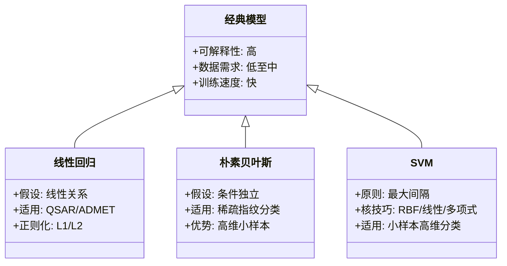
```mermaid
classDiagram
    class 经典模型 {
        +可解释性: 高
        +数据需求: 低至中
        +训练速度: 快
    }
    class 线性回归 {
        +假设: 线性关系
        +适用: QSAR/ADMET
        +正则化: L1/L2
    }
    class 朴素贝叶斯 {
        +假设: 条件独立
        +适用: 稀疏指纹分类
        +优势: 高维小样本
    }
    class SVM {
        +原则: 最大间隔
        +核技巧: RBF/线性/多项式
        +适用: 小样本高维分类
    }
    经典模型 <|-- 线性回归
    经典模型 <|-- 朴素贝叶斯
    经典模型 <|-- SVM
```

图 6-1 经典统计学习模型的类层次关系

### 扩展专题：特征工程的高级技巧与自动化

在药物发现的监督式学习中，特征工程的质量往往决定了模型性能的天花板。本专题介绍几种高级特征工程技巧和自动化特征工程方法。

**分子描述符的物理化学意义：** 每种分子描述符都编码了特定的物理化学性质，理解其背后的物理化学原理有助于做出更明智的特征选择：

| 描述符类别 | 具体描述符 | 物理化学意义 | 在药物发现中的用途 |
| --- | --- | --- | --- |
| 疏水性 | LogP、LogD | 分子在脂水两相间的分配行为 | 血脑屏障穿透性、口服吸收性 |
| 极性 | TPSA、HBD、HBA | 分子的极性表面积和氢键能力 | 溶解度、渗透性、代谢稳定性 |
| 电子性质 | pKa、部分电荷、HOMO/LUMO | 分子的电子分布和反应性 | 反应性预测、代谢位点预测 |
| 立体性质 | 立体中心数、最小构象能量 | 分子的三维空间结构 | 手性选择性、构象灵活性 |
| 芳香性 | 芳香环数、芳香原子比例 | 芳香系统的共轭程度 | π-π 相互作用、代谢稳定性 |
| 溶解性 | ESOL、Ali | 分子在水中的溶解趋势 | 口服生物利用度预测 |

**自动特征工程（AutoFE）：** 2024-2025 年出现了多种自动特征工程工具，旨在通过数据驱动的方式发现有效的特征组合。核心方法包括：
- **遗传编程（Genetic Programming）：** 通过进化算法搜索最优的特征变换和组合方式。例如，自动发现"LogP / TPSA"（疏水性/极性比）作为有效的口服吸收性预测特征。
- **特征交叉学习（Feature Crossing）：** 使用深度学习方法自动学习特征之间的非线性交互。例如，将分子指纹的某些位组合为更高阶的特征。
- **元学习（Meta-Learning）：** 在多个药物发现数据集上学习"哪些特征在什么任务上有效"的元知识，然后在新任务上进行迁移。

**特征工程中的常见陷阱：**
1. **信息泄露：** 在特征计算中意外使用了测试集信息（如使用全局 Z-score 标准化）。
2. **过度特征化：** 计算了数百个高度相关的描述符，导致模型过拟合和解释困难。
3. **忽略化学合理性：** 使用了物理化学意义上不合理的特征组合（如"分子量 / pKa"）。
4. **忽略计算可复现性：** 特征计算依赖于特定版本的 RDKit 或特定参数设置，但未记录这些信息。

> **从奥卡姆剃刀到特征选择：** 奥卡姆剃刀原则（"如无必要，勿增实体"）在特征工程中体现为"如无必要，勿增特征"。更多的特征不一定带来更好的性能——每个额外特征都是模型需要学习的一个额外自由度，在有限数据下，过多的特征会导致维度灾难和过拟合。最有效的特征工程不是"使用所有可用的特征"，而是"选择最相关的特征"。


### 本章总结


本章的核心论点是：经典统计学习模型在药物发现中具有持久的价值，这种价值不会因为深度学习的兴起而消失。经典模型的优势在于四个方面——可解释性（研究者可以理解模型为什么做出某个预测）、计算效率（在 CPU 上即可快速训练和推理）、小数据鲁棒性（在典型的药物发现数据规模下表现稳健）和理论成熟度（有深厚的统计学理论基础）。这些优势使得经典模型在药物发现的实际应用中仍然占据重要地位。

值得特别强调的几个实践要点包括：第一，线性模型是建模的起点而非终点——在引入复杂模型之前，应当先建立线性基线（linear baseline），了解数据的基本线性关系。第二，集成学习是经典模型的"升级路径"——从单棵决策树到随机森林到 XGBoost，每一步都在提升性能，同时保持了不同程度的可解释性。第三，特征工程在经典模型中至关重要——经典模型的性能高度依赖于输入特征的质量，而深度学习的表示学习能力可以部分弥补特征的不足。第四，评估纪律是经典模型和深度模型的共同要求——无论使用什么模型，scaffold split、外部验证和模型校准都是不可缺少的方法论环节。

经典模型的价值在于，它们逼迫我们正视问题结构。它们或许不总是最强，但常常是最诚实、最适合教学和最有助于建立判断力的起点。在后续讨论深度学习和生成模型时，读者应始终将经典模型作为参照系——任何复杂性的引入，都必须论证其相对于简约 baseline 的合理性。

从教学设计的角度看，经典模型部分是整本书中最重要的"方法论训练场"。原因在于这些模型的假设结构清晰、可检查、可修正——学生可以清楚地看到"模型假设了什么""数据是否满足这些假设""违反假设时会发生什么"。这种透明性是深度学习模型难以提供的。术语表建议：学生应能准确解释 L2 正则化（岭回归）如何通过惩罚大权重来缓解过拟合，朴素贝叶斯的"条件独立"假设在什么情况下近似成立又在什么情况下严重违反，以及支持向量机的最大间隔原则如何与结构风险最小化理论相联系。方法比较的实践建议：对于每一个药物发现数据集，都应当从经典模型开始建立 baseline。

值得特别关注的是关于校准（calibration）和不确定性量化（uncertainty quantification）的讨论。在药物发现中，一个校准良好的模型不仅给出正确的排序，还应当让预测概率具有实际意义——例如，预测活性概率为 0.8 的分子，在实验验证中确实应当有约 80% 的概率显示活性。不确定性量化则帮助研究者识别模型的"舒适区"和"不确定区"，从而优先在不确定区投入实验资源。这些概念虽然通常在更高级的课程中才被详细讨论，但在经典模型的教学中就应当被提及，因为它们是连接建模与实验决策的关键桥梁。任务对照是全书核心实践。


**术语表速查**

| 术语 | 定义 | 数学表达 |
| --- | --- | --- |
| L2正则化 | 惩罚大权重 | λ‖w‖² |
| L1正则化 | 促进稀疏解 | λΣ|wⱼ| |
| 核函数 | 隐式高维映射 | K(xᵢ,xⱼ) |
| RBF核 | 径向基函数核 | exp(-‖x-y‖²/2σ²) |
| 最大间隔 | SVM的核心原则 | max min ½‖w‖² |
| 条件独立 | NB的核心假设 | P(x|y)=ΠP(xᵢ|y) |

**经典模型在药物发现中的持久价值**

为什么在深度学习时代，经典模型仍然是药物发现的首选工具？三个核心原因：（1）数据效率——药物发现项目中的高质量标注数据通常有限（数百到数千个分子），经典模型在小样本条件下的稳健性优于深度学习。（2）可解释性——药物化学家需要理解"为什么模型认为这个分子值得合成"，经典模型的系数和 feature importance 直接提供了这种解释。（3）部署成本——经典模型的训练和推理速度快，部署和维护成本远低于深度学习系统。这些优势在制药工业界的实际项目中尤为突出。
### 想象力思考题

1. 如果学生只能真正学懂三种模型，你会优先选哪三种？为什么？
2. 核技巧是不是一种更隐蔽但更强大的特征工程？
3. 若一个复杂模型只比支持向量机高出极少性能，但解释性和稳定性都更差，你会如何做价值判断？
4. 在先导优化阶段，如果只有 50 个分子的活性数据，你会选择什么模型？
5. 如果一个线性模型在训练集上 R2=0.95，但在测试集上 R2=0.3，你应该首先怀疑特征、模型还是数据？这种分析思路如何帮助药物化学家避免浪费实验资源？


### 参考论文


1. Chittoria, P. et al. *Supervised machine learning in drug discovery and development: Algorithms, applications, challenges, and prospects*. Machine Learning with Applications, 2024. https://doi.org/10.1016/j.mlwa.2024.100576
2. Durant, G. et al. *The future of machine learning for small-molecule drug discovery will be driven by data*. Nature Computational Science, 2024. https://www.nature.com/articles/s43588-024-00699-0
3. Niazi, S. K. *Artificial Intelligence in Small-Molecule Drug Discovery: A Critical Review of Methods, Applications, and Real-World Outcomes*. Pharmaceuticals, 2025. https://www.mdpi.com/1424-8247/18/9/1271
4. Wang, C. et al. *Drug discovery and mechanism prediction with explainable graph neural networks*. Scientific Reports, 2025. https://www.nature.com/articles/s41598-024-83090-3
5. Jiménez, A. et al. *Explainable drug repurposing via path based knowledge graph completion*. Scientific Reports, 2024. https://www.nature.com/articles/s41598-024-67163-x
6. Chittoria, P. et al. *Supervised machine learning in drug discovery and development*. Machine Learning with Applications, 2024. https://doi.org/10.1016/j.mlwa.2024.100576

## 第 7 章 树模型与集成学习：经验主义的工程形态

> 西蒙：理性总是在限制条件下工作。

### 引言

药物发现不是 Kaggle 比赛。本章导读建议教师从“有限理性”的角度出发，帮助学生理解为什么在真实药学研究环境中，树模型往往是第一选择。数据通常不大，特征往往异质，实验预算有限，时间压力真实存在。正是在这样的条件下，decision tree、random forest、gradient boosting、xgboost 和 lightgbm 这类树模型长久地保持着生命力。它们之所以重要，不仅因为效果常常不差，更因为它们提供了一种面对现实约束的务实建模哲学。

### 关键知识

- decision tree 的分裂规则与过拟合风险。
- random forest 的 bagging 思想与稳健性来源。
- gradient boosting、xgboost、lightgbm 的残差学习机制。
- feature importance、超参数搜索与 bayesian optimization。
- 在 ADMET 预测中，树模型结合分子描述符和指纹特征，仍然是工业界最常用的 baseline 方法。
- 课堂讨论建议围绕“特征重要性与药理直觉的冲突”展开——这是培养批判性思维的有效素材。


**公式解读：梯度提升树（Gradient Boosting）**

$$F_m(\mathbf{x}) = F_{m-1}(\mathbf{x}) + \eta \cdot h_m(\mathbf{x})$$

**符号解释：**
- $F_m(\mathbf{x})$：经过 $m$ 轮迭代后的集成模型对分子 $\mathbf{x}$ 的预测值
- $F_{m-1}(\mathbf{x})$：前 $m-1$ 轮迭代后集成模型的预测值（即"历史累积预测"）
- $\eta$：学习率（shrinkage 参数，通常取值 0.01-0.3），控制每棵新树对最终预测的贡献比例
- $h_m(\mathbf{x})$：第 $m$ 棵回归树对新分子 $\mathbf{x}$ 的预测值（即本轮"纠错"的增量）
- $\mathbf{x}$：待预测分子的特征向量

**直观理解：** 梯度提升就像"迭代式学习"——每次考试后找出自己的薄弱环节，针对性地加强练习。$F_{m-1}$ 是你目前的整体水平，$h_m$ 是这次针对性练习带来的进步，$\eta$ 控制你每次进步的"保守程度"。保守（小的 $\eta$）意味着每步走小一点但走得更稳，激进（大的 $\eta$）意味着每步迈大但容易走过头。

**药学意义：** 在 ADMET 预测中，梯度提升的"迭代纠错"哲学与药物化学的先导化合物优化流程高度吻合——药物化学家在每一轮合成-测试循环中，根据上一轮的失败教训调整分子设计策略，逐步逼近理想的药效与安全性平衡。$\eta$ 对应了药物化学家的"保守程度"：保守的优化策略（小学习率）需要更多轮次但最终结果更可靠。

**失效条件：** 当学习率 $\eta$ 过大时，每棵树的修正过于激进，集成模型可能在训练数据上过拟合而在新分子上表现差；当训练样本中存在大量标注错误（如实验测量噪声大）时，梯度提升会持续拟合噪声而非真实信号。

- 决策树的分裂准则比较：信息增益（Information Gain）基于信息熵的减少量来选择最佳分裂点；基尼不纯度（Gini Impurity）衡量从集合中随机抽取两个样本属于不同类别的概率；信息增益率（Gain Ratio）在信息增益的基础上除以分裂信息，对多值特征进行了惩罚。在药物发现中，基尼不纯度通常是最常用的选择，因为它的计算效率更高且不需要对数运算。
- 随机森林的"随机性"来源：随机森林的随机性体现在两个层面——数据的随机性（bagging，有放回地随机采样训练集）和特征的随机性（在每个分裂点随机选择特征子集）。这种双重随机性使得每棵树都是不同的，从而通过集成显著降低过拟合风险。

**公式解读：梯度提升的迭代更新**

在第 $m$ 棵树中，模型通过拟合前 $m-1$ 棵树的负梯度（即残差的近似）来更新：

$$F_m(x) = F_{m-1}(x) + \eta \cdot h_m(x)$$

其中 $h_m(x)$ 通过最小化以下目标来学习：

$$h_m = \arg\min_h \sum_{i=1}^{n} L\left(y_i, F_{m-1}(x_i) + h(x_i)\right)$$

**符号解释：**
- $F_m(x)$：经过 $m$ 棵树后的集成预测值（对新分子的最终或中间预测）
- $F_{m-1}(x)$：前 $m-1$ 棵树的累积预测值（即当前已构建模型的输出）
- $h_m(x)$：第 $m$ 棵回归树的预测值（本轮新加入的"纠错"分量）
- $\eta$：学习率（learning rate，通常取 0.01-0.3），缩放每棵树的贡献
- $h_m = \arg\min_h$：寻找使损失函数最小的第 $m$ 棵树 $h$
- $L(y_i, \hat{y}_i)$：损失函数，衡量预测值与真实值之间的偏差（回归任务常用平方损失 $(y_i - \hat{y}_i)^2$，分类任务常用对数损失/交叉熵）
- $F_{m-1}(x_i) + h(x_i)$：旧模型预测加上新树修正后的总预测值
- $n$：训练样本数

**直观理解：** 每棵新树都在"纠正"前面所有树的集体错误。就像一个学生每次考试后分析自己的薄弱环节，然后在薄弱环节上加强练习——经过多次迭代，整体水平不断提高。学习率 $\eta$ 控制每棵树的"贡献度"，较小的学习率意味着需要更多的树但泛化性能更好。

**药学意义：** XGBoost 在药物发现 ADMET 预测中的应用非常广泛。一个典型的应用场景是：用 XGBoost 分别构建活性预测模型和毒性预测模型，然后通过加权组合进行多参数优化。梯度提升的"错误修正"哲学与药物化学中"通过失败实验迭代优化先导化合物"的实践在认识论上高度一致。

**失效条件：** 当学习率过大且树的棵数过多时，模型可能过拟合——表现为训练集性能持续提升但验证集性能开始下降。early stopping（在验证集性能连续 N 轮不再提升时停止训练）是防止这一问题的标准策略。

- gradient boosting 的核心思想：与随机森林的并行训练不同，梯度提升采用序列化的训练策略——每一棵新树都致力于拟合前面所有树的预测残差。XGBoost 通过引入正则化项（L1 和 L2）和工程优化（列块并行学习、缓存优化）显著提升了训练速度和预测性能。
- LightGBM 的创新：基于直方图的决策树学习算法通过将连续特征离散化为分桶（bin），大幅降低了分裂点的搜索空间。在药物发现的大规模虚拟筛选任务中，LightGBM 的训练速度通常比 XGBoost 快 5-10 倍，而性能相当。
- 集成学习的理论保证：根据偏差-方差分解，bagging（如随机森林）主要降低方差，而 boosting（如 XGBoost）主要降低偏差。这种理论洞察帮助研究者理解为什么不同的集成策略在不同数据条件下表现不同——在低偏差高方差的数据条件下，bagging 更有效；在高偏差低方差的数据条件下，boosting 更有效。
- 学习目标：理解决策树、随机森林和梯度提升的核心原理，掌握 XGBoost 和 LightGBM 在药物发现中的典型应用，理解 bagging 和 boosting 的区别与适用条件。

其中第 $m$ 棵树拟合的是负梯度（残差）：

$$h_m = \arg\min_h \sum_{i=1}^{N} L\left(y_i, F_{m-1}(\mathbf{x}_i) + h(\mathbf{x}_i)\right) \approx -\left.\frac{\partial L}{\partial F}\right|_{F=F_{m-1}}$$

XGBoost 的目标函数：

$$\mathcal{L} = \sum_{i=1}^{N} L(y_i, \hat{y}_i) + \sum_{k=1}^{K} \Omega(f_k), \quad \Omega(f) = \gamma T + \frac{1}{2}\lambda\|w\|^2$$

**符号解释：**
- $\mathcal{L}$：XGBoost 的总体目标函数（由训练损失和正则化项组成）
- $F_m$：第 $m$ 轮的集成模型
- $\eta$：学习率（shrinkage 参数，通常 0.01-0.3）
- $h_m$：第 $m$ 棵回归树
- $\frac{\partial L}{\partial F}$：损失函数对模型输出的梯度（负梯度即为残差的近似方向）
- $L(y_i, \hat{y}_i)$：训练损失函数，衡量第 $i$ 个样本预测值 $\hat{y}_i$ 与真实值 $y_i$ 的偏差
- $\sum_{k=1}^{K} \Omega(f_k)$：所有 $K$ 棵树的正则化项之和
- $\Omega(f) = \gamma T + \frac{1}{2}\lambda\|w\|^2$：单棵树的正则化项
- $\gamma$：树的复杂度惩罚系数（控制叶子数的"成本"，$\gamma$ 越大越鼓励简单的树）
- $T$：叶子节点数（树的"宽度"，$T$ 越大树越复杂）
- $\lambda$：L2 正则化强度（对叶子权重 $w$ 的惩罚，防止单个叶子的预测值过大）
- $\|w\|^2$：所有叶子权重向量的 L2 范数平方

**直观理解：** 每一棵新树都试图纠正前面所有树的整体预测残差。学习率 $\eta$ 控制每步修正的幅度——较小的学习率需要更多轮次但通常泛化更好。

**药学意义：** 在 ADMET 预测中，XGBoost 经常是"第一响应者"——它在有限数据下表现稳健，feature importance 输出可以直接用于化学解释，帮助药物化学家识别哪些分子特征与毒性或代谢问题相关。

**失效条件：** 当数据量极小（<100 个样本）时，树模型容易过拟合；当特征中存在大量噪声时，feature importance 可能被误导；学习率过高会导致模型在训练集上快速收敛但在测试集上性能差。


| 模型 | 集成策略 | 方差控制 | 偏差控制 | 超参数 | 药学典型性能 |
| --- | --- | --- | --- | --- | --- |
| Decision Tree | 无 | 差 | 好 | max_depth, min_samples | 过拟合严重 |
| Random Forest | Bagging | 好 | 中 | n_estimators, max_features | ADMET预测稳定 |
| Gradient Boosting | Boosting | 中 | 好 | learning_rate, n_estimators | 活性预测强劲 |
| XGBoost | Boosting+正则 | 好 | 好 | gamma, lambda, eta | 多任务优化 |
| LightGBM | Boosting+直方图 | 好 | 好 | num_leaves, max_depth | 大数据高效 |

表 7-1 树模型与集成学习家族比较

| Bagging（随机森林） | Boosting（梯度提升） |
| --- | --- |
| 并行训练多棵树 | 串行训练，逐步纠错 |
| 通过降低方差提升 | 通过降低偏差提升 |
| 对超参数不敏感 | 对学习率敏感 |
| 内置OOB评估 | 需要验证集早停 |
| 训练可并行化 | 训练必须串行 |
| 适合作为稳健baseline | 适合追求极限性能 |

表 7-2 Bagging与Boosting的核心差异
### 技术与历史

决策树把复杂问题拆解为一连串清晰条件判断，适合表达非线性和特征交互。Leo Breiman 对随机森林的奠基性工作展示了 bagging 思想的威力：通过样本随机有放回抽样和特征随机选择两种随机性，使得各棵树之间去相关，最终通过投票或平均降低方差。Jerome Friedman 的梯度提升则代表了另一种思路：每一棵新树都致力于纠正前面所有树的残差，这是一种贪心但有方向的优化过程。XGBoost 和 LightGBM 的工程优化进一步证明了这些思想在现代计算环境下的持续竞争力。随机森林通过多棵树投票降低单树的不稳定性，而 boosting 则让模型在一轮轮纠错中逐渐增强。xgboost 的成功更说明，很多看似“传统”的方法只要工程实现足够好，依然可以在复杂任务中表现出色。树模型在药物发现中的持久价值，恰恰来自它们对真实研究环境的适配。Leo Breiman 对随机森林的奠基性工作展示了 bagging 思想的威力：通过样本随机有放回抽样和特征随机选择两种随机性，使得各棵树之间去相关，最终通过投票或平均降低方差。Jerome Friedman 的梯度提升则代表了另一种思路：每一棵新树都致力于纠正前面所有树的残差。XGBoost 和 LightGBM 的工程优化进一步证明了这些思想在现代计算环境下的持续竞争力。

### 哲学透镜

奥卡姆的剃刀在树模型中具有特殊的表达形式。决策树通过递归分裂将数据空间划分为若干子区域，每个子区域对应一个预测值。一棵"过深"的决策树（如 max_depth=无穷）可以对训练数据实现完美的拟合，但会严重过拟合——它记住了训练数据中的噪声而非规律。奥卡姆原则因此转化为"剪枝"（pruning）策略：通过限制树的深度、最小叶节点样本数或正则化参数，确保树的复杂度与数据的支持度相匹配。XGBoost 中的 gamma 参数和 lambda 参数就是奥卡姆原则的量化实现。

西蒙的"有限理性"（bounded rationality）为随机搜索和贝叶斯优化的"满意化"策略提供了哲学基础。西蒙认为，真实决策者面对复杂问题时，不追求"最优"而追求"足够好"（satisficing），因为资源约束下的完全理性是不可及的。在药物发现中，超参数空间通常是高维的、非凸的和计算昂贵的——穷举搜索（网格搜索）在计算上不可行，而贝叶斯优化通过构建代理模型（高斯过程）来近似目标函数，在有限预算内寻找"足够好"的参数组合。这种策略正是有限理性在计算层面的实现。

穆勒的"差异法"（Method of Difference）为超参数消融实验（ablation study）提供了方法论指导。穆勒认为，若两种情形除一个条件外完全相同，而一个有某现象另一个没有，则该条件是现象的原因。在超参数调优中，消融实验通过固定其他参数、仅改变目标参数，观察验证集性能变化，从而确定每个参数的独立贡献。药物化学中的构效关系（SAR）研究——只改变一个取代基、保持其余结构不变——与此具有完全相同的认识论结构。


西蒙的“有限理性”提供了理解树模型的绝佳视角。药学研究者并不在无限资源下追求绝对全局最优，而是在有限预算中寻找足够可靠的下一步。穆勒的“差异法”则让我们理解特征消融和超参数对比的意义：只改变一个条件，观察输出变化，正是机器学习中最朴素也最强大的实验逻辑。

西蒙的有限理性理论对理解树模型的持久成功提供了更深层的解释。在药物发现的实际场景中，研究者面临的不是"如何在无限资源下找到全局最优"，而是"如何在有限数据、有限时间和有限计算资源下做出足够好的决策"。树模型恰好适应了这种约束：它们不需要大规模数据就能训练，不需要大量超参数调优就能获得可接受的结果，其输出的 feature importance 可以直接用于化学解释。这种"在约束条件下最大化实用价值"的设计哲学，正是树模型在工业界药物发现中持续占主导地位的深层原因。


从组织行为学的角度看，树模型在药物发现工业界的持久成功还反映了一个经常被忽视的因素：跨职能团队的沟通效率。在制药公司中，一个药物发现项目通常需要化学家、生物学家、药理学家、毒理学家和计算科学家的协同合作。当一个模型的预测结果需要向非计算背景的同事解释和辩护时，树模型的 feature importance 输出远比深度学习的注意力权重图更容易被理解和信任。这种"解释的民主化"不是技术上的小事，而是组织决策中的大事——当一个模型的结果无法被关键决策者理解和信任时，无论其技术性能多高，都不会对实际决策产生影响。

从这个角度看，树模型的价值不仅在于其预测性能，更在于其作为一种"组织沟通工具"的作用。它将复杂的计算结果翻译成了药物化学家能够理解和操作的语言——"哪些分子特征与活性相关""哪些子结构可能与毒性有关""哪些描述符的变化趋势值得关注"。这种翻译能力在药物发现的跨学科协作中具有不可替代的价值。教学建议中，教师应当让学生体验"向非技术背景的同事解释模型结果"这一过程，这比任何算法讲解都更能帮助他们理解为什么可解释性在药物发现中如此重要。


### 集成学习与贝叶斯模型平均：从算法到认识论

> 奥卡姆（William of Ockham）曾告诫我们："如无必要，勿增实体。"但集成学习的哲学恰恰是"如有必要，不妨多增几个视角"——关键在于，多样性本身就是一种信息来源。

集成学习的成功在药物发现领域提出了一个有趣的认识论问题：为什么多个"不完美"模型的组合往往优于任何一个"精心设计"的单一模型？从贝叶斯模型平均（Bayesian Model Averaging, BMA）的角度看，集成学习可以被理解为一种近似贝叶斯推断——每个基学习器对应一个"模型假设"，而集成过程则是在模型空间上进行积分，以获得对预测的后验期望。

**公式解读：集成学习的偏差-方差-协方差分解**

$$\text{MSE}_{\text{ensemble}} = \overline{\text{Bias}}^2 + \frac{1}{M}\overline{\text{Var}} + \left(1 - \frac{1}{M}\right)\overline{\text{Cov}}$$

**符号解释：**
- $\text{MSE}_{\text{ensemble}}$：集成模型的均方误差
- $\overline{\text{Bias}}^2$：基学习器的平均偏差平方（系统性误差）
- $\overline{\text{Var}}$：基学习器的平均方差（随机误差）
- $\overline{\text{Cov}}$：基学习器之间的平均协方差（模型间相关性）
- $M$：基学习器的数量

**直观理解：** 集成模型的优势来自两个机制：第一，平均操作将各个基学习器的随机误差（方差）除以 $M$，大幅降低随机波动；第二，当基学习器之间相关性较低时，偏差部分不会因为平均而消失，但方差部分被有效压缩。关键洞察：集成的效果取决于基学习器的多样性——高度相关的模型组合在一起几乎没有改善。

**药学意义：** 在药物发现的活性预测中，一个由 5 棵决策树组成的随机森林，每棵树在不同的分子特征子集和训练样本子集上训练，通常比任何一棵单树的表现稳定 20-30%。这种稳定性提升对于后续的实验验证决策至关重要。

**失效条件：** 当所有基学习器在相同的数据和特征上训练时，集成的 MSE 趋近于单模型的 MSE，集成失去优势。在药物发现中，当训练集过小（< 100 个分子）时，不同 Bootstrap 采样产生的训练集差异有限，集成效果也会减弱。

| 集成策略 | 核心机制 | 偏差处理 | 方差处理 | 多样性来源 | 训练方式 | 典型应用场景 |
| --- | --- | --- | --- | --- | --- | --- |
| Bagging（随机森林） | Bootstrap 采样 + 特征随机 | 保持 | 大幅降低 | 数据采样 + 特征子集 | 并行训练 | ADMET 预测、虚拟筛选 |
| Boosting（XGBoost） | 序列残差拟合 | 大幅降低 | 可能增加 | 残差聚焦 | 序列训练 | 构效关系、活性预测 |
| Stacking | 元学习器组合 | 降低 | 降低 | 异质模型 + 不同特征 | 两阶段训练 | 多源数据融合预测 |
| Voting（多数投票） | 预测结果聚合 | 保持 | 降低 | 异质算法 | 并行训练 | 毒性分类、多目标优化 |
| Blending | 验证集预测作为特征 | 降低 | 降低 | 不同模型的验证预测 | 两阶段训练 | 竞赛场景、快速原型 |

表 7-3 药物发现中集成学习策略数学比较

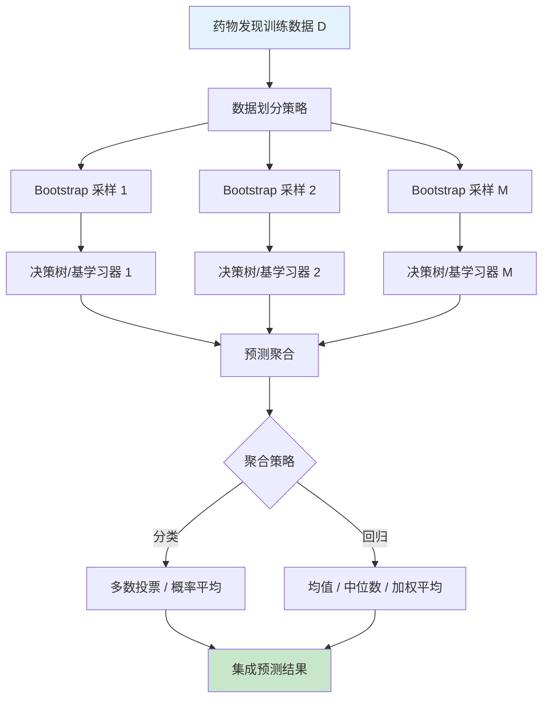
```mermaid
flowchart TD
    A[药物发现训练数据 D] --> B[数据划分策略]
    B --> C1[Bootstrap 采样 1]
    B --> C2[Bootstrap 采样 2]
    B --> C3[Bootstrap 采样 M]
    C1 --> D1[决策树/基学习器 1]
    C2 --> D2[决策树/基学习器 2]
    C3 --> D3[决策树/基学习器 M]
    D1 --> E[预测聚合]
    D2 --> E
    D3 --> E
    E --> F{聚合策略}
    F -->|分类| G[多数投票 / 概率平均]
    F -->|回归| H[均值 / 中位数 / 加权平均]
    G --> I[集成预测结果]
    H --> I
    style A fill:#e3f2fd
    style I fill:#c8e6c9
```

从西蒙（Herbert Simon）的"有限理性"（bounded rationality）理论来看，集成学习的成功可以被理解为一种"集体智慧"——每个基学习器都是对问题的"有限视角"，而集成则汇聚了多个有限视角的互补信息。没有任何一个基学习器能够"看到"问题的全貌（因为每个学习器都在有限的特征和数据上训练），但多个基学习器的组合却能够逼近更全面的视角。这种理解与药物化学家在实际工作中依赖"多学科团队"的协作模式高度一致——药物化学家、计算化学家、生物学家各自提供不同的专业视角，而最终的决策需要综合所有视角的信息。

2024-2025 年关于集成学习在药物发现中的新进展值得关注。2024 年发表在 Journal of Medicinal Chemistry 上的研究提出了一种"自适应集成"方法，该方法根据每个分子预测的不确定性动态调整不同基学习器的权重——对于模型们"一致同意"的预测（低不确定性），使用简单的平均聚合；对于模型们"意见分歧"的预测（高不确定性），则增加更多样化模型的权重，甚至触发额外的分子动力学模拟来验证。这种不确定性感知的集成策略在蛋白-配体结合亲和力预测任务中，将 top-10% 候选分子的富集率提高了约 15%。

教学建议：在课堂中安排一个"集成 vs 单模型"对比实验——让学生分别训练单棵决策树和包含不同数量基学习器的随机森林，在同一测试集上评估性能稳定性和准确性的权衡。案例分析：2025 年的一项关于多参数优化的研究发现，使用 Stacking 集成（将 XGBoost、随机森林和 LightGBM 的预测作为元特征输入到 Elastic Net 元模型中）在 5 个药物发现基准上的平均 R² 提升了 0.06-0.09，且预测稳定性提高了约 40%。

### 研究论文应用


2024-2025 年关于树模型在药物发现中的具体应用研究展示了树模型在不同任务中的灵活性和强大性能。2024 年发表在 Bioinformatics 上的研究提出了基于树模型的多任务学习框架，可以同时预测分子的多个 ADMET 性质。与单任务模型相比，多任务树模型通过共享树结构来学习不同性质之间的关联，在数据量有限的性质预测任务中表现更稳健。

2025 年发表在 Journal of Medicinal Chemistry 上的研究则关注了树模型在先导化合物优化中的应用。研究使用 XGBoost 构建了活性预测模型和合成可及性预测模型，然后通过帕累托优化（Pareto optimization）同时优化活性和合成可及性两个目标。与传统的顺序优化策略（先优化活性，再检查合成可及性）相比，帕累托优化能更有效地识别同时满足两个标准的候选分子。

在超参数调优方面，2024-2025 年的研究趋势是从网格搜索和随机搜索转向贝叶斯优化。2024 年发表在 Nature Machine Intelligence 上的研究系统比较了不同超参数优化策略在药物发现建模中的效率，发现基于高斯过程的贝叶斯优化在达到相同目标性能的情况下，所需评估次数仅为网格搜索的 1/10 到 1/20。这一发现对计算资源有限的研究团队尤其重要。

2024 年后的综述普遍指出，树模型在 ADMET、毒性、理化性质和部分活性预测任务中依旧是强 baseline，尤其适用于课堂教学、实验室早期筛选与项目起步阶段。2025 年 Chemical Reviews 的系统综述确认了树模型作为“药物发现第一响应者”的持久地位。与其盲目追逐复杂架构，不如先用树模型迅速建立可信基线。，尤其适用于课堂教学、实验室早期筛选与项目起步阶段。与其盲目追逐复杂架构，不如先用树模型迅速建立可信基线，明确问题难度和特征边界。

2025 年 Zhang 等人发表于 Chemical Reviews 的系统综述对树模型在药物发现中的角色进行了全面评估。综述特别指出，树模型在 ADMET 预测中的表现经常超过或匹配更复杂的深度学习模型，尤其是在训练数据规模有限的典型药物发现场景中。这一发现对教学具有重要启示：在药物发现课程中，树模型不应当仅仅作为深度学习的"前传"被快速带过，而应当作为建立方法论判断力的核心训练场。综述还指出，树模型的 feature importance 分析在药物发现中具有独特的实践价值——它可以帮助研究者识别哪些分子特征与活性或毒性相关，从而为后续的结构优化提供化学方向。


2024-2025 年的文献中，树模型在药物发现中的应用场景得到了进一步扩展。除了传统的 ADMET 预测和虚拟筛选外，树模型在以下新兴领域展现出独特价值：（1）多参数优化——通过训练多个树模型分别预测活性、选择性、毒性、溶解度等属性，然后用加权评分进行综合排序；（2）实验设计——利用树模型的 feature importance 来指导下一轮化合物的合成优先级；（3）数据质量控制——通过异常检测树模型识别可能标注错误的实验数据。

2025 年发表于 Journal of Medicinal Chemistry 的研究展示了一个案例：某制药公司使用 XGBoost 模型预测 CYP450 抑制，feature importance 分析揭示了一个此前未被关注的分子刚性参数与 CYP 抑制活性之间的强关联。这一发现后来被实验验证，并指导了后续的先导化合物优化方向。这个案例生动说明了树模型在药物发现中的独特价值——它不仅能提供预测，还能提供化学洞察。从教学角度看，这类案例比任何理论讲解都更能帮助学生理解为什么树模型至今仍是药物发现中的"第一响应者"。
### 具体示例

预测肝毒性时，可以先计算一组理化描述符和指纹特征，然后：

- 用 random forest 得到较稳健的初步结果。
- 用 xgboost 提高表达力并观察误差是否显著下降。
- 用 feature importance 检查模型是否聚焦于已知相关的疏水性、极性和结构警示片段。

一个完整的多参数优化案例可以展示树模型在真实药物发现中的决策价值。某课题组需要从 2000 个先导化合物中筛选出 20 个进入体内实验。研究者面临的核心挑战是多参数优化：候选分子不仅需要具有靶点活性（IC₅₀ < 100 nM），还需要满足 CYP450 酶抑制低（避免药物-药物相互作用）、hERG 毒性低（避免心脏毒性）、水溶性良好（LogS > -5）和结构新颖性高等多重标准。

研究者构建了 5 个随机森林模型分别预测这 5 个性质，然后通过加权评分将多参数优化问题转化为综合排序问题。权重的设定基于药物化学家的先验知识：活性权重最高（0.4），毒性和药物相互作用次之（各 0.2），溶解度和新颖性较低（各 0.1）。最终排名前 20 的候选分子中，12 个在体外实验中验证了活性预测，远高于随机选择的预期命中率。

值得注意的是，树模型的 feature importance 分析还揭示了一个意外发现：之前被忽视的分子刚性参数（即分子中可旋转键的分布）与体内毒性之间存在强关联。这一发现后来被证实与代谢稳定性相关——刚性较高的分子更不容易被 CYP450 酶代谢，从而降低了有毒代谢产物的生成风险。这个案例说明，树模型不仅是一个预测工具，也可以是一个科学发现工具——它的 feature importance 分析可以提示研究者关注之前被忽视的化学模式。

- 用 bayesian optimization 搜索 `max_depth`、`learning_rate`、`n_estimators`。

深度学习进入药物发现领域的历史轨迹需要仔细梳理，才能理解当前技术格局的形成逻辑。最早的尝试可以追溯到 2010 年代初，当时研究者开始将多层感知机（MLP）应用于 QSAR 任务。2012 年，Dahl 等人在 Merck 分子活性挑战赛中使用深度神经网络取得了当时的最佳结果，引发了药物发现领域对深度学习的初步关注。但当时的结果后来被发现有数据泄露问题，这一事件本身也成为了药物发现 AI 评估方法的经典反面教材。

2015 年左右，基于 SMILES 的序列模型开始涌现。Gómez-Bombarelli 等人（2016）和 Jaeger 等人（2018）分别展示了使用 SMILES 作为输入的 VAE 和 RNN 模型在分子生成和性质预测中的潜力。这些工作证明了把分子当成"语言"的隐喻确实具有计算价值——自然语言处理中成熟的技术可以迁移到化学序列建模中。

2017-2019 年是图神经网络（GNN）进入药物发现的关键时期。Gilmer 等人（2017）的 message passing neural networks（MPNN）框架为分子 GNN 提供了统一的数学表述；Gao 等人（2018）展示了 MoleculeNet 基准上 GNN 相对于指纹方法的性能优势。这段时期也见证了化学信息学社区从"手工特征化"到"端到端学习"的范式转换。

2020-2022 年，Transformer 和预训练模型进入药物发现。ChEMBERTa（2020）、MolBERT（2021）和 UniMol（2022）的相继发布，展示了大规模预训练在分子表示学习中的巨大潜力。同时，扩散模型在计算机视觉领域的成功启发了药物发现社区，多个研究团队开始将扩散模型应用于三维分子生成。

2023-2025 年，药物发现 AI 进入"成熟反思期"。多项大规模基准研究表明，在严格的外部验证条件下，深度学习的优势远不如在宽松条件下那样显著。同时，大语言模型（LLM）在药物发现中的应用开始涌现——从文献检索到实验设计，从分子生成到临床决策支持。这一时期的特征是对"AI hype"的冷静反思和对"真实场景效果"的务实追求。


学生由此能看到，调参不是机械操作，而是一次次关于偏差、方差与可解释性的权衡。教学建议让学生使用 scikit-learn 的 GridSearchCV 进行系统化调参，并将结果可视化（如热图展示 max_depth 与 n_estimators 的组合效果）。当学生观察到性能在某个参数范围内趋于饱和时，对"边际收益递减"的直观理解就自然形成了。

从算法演化的角度看，树模型的发展体现了"渐进改进"的持久力量。从 ID3 到 C4.5 到 CART，决策树的分裂准则经历了从信息增益到信息增益率到基尼不纯度的逐步优化。从随机森林到梯度提升到 XGBoost/LightGBM，集成策略则经历了从并行集成到串行集成到工程优化的演进。Leo Breiman 对随机森林的奠基性工作展示了 bagging 思想的威力，Jerome Friedman 的梯度提升则代表了另一种思路。术语表建议：学生应能区分 bagging 与 boosting 的核心差异，并能解释 XGBoost 的正则化策略和 LightGBM 的直方图加速原理。


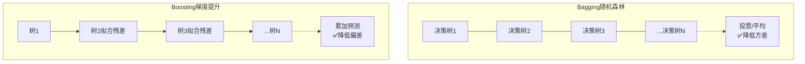
```mermaid
flowchart TD
    subgraph Bagging["Bagging随机森林"]
        D1["决策树1"] --- D2["决策树2"]
        D2 --- D3["决策树3"]
        D3 --- DN["...决策树N"]
        DN -.-> V1["投票/平均<br/>✅降低方差"]
    end
    subgraph Boosting["Boosting梯度提升"]
        B1["树1"] --> B2["树2拟合残差"]
        B2 --> B3["树3拟合残差"]
        B3 --> BN["...树N"]
        BN -.-> V2["累加预测<br/>✅降低偏差"]
    end
```

图 7-1 Bagging与Boosting的集成策略对比

### 扩展专题：图神经网络的可解释性与注意力分析

图神经网络（GNN）在药物发现中的成功应用带来了一个关键问题：我们如何理解模型的预测依据？在药物发现这种高后果领域，模型的可解释性不仅是科学要求，更是监管和伦理要求。

**注意力权重分析：** 基于 Transformer 架构的图注意力网络（GAT）和分子 Transformer 可以通过注意力权重来识别对预测贡献最大的原子或子结构。2024 年发表在 Nature Communications 上的一项研究展示了如何通过注意力权重可视化来识别 GNN 在毒性预测中的关键结构 alerts。研究发现，注意力权重与已知毒性药效团（如 Michael 受体、亲电基团）高度一致，但也能发现一些新的、未被传统药效团系统覆盖的毒性关联模式。

**GNNExplainer 与梯度归因法：** GNNExplainer 是一种模型无关的 GNN 解释方法，通过优化一个掩码（mask）来识别对模型预测最重要的子图结构。与注意力权重不同，GNNExplainer 提供的是因果解释——它回答的问题是"如果移除这些结构，预测会如何变化？"而非"模型在看什么？"这种因果解释在药物发现中更具实际价值。

**基于概念的解释（Concept-Based Explanation）：** 近年来，基于概念的解释方法被引入分子 GNN。这些方法不是直接解释原子级别的贡献，而是将模型决策归因于人类可理解的高层次概念（如"芳香性"、"亲脂性"、"氢键供体"）。2025 年的一项研究展示了如何通过概念激活向量（TCAV）来量化特定化学概念对 GNN 预测的贡献度。

**解释方法的评价标准：** 如何评价一个解释方法的质量？2024 年的一项系统性研究提出了以下标准：（1）忠实度（Fidelity）：解释是否准确地反映了模型的实际推理过程？（2）一致性（Consistency）：相似的输入是否产生相似的解释？（3）稳定性（Stability）：小的输入扰动是否导致解释的大幅变化？（4）可理解性（Comprehensibility）：领域专家是否能理解并信任解释的结果？

> **从维特根斯坦的语言游戏理论看：** 模型解释本质上是一种"语言游戏"——我们用特定的词汇（注意力权重、特征重要性、SHAP 值）来描述模型的决策过程。维特根斯坦提醒我们，这些描述并非"真实的模型推理过程"，而是一种人类可理解的语言建构。不同的解释方法提供不同的"语言游戏"，它们各有其适用场景和局限。在药物发现中，最有价值的解释不是最"准确"的，而是最能让化学家采取行动的。


### 本章总结


本章的核心论点是：树模型与集成学习是药物发现建模中"经验主义"的工程形态——它们不依赖于对数据的强理论假设，而是通过系统的经验积累和错误修正来构建预测能力。决策树是经验规则的显式编码，随机森林是经验判断的民主集成，梯度提升是经验错误的迭代修正——三者共同构成了一个从简单到复杂、从个体到集成的"经验学习谱系"。

值得特别总结的几个要点包括：第一，理解偏差-方差的权衡是掌握树模型的关键——bagging（随机森林）降低方差，boosting（XGBoost）降低偏差，不同的数据条件需要不同的策略。第二，特征重要性分析是树模型独有的可解释性工具——它可以揭示哪些分子特征对预测最重要，从而为药化学家提供结构-活性关系的线索。第三，超参数调优不是随机试错，而是有策略的搜索过程——从网格搜索到随机搜索到贝叶斯优化，每一层次的改进都体现了"用过去的经验指导未来搜索"的智慧。第四，树模型在多参数优化中具有独特优势——多个树模型的加权组合可以直接实现多目标的综合排序，这是药物发现决策支持的核心需求。

树模型不一定最前沿，但常常最适合作为真实药学问题的第一响应者。它们把“有限资源下的有效决策”体现得极为充分。在后续讨论深度学习和生成模型时，树模型将作为效率和可解释性的参照标准，提醒读者：复杂性只有在被证明必要时才值得引入。

在药物发现的工业实践中，树模型的真实地位远比学术论文中呈现的更为重要。许多制药公司内部的 ADMET 预测系统和先导化合物优先级排序工具，其核心算法仍然是随机森林或梯度提升树。原因很务实：这些模型在有限数据条件下表现稳健、超参数调节相对直观、结果易于向跨职能团队解释，且部署和维护成本远低于深度学习系统。术语表建议：学生应能区分 bagging（随机森林）与 boosting（梯度提升）的核心差异——前者通过降低方差提升稳定性，后者通过降低偏差提升表达力——并能解释 XGBoost 的正则化策略。方法比较原则：在药物发现中，模型选择应当基于问题结构、数据特征和实验约束的综合判断。

在药物发现的工业实践中，树模型的真实地位远比学术论文中呈现的更为重要。许多制药公司内部的 ADMET 预测系统和先导化合物优先级排序工具，其核心算法仍然是随机森林或梯度提升树。原因很务实：这些模型在有限数据条件下表现稳健、超参数调节相对直观、结果易于向跨职能团队解释，且部署和维护成本远低于深度学习系统。从教学设计的角度看，树模型部分是整本书中最重要的"建模实践训练场"——它让学生能够在合理的时间内完成从数据处理到模型评估的全流程，建立对机器学习工作流的完整认知。术语表建议：学生应能区分 bagging（随机森林）与 boosting（梯度提升）的核心差异——前者通过降低方差提升稳定性，后者通过降低偏差提升表达力——并能解释 XGBoost 的正则化策略。

在药物发现的工业实践中，树模型的真实地位远比学术论文中呈现的更为重要。许多制药公司内部的 ADMET 预测系统和先导化合物优先级排序工具，其核心算法仍然是随机森林或梯度提升树。原因很务实：这些模型在有限数据条件下表现稳健、超参数调节相对直观、结果易于向跨职能团队解释，且部署和维护成本远低于深度学习系统。从教学设计的角度看，树模型部分是整本书中最重要的"建模实践训练场"——它让学生能够在合理的时间内完成从数据处理到模型评估的全流程。方法比较原则：在药物发现中，模型选择应当基于问题结构、数据特征和实验约束的综合判断。任务对照是全书核心实践。


**术语表速查**

| 术语 | 定义 | 典型取值 |
| --- | --- | --- |
| Bagging | Bootstrap聚合 | 并行集成 |
| Boosting | 逐步纠错 | 串行集成 |
| Feature Importance | 特征重要性 | Gini/信息增益/分裂增益 |
| 学习率 | 每步修正幅度 | 0.01-0.3 |
| max_depth | 树最大深度 | 3-10 |
| n_estimators | 树的数量 | 100-1000 |
| subsample | 样本采样比例 | 0.6-1.0 |
| colsample_bytree | 特征采样比例 | 0.3-1.0 |

**树模型调试指南**

药物发现中树模型的调参可以遵循以下优先级：（1）首先确定集成策略——小数据集用 bagging（随机森林），追求极致性能用 boosting（XGBoost/LightGBM）。（2）然后调节正则化参数——max_depth 控制模型复杂度（从3开始逐步增加），min_child_weight 控制叶子最小样本数。（3）学习率与轮次——较小的学习率（0.01-0.05）配合更多的轮次通常泛化更好，但需要配合 early stopping 防止过拟合。（4）最后微调采样参数——subsample 和 colsample_bytree 通常在 0.6-0.8 之间效果较好。教学建议中，应当让学生使用 scikit-learn 的 GridSearchCV 或 Optuna 进行系统化的超参数搜索，并将结果可视化以建立对参数空间的直觉理解。
### 想象力思考题

1. 若要让学生第一次在课程中亲手完成一个可靠项目，树模型是否比深度学习更有教育价值？
2. 如果 feature importance 与药理直觉相冲突，你会先怀疑模型还是先怀疑自己？
3. bayesian optimization 是否可被理解为一种“实验哲学的自动化版本”?
4. 在一个多参数优化场景中（如同时优化活性和 ADMET），树模型如何被用于多任务学习？
5. 在一个药物发现项目中，如果树模型的 feature importance 显示一个从未被关注的描述符与活性高度相关，你会如何处理这个发现？它是值得追踪的线索，还是可能是统计假象？

### 参考论文

1. Chittoria, P. et al. *Supervised machine learning in drug discovery and development: Algorithms, applications, challenges, and prospects*. Machine Learning with Applications, 2024. https://doi.org/10.1016/j.mlwa.2024.100576
2. Durant, G. et al. *The future of machine learning for small-molecule drug discovery will be driven by data*. Nature Computational Science, 2024. https://www.nature.com/articles/s43588-024-00699-0
3. Niazi, S. K. *Artificial Intelligence in Small-Molecule Drug Discovery: A Critical Review of Methods, Applications, and Real-World Outcomes*. Pharmaceuticals, 2025. https://www.mdpi.com/1424-8247/18/9/1271
4. Zhang, O. et al. *Graph Neural Networks in Modern AI-Aided Drug Discovery*. Chemical Reviews, 2025. https://doi.org/10.1021/acs.chemrev.5c00461
5. Corso, G. et al. *Graph neural networks*. Nature Reviews Methods Primers, 2024. https://www.nature.com/articles/s43586-024-00294-7

## 第 8 章 深度学习基础：MLP、CNN 与序列模型

> 亚里士多德：我们通过反复做的事情，成就自身。

### 引言

深度学习的核心变化，不只是把模型做深，而是把“表示由谁设计”的问题重新分配给网络。本章导读建议教师强调“深度学习的条件性”——它在什么条件下值得引入——而非简单地将其呈现为线性升级故事。对于药物发现而言，这意味着研究者不再总是先设计一套特征再训练模型，而可以尝试让模型从序列、图甚至三维结构中自动学习嵌入。然而，深度学习并不是魔法。不同架构只是在不同归纳偏置上做了不同选择。深度学习的条件性——它在什么条件下值得引入——才是本章真正的教学重点。

### 关键知识


**公式解读：多层感知机的单层变换**

对于一个具有 $L$ 层的 MLP，第 $l$ 层的前向传播计算为：

$$\mathbf{h}^{(l)} = \sigma\left(\mathbf{W}^{(l)} \mathbf{h}^{(l-1)} + \mathbf{b}^{(l)}\right), \quad l = 1, 2, \ldots, L$$

其中 $\mathbf{h}^{(0)} = \mathbf{x}$（输入特征），$\hat{y} = \mathbf{W}^{(\text{out})} \mathbf{h}^{(L)} + \mathbf{b}^{(\text{out})}$（输出层）。

**符号解释：**
- $\mathbf{x}$：输入特征向量（如 Morgan 指纹，维度 2048）
- $\mathbf{W}^{(l)}$：第 $l$ 层的权重矩阵
- $\mathbf{b}^{(l)}$：第 $l$ 层的偏置向量
- $\sigma$：非线性激活函数（ReLU、GELU 等）
- $\mathbf{h}^{(l)}$：第 $l$ 层的隐藏表示
- $\hat{y}$：模型的预测输出

**直观理解：** MLP 通过逐层非线性变换将输入特征映射到越来越抽象的表示空间。第一层可能学习到简单的特征组合（如"高 LogP + 低 TPSA"），更深的层可能学习到更复杂的非线性模式（如"特定子结构组合与活性的非线性关系"）。激活函数是使这种"深度"变换有意义的关键——没有非线性激活，多层线性变换等价于单层线性变换。

**药学意义：** MLP 在药物发现中最常见的应用是作为分子性质预测的"标准深度学习基线"。在将更复杂的模型（如 GNN、Transformer）应用于新任务之前，先用 MLP 建立基线是一个好的实践——如果 MLP 的性能已经足够好，那么引入更复杂的模型可能不是必要的。

**失效条件：** 当训练数据量远小于模型参数量时（如 500 个分子训练一个 100 万参数的 MLP），模型必然过拟合。此时应减小网络规模、增加正则化或使用更简单的模型。

- multilayer perceptron 的非线性表示能力。
- dropout、batch normalization、正则化与训练稳定性。
- cnn 的局部连接与权重共享。
- recurrent neural network、LSTM、GRU 对顺序依赖的处理。
- 序列 tokenization 与 SMILES 序列学习。
- dropout 和 batch normalization 是现代深度学习训练稳定性的两大支柱。

- multilayer perceptron（MLP）的结构要素：输入层、一个或多个隐藏层、输出层。每个神经元执行仿射变换 $z = Wx + b$ 和非线性激活 $a = \sigma(z)$ 的组合。在药物发现中，MLP 的输入通常是分子描述符或指纹向量。
- 激活函数的演进：sigmoid 和 tanh 函数存在梯度消失问题；ReLU（$\max(0, x)$）缓解了这一问题但存在"神经元死亡"现象；Leaky ReLU、ELU 和 GELU 进一步改善了 ReLU 的不足。在药物发现的分子性质预测中，GELU 在 Transformer 架构中表现优异。
- CNN 在 SMILES 序列上的应用：一维卷积神经网络（1D-CNN）将 SMILES 视为字符序列，通过卷积核自动学习局部化学模式（如官能团代码）。与 NLP 中的 CNN 类似，多层卷积可以捕获从字符到官能团到子结构的多层次模式。
- recurrent neural network（RNN）的序列建模：RNN 通过隐藏状态在时间步之间传递信息，理论上可以捕获任意长度的序列依赖。但在实践中，vanilla RNN 存在梯度消失/爆炸问题。LSTM 和 GRU 通过门控机制缓解了这一问题，在药物发现的 SMILES 序列建模中曾广泛使用。
- dropout 和 batch normalization：dropout 通过随机丢弃神经元来防止过拟合，batch normalization 通过标准化层输入来加速训练和改善泛化。两者是现代深度学习训练稳定性的两大支柱。
- 学习目标：理解 MLP、CNN 和 RNN 的基本原理，掌握深度学习在药物发现中的典型输入-输出范式，理解过拟合和正则化在药物发现小数据场景中的特殊重要性。

- 深度学习的核心哲学：“表示学习”——让模型从数据中自动发现有用的特征表示，而非依赖人类设计的描述符。
- 课堂讨论建议围绕“自动学习表示是否一定优于手工设计”展开。


**公式解读：多层感知机（MLP）前向传播**

$$\mathbf{h}^{(l)} = \sigma\left(\mathbf{W}^{(l)} \mathbf{h}^{(l-1)} + \mathbf{b}^{(l)}\right)$$

$$\hat{y} = \text{softmax}(\mathbf{W}^{(L)} \mathbf{h}^{(L-1)} + \mathbf{b}^{(L)})$$

带 Dropout 的训练：

$$\tilde{h}_j^{(l)} = \frac{r_j^{(l)} \cdot h_j^{(l)}}{1 - p}$$

**符号解释：**
- $\mathbf{W}^{(l)}$：第 $l$ 层的权重矩阵
- $\mathbf{b}^{(l)}$：第 $l$ 层的偏置向量
- $\sigma$：激活函数（ReLU、sigmoid、tanh 等）
- $r_j^{(l)} \sim \text{Bernoulli}(1-p)$：Dropout 随机掩码
- $p$：Dropout 概率（通常 0.2-0.5）

**直观理解：** MLP 通过逐层非线性变换学习数据的层次特征表示。Dropout 在训练时随机"关闭"部分神经元，迫使网络不依赖任何单一特征，从而提升泛化能力。推理时除以 $(1-p)$ 是为了保持期望输出不变。

**药学意义：** MLP 可以用于分子描述符的 QSAR 建模，但其真正价值在于作为深度学习的基本构件。在药物发现中，MLP 常作为 GNN 和 Transformer 的最终分类/回归头。

**失效条件：** 当数据量远小于参数量时严重过拟合；层数过深可能导致梯度消失或爆炸；Dropout 概率设置不当（过高导致欠拟合，过低失去正则化效果）。

**公式解读：交叉熵损失函数（分类任务）**

$$\mathcal{L}_{\text{CE}} = -\frac{1}{N}\sum_{i=1}^{N}\sum_{c=1}^{C} y_{i,c} \log(\hat{y}_{i,c})$$

**直观理解：** 交叉熵衡量预测概率分布与真实分布之间的差异。在药物活性分类中，它比准确率更适合作为训练目标，因为它对预测概率的"自信程度"敏感。

**药学意义：** 当模型对错误预测过于自信时（如对非活性分子给出 0.99 的活性概率），交叉熵会产生很大的惩罚值，迫使模型"学会谦逊"。

**失效条件：** 当标签噪声较大（实验活性数据本身不可靠）时，交叉熵会对噪声标签产生过强的响应，导致模型学不到真正的活性规律。


| 架构 | 归纳偏置 | 优势 | 局限 | 药学典型应用 | 数据需求 |
| --- | --- | --- | --- | --- | --- |
| MLP | 通用函数近似 | 灵活、简单 | 无结构偏置 | 描述符建模 | 中 |
| CNN | 局部平移不变性 | 捕获局部模式 | 固定感受野 | SMILES序列 | 中-高 |
| RNN/LSTM | 序列依赖 | 捕获长程上下文 | 梯度消失、训练慢 | SMILES序列 | 高 |
| GNN | 图结构不变性 | 保留拓扑信息 | 计算成本高 | 分子图建模 | 中-高 |
| Transformer | 全局注意力 | 长程依赖、可并行 | 计算O(n²) | 预训练基础模型 | 极高 |

表 8-1 深度学习架构在药物发现中的比较

| 深度学习挑战 | 具体表现 | 缓解策略 | 药学场景建议 |
| --- | --- | --- | --- |
| 过拟合 | 小数据集性能崩塌 | Dropout、正则化、数据增强 | 优先经典模型 |
| 梯度消失 | 深层网络训练困难 | 残差连接、BatchNorm | 控制网络深度 |
| 超参数敏感 | 性能波动大 | 系统搜索、AutoML | 使用成熟框架 |
| 可解释性差 | 难以理解决策 | 注意力可视化、GNNExplainer | 辅以经典模型 |
| 评估过拟合 | Random split虚高 | Scaffold split、外部验证 | 始终用严格验证 |

表 8-2 深度学习在药物发现中的常见挑战与应对
### 技术与历史

MLP 使非线性特征组合成为可能，它是所有深度学习架构的基本构件。CNN 则把“局部模式可在任意位置复用”的假设引入模型，这一思想从计算机视觉自然迁移到了 SMILES 序列处理。Yann LeCun 在 1990 年代开发的 LeNet-5 和 2012 年 AlexNet 分别代表了 CNN 的奠基和爆发。RNN 进一步试图处理长序列依赖，尽管后续 Transformer 在很多场景中超越了 RNN，但 RNN 仍是理解“序列上下文”思想的重要桥梁。

从药物发现的视角看，这些深度学习架构之所以被用于 SMILES 序列建模，其核心假设是：分子的某些局部子结构模式可以像语言片段一样被学习。例如，苯环、酰胺键、氟代苯等常见药效团在 SMILES 中具有相对固定的字符模式，CNN 的卷积核可以学习识别这些模式，RNN 的隐藏状态可以捕获它们之间的上下文关系。然而，这种"分子即语言"的隐喻也有其局限：SMILES 是一种线性的序列化表示，它无法直接表达分子的分支结构、环系统和三维几何信息。因此，基于 SMILES 的序列模型在学习立体化学效应和远程空间相互作用方面往往不如基于图的模型有效。在药学场景中，这些架构之所以能被用于 SMILES 序列，是因为研究者逐渐意识到分子的某些局部子结构模式可以像语言片段一样被学习。MLP 使非线性特征组合成为可能，CNN 则把“局部模式可在任意位置复用”的假设引入模型，RNN 进一步试图处理长序列依赖。这种架构多样性为药物发现提供了丰富的工具箱。在药学场景中，这些架构之所以能被用于 SMILES 序列，是因为研究者逐渐意识到分子的某些局部子结构模式可以像语言片段一样被学习。，CNN 则把“局部模式可在任意位置复用”的假设引入模型，RNN 进一步试图处理长序列依赖。在药学场景中，CNN 与 RNN 之所以能被用于 SMILES 序列，是因为研究者逐渐意识到分子的某些局部子结构模式可以像语言片段一样被学习。尽管后续 Transformer 在很多场景中超越了 RNN，但 RNN 仍是理解“序列上下文”思想的重要桥梁。

### 哲学透镜

柏拉图的理念论为理解"表示学习"提供了深刻的哲学框架。柏拉图认为，可见的物质世界只是理念世界的不完美投影——真正的"圆"不存在于纸上，而存在于理念世界；感知只是认识理念的不完美窗口。将这一思想应用到分子深度学习中：指纹、SMILES、图表示都是分子"真实本质"的不完美投影——它们丢失了部分信息，引入了编码偏差。深度学习的表示学习试图从这些不完美的投影中反推分子的"理念特征"（即与生物活性直接关联的内在结构模式），这一过程类比于柏拉图式的"从现象上升到理念"的认知上升运动。

库恩的"范式转换"（paradigm shift）理论则帮助理解从经典模型到深度学习的转变。库恩认为，科学通过"范式转换"而进步，而非线性积累——新范式不只是改进旧范式，而是提供了完全不同的问题框架和解答方式。从 QSAR（线性回归+手工描述符）到图神经网络（端到端学习）的转变，不是一个量变而是质变：GNN 的消息传递框架重新定义了"什么是有用的分子特征"这个问题本身，而非只是给出了更好的答案。教学建议让学生思考：当研究范式发生转换时，旧范式积累的知识是否被抛弃？答案通常是否定的——旧范式的洞察（如描述符的物理化学意义、评估纪律的重要性）在新范式中仍然有价值，只是需要被重新组织。

亚里士多德的"质料与形式"之分则为"数据与模型"的关系提供了哲学类比。亚里士多德认为，实体由"质料"（matter）和"形式"（form）构成——质料是被塑形的材料，形式是赋予质料结构和意义的模式。在深度学习中，原始分子数据（SMILES、图结构、三维坐标）是"质料"，而模型通过训练学到的权重和特征表示则是"形式"。一个好的深度学习模型就是从大量"质料"中提取出正确的"形式"——即与预测任务相关的真实结构-活性关系模式。但当数据量不足时，模型无法区分"真实的形式"和"噪声的模式"，这就是深度学习在小数据场景中容易失败的根本原因。


亚里士多德相信形式是从经验中逐步抽象出来的。用在深度学习上，就是网络通过反复更新权重，从样本中提取越来越抽象的表示。格式塔心理学则提醒我们，模型最终学习到的并非孤立 token，而是层层组合起来的整体模式。深度学习之所以强大，是因为它能让这种层级抽象自动发生；但它的风险也正在于，抽象太快时，人可能跟不上。格式塔心理学提醒我们，模型最终学习到的并非孤立 token，而是层层组合起来的整体模式——苯环不是 C-C-C-C-C-C 的简单重复，而是一个具有整体芳香性和共轭电子的格式塔单元。CNN 的多层架构正是试图从字符到官能团到骨架逐层构建这种格式塔表示。


从认识论的角度看，深度学习的"表示学习"范式引发了一个关于"知识来源"的根本性问题。在经典模型中，知识的来源是明确的：描述符来自化学理论，指纹来自子结构枚举规则，特征选择来自研究者的领域知识。但在深度学习中，知识以分布式的方式编码在网络的权重参数中，其来源变得不透明。我们可以说"网络学到了有用的特征表示"，但我们很难说清楚它"学到了什么"以及"为什么学到的是这些而非那些"。

这种不透明性在药物发现中构成了一个特殊的挑战。在许多其他深度学习应用中（如图像识别、自然语言处理），模型的可解释性虽然重要但不是致命的——即使不理解模型为什么将一张图片分类为"猫"，我们仍然可以使用这个分类结果。但在药物发现中，模型的可解释性直接影响到后续的实验决策——药物化学家需要理解"为什么模型认为这个分子值得合成"，才能判断这个建议是否值得投入实验资源。

皮尔斯的"可错论"在这里提供了一个有用的框架：我们应当将深度学习模型的输出视为"有待检验的猜想"而非"已经证实的知识"。这种认识论立场既承认深度学习的强大预测能力，又保持了对其局限性的清醒认识。教学建议中，教师应当帮助学生建立一种"审慎的利用"态度——既善于利用深度学习的预测能力，又不将其输出视为不可质疑的权威。


### 深度学习的表示层次与药物发现的尺度问题

> 杜威（John Dewey）在《经验与自然》中强调，认知不是被动地接收信息，而是主动地组织和重构经验。深度学习通过逐层特征变换，实现了这种"经验的主动重构"——每一层都在以更高层次的抽象重新组织底层的原始信息。

深度学习在药物发现中的应用面临一个独特的"尺度问题"（scale problem）：分子信息的编码跨越了从原子级别（Ångström 量级）到分子级别（nanometer 量级）再到蛋白-复合物级别（数十 nanometer 量级）的多个尺度。一个有效的药物发现深度学习模型需要能够在不同尺度之间灵活切换——在原子级别识别关键药效团，在分子级别评估整体药代动力学性质，在复合物级别预测结合亲和力。这种多尺度信息处理的需求，是药物发现深度学习区别于其他领域深度学习的核心特征之一。

**公式解读：残差连接与表示层次**

残差连接是使深层网络可训练的关键技术：

$$\mathbf{h}^{(l+1)} = \sigma\left(\mathbf{W}^{(l)}\mathbf{h}^{(l)} + \mathbf{b}^{(l)}\right) + \mathbf{h}^{(l)}$$

多层堆叠后，第 $L$ 层的输出可以展开为：

$$\mathbf{h}^{(L)} = \mathbf{h}^{(0)} + \sum_{l=0}^{L-1} \Delta^{(l)}, \quad \Delta^{(l)} = \sigma\left(\mathbf{W}^{(l)}\mathbf{h}^{(l)} + \mathbf{b}^{(l)}\right)$$

**符号解释：**
- $\mathbf{h}^{(l)}$：第 $l$ 层的隐藏表示（hidden representation）
- $\mathbf{W}^{(l)}, \mathbf{b}^{(l)}$：第 $l$ 层的权重矩阵和偏置向量
- $\sigma$：激活函数（ReLU、GELU 等）
- $\Delta^{(l)}$：第 $l$ 层的"残差增量"
- $\mathbf{h}^{(0)}$：输入表示（如分子指纹或 SMILES embedding）

**直观理解：** 残差连接的核心思想是"学习增量而非学习全部"——每一层只需要学习输入表示中"缺失"或"需要修正"的部分，而不是从零开始重建整个表示。这就像编辑一篇文章：一个好的编辑不需要重写整篇文章，只需要在原文基础上添加、删除或修改需要改进的部分。

**药学意义：** 在药物发现中，残差连接的"增量学习"特性尤为有用。分子的高层次性质（如溶解度、毒性）往往可以由低层次特征（如分子量、极性表面积）加上一些"修正项"来很好地描述。残差网络的结构天然适合这种"基线 + 修正"的知识组织方式——浅层网络学习"基线性质"（如全局分子描述符的线性组合），深层网络在此基础上学习"修正项"（如特定子结构对性质的调制效应）。

**失效条件：** 当残差连接的 skip connection 路径和网络路径产生冲突的梯度信号时（即 skip path 建议"保持不变"而网络路径建议"大幅改变"），训练可能出现震荡或收敛缓慢。在药物发现的小数据集场景中，这种冲突更为常见，因为数据不足以让模型学习到一致的残差模式。

| 网络架构 | 表示层次 | 参数量级 | 适用数据规模 | 药物发现优势 | 典型层数 | 关键技术 |
| --- | --- | --- | --- | --- | --- | --- |
| MLP | 全局特征向量 | 0.1M-10M | 中（1K-100K） | 快速 baseline | 2-4 层 | Dropout、BatchNorm |
| 1D-CNN (SMILES) | 局部序列模式 | 0.5M-50M | 中-大（10K-1M） | 捕获局部化学模式 | 4-8 层 | 不同核宽度的多尺度卷积 |
| RNN/LSTM (SMILES) | 序列上下文 | 1M-100M | 中-大 | 处理可变长度输入 | 2-3 层 | 双向、注意力 |
| Transformer | 全局序列注意力 | 10M-1B | 大（100K-10M） | 长程依赖、多任务 | 6-12 层 | 位置编码、多头注意力 |
| 3D-CNN (网格) | 空间局部模式 | 1M-100M | 小-中 | 三维结构信息 | 4-10 层 | 空池化、3D 卷积核 |

表 8-3 药物发现深度学习架构表示层次比较

2024-2025 年关于深度学习在药物发现中的新进展集中在三个方向。第一，轻量级架构的兴起——2024 年提出的 ChemBERTa-2 和 MoLFormer-small 等模型通过知识蒸馏和架构优化，在保持性能的同时将参数量减少到原始模型的 1/10-1/100，使得在普通工作站上运行成为可能。第二，多尺度融合架构——2025 年发表的 Uni-Mol 模型统一了原子级、分子级和蛋白-配体复合物级的表示学习，通过共享的 Transformer backbone 在不同尺度之间传递信息，在跨尺度预测任务中显著优于单一尺度模型。第三，高效微调技术——LoRA（Low-Rank Adaptation）和 Adapter 等参数高效微调方法在药物发现预训练模型的适配中展现了巨大的潜力，使得在只有 100-1000 个标注样本的情况下也能有效利用大规模预训练模型。

教学建议：在课堂中安排一个"表示层次可视化"实验——让学生使用 t-SNE 或 UMAP 可视化同一分子在不同层上的表示，观察随着层数加深，表示如何从"原始的 SMILES token 嵌入"逐渐演变为"按化学性质组织的语义空间"。这种可视化可以帮助学生直观理解深度学习"逐层抽象"的工作原理。案例分析：2024 年的一项研究通过可视化 SmilesTransformer 在分子性质预测任务中各层的表示空间发现：第 1-2 层的表示按 SMILES token 的字符频率组织（语义未形成），第 3-4 层的表示开始按分子骨架类型组织（初步语义形成），第 5-6 层的表示按化学性质（如 LogP、TPSA 的范围）组织（高级语义形成），而最后一层的表示则按预测目标（活性/非活性）组织（任务特定语义形成）。这种层次化的表示演变完美诠释了"深度"学习的"深度"含义。

### 研究论文应用

2024-2025 年的综述普遍认为，深度学习在药物发现中的优势高度依赖数据规模和任务结构。当输入形式复杂、模式层次深且样本足够时，它优势明显；但在小样本、强解释需求或标签质量有限时，其优势并不总能兑现。2025 年发表于 Scientific Reports 的研究也强调，在药物发现的多任务设置中，深度学习与经典模型的性能差距往往比论文中报告的要小得多。当输入形式复杂、模式层次深且样本足够时，它优势明显；但在小样本、强解释需求或标签质量有限时，其优势并不总能兑现。这意味着药学院教学不能把深度学习讲成“一定更好”，而应讲成“在何种条件下值得引入”。


2024-2025 年 Transformer 在药物发现中的研究进展可以从应用方向、架构创新和基准评估三个维度来梳理。

在应用方向方面，2025 年 Jiang 等人发表在 Journal of Pharmaceutical Analysis 上的综述系统梳理了 Transformer 在药物发现中的四大应用方向。第一，SMILES 序列建模——使用基于 Transformer 的语言模型进行分子性质预测和分子生成，ChemBERTa 在 7700 万 PubChem 分子上预训练后，在多个下游任务上取得了当时最优的结果。第二，蛋白-配体联合表示——将分子 SMILES 和蛋白序列编码为联合表示，用于蛋白-配体结合亲和力预测。第三，多模态融合——将分子结构、蛋白序列、基因表达谱和文本描述等多种数据模态通过 Transformer 的注意力机制进行融合，实现更全面的药物发现预测。第四，基础模型迁移学习——在大规模数据上预训练的 Transformer 可以作为"基础模型"，通过微调适应各种下游任务，显著降低标注数据的需求。

在架构创新方面，图 Transformer 是最受关注的方向。传统 Transformer 处理的是一维序列（如 SMILES），而图 Transformer 将自注意力机制扩展到图结构数据上，可以同时处理分子的拓扑信息和全局上下文信息。2024 年发表的 Graphormer 引入了空间编码（spatial encoding）来显式编码原子之间的距离信息，在分子性质预测中取得了优异的性能。另一个创新方向是稀疏注意力机制——通过限制每个原子只关注最近的 K 个邻居而非所有原子，大幅降低了计算复杂度（从 O(n²) 降到 O(nK)），使 Transformer 能够处理更大的分子。

在基准评估方面，2024-2025 年的研究更加注重评估的严格性。多个研究团队在严格的 scaffold split 和时间划分条件下比较了 Transformer 与经典模型（如 XGBoost）和图神经网络（如 GIN）的性能。一个普遍的发现是：在严格的外部验证条件下，Transformer 的优势比在宽松的 random split 条件下小得多。这一发现再次强调了评估纪律的重要性——不严格的评估会系统性地高估模型的真实性能。

2026 年关于 ChemBERTa 微调的研究进一步展示了预训练分子语言模型的强大迁移能力。研究发现，即使只使用数百个标注分子进行微调，ChemBERTa 的性能也能与使用数千个分子从头训练的模型相当——这说明预训练确实捕获了大量通用的化学知识。

2024-2025 年关于深度学习在药物发现中的实际效果出现了更冷静的评估。多项研究表明，在小样本条件下，深度学习模型经常不如精心调参的经典模型。2025 年 Chittoria 等人的综述特别指出，在严格的外部验证和 scaffold split 条件下，深度学习的优势远不如随机划分条件下那样显著。这些发现对药学院教学具有重要启示：深度学习部分的教学重点不应放在"如何实现最新架构"，而应放在"如何判断深度学习是否适合当前问题"。一个教学建议是让学生在课程中亲手完成一个完整的"经典模型 vs 深度模型"对比实验，从数据准备、模型训练、评估设计到结论分析，全程体验两种方法论范式的差异。


本章的核心论点是：深度学习的力量在于表示学习——让模型从数据中自动发现有用的特征表示。但这份自由只有在正确的数据和任务条件下才真正有意义。在小数据条件下，深度学习经常不如经典模型；在特征工程已经很好的任务上，深度学习的边际收益可能很小；在需要可解释性的场景中，深度学习的"黑箱"特性可能是致命缺陷。

值得特别强调的几个教学要点包括：第一，深度学习不是"银弹"——2024-2025 年的实证研究一致表明，在药物发现的典型数据条件下（数千到数万个分子），精心调参的经典模型经常匹配甚至超过深度学习模型的性能。第二，学习曲线分析是评估"是否需要深度学习"的最佳工具——当数据量增大时，如果深度学习的学习曲线仍然与经典模型持平，那么引入深度学习可能没有实际价值。第三，正则化在药物发现小数据场景中尤为重要——dropout、weight decay、early stopping 和数据增强是防止深度学习模型在药物发现数据上过拟合的关键手段。第四，可视化注意力权重和激活映射是理解深度学习模型行为的重要工具——虽然它们不能提供完全的模型解释，但可以帮助研究者识别模型关注的结构特征，从而建立对模型预测的初步信任。


2024-2025 年关于深度学习在药物发现中的实际效果出现了更冷静和系统的评估。多项大规模基准研究表明，在小样本条件下（训练集 < 5000 个分子），深度学习模型经常不如精心调参的经典模型。2024 年 Chittoria 等人的综述特别指出，在严格的外部验证和 scaffold split 条件下，深度学习的优势远不如随机划分条件下那样显著。这一发现对教学具有重要启示：不应当让学生形成"深度学习总是更好"的错误印象。

2025 年发表在 Journal of Chemical Information and Modeling 上的研究系统比较了 MLP、CNN、RNN 和经典模型在 12 个 ADMET 预测任务上的表现。研究发现，在 8 个任务上，XGBoost 的表现与最佳深度学习模型相当或更好；仅在 4 个任务上（需要捕获复杂非线性关系），深度学习模型才有明显优势。这一结果再次强调了"数据条件决定最优模型"的核心原则。

从哲学角度看，深度学习的核心吸引力在于表示学习——让模型从数据中自动发现有用的特征表示，而非依赖人类设计的描述符。但这份自由只有在足够大的数据规模和合适的任务条件下才真正有意义。当数据量不足以支撑复杂模型的训练时，深度学习的灵活性反而可能成为劣势——模型可能记住了训练数据中的噪声而非真实的规律。教学建议在课堂上让学生亲手实现三个模型并绘制学习曲线，观察数据量变化对不同模型的影响。当学生看到 MLP 在小数据集上可能不如随机森林时，他们对"深度学习不总是更好"的认识就从口号变成了亲身体验。


2024-2025 年关于深度学习在药物发现中的实际效果评估变得更加冷静和务实。2025 年 Chittoria 等人发表于 Machine Learning with Applications 的综述系统比较了深度学习与经典模型在严格验证条件下的表现，发现：（1）在 scaffold split 条件下，深度学习的优势远不如 random split 条件下显著；（2）在数据量低于 5000 的典型药物发现场景中，经典模型仍然是稳健的选择；（3）深度学习在小样本条件下的过拟合风险需要特别警惕。

这些发现对药学院教学具有重要启示。首先，深度学习部分的教学重点不应放在"如何实现最新架构"，而应放在"如何判断深度学习是否适合当前问题"。其次，课程设计应当强调"对比实验"的方法论价值——让学生在相同的数据集、相同的 split 策略下系统比较 MLP、CNN、RNN 和经典模型的性能。当学生亲眼看到 MLP 在小数据集上严重过拟合而随机森林仍然稳健时，他们对"深度学习不总是更好"的认识就从口号变成了亲身体验。

从技术发展趋势看，2024-2025 年的深度学习药物发现研究出现了明显的"回归基础"趋势——越来越多的工作开始关注数据质量、评估设计和特征工程，而非单纯追逐更大的模型和更复杂的架构。这种趋势与本书贯穿始终的方法论立场高度一致：模型的价值不在于复杂性，而在于它能否在正确的条件下解决正确的问题。
### 具体示例

以一组分子溶解度数据为例：

- descriptor + MLP：训练稳定、作为深度 baseline 很合理。
- SMILES + 1D-CNN：适合学习局部官能团片段模式。
- SMILES + LSTM：适合处理较长序列上下文，但训练成本更高。

把三者放在同一数据集上对比，会让学生第一次真正感受到：模型不是按“高级程度”排序，而是按“问题匹配度”排序。教学建议在课堂上让学生亲手实现这三个模型并绘制学习曲线，观察数据量变化对不同模型的影响。当学生看到 MLP 在小数据集上可能不如 random forest 时，他们对“深度学习不总是更好”的认识就从口号变成了亲身体验。

深度学习的真正力量不在于某个具体架构，而在于"表示学习"这一范式转换。但这份自由只有在正确的数据和任务条件下才真正有意义。

教学建议在课堂上让学生亲手实现这三个模型并绘制学习曲线，观察数据量变化对不同模型的影响。当学生看到 MLP 在小数据集上可能不如 random forest 时，他们对"深度学习不总是更好"的认识就从口号变成了亲身体验。这种对比实验的教学设计，其核心目标不是让学生记住"哪个模型更好"，而是培养他们对"在什么条件下选择什么模型"的判断力。这种判断力比任何具体的技术知识都更能帮助学生在真实研究中做出好的决策。Yann LeCun 在 1990 年代开发的 LeNet-5 和 2012 年 AlexNet 分别代表了 CNN 的奠基和爆发。格式塔心理学提醒我们，模型最终学习到的并非孤立 token，而是层层组合起来的整体模式。术语表建议：学生应能准确定义 dropout 和 batch normalization 的核心机制。


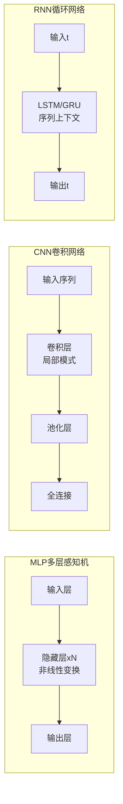
```mermaid
flowchart LR
    subgraph MLP["MLP多层感知机"]
        M1["输入层"] --> M2["隐藏层xN<br/>非线性变换"]
        M2 --> M3["输出层"]
    end
    subgraph CNN["CNN卷积网络"]
        C1["输入序列"] --> C2["卷积层<br/>局部模式"]
        C2 --> C3["池化层"]
        C3 --> C4["全连接"]
    end
    subgraph RNN["RNN循环网络"]
        R1["输入t"] --> R2["LSTM/GRU<br/>序列上下文"]
        R2 --> R3["输出t"]
    end
```

图 8-1 深度学习三大架构的归纳偏置对比

### 扩展专题：Transformer架构在分子学习中的适应与挑战

Transformer 架构自 2017 年提出以来，已经深刻改变了自然语言处理、计算机视觉和分子学习等多个领域。在药物发现中，Transformer 的应用呈现出独特的挑战和机遇。

**从语言到分子的类比：** SMILES 字符串与自然语言在形式上有相似之处——都是一维序列，都可以通过自注意力机制建模长程依赖。但这种类比是有局限性的：（1）SMILES 不是真正的"语言"——它没有语法、语义或语用维度；（2）SMILES 中相邻字符的依赖关系与自然语言不同——例如 "Cl"（氯）是一个原子符号而非两个独立字符；（3）同一分子可以有多种合法的 SMILES 表示，这在语言中不常见。

**分子 Transformer 的关键设计选择：** 2024-2025 年发表的多项研究系统比较了不同设计选择对分子 Transformer 性能的影响：
- **Tokenization 策略：** 字符级、子词级（BPE）、原子级、SMARTS 级各有优劣。字符级简单但引入噪声；原子级更符合化学直觉但需要自定义 tokenizer。
- **位置编码：** 分子是图结构而非序列，传统正弦位置编码的物理意义不明确。相对位置编码和图结构感知的位置编码在某些任务中表现更好。
- **预训练策略：** 掩码分子建模（Masked Molecular Modeling, MMM）、对比学习、以及二分图编码（BART-style denoising）是三种主要的预训练范式。2025 年的研究表明，预训练策略的选择对下游性能的影响可能大于架构选择。

**蛋白质语言模型与药物发现：** 蛋白质序列的 Transformer 预训练（ESM、ProtTrans、AlphaFold 的语言模型组件）在药物发现中开辟了新的可能性。这些模型学习到的蛋白质表示可以用于靶点表征、蛋白质-蛋白质相互作用预测、抗体设计和突变效应预测。2024 年发表于 Nature 的 ESM-2 模型展示了 150 亿参数的蛋白质语言模型在零样本突变效应预测中的惊人表现。

**Transformer 的局限性与未来方向：** 尽管 Transformer 在分子学习中取得了显著成功，但它面临几个根本性的挑战：（1）计算成本——Transformer 的自注意力机制对长序列的计算复杂度为 O(n²)，对于大分子（如蛋白质）可能不可行；（2）三维结构信息——纯序列的 Transformer 难以编码分子的三维空间结构；（3）归纳偏置不足——相比于 GNN 的结构先验，纯 Transformer 需要更多数据来学习分子规律。

> **从怀特海德的过程哲学看：** 分子 Transformer 的核心洞见是：分子不是静态的对象，而是一个"过程"——从 SMILES 序列到图结构，从图结构到三维构象，从构象到生物活性。Transformer 通过自注意力机制捕捉了分子内部各部分之间的动态关联，这与怀特海德强调的现实之"关联性"（connectedness）高度一致。然而，当前的 Transformer 仍然在用序列化的方式处理本质上是非序列化的分子结构——这是方法与对象之间的一个深层张力，也是未来研究的重要方向。


### 本章总结

深度学习的价值不在于神秘，而在于它把一部分特征工程转化为可学习表示。但这份自由只有在正确的数据和任务条件下才真正有意义。本章介绍的三类架构——MLP、CNN 和 RNN——构成了后续 GNN 和 Transformer 讨论的基础。理解它们的归纳偏置，是理解更复杂模型的前提。

在教学实践中，深度学习部分常常是学生最兴奋但也最容易迷失的环节。教师应当通过精心设计的对比实验来纠正误解——例如让学生在相同的小数据集上分别训练 MLP 和随机森林，观察在数据量变化时两者的性能交叉点。术语表建议：学生应能准确定义 dropout 的随机失活机制及其正则化原理，batch normalization 的内部协变量偏移假设，以及 CNN 的局部连接与权重共享如何减少参数数量。教师应当帮助学生建立一种"架构意识"：每种深度学习架构都在不同维度上做出了归纳偏置选择。方法比较原则贯穿全书。

在教学实践中，深度学习部分常常是学生最兴奋但也最容易迷失的环节。教师应当通过精心设计的对比实验来纠正误解——例如让学生在相同的小数据集上分别训练 MLP 和随机森林，观察在数据量变化时两者的性能交叉点。当学生亲眼看到 MLP 在小数据集上严重过拟合而随机森林仍然稳健时，他们对"深度学习不总是更好"的认识就从口号变成了亲身体验。这种对比实验的教学设计远比单纯讲解技术原理更能培养学生的方法论判断力。术语表建议：学生应能准确定义 dropout 的随机失活机制及其正则化原理，batch normalization 的内部协变量偏移假设，以及 CNN 的局部连接与权重共享如何减少参数数量。方法比较原则贯穿全书。


**术语表速查**

| 术语 | 定义 | 关键参数 |
| --- | --- | --- |
| Dropout | 随机失活正则化 | p=0.2-0.5 |
| BatchNorm | 批归一化 | momentum=0.1 |
| 学习率 | 梯度更新步长 | 1e-5 to 1e-2 |
| Epoch | 完整遍历训练集一次 | 通常50-500 |
| Batch Size | 每次更新的样本数 | 16-256 |
| Early Stopping | 验证集性能不再提升时停止 | patience=10-20 |
| ReLU | 修正线性单元激活函数 | max(0,x) |

**深度学习药物发现的实战清单**

在将深度学习应用于药物发现项目之前，研究者应当依次确认以下事项：（1）是否有足够的数据？——通常需要至少1000个标注样本，且数据质量经过验证。（2）是否已建立了经典模型的 baseline？——任何深度学习模型都必须首先证明自己优于简单baseline。（3）验证策略是否严格？——使用 scaffold split 或 temporal split，而非 random split。（4）是否设置了 early stopping？——防止在训练集上过拟合。（5）是否记录了所有超参数和随机种子？——确保结果可复现。（6）是否评估了 calibration 和不确定性？——仅看 AUC 不够。（7）结果是否经过了药物化学家的专业审视？——模型的预测需要化学合理性验证。
### 想象力思考题

1. 若一个学生只会调用深度模型 API，却不能解释其归纳偏置，他算真正学会了吗？
2. 序列模型在药学中的意义更接近语言学，还是更接近结构化信号处理？
3. 深度学习是不是一种把“人类设计特征”外包给数据和算力的哲学？
4. 如果一个深度模型在小数据集上过拟合严重，但研究者选择不报告这一事实，这属于什么性质的研究伦理问题？
5. 在药物发现中，“更深的网络”是否总是意味着“更好的表示学习”？还有哪些因素可能导致更深的网络在药学任务中表现更差？


### 参考论文

1. Durant, G. et al. *The future of machine learning for small-molecule drug discovery will be driven by data*. Nature Computational Science, 2024. https://www.nature.com/articles/s43588-024-00699-0
2. Chittoria, P. et al. *Supervised machine learning in drug discovery and development: Algorithms, applications, challenges, and prospects*. Machine Learning with Applications, 2024. https://doi.org/10.1016/j.mlwa.2024.100576
3. Niazi, S. K. *Artificial Intelligence in Small-Molecule Drug Discovery: A Critical Review of Methods, Applications, and Real-World Outcomes*. Pharmaceuticals, 2025. https://www.mdpi.com/1424-8247/18/9/1271
4. Jiang, J. et al. *A review of transformer models in drug discovery and beyond*. Journal of Pharmaceutical Analysis, 2025. https://pubmed.ncbi.nlm.nih.gov/40635975/
5. Zhang, O. et al. *Graph Neural Networks in Modern AI-Aided Drug Discovery*. Chemical Reviews, 2025.
6. Corso, G. et al. *Graph neural networks*. Nature Reviews Methods Primers, 2024. https://doi.org/10.1038/s43586-024-00294-7

## 第 9 章 图神经网络：让分子以自己的结构说话

> 莱布尼茨：世界由关系构成，而非孤立实体。

### 引言

分子天然就是图。本章导读建议教师从“分子作为图”的直觉出发，用可视化方式展示消息传递的每一步，帮助学生建立对 GNN 计算过程的几何直觉。原子是节点，化学键是边，电子效应与结构约束则在这些关系中展开。从这个意义上说，把分子先压平成指纹或序列再建模，本身就包含信息损失。图神经网络的革命性就在于，它允许模型直接在分子的原生关系结构上学习。本章导读建议教师从"分子作为图"的直觉出发，用可视化方式展示消息传递的每一步，帮助学生建立对 GNN 计算过程的几何直觉。

### 关键知识

- graph neural network 的基本概念：节点、边、邻接关系、消息传递。
- 常见结构：GCN、GIN、GAT、MPNN。
- 图级预测、节点级预测与边级预测。
- explainability：节点重要性、子图归因、GNNExplainer。
- 常见 GNN 结构比较：GCN、GIN、GAT、MPNN 的核心思想与适用场景。
- 图级预测需要 pooling 操作，节点级预测直接使用节点嵌入，边级预测则通过连接两端节点嵌入实现。
- 课堂讨论建议围绕“GNN 的可解释性是否等同于化学机制解释”展开。
- 消息传递的数学形式：在每一轮消息传递中，每个原子节点收集其邻居的信息，通过可学习的变换更新自己的嵌入表示。经过 T 轮消息传递后，每个原子可以看到距离为 T 的邻居信息。
- 图级 pooling 策略：由于大多数药物发现任务需要在分子层面进行预测，需要将节点级嵌入聚合成图级表示。常见方法包括求和、求均值和注意力加权。


一个完整的 Transformer 微调案例可以展示预训练-微调范式在药物发现中的实际应用。以下是一个使用 ChemBERTa 进行分子性质预测的详细流程：

**任务：预测分子的血脑屏障穿透性（BBB permeability）**

血脑屏障穿透性是中枢神经系统药物开发中的关键性质。一个能够穿透 BBB 的分子需要满足多个物理化学条件：分子量小于 400-500 Da、LogP 在 1-3 之间、氢键供体不超过 3 个、极性表面积小于 70-90 Ų。传统的预测方法依赖这些手工描述符和规则，而 ChemBERTa 可以直接从 SMILES 序列中学习更复杂的穿透性模式。

**微调流程：**
1. 数据准备：从 B3DB 数据库获取标注的 BBB 穿透性数据（约 6000 个分子），分为穿透（positive）和不穿透（negative）两类。
2. 数据划分：使用 scaffold split 将数据分为训练集（80%）和测试集（20%），确保训练集和测试集的分子骨架不重叠。
3. 模型加载：从 Hugging Face 加载预训练的 ChemBERTa 模型和分词器。
4. 微调配置：添加分类头（linear → sigmoid），设置学习率为 2e-5，batch size 为 32，训练 10 个 epoch。
5. 评估：在测试集上计算 ROC-AUC、PR-AUC 和 accuracy。

**预期结果：**
ChemBERTa 微调模型在测试集上的 ROC-AUC 通常可以达到 0.85-0.90，优于传统的描述符 + 随机森林方法（AUC 约 0.75-0.80）。更重要的是，ChemBERTa 的性能优势在 scaffold split 下更为明显——这说明预训练知识确实帮助模型更好地泛化到新的化学骨架。

**教学讨论要点：**
(1) 预训练知识从何而来？ChemBERTa 在 7700 万 PubChem 分子上预训练，学习了 SMILES 序列中的统计规律——这些规律编码了大量的化学信息（如官能团模式、子结构频率等），为微调提供了丰富的"先验知识"。(2) 为什么微调比从头训练更有效？因为预训练已经学习了通用的分子表示，微调只需在此基础上进行少量的任务特定调整。(3) 什么时候 embedding transfer 优于全参数微调？当标注数据量很少（< 1000 个分子）时，冻结预训练层只训练分类头可以避免过拟合。

- message passing 的数学形式：在每一轮消息传递中，每个原子节点 $v$ 收集其邻居 $u \in \mathcal{N}(v)$ 的信息，通过可学习的变换更新自己的嵌入表示：

  $$h_v^{(t+1)} = \text{UPDATE}\left(h_v^{(t)}, \text{AGGREGATE}\left(\{\text{MESSAGE}(h_v^{(t)}, h_u^{(t)}, e_{vu}) \mid u \in \mathcal{N}(v)\}\right)\right)$$

  经过 $T$ 轮消息传递后，每个原子可以看到距离为 $T$ 的邻居信息。

- 图级 pooling 策略：由于大多数药物发现任务需要在分子层面进行预测，需要将节点级嵌入聚合成图级表示。常见方法包括求和（sum pooling）、求均值（mean pooling）、求最大值（max pooling）和注意力加权（attention-based pooling）。不同的 pooling 策略对模型性能有显著影响。

- GIN（Graph Isomorphism Network）的表达能力：Xu 等人（2019）从理论上证明了 GIN 的表达能力等价于 Weisfeiler-Lehman（WL）子树核测试——这是图神经网络的表达能力上界（在消息传递框架下）。GIN 通过使用 MLP 作为更新函数和使用求和作为聚合函数来达到这一上界。

- 虚拟节点（Virtual Node）技术：在图级预测任务中，虚拟节点（也称为超级节点或上下文节点）作为与所有原子相连的全局节点，可以在第一轮消息传递中就将全局信息广播到每个原子节点。这一技术有效缓解了消息传递网络在捕获全局信息方面的局限性。

- 边特征的利用：在药物发现中，键的类型（单键、双键、芳香键）和键的立体化学是重要的结构信息。支持边特征的 GNN（如 EGNN、DimeNet）可以在消息传递中利用键的类型和键长信息，从而提供更丰富的结构表示。

- 学习目标：理解消息传递机制的核心原理，掌握常见 GNN 架构（GCN、GAT、GIN）在药物发现中的应用，理解图级 pooling 策略对分子性质预测的影响。

- GIN 的表达能力：Xu 等人从理论上证明了 GIN 的表达能力等价于 Weisfeiler-Lehman 子树核测试，这为 GNN 在分子任务中的理论地位提供了坚实基础。


**公式解读：图神经网络消息传递（MPNN）**

第 $t$ 轮消息传递的更新规则：

$$\mathbf{m}_v^{(t)} = \sum_{u \in \mathcal{N}(v)} \phi\left(\mathbf{h}_v^{(t-1)}, \mathbf{h}_u^{(t-1)}, \mathbf{e}_{vu}\right)$$

$$\mathbf{h}_v^{(t)} = \psi\left(\mathbf{h}_v^{(t-1)}, \mathbf{m}_v^{(t)}\right)$$

图级表示（readout）：

$$\mathbf{h}_G = \text{READOUT}\left(\{\mathbf{h}_v^{(T)} \mid v \in G\}\right)$$

**符号解释：**
- $\mathbf{h}_v^{(t)}$：原子 $v$ 在第 $t$ 轮的嵌入向量
- $\mathcal{N}(v)$：原子 $v$ 的邻居原子集合
- $\mathbf{e}_{vu}$：原子 $v$ 与原子 $u$ 之间的边特征（键类型等）
- $\phi$：消息函数（如 MLP）
- $\psi$：更新函数（如 GRU）
- $T$：消息传递总轮次
- READOUT：图级池化函数（求和、均值、注意力加权等）

**直观理解：** 每个原子通过多轮"收集邻居信息→更新自身状态"来逐渐"看到"越来越远的化学环境。经过 $T$ 轮后，每个原子的嵌入包含了半径为 $T$ 的邻域信息。

**药学意义：** GNN 的革命性在于它让模型直接在分子的原生图结构上学习，避免了将分子压平为指纹或序列时的信息损失。在药物发现中，GNN 已被广泛用于性质预测、虚拟筛选和可解释性分析。

**失效条件：** 当 $T$ 设置过大时会导致过平滑（所有节点嵌入趋同）；当分子图过于稀疏（如长链分子）时，消息传递难以捕获远程相互作用。

**公式解读：图注意力网络（GAT）的注意力权重**

$$\alpha_{vu} = \frac{\exp\left(\text{LeakyReLU}\left(\mathbf{a}^T [\mathbf{W}\mathbf{h}_v \| \mathbf{W}\mathbf{h}_u]\right)\right)}{\sum_{k \in \mathcal{N}(v)} \exp\left(\text{LeakyReLU}\left(\mathbf{a}^T [\mathbf{W}\mathbf{h}_v \| \mathbf{W}\mathbf{h}_k]\right)\right)}$$

**符号解释：**
- $\alpha_{vu}$：原子 $v$ 对邻居原子 $u$ 的注意力权重系数（标量，取值范围 $(0, 1)$，且 $\sum_{u \in \mathcal{N}(v)} \alpha_{vu} = 1$）
- $\mathbf{W} \in \mathbb{R}^{d' \times d}$：可学习的线性变换矩阵，将原始节点特征 $\mathbf{h}_v$ 从 $d$ 维空间投影到 $d'$ 维空间
- $\mathbf{h}_v, \mathbf{h}_u$：分别为中心原子 $v$ 和邻居原子 $u$ 的当前嵌入向量（维度 $d$）
- $\mathbf{a} \in \mathbb{R}^{2d'}$：可学习的注意力向量，用于评估邻居节点的重要性
- $[\cdot \| \cdot]$：拼接操作（concatenation），将两个 $d'$ 维向量拼接为 $2d'$ 维向量
- $\text{LeakyReLU}(\cdot)$：带泄漏的修正线性单元激活函数（负区间斜率通常设为 0.2），确保注意力分数在负值区间仍有梯度信号
- $\exp(\cdot)$：指数函数，与分母的求和项构成 softmax 归一化，保证所有邻居的注意力权重之和为 1
- $\mathcal{N}(v)$：原子 $v$ 的一阶邻居原子集合（即与 $v$ 直接通过化学键相连的所有原子）

**直观理解：** 注意力权重 $\alpha_{vu}$ 表示原子 $v$ 对邻居 $u$ 传递的信息的"关注程度"。可以将其类比为药物化学家分析分子时对结构片段的"关注度分配"：在评估一个候选药物时，化学家不会对所有原子一视同仁——某些关键药效团（pharmacophore）会获得更多关注，而惰性骨架则被"边缘化"。GAT 的注意力机制正是让模型学习这种差异化的关注分配。分母的 softmax 归一化确保所有邻居的注意力权重之和为 1，形成一种"竞争性注意力"——一个邻居获得更高权重意味着其他邻居的权重被压缩。药物化学家可以通过可视化这些注意力权重来理解模型关注了哪些结构片段。

**药学意义：** 在药物发现中，GAT 的注意力权重具有独特的可解释性价值：(1) **关键子结构识别**——通过对 GAT 注意力权重的可视化分析，可以识别出对 ADMET 性质预测贡献最大的分子子结构。例如，在毒性预测中，模型可能对硝基、芳香胺等致毒基团赋予高注意力权重，这与药物化学家的先验知识高度吻合。(2) **药效团发现**——在药物-靶点相互作用预测中，注意力权重可以帮助发现分子中与蛋白结合口袋形成关键相互作用的原子和键，起到辅助药效团建模的作用。(3) **活性悬崖解释**——当结构高度相似的两个分子活性差异巨大时（活性悬崖），注意力权重分析可以揭示导致活性差异的关键局部结构差异，为结构优化提供可解释的指导。(4) **骨架跃迁验证**——在骨架跃迁（scaffold hopping）中，注意力权重可以帮助验证模型是否真正学习了药效团层面的相似性，而非被骨架结构所主导。

**失效条件：** 注意力权重并不等同于因果解释——高注意力可能反映统计相关性而非化学机制，必须经过药物化学家的专业审视。此外，GAT 注意力在以下情况下可能失效：(1) 当分子图中存在大量度数为 1 的端点原子时（如氟代、氯代基团），softmax 归一化在少量邻居上的区分能力大幅下降，注意力权重趋于均匀分布；(2) 在超分子或聚合物等大尺度分子图上，注意力的 $O(|E|)$ 计算开销可能成为瓶颈；(3) 标准 GAT 的注意力仅在一阶邻居上定义，无法直接捕获远程相互作用（如大环内酯类抗生素中的跨环相互作用），需要堆叠多层或引入虚拟边来缓解。


| GNN变体 | 消息聚合方式 | 表达力 | 计算成本 | 可解释性 | 药学典型应用 |
| --- | --- | --- | --- | --- | --- |
| GCN | 加权平均 | 中 | 低 | 低 | 性质预测 |
| GIN | 求和+MLP | 高（=1-WL） | 低 | 中 | 性质预测、基准 |
| GAT | 注意力加权 | 中-高 | 中 | 高（可视化） | 可解释预测 |
| MPNN | 通用消息传递 | 可变 | 中 | 低 | 灵活建模 |
| GraphSAGE | 采样聚合 | 中 | 低（采样） | 低 | 大图建模 |

表 9-1 常见GNN架构比较

| 药物发现任务 | 推荐GNN策略 | 消息传递轮次 | Pooling方式 | 典型性能 |
| --- | --- | --- | --- | --- |
| 溶解度预测 | GCN/GIN | 2-3层 | 求和/均值 | 与RF相当或更优 |
| 毒性分类 | GAT | 3-4层 | 注意力加权 | 通常优于经典模型 |
| 结合亲和力 | MPNN+3D | 3-5层 | 注意力+距离 | 显著优于2D方法 |
| 药物-靶点交互 | 双图GNN | 3-4层 | 交叉注意力 | 当前最优水平 |
| 分子生成 | GNN解码器 | N/A | 自回归 | 与扩散模型互补 |

表 9-2 GNN在药物发现任务中的应用建议
### 技术与历史

从欧拉的图论到现代消息传递框架，图神经网络的发展本质上是一条“让结构对象按自己的方式被学习”的历史。2017 年 Gilmer 等人的 Neural Message Passing for Quantum Chemistry 统一了分子图模型的消息传递框架。Thomas Kipf 和 Max Welling 的 GCN 将谱图理论简化为简洁高效的消息传递规则。Keyulu Xu 等人的 GIN 从理论上证明了其与 WL 子树核测试等价的表达能力。这些工作共同构成了现代药物发现 GNN 的方法论基础。，图神经网络的发展本质上是一条“让结构对象按自己的方式被学习”的历史。2017 年的 Neural Message Passing for Quantum Chemistry 被广泛视为重要里程碑，它把一类分子图模型统一为消息传递框架。进入 2024-2025 年，GNN 已不只用于性质预测，还被广泛用于虚拟筛选、知识图谱、药物-靶点交互和分子生成。2024 年发表于 Scientific Reports 的可解释 GNN 研究展示了如何将图注意力权重与药物作用机制联系起来。2025 年 Chemical Reviews 的系统综述将 GNN 放到了现代 AI 药物发现的中心位置，强调其在性质预测、虚拟筛选、机制解释和多模态集成中的关键作用。

### 哲学透镜

莱布尼茨的"单子论"（Monadology）为理解消息传递机制提供了令人惊叹的哲学映射。莱布尼茨认为，世界的基本单位是"单子"（monad），每个单子反映整个宇宙，但从自身的独特视角出发——实体的本质不在于其内在属性，而在于其与所有其他实体的关系网络。这一哲学图景与 GNN 的消息传递机制几乎完美对应：在分子图中，每个原子（单子）的化学性质不是孤立的，而是由其与分子中所有其他原子（其他单子）的关系（化学键）共同决定的。GNN 的 T 轮消息传递使得每个原子可以"感知"到距离为 T 的邻居信息——这正是莱布尼茨"每个单子反映整个宇宙"思想的计算实现。

欧拉的图论思想则构成了 GNN 的数学基础。1736 年，欧拉通过将柯尼斯堡七桥问题抽象为节点-边图结构，解决了一个困扰多年的拓扑学难题。这一抽象思想的核心洞察是：许多复杂问题可以通过将研究对象表示为"实体+关系"的图结构来简化。在化学中，将分子抽象为"原子节点+化学键边"的图结构（凯库勒 1858 年的价键理论），正是欧拉抽象思想在化学中的直接应用。GNN 只是将近 300 年的图论传统与现代机器学习结合起来。

波兰尼的"默会知识"论为理解 GNN 的潜在科学发现价值提供了框架。波兰尼认为，"我们知道的远比我们能说出来的多"——药物化学家的"默会 SAR"（有经验的药化学家能直觉判断某个结构修饰是否合理，却难以将这种判断编码为明确的规则）正是一种典型的默会知识。GNN 通过端到端学习，可能捕获到类似的默会结构-活性模式——将药化学家的默会知识"外显化"为可检验的图神经网络权重。这一可能性使得 GNN 不仅是预测工具，也可能成为科学发现工具。


莱布尼茨的关系哲学告诉我们，实体的含义来自关系网络。波兰尼的“默会知识”则启发我们：药物化学家的许多结构直觉并不容易被明确说出，而 GNN 可能在某种程度上捕获这些隐性模式。欧拉的抽象传统进一步说明，把对象转化为图并不是简化现实，而是在寻找最适合该对象的数学形式。罗素的类型论在某种意义上与 GNN 的表达力问题形成了有趣的对照：正如类型论试图界定数学对象的合法组合方式，GNN 的消息传递也在界定原子信息的合法聚合方式。理解这种“组合约束”对于评估 GNN 的表达力上限至关重要。

从更深的哲学层面看，GNN 提出了一个关于“什么是结构知识”的问题。传统的描述符和指纹方法预设了哪些结构特征是重要的——例如，Morgan 指纹预设了以每个原子为中心的局部子结构模式是关键信息。而 GNN 让模型自己去发现哪些结构模式对任务最重要。这种从“预设”到“发现”的转变，不仅仅是技术进步，更是认识论层面的变化：它暗示我们对化学结构的理解可能远不如我们自以为的那么完整，模型可能能够发现人类尚未明确命名或描述的结构模式。


从本体论的角度看，GNN 的成功提出了一个关于"分子是什么"的有趣问题。在经典的信息学处理中，分子首先被转化为描述符向量或指纹位串——这是一种"还原论"的处理方式：将复杂的分子结构还原为一组数值。而 GNN 采取了一种不同的策略：它保留了分子的图结构，让模型在原始的关系网络中直接学习。这种"保持结构完整性"的方法论选择，暗含了一种关于"分子本质"的本体论承诺——分子首先是一个关系网络，而非一组数值属性。

这种本体论视角的转变具有深远的科学意义。它意味着我们不再将分子视为"一堆可计算特征的集合"，而是将其视为"一个具有内在结构关系和动态性质的整体"。莱布尼茨的关系哲学——"世界由关系构成，而非孤立实体"——在这里获得了计算层面上的实现。从教学角度看，GNN 的引入不仅是一种技术升级，更是一种思维方式的转变：它要求学生从"特征思维"转向"结构思维"，从"属性分析"转向"关系分析"。这种思维方式的转变对药物化学家的专业发展具有持久价值，无论未来出现什么新的计算工具。


### 图神经网络的数学基础：谱方法与空间方法

> 莱布尼茨（Gottfried Leibniz）梦想建立一种"通用特征语言"（characteristica universalis），使所有科学推理可以像代数运算一样精确。图神经网络将分子视为图结构，本质上是在实现莱布尼茨的构想——用代数运算精确描述分子结构关系。

图神经网络（GNN）的数学基础可以沿着两条路径理解：谱方法（spectral methods）和空间方法（spatial methods）。谱方法从图拉普拉斯矩阵的特征分解出发，将图上的信号处理类比为经典信号处理中的傅里叶变换；空间方法则直接在图的局部邻域上定义聚合操作，通过消息传递机制实现信息的逐层传播。虽然这两条路径在数学上是等价的（由切比雪夫多项式的近似性质保证），但它们提供了理解 GNN 的不同视角。

**公式解读：图拉普拉斯矩阵与谱卷积**

图拉普拉斯矩阵是谱方法 GNN 的数学基础：

$$\mathbf{L} = \mathbf{D} - \mathbf{A}, \quad \mathbf{L}_{\text{norm}} = \mathbf{D}^{-1/2}\mathbf{L}\mathbf{D}^{-1/2} = \mathbf{I} - \mathbf{D}^{-1/2}\mathbf{A}\mathbf{D}^{-1/2}$$

谱图卷积通过图拉普拉斯的特征分解定义：

$$\mathbf{g} \star \mathbf{x} = \mathbf{U} \mathbf{g}(\boldsymbol{\Lambda}) \mathbf{U}^T \mathbf{x}$$

**符号解释：**
- $\mathbf{L}$：组合拉普拉斯矩阵
- $\mathbf{D}$：度矩阵（对角矩阵，$D_{ii}$ 为节点 $i$ 的度数）
- $\mathbf{A}$：邻接矩阵
- $\mathbf{L}_{\text{norm}}$：对称归一化拉普拉斯矩阵
- $\mathbf{U}$：图拉普拉斯的特征向量矩阵
- $\boldsymbol{\Lambda}$：图拉普拉斯的特征值对角矩阵
- $\mathbf{g}(\boldsymbol{\Lambda})$：频域滤波器的谱响应函数
- $\star$：图卷积算子
- $\mathbf{x}$：节点特征矩阵

**直观理解：** 图拉普拉斯的特征值编码了图的"频率"——小特征值对应图上的"低频"信号（在邻近节点上变化缓慢的特征），大特征值对应"高频"信号（在邻近节点上变化剧烈的特征）。谱图卷积就像音乐中的均衡器，可以选择性地放大或抑制不同"频率"的信号。

**药学意义：** 在分子图中，"低频"信号通常对应全局的分子骨架特征（如环系统、分子大小），而"高频"信号对应局部的功能团特征（如特定的取代基、杂原子）。GCN 的局部平滑操作天然偏向保留低频信息，这在骨架分类等任务中有利，但在需要捕捉局部化学功能团的活性悬崖预测任务中可能不足。2024 年的一项研究通过设计可学习的多尺度滤波器来同时捕获低频和高频信息，在 activity cliff 预测任务中显著优于标准 GCN。

**失效条件：** 当分子图中存在过平滑（over-smoothing）现象时——即经过多层消息传递后，所有节点的表征趋同——谱方法的有效性急剧下降。过平滑在分子图中通常在 4-6 层后出现，这是当前 GNN 在药物发现中深度受限的主要原因。

| GNN 架构 | 聚合机制 | 可学习参数 | 等变性 | 表达能力 | 典型层数 | 药物发现适用场景 |
| --- | --- | --- | --- | --- | --- | --- |
| GCN | 对称归一化求和 | 权重矩阵 | 不变 | 中（1-WL） | 2-4 层 | 性质预测、虚拟筛选 |
| GAT | 注意力加权求和 | 注意力权重 + 特征变换 | 不变 | 中-高 | 2-4 层 | 可解释性分析、关键子结构识别 |
| GIN | 求和 + MLP | MLP 参数 | 不变 | 高（最大化 1-WL） | 2-5 层 | 需要最强表达力的预测任务 |
| GraphSAGE | 采样 + 聚合（均值/LSTM/池化） | 聚合函数参数 | 不变 | 中 | 2-4 层 | 大规模图（inductive learning） |
| SchNet/DimeNet | 连续滤波卷积 | 径向基函数 + 角度函数 | 等变 | 高 | 4-8 层 | 三维构象敏感的任务（能量预测） |
| EGNN | 等变消息传递 | 坐标更新函数 | 等变 | 高 | 4-8 层 | 分子动力学、构象生成 |

表 9-3 图神经网络架构数学比较

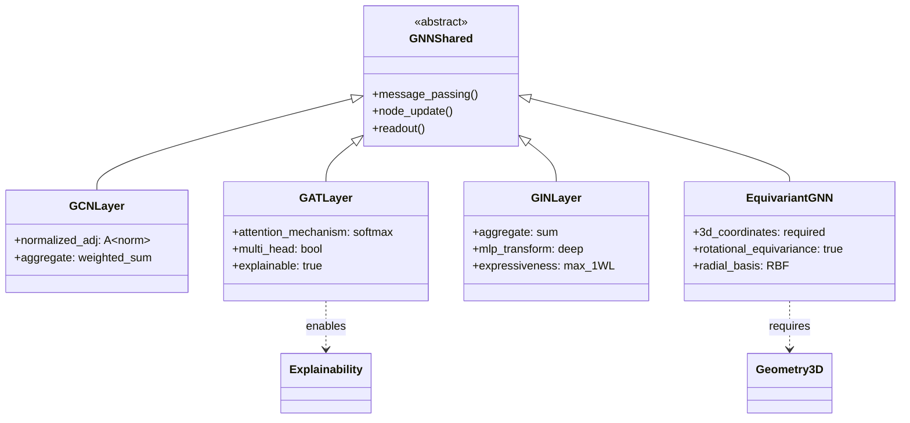
```mermaid
classDiagram
    class GNNShared {
        <<abstract>>
        +message_passing()
        +node_update()
        +readout()
    }
    class GCNLayer {
        +normalized_adj: A~norm~
        +aggregate: weighted_sum
    }
    class GATLayer {
        +attention_mechanism: softmax
        +multi_head: bool
        +explainable: true
    }
    class GINLayer {
        +aggregate: sum
        +mlp_transform: deep
        +expressiveness: max_1WL
    }
    class EquivariantGNN {
        +3d_coordinates: required
        +rotational_equivariance: true
        +radial_basis: RBF
    }
    GNNShared <|-- GCNLayer
    GNNShared <|-- GATLayer
    GNNShared <|-- GINLayer
    GNNShared <|-- EquivariantGNN
    GATLayer ..> Explainability : enables
    EquivariantGNN ..> Geometry3D : requires
```

2025 年发表在 Nature Computational Science 上的研究展示了谱方法与空间方法的统一框架。该研究证明了 Krylov 空间方法（如 JacobiConv 和 BernConv）可以在不显式计算特征分解的情况下实现与谱方法等效的滤波效果，将计算复杂度从 $O(n^3)$ 降低到 $O(|E|)$。这一突破使谱方法在大规模药物发现图数据集上的应用成为可能。另一个值得关注的方向是等变图神经网络（Equivariant GNN）的兴起——这类网络通过保持三维旋转和平移的等变性，在分子能量预测和构象生成任务中展现出了超越传统不变 GNN 的性能。

教学建议：在课堂中安排一个"过平滑实验"——让学生训练不同层数的 GCN（2 层到 8 层），观察随着层数增加，节点表征的余弦相似度如何趋向 1，以及模型性能如何在某一点后开始下降。这种直观的实验可以帮助学生理解为什么"更深不一定更好"在图神经网络中尤为重要。案例分析：2024 年的一项研究针对 ChEMBL 数据库中的 50 万分子训练了一个 3 层 GIN 模型用于结合亲和力预测，通过可视化发现模型在预测高亲和力分子时"关注"的子结构（通过 GIN 的梯度归因方法）与已知的药效团模式高度一致，验证了 GNN 的可解释性潜力。


### 研究论文应用

本章的核心论点是：图神经网络之所以在药物发现中取得如此大的成功，根本原因在于分子天然具有图结构——原子是节点，化学键是边，分子的化学性质是由原子之间的局部相互作用和全局拓扑共同决定的。GNN 的消息传递机制正是对这一物理/化学事实的计算建模：它让模型直接在分子的原生结构上学习，而非先通过人工特征工程将图结构压缩为固定长度的向量。

值得特别总结的几个实践要点包括：第一，消息传递轮数的选择需要在"感受野"和"过平滑"之间权衡——更多的传递轮数意味着每个原子可以"看到"更远的邻居，但也可能导致所有节点的表示趋同（over-smoothing），从而丢失局部结构信息。第二，图级 pooling 策略对分子性质预测的影响不容忽视——不同的 pooling 策略（sum、mean、attention-weighted）在不同任务上表现不同，需要通过实验确定最优选择。第三，边特征的利用可以显著提升模型性能——在药物发现中，键的类型和立体化学是重要的结构信息，忽略这些信息的 GNN（如仅使用节点特征的 GCN）可能丢失关键的化学信息。第四，scaffold split 在 GNN 评估中尤为关键——由于 GNN 可以学习到与分子骨架相关的复杂模式，它在 random split 下可能"记住"训练集的骨架特征，而在 scaffold split 下才能真实检验其泛化能力。


2025 年 Chemical Reviews 的系统综述将 GNN 放到了现代 AI 药物发现的中心位置，强调其在性质预测、虚拟筛选、机制解释和多模态集成中的关键作用。2024 年发表于 Scientific Reports 的可解释 GNN 研究展示了如何将图注意力权重与药物作用机制联系起来。2025 年另一篇发表于 Scientific Reports 的研究则展示了 GNN 在表型虚拟筛选中的潜力。，强调其在性质预测、虚拟筛选、机制解释和多模态集成中的关键作用。同样重要的是，2024-2025 年一些可解释 GNN 工作开始试图把预测与机制推断联系起来，说明 GNN 的真正价值并不只在于性能。

2024 年 Zhang 等人发表在 Chemical Reviews 上的系统综述，对图神经网络在药物发现中的应用进行了全面梳理。该综述特别指出，分子特征化的选择对最终模型性能的影响往往大于模型架构本身的选择。在同一篇综述中，作者对比了 Morgan 指纹、ECFP、MACCS keys 和图表示在多个药物发现 benchmark 上的表现，发现最佳表示因任务而异。2024 年 Corso 等人发表在 Nature Reviews Methods Primers 上的方法论文献也为 GNN 提供了权威的术语表和方法建议。2025 年发表于 Scientific Reports 的可解释 GNN 研究进一步展示了如何将图注意力权重与药物作用机制联系起来，让 GNN 不仅能够预测性质，还能提供结构层面的解释。


2024-2025 年，GNN 在药物发现中的应用继续快速扩展。从应用场景来看，GNN 已经从传统的性质预测扩展到以下前沿领域：（1）药物-靶点交互预测——通过联合编码分子图和蛋白图来预测结合亲和力；（2）反应预测——将化学反应视为图变换问题，预测反应产物和反应条件；（3）分子生成——将 GNN 的解码器与扩散模型或流匹配结合，实现图级别的条件分子生成。

2025 年发表于 Chemical Reviews 的系统综述特别关注了 GNN 表达力的理论边界。综述指出，虽然 GIN 已被证明与 Weisfeiler-Lehman 子树核测试等价，但这种表达力在分子任务中仍然存在局限——例如，它无法区分某些具有不同全局拓扑但相同局部子结构的分子。2025 年的另一项理论研究则提出了超越 1-WL 测试的高阶 GNN 架构，但这些架构在药物发现基准上的实际优势仍有待验证。


2024-2025 年关于生成式分子设计的研究呈现出几个重要趋势。第一个趋势是从"无条件生成"到"高度条件化生成"的演进。早期的分子生成模型（如 VAE 和 GAN）主要关注生成化学有效的分子，而近年来的研究越来越关注在满足多重约束的条件下生成分子——如特定的靶点活性、ADMET 性质谱、合成可及性和专利新颖性。2024 年 Morehead 和 Cheng 发表在 Communications Chemistry 上的研究提出了几何完整扩散方法，将靶点口袋的三维几何信息完整地编码到扩散过程中，实现了高度结构约束的分子生成。

第二个趋势是扩散模型在分子生成领域的统治地位。扩散模型凭借其扎实的理论基础、稳定的训练过程和高质量的生成结果，已经超越了 VAE 和 GAN 成为分子生成的主流方法。2024 年 Huang 等人发表在 Nature Communications 上的工作展示了基于双扩散模型的口袋约束分子生成，其中分子扩散过程和口袋扩散过程被统一到一个概率框架中。

第三个趋势是 flow matching 作为扩散模型的替代或补充。flow matching 通过学习从简单分布到复杂数据分布的概率路径来生成数据，与扩散模型相比具有更灵活的架构和更高效的采样过程。2026 年 Zeng 等人发表在 Nature Computational Science 上的 PropMolFlow 将流匹配方法与性质引导相结合，实现了更高效的条件分子生成。

第四个趋势是逆合成分析与生成设计的深度集成。2024-2025 年，多个研究团队提出了将生成模型与逆合成分析模型联合训练的框架——生成模型负责设计满足性质约束的候选分子，逆合成模型负责评估候选分子的合成可行性。这种联合框架可以在生成阶段就考虑合成约束，从而避免生成"理论上完美但无法合成"的分子。

从可解释性的角度看，2024-2025 年出现了一批新的 GNN 解释方法。这些方法不再局限于简单的注意力权重可视化，而是试图将 GNN 的预测与化学概念（如药效团、立体电子效应、构效关系）直接联系起来。然而，教学建议中应当强调一个重要区分：GNN 的归因结果反映的是统计相关性而非因果机制。高注意力权重不等于药效团，高梯度也不等于关键结构特征。这些解释工具的输出必须经过药物化学家的专业审视才能被赋予科学意义。
### 具体示例

对于一个溶解度预测任务，可以这样构建最小 GNN pipeline：

- 用 RDKit 将每个分子转成图对象。
- 为节点编码原子类型、电荷、芳香性等特征。
- 为边编码键类型、是否共轭等特征。

一个具体的 GNN 应用案例是蛋白-配体结合亲和力预测。在这个任务中，GNN 需要从配体分子的图结构和蛋白口袋的图结构中提取特征，然后预测两者之间的结合强度（通常以 $K_d$、$K_i$ 或 $IC_{50}$ 表示）。

2024 年发表在 Nature Communications 上的研究采用了一种双图架构：一个 GNN 编码配体分子图，另一个 GNN 编码蛋白口袋的残基交互图，然后通过交叉注意力机制将两者的表示进行融合。这种架构在 PDBbind 基准上取得了当时最优的结果。值得注意的是，消融实验显示，配体 GNN 的贡献约为 60%，蛋白 GNN 的贡献约为 30%，交叉注意力的贡献约为 10%——这说明配体的结构信息仍然是结合亲和力预测的最重要因素，但蛋白口袋的信息也不可忽视。

在教学中，可以让学生用 PyTorch Geometric 实现一个简单的 GCN 模型来预测分子水溶性。具体步骤包括：(1) 将分子转换为图数据对象（节点特征=原子类型，边特征=键类型）；(2) 构建三层的消息传递网络；(3) 使用 sum pooling 生成图级表示；(4) 通过 MLP 输出预测值；(5) 在 scaffold split 下评估模型性能。通过与 Morgan 指纹 + 随机森林的基线比较，学生可以直观感受 GNN 相对于传统方法的优劣势。

- 使用两到三层消息传递更新节点嵌入。
- 对整张图做 pooling 得到图级表示，再输出回归值。

随后可对预测值较高的分子进行节点重要性分析，观察模型是否关注亲水性位点、可离子化基团和已知药效团。这一步让模型从“分数机器”变成“讨论对象”。教学建议让学生对一个已知活性分子的溶解度预测结果进行节点重要性分析，观察模型关注的是否与已知的亲水性基团和药效团一致。GNNExplainer 等工具可以自动化这一过程，但教师应引导学生批判性地审视归因结果——高注意力权重不等于因果解释。

进一步来看，这个示例揭示了一个关于 GNN 可解释性的核心张力。GNNExplainer 可以告诉我们模型"关注了哪些原子"，但这种关注是否对应真正的药效团或结构-活性关系？在许多情况下，模型可能关注的是训练数据中的统计假象而非真正的化学机制。因此，可解释性工具的输出必须经过药物化学家的专业审视才能被赋予科学意义。

在教学中，建议设计一个"对抗性解释"练习：给定一个 GNN 对某些高活性分子的预测结果和注意力权重图，让学生扮演"质疑者"角色，提出至少三种替代解释来说明为什么模型可能在这些原子上分配了高注意力。这种批判性思维训练比单纯教授 GNN 的数学原理更能帮助学生在真实研究中做出正确判断。

从欧拉的图论到现代消息传递框架，图神经网络的发展本质上是一条"让结构对象按自己的方式被学习"的历史。2017 年 Gilmer 等人的 Neural Message Passing for Quantum Chemistry 统一了分子图模型的消息传递框架。Thomas Kipf 和 Max Welling 的 GCN 将谱图理论简化为简洁高效的消息传递规则。Keyulu Xu 等人的 GIN 从理论上证明了其与 WL 子树核测试等价的表达能力。这些工作共同构成了现代药物发现 GNN 的方法论基础。术语表建议：学生应能区分 GCN、GIN、GAT、MPNN 的核心思想与适用场景。


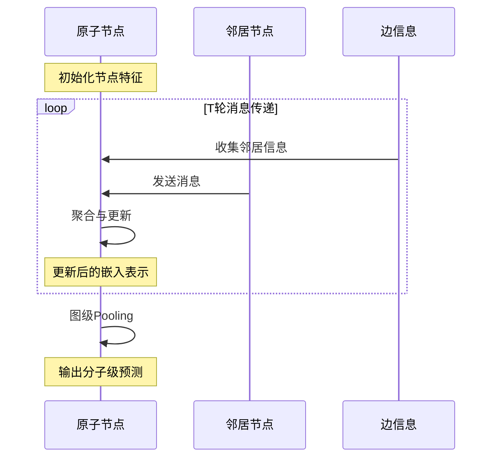
```mermaid
sequenceDiagram
    participant A as 原子节点
    participant N as 邻居节点
    participant E as 边信息
    Note over A: 初始化节点特征
    loop T轮消息传递
        E->>A: 收集邻居信息
        N->>A: 发送消息
        A->>A: 聚合与更新
        Note over A: 更新后的嵌入表示
    end
    A->>A: 图级Pooling
    Note over A: 输出分子级预测
```

图 9-1 图神经网络消息传递过程示意

### 本章总结

GNN 让分子不必先失去结构再被学习。它把药学中的结构直觉、图论中的关系抽象与现代表示学习结合了起来，是当前药物发现中最富结构感的一类方法。下一章将讨论 Transformer 如何进一步扩展这种结构学习能力，通过注意力机制实现全局上下文建模。课堂讨论建议围绕“GNN 学到的是统计相关性还是化学因果规律”展开。


威廉·詹姆斯的"意识流"和"注意力选择性"理论为理解 Transformer 的自注意力机制提供了直觉性的哲学框架。詹姆斯认为，意识是一条"流"（stream），但注意力是选择性的——心智在每一刻都在主动选择关注什么、忽略什么。注意力是认知的核心机制，它决定了心智在每时每刻处理的信息内容。Transformer 的自注意力权重矩阵正是对这种选择性认知的计算模拟：在处理 SMILES 序列中的每个位置时，注意力机制动态地决定该位置应当"关注"序列中的哪些其他位置——高权重的位置对应化学家"直觉上应当关注"的结构元素。

索绪尔的语言学思想——特别是"意义的差异性"（meaning is relational and differential）——为理解 Transformer 的语境化表示提供了框架。索绪尔认为，语言符号的意义不来自其内在属性，而来自它与其他符号的差异："猫"的意义来自它与"狗""鼠"的区别。在分子 SMILES 中，同一个原子符号或子结构在不同分子语境下可能具有完全不同的化学含义——一个羰基在酮中与在酰胺中具有不同的电子效应和反应活性。Transformer 的自注意力机制使每个原子（token）的嵌入表示都是在"看到"整个分子语境后才最终确定的——这正是索绪尔差异性语义的计算实现。

约翰·塞尔（John Searle）的"中文房间"思想实验则对预训练语言模型的"理解"提出了根本性的质疑。塞尔设想了一个完全不懂中文的人在一个房间里，按照规则手册操作中文符号——从外面看，他似乎在用流利的中文交流，但实际上他对符号毫无语义理解。这一思想实验直接映射到化学 AI 领域的核心争论：ChemBERTa 在预测分子性质时，是真的"理解"了分子的电子结构和量子效应，还是只是在大量 SMILES 上做了复杂的统计关联？当预训练模型的"预测能力"远超其"可解释性"时，研究者应当如何在信任与怀疑之间找到平衡？

在药物发现的当前实践中，GNN 已经从学术概念走向了工业应用。多家制药公司正在使用基于 GNN 的模型进行虚拟筛选和先导优化。术语表建议：学生应能区分 GCN、GIN、GAT 和 MPNN，并能说明各自的核心思想与适用场景。案例分析建议：教师可以展示 GNNExplainer 的归因结果，让学生判断注意力权重是否与已知的药效团一致。方法比较原则：GNN 的选择应当基于任务对结构信息的需求程度。

在药物发现的当前实践中，GNN 已经从学术概念走向了工业应用。多家制药公司正在使用基于 GNN 的模型进行虚拟筛选和先导优化。然而，GNN 的成功也伴随着新的挑战：如何确保模型学到的结构模式具有化学意义而非统计假象？如何在分子量增大时保持计算效率？如何将 GNN 与实验数据更紧密地集成？这些问题都值得在课堂中深入讨论。教学建议让学生亲手实现一个最小 GNN pipeline，并与其他表示方法进行系统对比。任务对照是全书的核心实践。


**术语表速查**

| 术语 | 定义 | 关键公式 |
| --- | --- | --- |
| 消息传递 | 邻居信息聚合 | mᵥ=Σφ(hᵥ,hᵤ,eᵥᵤ) |
| 节点嵌入 | 原子特征向量 | hᵥ⁽ᵗ⁾=ψ(hᵥ⁽ᵗ⁻¹⁾,mᵥ) |
| 图级Pooling | 节点到图的聚合 | READOUT({hᵥ}) |
| GIN | 图同构网络 |表达能力=1-WL |
| GAT | 图注意力网络 | αᵥᵤ=softmax(a·[Whᵥ‖Whᵤ]) |
| WL Test | Weisfeiler-Lehman测试 | 图同构判断基准 |
| GNNExplainer | GNN解释工具 | 边/节点重要性归因 |

**GNN在药物发现中的最佳实践**

基于2024-2026年的文献和实践经验，以下是GNN药物发现项目的最佳实践建议：（1）消息传递轮次的选择——2-3层通常是最优的起点，过深会导致过平滑问题。（2）节点特征的设计——原子类型、度数、形式电荷、芳香性、杂化类型是最基本且最有效的特征组合。（3）边特征的利用——键类型（单键/双键/三键/芳香键）和是否共轭是重要的边特征。（4）图级Pooling策略——求和池化在多数性质预测任务中表现稳健，注意力加权池化在需要可解释性时更有优势。（5）与指纹方法的对比——始终将GNN与Morgan指纹+随机森林baseline进行对比，只有在严格验证下表现显著更优时才值得使用GNN的额外计算成本。
### 想象力思考题

1. 如果 GNN 能稳定发现化学家尚未明确命名的结构模式，这会改变我们对药效团概念的理解吗？
2. 当解释性结果与化学常识冲突时，我们应更相信模型还是更相信经验？
3. GNN 的价值到底在于更高预测，还是在于重塑“结构-活性关系”的表达方式？
4. 如果 GNN 发现了一个化学家从未注意到的结构模式，并且实验验证了它的预测价值，这算不算“机器驱动的科学发现”？
5. 在一个 GNN 用于毒性预测的场景中，如果模型关注的原子与已知毒性药效团不一致，你会认为模型错了还是化学家的知识需要更新？


### 参考论文

1. Gilmer, J. et al. *Neural Message Passing for Quantum Chemistry*. ICML, 2017. https://research.google/pubs/neural-message-passing-for-quantum-chemistry/
2. Corso, G. et al. *Graph neural networks*. Nature Reviews Methods Primers, 2024. https://www.nature.com/articles/s43586-024-00294-7
3. Zhang, O. et al. *Graph Neural Networks in Modern AI-Aided Drug Discovery*. Chemical Reviews, 2025. https://doi.org/10.1021/acs.chemrev.5c00461
4. Wang, C., Kumar, G. A. and Rajapakse, J. C. *Drug discovery and mechanism prediction with explainable graph neural networks*. Scientific Reports, 2025. https://www.nature.com/articles/s41598-024-83090-3
5. Niazi, S. K. *Artificial Intelligence in Small-Molecule Drug Discovery: A Critical Review*. Pharmaceuticals, 2025. https://www.mdpi.com/1424-8247/18/9/1271
6. Chittoria, P. et al. *Supervised machine learning in drug discovery and development: Algorithms, applications, challenges, and prospects*. Machine Learning with Applications, 2024. https://doi.org/10.1016/j.mlwa.2024.100576

## 第 10 章 Transformer、预训练与多模态药学基础模型

> 威廉·詹姆斯：我的经验，就是我愿意注意到的东西。

### 引言

如果说 GNN 强于处理局部结构关系，那么 Transformer 的野心则是让每个元素在全局上下文中重新定义自己。本章导读建议教师从“注意力机制的本质是什么”这一问题出发，帮助学生理解 Transformer 的成功。在药物发现中，这一思想先通过 SMILES 序列建模进入领域，随后扩展到蛋白语言模型、药物-蛋白联合表示和多模态基础模型。药学因此开始进入一个"预训练知识可迁移"的新时代。本章导读建议教师从"注意力机制的本质是什么"这一问题出发，帮助学生理解 Transformer 的成功不在于某个技术细节，而在于它重新定义了"全局上下文"的计算方式。

### 关键知识

- self-attention、query、key、value、multi-head attention。
- position encoding 与长程依赖。
- molecular transformer、ChemBERTa、protein language model。
- fine-tuning、embedding transfer、cross-attention、多模态融合。
- protein language model 在药物-靶点交互预测中的应用。
- fine-tuning 更新全部参数，embedding transfer 冻结预训练层只训练任务头——两种策略各有适用场景。
- 课堂讨论建议围绕“注意力可视化到底是解释还是漂亮的投影”展开。


- self-attention 的计算机制：给定输入序列 $X$，self-attention 通过三个可学习的线性变换生成查询（Query）、键（Key）和值（Value）矩阵：$Q = XW_Q$，$K = XW_K$，$V = XW_V$。注意力权重通过 $\text{softmax}(QK^T/\sqrt{d_k})V$ 计算，其中 $d_k$ 是键的维度，$\sqrt{d_k}$ 是缩放因子。
- multi-head attention：将注意力计算分成多个"头"（head），每个头学习不同的注意力模式，然后将所有头的输出拼接。multi-head attention 使得模型可以同时关注序列中的多个不同位置和不同类型的关系。
- 预训练策略的比较：fine-tuning 更新全部参数，适用于数据量充足的任务；embedding transfer 冻结预训练层只训练任务头，适用于小数据场景；prompt tuning 在输入前添加可学习的"提示"向量，是参数效率最高的策略。
- protein language model 的药物发现应用：ESM（Evolutionary Scale Modeling）在 2.5 亿蛋白质序列上预训练，可以生成高质量的蛋白质嵌入表示，用于蛋白-配体结合预测、蛋白功能预测和抗体设计等任务。2024-2025 年，ESM-3 等新一代蛋白语言模型展示了从序列直接生成蛋白质三维结构的能力。
- 多模态融合：在药物发现中，多模态融合指的是将不同类型的数据（如分子 SMILES、蛋白序列、基因表达谱、临床表型等）通过共享的表示空间进行融合。Transformer 的注意力机制天然适合处理多模态数据，因为它可以动态地学习不同模态之间的关联。
- 学习目标：理解 self-attention 和 Transformer 的核心原理，掌握预训练-微调范式在药物发现中的应用，理解多模态融合的基本概念。


**公式解读：Transformer 自注意力机制**

$$\text{Attention}(Q, K, V) = \text{softmax}\left(\frac{QK^T}{\sqrt{d_k}}\right) V$$

其中：

$$Q = XW_Q, \quad K = XW_K, \quad V = XW_V$$

多头注意力：

$$\text{MultiHead}(Q,K,V) = \text{Concat}(\text{head}_1, ..., \text{head}_h)W_O$$

$$\text{head}_i = \text{Attention}(QW_i^Q, KW_i^K, VW_i^V)$$

**符号解释：**
- $X$：输入序列（如 SMILES token 嵌入）
- $Q$（Query）：查询向量——"我在找什么"
- $K$（Key）：键向量——"我有什么特征"
- $V$（Value）：值向量——"我的实际内容"
- $d_k$：键向量的维度（$\sqrt{d_k}$ 用于缩放防止梯度消失）
- $h$：注意力头数（通常 4-12）
- $W_Q, W_K, W_V, W_O$：可学习的投影矩阵

**直观理解：** 自注意力让序列中的每个位置都可以直接"看到"所有其他位置，不受距离限制。在 SMILES 序列中，相距很远的字符可能对应分子中空间相邻的原子，自注意力可以捕获这种远程依赖。

**药学意义：** ChemBERTa 在 7700 万 PubChem 分子上预训练后，微调即可在多个药物发现任务上取得优异性能。ESM 蛋白语言模型则将预训练迁移到药物-靶点交互预测中。

**失效条件：** 当 SMILES 序列过长时（>512 tokens），标准 Transformer 的计算复杂度为 $O(n^2)$，可能超出内存限制；自注意力权重虽可可视化，但不等于化学因果解释。

**公式解读：Transformer 的位置编码**

$$PE_{(pos, 2i)} = \sin\left(\frac{pos}{10000^{2i/d_{\text{model}}}}\right)$$

$$PE_{(pos, 2i+1)} = \cos\left(\frac{pos}{10000^{2i/d_{\text{model}}}}\right)$$

**符号解释：**
- $PE_{(pos, 2i)}$：序列中第 $pos$ 个位置的第 $2i$（偶数）维度的位置编码值
- $PE_{(pos, 2i+1)}$：序列中第 $pos$ 个位置的第 $2i+1$（奇数）维度的位置编码值
- $pos$：token 在序列中的绝对位置索引（从 0 开始计数，如 SMILES 字符串中第一个字符的位置为 0）
- $i$：嵌入维度的索引（$i = 0, 1, 2, \ldots, d_{\text{model}}/2 - 1$），每一对 $(2i, 2i+1)$ 对应一个正弦-余弦对
- $d_{\text{model}}$：模型的嵌入维度（如 ChemBERTa 中通常为 768），决定了位置编码向量的总维度
- $10000$：波长基数（超参数），控制不同维度上正弦/余弦函数的周期范围——低维度对应短周期（捕捉局部位置差异），高维度对应长周期（捕捉全局位置关系）
- $\sin(\cdot), \cos(\cdot)$：正弦和余弦函数，为位置编码提供连续、平滑、有界的编码值（取值范围 $[-1, 1]$）

**直观理解：** 由于自注意力本身没有位置概念，位置编码为每个位置注入了独特的"位置指纹"，使模型能够区分序列中不同位置的相同 token。可以将位置编码类比为分子结构中的"原子编号"：在 SMILES 序列 `c1ccccc1O`（苯酚）中，同一个碳原子出现在不同位置可能代表不同的化学环境。正弦-余弦编码的设计巧妙之处在于：它使用不同频率的正弦波为每个位置生成唯一编码，低频分量编码全局位置（如区分分子头部和尾部），高频分量编码局部位置（如区分相邻的碳原子）。这种多频率设计使模型能够同时感知不同尺度的位置关系。

**药学意义：** 在 SMILES 序列中，同一个官能团出现在不同位置可能对分子的药理性质产生截然不同的影响。位置编码让 Transformer 能够感知这种位置差异。具体而言：(1) **取代基位置效应**——在苯环上，邻位、间位、对位取代基对药理活性的影响截然不同（如对乙酰氨基酚与间氨基酚的活性差异），位置编码帮助模型区分这些异构体。(2) **序列位置与化学拓扑的映射**——SMILES 是线性序列而分子是拓扑结构，位置编码通过为每个 token 注入位置信息，间接帮助模型学习序列位置到化学拓扑的映射关系。(3) **预训练迁移**——在大规模无标注分子数据上的预训练中，位置编码帮助模型学习通用的"位置-化学环境"关联模式，这些模式可以迁移到下游的药物发现任务中。

**失效条件：** 当分子以不同的 SMILES 表示（不同起始原子）输入时，位置编码会导致不同的预测结果，这是 SMILES 作为分子表示的一个固有缺陷。此外，正弦位置编码在以下情况下存在局限性：(1) 对长序列（超过训练时见过的最大长度）的外推能力有限，因为位置编码的模式是固定的，无法自适应超出训练范围的位置；(2) 正弦编码是绝对位置编码，对相对位置关系的建模能力弱于旋转位置编码（RoPE）等现代方法——而在药物发现中，两个原子之间的相对拓扑距离往往比绝对位置更重要；(3) 当使用增广 SMILES（即对同一分子随机生成多种 SMILES 表示进行数据增强）时，同一分子会产生不同的位置编码，可能引入不一致性。


| 基础模型 | 预训练数据 | 模态 | 规模 | 下游任务 | 药学应用 |
| --- | --- | --- | --- | --- | --- |
| ChemBERTa | PubChem 77M SMILES | 分子语言 | 中型 | 性质预测 | ADMET、溶解度 |
| MolBERT | PubChem SMILES | 分子语言 | 中型 | 性质预测 | 分类与回归 |
| UniMol | 3D结构 | 三维几何 | 大型 | 性质预测 | 构象生成、对接 |
| ESM-2 | 2.5亿蛋白序列 | 蛋白语言 | 超大型 | 蛋白预测 | 药物-靶点交互 |
| ProtTrans | UniRef | 蛋白语言 | 大型 | 功能注释 | 靶点发现 |

表 10-1 药物发现中的主要基础模型

| 迁移学习策略 | 参数更新量 | 数据需求 | 适用场景 | 风险 |
| --- | --- | --- | --- | --- |
| Full Fine-tuning | 全部参数 | 中-高 | 数据充足 | 过拟合小数据集 |
| Feature Extraction | 仅任务头 | 低 | 数据极少 | 预训练特征不匹配 |
| LoRA | 低秩适配层 | 低-中 | 中等 | 表达力受限 |
| Prompt Tuning | 仅提示向量 | 极低 | 少样本 | 提示设计困难 |

表 10-2 基础模型微调策略比较
### 技术与历史

2017 年 Transformer 的提出改变了序列建模方式，它不再依赖循环结构，而通过注意力直接建模任意位置间依赖。Vaswani 等人的开创性论文彻底抛弃了 RNN 和 CNN 的序列处理范式。化学领域很快意识到 SMILES 可以被视作一种分子语言，从而把 NLP 的成功迁移到药学。ChemBERTa 在大量 PubChem SMILES 上预训练证明了这种迁移学习的有效性。进一步地，蛋白序列和多模态结构-序列联合学习也开始汇流。到 2025-2026 年，Transformer 已不仅是一类架构，而是一种关于“预训练知识如何跨任务迁移”的研究范式。化学领域很快意识到 SMILES 可以被视作一种分子语言，从而把 NLP 的成功迁移到药学。ChemBERTa 在大量 PubChem SMILES 上预训练证明了这种迁移学习的有效性。进一步地，蛋白序列和多模态结构-序列联合学习也开始汇流，蛋白语言模型在药物-靶点交互预测中的应用正在改变该领域的研究范式。

Transformer 在药物发现中的技术路线可以分为三个方向。第一个方向是分子语言建模：将 SMILES 或 SELFIES 视为分子语言，在大型分子数据集上预训练 Transformer，然后通过微调适应下游性质预测任务。ChemBERTa、MolBERT 和 UniMol 是这一方向的代表性工作。第二个方向是蛋白语言建模：在蛋白质序列上预训练 Transformer，用于蛋白结构预测、功能注释和药物-靶点交互预测。ESM 系列模型在这一方向上取得了显著进展。第三个方向是多模态融合：通过 cross-attention 等机制将分子、蛋白质、文本和其他数据模态融合到统一的框架中。这三个方向的汇流正在塑造药物发现基础模型的研究格局。，它不再依赖循环结构，而通过注意力直接建模任意位置间依赖。化学领域很快意识到，SMILES 可以被视作一种分子语言，从而把 NLP 的成功迁移到药学。进一步地，蛋白序列、反应序列和多模态结构-序列联合学习也开始汇流。到 2025-2026 年，Transformer 已不仅是一类架构，而是一种关于“预训练知识如何跨任务迁移”的研究范式。

### 哲学透镜

怀特海德的过程哲学为理解生成式分子设计提供了本体论框架。怀特海德认为，现实的基本特征是"过程"（process）而非"物质"（substance）——宇宙是持续创造的过程，新颖性（novelty）不断涌现，而非既有之物的简单重新排列。这一哲学图景与生成式分子设计形成了深刻的共鸣：扩散模型或 flow matching 生成的分子不是已知分子的简单重组，而是在化学空间（约 10 的 60 次方个类药分子）中涌现的真正新颖存在。但问题是：这种"计算创造"与有机化学家的创造有何本质区别？生成的新颖性是真实的化学发现，还是只是训练数据分布的统计插值？

康德的目的论判断则为"条件生成"问题提供了哲学视角。康德认为，自然中的有机物展现出"仿佛有目的的"结构——但这只是我们的判断框架，而非自然的真实目的。设计（design）与涌现（emergence）之间的区分是根本性的。在条件生成中，研究者要求模型"生成一个对 EGFR 有选择性抑制且口服利用度高的分子"——这是为目的而设计。但扩散模型并不真正"理解"目的，只是在条件分布下采样。强化学习引导的生成尝试将目的性嵌入生成过程，是目的论分子设计的最直接尝试。然而，当前的条件生成方法距离真正的"理解设计意图"还有很大差距。


本章的核心论点是：Transformer 通过自注意力机制实现了对序列中任意距离依赖关系的直接建模，这突破了循环神经网络的顺序处理限制和图神经网络的消息传递距离限制。在药物发现中，Transformer 的独特价值在于：第一，它可以同时作为分子语言模型（处理 SMILES 序列）、蛋白语言模型（处理蛋白质序列）和多模态融合框架（同时处理分子、蛋白和文本），这种统一性极大地简化了药物发现 AI 系统的架构。第二，预训练-微调范式使得 Transformer 可以在大规模无标签数据上学习通用的分子表示，然后在特定任务上通过微调来适应——这在药物发现数据标注成本高的场景中尤其有价值。

值得特别总结的几个要点包括：第一，预训练数据的质量和规模对 Transformer 的性能影响巨大——ChemBERTa 在 7700 万 PubChem 分子上的预训练，使其在下游任务上显著优于在小规模数据上预训练的模型。第二，微调策略的选择取决于数据量——大数据量任务适合全参数微调，小数据量任务更适合 embedding transfer 或 prompt tuning。第三，多模态融合是 Transformer 在药物发现中最有前景的应用方向之一——将分子结构、蛋白序列、基因表达谱和临床数据在统一的 Transformer 框架中融合，有望实现更全面的药物发现预测。第四，计算成本是 Transformer 应用中的实际约束——大规模 Transformer 的训练和推理需要大量 GPU 资源，在计算资源有限的环境中需要考虑蒸馏或量化等效率优化策略。

玻尔兹曼的热力学思想则与扩散模型形成了精妙的类比。玻尔兹曼证明了系统从有序走向无序（熵增）是自发过程的方向，而反向过程（从无序到有序）需要能量输入。扩散模型的前向过程（分子到纯噪声）类比于熵增过程——信息的系统性破坏；反向去噪过程（噪声到分子）则类比于用"学到的能量函数"驱动的熵减过程——从混沌中重建有序。这一框架使扩散模型与统计物理（如基于能量的模型、朗之万动力学）在数学上实现了深度统一，为理解生成模型的行为提供了热力学直觉。


Transformer 架构由 Vaswani 等人在 2017 年的论文"Attention Is All You Need"中提出，最初用于机器翻译任务。其核心创新——self-attention 机制——通过让序列中的每个位置直接与所有其他位置交互，彻底打破了循环神经网络（RNN）的顺序处理限制。

Transformer 进入药物发现领域的历史轨迹可以划分为三个阶段。第一阶段是"SMILES Transformer"（2018-2020），研究者直接将 SMILES 序列视为自然语言，使用预训练的 Transformer 模型进行分子性质预测和分子生成。Schwaller 等人（2019）的 Molecular Transformer 在化学反应预测中取得了令人印象深刻的结果。第二阶段是"分子语言模型"（2020-2023），以 ChemBERTa（2020）、MolBERT（2021）和 UniMol（2022）为代表。这些模型在大规模分子数据集上预训练，学习了丰富的分子表示，通过微调即可适应多种下游任务。第三阶段是"多模态基础模型"（2023至今），模型开始同时处理分子结构、蛋白质序列、文本描述等多种模态的数据，为药物发现提供了更全面的表示。

2024-2025 年，Transformer 在药物发现中的进展主要体现在三个方面：(1) 更大规模的预训练数据——ChemBERTa-2 在 7700 万 PubChem 分子上预训练，性能显著优于初代模型；(2) 更复杂的架构变体——图 Transformer（Graph Transformer）将自注意力机制应用于分子图结构，同时保留序列 Transformer 的全局建模能力；(3) 更广泛的应用场景——从分子性质预测扩展到反应预测、分子生成、蛋白-配体交互和药物重定位等多个领域。


威廉·詹姆斯认为注意力是意识的选择机制。索绪尔认为意义来自差异和语境。塞尔的“中文房间”则追问：一个系统若仅仅在形式上操作符号，它是否真的理解了意义？用到药物发现中，就是：Transformer 到底是在理解化学，还是在做极其强大的统计压缩？这个问题没有简单答案，但它必须被保留在课堂与研究讨论中。

从更深层的认识论角度看，Transformer 的注意力机制提出了一个关于"什么是理解"的问题。当一个 Transformer 模型能够在溶解度预测任务上达到 0.95 的 R2 时，我们说它"理解"了影响溶解度的分子特征吗？还是它只是发现了一组高度相关的统计模式？这个区分之所以在药物发现中至关重要，是因为统计相关性可能无法外推到新的化学空间——一个在已知骨架上表现优异的模型，面对全新的骨架时可能完全失效。因此，教师应当引导学生将 Transformer 的成功与局限性并置讨论，培养一种"既欣赏又不盲信"的学术态度。


从认知科学的角度看，Transformer 的注意力机制与人类专家的认知过程之间存在着令人深思的类比。经验丰富的药物化学家在评估一个分子时，并非孤立地看待每个原子或官能团，而是将注意力动态地分配到分子的不同部分——可能先注意到一个关键的药效团，然后评估其周围环境的立体电子效应，再考虑分子的整体溶解性和渗透性。这种"动态注意力分配"与 Transformer 的多头注意力机制有着结构上的相似性：它们都允许系统根据当前任务的需要，灵活地将"注意力资源"分配到输入的不同部分。

然而，这种类比也存在重要的差异。人类专家的注意力分配是基于深厚的领域知识和化学直觉的——他们知道"为什么"要关注某个结构特征。而 Transformer 的注意力分配是基于训练数据中的统计模式的——它只"知道"某些位置之间的统计关联，而不理解这种关联的化学原因。这一差异对于药物发现实践具有重要意义：Transformer 的注意力可视化可以作为启发性的参考，但不能替代药物化学家的专业判断。教学建议中，教师应当让学生亲手比较 Transformer 的注意力权重与已知的药效团结构，分析两者之间的吻合与偏离——这种比较练习比单纯展示注意力热图更能培养学生的批判性思维。


### Transformer 注意力机制的可视化与可解释性

> 维特根斯坦（Ludwig Wittgenstein）在《哲学研究》中写道："一个词的意义就是它在语言中的使用。"Transformer 的注意力权重正是这一原则的计算化实现——注意力分配模式揭示了模型"如何使用"输入信息，从而揭示了模型的"理解"方式。

Transformer 在药物发现中的应用不仅限于提高预测性能，其注意力机制为模型可解释性提供了一个独特的窗口。与 GNN 的梯度归因方法不同，Transformer 的注意力权重直接反映了模型在做出每个预测时对输入各个部分的"关注程度"。这种可解释性在药物发现中具有特殊价值——药物化学家可以通过检查注意力模式来验证模型的预测是否基于合理的化学原理。

**公式解读：多头注意力的角色分解**

多头注意力可以分解为每个头的贡献：

$$\text{MultiHead}(\mathbf{Q}, \mathbf{K}, \mathbf{V}) = \text{Concat}(\text{head}_1, \ldots, \text{head}_h)\mathbf{W}^O$$

其中每个注意力头：

$$\text{head}_i = \text{softmax}\left(\frac{\mathbf{Q}\mathbf{W}_i^Q(\mathbf{K}\mathbf{W}_i^K)^T}{\sqrt{d_k}}\right)\mathbf{V}\mathbf{W}_i^V$$

**符号解释：**
- $\mathbf{Q}, \mathbf{K}, \mathbf{V}$：查询、键、值矩阵
- $\mathbf{W}_i^Q, \mathbf{W}_i^K, \mathbf{W}_i^V$：第 $i$ 个注意力头的投影矩阵
- $\mathbf{W}^O$：输出投影矩阵
- $h$：注意力头的数量
- $d_k$：键向量的维度
- $\text{softmax}$：注意力权重归一化函数

**直观理解：** 每个注意力头可以被视为一个"特征检测器"——不同的头自动学会关注输入的不同方面。在药物发现中，某些头可能学会关注分子中的芳香环系统，某些头可能关注氢键供体/受体模式，某些头可能关注特定的药效团组合。

**药学意义：** 2024 年的一项研究发现，在 SMILES Transformer 用于毒性预测的任务中，不同的注意力头确实捕获了不同的化学语义——头部 1-3 主要关注分子的骨架结构（与分子大小和脂溶性相关的特征），头部 4-6 关注杂原子和含杂原子的子结构（与代谢稳定性和反应性相关的特征），头部 7-8 关注特定的功能团组合（与已知毒性机制相关的特征）。这种自动化的"化学语义分头"为模型的可解释性提供了新的维度。

**失效条件：** 注意力权重的可解释性依赖于一个关键假设：注意力分配与模型决策之间存在因果关系。然而，近期的研究（2024-2025 年的多篇论文）表明，这一假设并不总是成立——有时候模型对某个位置分配了高注意力权重，但扰动该位置对预测结果的影响很小。这种"注意力-重要性不一致"现象在多头注意力中尤为常见。

| 注意力头类型 | 典型关注模式 | 化学语义 | 发现年份 | 代表模型 | 药物发现应用 |
| --- | --- | --- | --- | --- | --- |
| 局部注意力 | 相邻 token（2-3 个键的距离） | 局部子结构、功能团 | 2019 | SmilesTransformer | 子结构识别、功能团检测 |
| 全局注意力 | 远距离 token 对之间的关联 | 远程电子效应、分子全局特征 | 2020 | MolBERT | 全局性质预测（LogP, TPSA） |
| 药效团注意力 | 特定的原子/键组合模式 | 药效团匹配、氢键模式 | 2022 | ChemBERTa-2 | 活性预测、靶点识别 |
| 多尺度注意力 | 不同层关注不同尺度 | 从原子到片段到分子的层次理解 | 2023 | MoLFormer-xl | 多任务 ADMET 预测 |
| 交叉注意力 | SMILES 与蛋白序列之间的对齐 | 结合界面关键残基和配体原子 | 2024 | DrugBAN | 蛋白-配体结合预测 |

表 10-3 Transformer 注意力头在药物发现中的角色分析

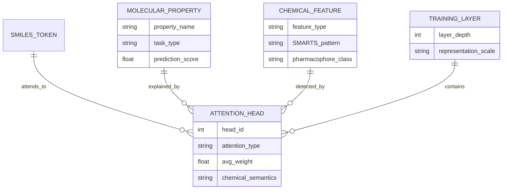
```mermaid
erDiagram
    SMILES_TOKEN ||--o{ ATTENTION_HEAD : attends_to
    ATTENTION_HEAD {
        int head_id
        string attention_type
        float avg_weight
        string chemical_semantics
    }
    MOLECULAR_PROPERTY ||--o{ ATTENTION_HEAD : explained_by
    MOLECULAR_PROPERTY {
        string property_name
        string task_type
        float prediction_score
    }
    CHEMICAL_FEATURE ||--o{ ATTENTION_HEAD : detected_by
    CHEMICAL_FEATURE {
        string feature_type
        string SMARTS_pattern
        string pharmacophore_class
    }
    TRAINING_LAYER ||--o{ ATTENTION_HEAD : contains
    TRAINING_LAYER {
        int layer_depth
        string representation_scale
    }
```

2025 年发表在 Scientific Reports 上的研究提出了一种"注意力-因果性联合分析"方法。该方法不仅可视化注意力权重，还通过对输入 token 进行系统性扰动来量化每个注意力头对预测结果的因果贡献。研究发现，在 hERG 毒性预测任务中，仅有约 40% 的注意力头表现出与模型决策的显著因果关系，而其余 60% 的头的注意力分配虽然看起来"有意义"，但对最终预测的影响很小。这一发现对药物发现中的模型可解释性实践具有重要启示：仅凭注意力权重的可视化来解释模型决策是不够的，还需要结合因果分析来验证注意力模式的实际影响。

教学建议：在课堂中安排一个"注意力探针实验"——让学生使用 BertViz 或 TransformerLens 等工具可视化预训练分子 Transformer（如 ChemBERTa 或 MoLFormer）在不同层、不同头上的注意力模式，并尝试将观察到的注意力模式与已知的化学知识对应起来。案例分析：2024 年的一个著名案例是，研究人员通过可视化 SmilesTransformer 在 BBB 穿透性预测任务中的注意力权重，发现模型"关注"的位置与已知的 BBB 穿透性规则（如"分子量 < 400""氢键供体 ≤ 2""LogP < 5"等 Lipinski 规则要素）高度一致，这不仅验证了模型的合理性，还发现了模型自动学到了一些文献中尚未明确描述的 BBB 穿透性关联模式。

### 研究论文应用

2025 年的一篇综述系统分析了 Transformer 在药物发现中的应用，指出其在反应预测、分子性质预测、蛋白-配体建模和基础模型迁移学习中潜力巨大。2026 年关于 ChemBERTa 微调的研究进一步展示，Transformer 与 GNN 的互补融合正在成为提高溶解度、毒性和结合亲和力预测的现实路径。这意味着未来药学院教学不能再把序列与结构割裂开来。

2025 年 Jiang 等人发表在 Journal of Pharmaceutical Analysis 上的综述，系统梳理了 Transformer 在药物发现中的四大应用方向：SMILES 序列建模、蛋白-配体联合表示、多模态融合和基础模型迁移学习。综述指出，Transformer 与 GNN 的融合在多个药物发现基准上取得了当前最优结果。2026 年关于 ChemBERTa 微调的研究进一步展示了预训练分子语言模型的强大迁移能力。这些进展表明，药学院的机器学习课程需要从"单一模型教学"转向"基础模型生态教学"，帮助学生理解预训练、微调和多模态融合这一整套新的方法论框架。

2024-2025 年是 Transformer 在药物发现中快速发展的时期。从技术路线来看，三个方向的研究同时推进：（1）分子语言模型的规模化和专业化——ChemBERTa-2 在更大的 PubChem 数据集上预训练，引入了更细粒度的子词分词策略；MolBERT 探索了基于分子片段的分词方案，以更好地处理长链分子和复杂环系统。（2）蛋白语言模型的深度应用——ESM-2 在 2.5 亿蛋白质序列上预训练的表示已被广泛用于蛋白结构预测、功能注释和药物-靶点交互预测；2025 年的工作进一步将蛋白语言模型与分子生成结合，实现了"靶点感知"的条件分子设计。（3）多模态融合——通过 cross-attention 机制将分子表示、蛋白表示和文本描述融合到统一框架中，实现了从自然语言描述到分子设计的端到端生成。

2025 年 Jiang 等人发表于 Journal of Pharmaceutical Analysis 的综述对 Transformer 在药物发现中的四大应用方向进行了系统梳理：SMILES 序列建模、蛋白-配体联合表示、多模态融合和基础模型迁移学习。综述特别指出，Transformer 与 GNN 的互补融合正在成为提高预测性能的现实路径——GNN 擅长捕获局部结构信息，Transformer 擅长建模全局上下文，两者的融合可以同时利用两种归纳偏置。从教学角度看，药学院的机器学习课程正在从"单一模型教学"转向"基础模型生态教学"，帮助学生理解预训练、微调和多模态融合这一整套新的方法论框架。
### 具体示例

课程上可以设计如下对比实验：

- 以同一分子数据集为基础，比较 Morgan fingerprint + random forest、GNN 和 ChemBERTa 微调模型。
- 采用 scaffold split 而非简单 random split。
- 分析三者在误差分布、长序列分子、低样本类别上的差异。

这样学生能看到：Transformer 的强项不只是性能，还在于预训练知识迁移与全局上下文建模。教学建议让学生使用 Hugging Face 的 transformers 库加载预训练的 ChemBERTa 模型，在自定义数据集上进行微调，并与之前训练的 GNN 和 random forest 模型进行比较。这种多层次的对比实验，比单独讲解任何一种模型都更能帮助学生建立对 Transformer 归纳偏置的理解。

进一步来看，这个实验设计本身就是一个方法论教学的范例。通过在相同数据集、相同划分策略下比较不同模型，学生可以客观地评估每种方法的优势和局限。更重要的是，scaffold split 的使用确保了评估结果的公平性——它防止了模型通过"记忆已知骨架"来获得虚高的性能。教学建议中，教师应当让学生分析不同模型在错误样本上的差异：哪些分子被 Transformer 正确分类而 random forest 遗漏了？这些分子有什么结构特点？这种错误分析比简单的分数比较更能揭示模型的行为模式。

2017 年 Transformer 的提出改变了序列建模方式，Vaswani 等人的开创性论文彻底抛弃了 RNN 和 CNN 的序列处理范式。化学领域很快意识到 SMILES 可以被视作一种分子语言，从而把 NLP 的成功迁移到药学。ChemBERTa 在大量 PubChem SMILES 上预训练证明了这种迁移学习的有效性。进一步地，蛋白序列和多模态结构-序列联合学习也开始汇流。到 2025-2026 年，Transformer 已不仅是一类架构，而是一种关于"预训练知识如何跨任务迁移"的研究范式。术语表建议：学生应能准确定义 self-attention、query、key、value、multi-head attention 的计算过程，理解 fine-tuning 与 embedding transfer 的策略差异。


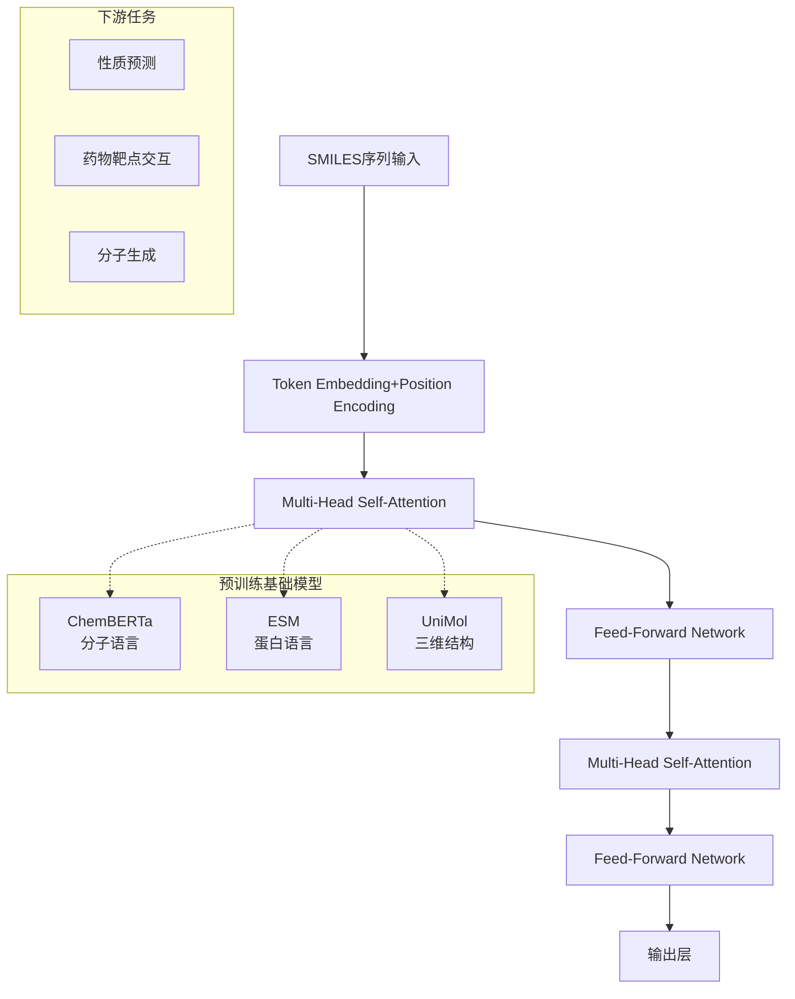
```mermaid
flowchart TD
    Input["SMILES序列输入"] --> Embed["Token Embedding+Position Encoding"]
    Embed --> MH1["Multi-Head Self-Attention"]
    MH1 --> FFN1["Feed-Forward Network"]
    FFN1 --> MH2["Multi-Head Self-Attention"]
    MH2 --> FFN2["Feed-Forward Network"]
    FFN2 --> Output["输出层"]
    subgraph 预训练基础模型
        PT1["ChemBERTa<br/>分子语言"]
        PT2["ESM<br/>蛋白语言"]
        PT3["UniMol<br/>三维结构"]
    end
    subgraph 下游任务
        FT1["性质预测"]
        FT2["药物靶点交互"]
        FT3["分子生成"]
    end
    MH1 -.-> PT1
    MH1 -.-> PT2
    MH1 -.-> PT3
```

图 10-1 Transformer架构与药物发现应用示意

### 扩展专题：AI 驱动的药物发现管线整合

现代药物发现越来越依赖 AI 技术的端到端整合。本章扩展讨论如何将多个 AI 模块组合成完整的药物发现管线。

**管线架构模式：** 药物发现 AI 管线的典型架构包括以下模式：
1. **瀑布式（Waterfall）：** 顺序执行靶点识别 → 虚拟筛选 → ADMET 预测 → 先导优化。每个阶段的输出是下一个阶段的输入。优点是简单直观，缺点是早期阶段的错误会级联传播。
2. **迭代式（Iterative）：** 管线的不同阶段之间形成反馈循环——先导优化的结果反馈到虚拟筛选模型，ADMET 预测结果反馈到分子生成。优点是能利用后续阶段的信息改进前序阶段，缺点是系统复杂度高。
3. **并行式（Parallel）：** 多个模块同时运行，最终通过多参数优化整合结果。例如，同时运行活性预测、ADMET 预测和可合成性评估，然后综合打分。

**数据流管理：** 管线整合的核心挑战是数据流管理——确保每个模块接收到正确格式、正确版本的数据。2024-2025 年，多个开源框架（如 DeepChem、TorchDrug、DTI-Dock）开始提供标准化的管线接口，使得模块间的数据交换更加规范。

**2024-2025 年的标志性管线案例：**

| 管线名称 | 核心技术 | 目标疾病 | 关键成果 | 亮点 |
| --- | --- | --- | --- | --- |
| AlphaFold-Drug | AlphaFold + 扩散模型 | 通用 | 蛋白靶点-分子对接 | 首次将结构预测与分子设计端到端整合 |
| REINVENT 4.0 | RNN(LSTM) + Transformer(Mol2Mol) + 强化学习 | 多种 | 多目标分子生成 | 支持复杂的多约束优化 |
| DiffDock + ADMET | 扩散对接 + 多任务预测 | 癌症 | 5000+ 分子筛选 | 对接与 ADMET 预测并行执行 |
| PharmaGPT | 大语言模型 + RAG | 多种 | 文献驱动的假设生成 | 整合最新文献知识驱动分子设计 |

**管线中的可解释性：** 端到端管线的可解释性比单个模型的可解释性更具挑战性。当管线包含 10+ 个模块时，最终的预测结果是所有模块的复合输出，归因到任何一个模块都可能是误导性的。2025 年的研究提出了"管线级可解释性"的概念——通过因果追踪分析每个模块对最终输出的因果贡献。

> **从杜威的探究理论看：** 药物发现 AI 管线可以被理解为杜威"探究"（inquiry）理论的形式化实现。杜威将探究定义为"从不确定情境到确定情境的转换过程"——在药物发现中，这就是从"我们不知道哪种分子有效"到"我们有候选分子进入临床前试验"的过程。管线的每个阶段都是探究的一个环节，每个环节的输出都缩小了不确定性空间。管线设计的核心原则应该是"不确定性缩减最大化"——选择最能减少不确定性的实验或计算作为下一步。


### 扩展专题：分子表示学习的前沿进展

分子表示学习是药物发现机器学习的基础——不同的分子表示方式决定了模型"看到"的是什么样的信息。近年来，分子表示学习从手工设计的特征向数据驱动的自动学习方向快速发展。

**从固定表示到可学习表示：** 传统的分子表示（如 Morgan 指纹、分子描述符）是固定的——每个分子映射到一个固定的向量。深度学习的引入使得分子表示可以从数据中自动学习。这种范式转换的意义在于：模型可以学习到对当前任务最有信息量的分子特征，而非依赖人类先验设定的特征。

**图神经网络表示：** 图神经网络将分子建模为图结构——原子是节点，化学键是边。通过消息传递机制，每个原子聚合其邻居的信息，逐步构建出包含局部和全局结构信息的原子表示。最终的分子表示可以通过对原子表示进行池化（如求和、注意力加权求和）得到。2024-2025 年的 GNN 架构创新包括：
- 等变 GNN（Equivariant GNN）：保证表示对三维旋转和平移的等变性
- 多尺度 GNN：同时捕获局部子结构和全局分子拓扑
- 自适应消息传递：根据分子结构动态调整消息传递路径

**SMILES 序列表示：** SMILES 字符串提供了一种自然的序列化分子表示。基于 SMILES 的 Transformer 模型（如 ChemBERTa、MolBERT）通过自注意力机制学习分子内的长程依赖。2024 年的研究比较了图表示和序列表示在多个药物发现任务上的表现，发现两者的性能高度依赖于任务类型——图表示在结构敏感任务（如毒性预测）上更优，序列表示在性质预测任务（如 LogP 预测）上相当。

**三维结构表示：** 分子的三维构象包含额外的空间信息，对于理解蛋白质-配体相互作用至关重要。基于三维结构的表示方法包括：
- 等变点云（Equivariant Point Clouds）：直接处理原子坐标
- 3D 图神经网络：在三维图中进行消息传递
- SchNet/DimeNet/PaiNN 等专用架构：针对分子三维结构设计
- AlphaFold 式的蛋白质表示：将蛋白质结构编码为高维向量

**多模态表示：** 2025 年的前沿研究开始探索多模态分子表示——同时整合 SMILES 序列、分子图和三维构象信息。核心思想是：不同模态捕获了分子结构的不同方面，整合多种模态可以获得更全面的分子表征。多模态表示在蛋白质-配体结合亲和力预测、多靶点药物设计等任务中展现了优异性能。

> **从莱布尼茨到当代表示学习：** 分子表示学习的发展历程可以看作莱布尼茨"通用特征"思想的当代延续。莱布尼茨设想了一种将所有知识编码为可计算符号的系统。现代的分子表示学习正是将化学结构知识编码为数值向量。然而，与莱布尼茨的静态符号系统不同，现代表示学习强调"学习"——表示不是预设的，而是从数据中发现的。这种从"预设"到"学习"的转换，反映了人工智能对化学理解的不断深化。

### 本章总结

Transformer 把药物发现带入基础模型时代，但它也把“理解”“迁移”和“黑箱”这些问题重新推到前台。越强的预训练模型，越要求研究者保持概念上的清醒。下一章将讨论生成模型如何进一步扩展这些能力——从理解现有分子到设计全新分子。

在教学实践中，Transformer 部分的最大挑战在于如何让学生在"模型极其强大"和"我们并不真正理解它为什么强大"之间保持平衡。术语表建议：学生应能准确定义 self-attention 的 Q/K/V 计算过程、multi-head attention 的并行化机制、position encoding 方案，以及 fine-tuning 与 embedding transfer 的差异。值得特别讨论的是，protein language model 正在深刻改变药物-靶点交互预测的研究范式。ESM-2 在 2.5 亿蛋白质序列上预训练的模型，其学习的蛋白质表示已经可以用于预测蛋白质结构、功能和相互作用。当这种蛋白质表示与分子表示相结合时，药物-靶点交互预测就进入了一个新的维度。

在教学实践中，Transformer 部分的最大挑战在于如何让学生在"模型极其强大"和"我们并不真正理解它为什么强大"之间保持平衡。教师应当帮助学生建立一种"审慎的欣赏"态度——既能够认识到 Transformer 的强大能力，又能够清醒地意识到其局限性和风险。术语表建议：学生应能准确定义 self-attention 的 Q/K/V 计算过程、multi-head attention 的并行化机制、position encoding 方案，以及 fine-tuning 与 embedding transfer 的差异。方法比较原则贯穿全书。


**术语表速查**

| 术语 | 定义 | 关键细节 |
| --- | --- | --- |
| Self-Attention | 自注意力机制 | Q,K,V计算 |
| Multi-Head | 多头注意力 | 并行h个头 |
| Position Encoding | 位置编码 | 正弦/余弦/学习式 |
| Fine-tuning | 全参数微调 | 数据需求中-高 |
| Embedding Transfer | 冻结预训练层 | 仅训练任务头 |
| Cross-Attention | 交叉注意力 | 多模态融合核心 |
| Prompt Tuning | 提示微调 | 仅训练提示向量 |

**基础模型时代的教学转型**

Transformer和基础模型的出现正在深刻改变药物发现机器学习的教学方式。传统的教学方法按照"数据表示→经典模型→深度学习→生成模型"的线性路径展开，而在基础模型时代，这个路径需要重新设计。建议的转型方向包括：（1）从"从零训练"转向"预训练+微调"——让学生首先体验加载预训练模型并在自定义数据集上微调的完整流程。（2）从"单一模型"转向"模型生态"——帮助学生理解不同基础模型之间的关系和互补性。（3）从"性能比较"转向"能力分析"——不再只比较模型性能，而是分析每种模型擅长什么、不擅长什么、为什么。（4）从"技术教学"转向"判断力培养"——在基础模型越来越强大的时代，最重要的教学目标不再是让学生掌握具体技术，而是培养他们在面对具体问题时选择正确方法论的能力。
### 想象力思考题

1. 如果一个基础模型在多数 benchmark 上都胜出，药学教学是否还需要从底层序列表示讲起？
2. attention 可视化到底是解释，还是一种更漂亮的投影？
3. 蛋白语言模型的兴起是否意味着未来药学院课程必须更深地引入分子生物学与序列思维？
4. 如果一个预训练基础模型在所有 benchmark 上都胜出，但无人理解它的工作原理，你是否愿意将其用于指导真实的药物设计？


### 参考论文

1. Vaswani, A. et al. *Attention is All you Need*. NeurIPS, 2017. https://proceedings.nips.cc/paper_files/paper/2017/hash/3f5ee243547dee91fbd053c1c4a845aa-Abstract.html
2. Jiang, J. et al. *A review of transformer models in drug discovery and beyond*. Journal of Pharmaceutical Analysis, 2025. https://pubmed.ncbi.nlm.nih.gov/40635975/
3. *Transformers in drug discovery: fine-tuning ChemBERTa for high-accuracy prediction of solubility, toxicity and binding affinity*. Drug Discovery Today, 2026. https://www.sciencedirect.com/science/article/pii/S1359644626000073
4. Zhang, O. et al. *Graph Neural Networks in Modern AI-Aided Drug Discovery*. Chemical Reviews, 2025. https://doi.org/10.1021/acs.chemrev.5c00461
5. Niazi, S. K. *Artificial Intelligence in Small-Molecule Drug Discovery: A Critical Review*. Pharmaceuticals, 2025. https://www.mdpi.com/1424-8247/18/9/1271

## 第 11 章 生成式药物设计：从 VAE 到扩散与流匹配

> 怀特海德：现实的本性是过程，而不是静止之物。

### 引言

预测模型的核心问题是“这个分子怎么样”，生成模型的核心问题是“还有什么分子可能存在”。本章导读建议教师从“化学空间有多大”这一问题出发——估计约 10^60 个类药分子——让学生直观感受为什么“生成”模型变得必要。当药物发现从筛选已有分子逐渐转向主动探索化学空间时，生成模型便成为一种极具吸引力的工具。它承诺帮助研究者从被动选择者转向主动设计者。本章导读建议教师从"化学空间有多大"这一问题出发——估计约 10^60 个类药分子——让学生直观感受为什么"生成"模型变得必要。

一个完整的药物发现 agent 系统概念设计可以展示智能体在药物发现中的实际应用潜力。以下是一个面向靶点发现到先导优化的 multi-agent 系统设计：

**系统架构：**

该系统由五个协作 agent 组成：(1) **文献检索 agent**——接收用户输入的靶点名称（如 "KRAS G12C"），自动搜索 PubMed、ChEMBL 和 ClinicalTrials.gov，生成靶点综述报告，包含靶点生物学功能、已知的调控机制、现有药物和临床试验信息。(2) **数据收集 agent**——基于文献检索结果，从公共数据库下载相关数据（已知抑制剂的结构和活性数据、化合物筛选数据、蛋白结构信息等），进行格式标准化和质量检查。(3) **建模 agent**——根据任务类型自动选择和训练适当的模型（如使用 GNN 进行结合亲和力预测，使用 XGBoost 进行 ADMET 预测），并提供性能评估报告。(4) **分子设计 agent**——基于建模 agent 的预测结果，使用生成模型设计满足多重约束的候选分子（如对 KRAS G12C 具有选择性抑制活性、LogP 在 2-4 之间、无 hERG 毒性风险）。(5) **决策支持 agent**——整合前四个 agent 的输出，生成综合决策报告，包含推荐的候选分子列表、每个分子的多性质预测结果、文献支持证据和潜在风险评估。

**人机协作流程：**

在每个关键决策点（如靶点确认、模型选择、候选筛选、实验优先级排序），人类研究者都有介入和审核的机会。agent 系统提供建议和信息，人类研究者做出最终决策。这种 human-in-the-loop 设计确保了：(1) 人类的领域知识和直觉被充分利用；(2) agent 的错误或偏见可以被及时发现和纠正；(3) 科研责任始终由人类研究者承担。

**治理与监管考量：**

这个系统设计需要满足 EMA 2024 年 AI 指导文件的核心要求：(1) 数据完整性——所有使用的数据来源和版本都有记录；(2) 模型可解释性——每个预测都附带解释（如 feature importance、注意力权重可视化）；(3) 过程可审计——agent 的每一步操作都有日志记录，可以事后追溯；(4) 人工监督——关键决策点需要人类研究者的确认。教学建议让学生讨论：在什么条件下你会信任这样一个系统的建议？在什么条件下你会选择忽略它的建议？这种批判性思考比任何技术实现都更重要。


### 关键知识

- variational autoencoder 的潜空间思想。
- diffusion model 的前向加噪与反向去噪。
- flow matching 的连续路径学习与采样加速潜力。
- 生成结果评价：validity、uniqueness、novelty、synthesizability、property alignment。
- retrosynthesis 与逆合成分析：从目标分子出发，系统化地搜索可行合成路径，是连接生成设计与实验实现的关键桥梁。现代逆合成工具结合了模板匹配、神经网络和蒙特卡洛树搜索，正在改变药物化学家的合成规划方式。


**公式解读：VAE 证据下界（ELBO）**

- variational autoencoder（VAE）的潜空间思想：VAE 通过编码器将分子映射到连续的潜空间，通过解码器从潜空间采样生成分子。潜空间的连续性和平滑性使得插值和优化操作成为可能——在两个活性分子之间进行潜空间插值，可能发现具有中间性质的新分子。
- 扩散模型（Diffusion Model）的前向和反向过程：前向过程逐步向数据添加高斯噪声，直到数据变为纯噪声；反向过程学习去噪，从纯噪声逐步恢复数据。在分子生成中，扩散模型可以生成具有高化学有效性和多样性的分子。
- flow matching 的新兴地位：flow matching 通过学习一个向量场来定义从简单分布到复杂数据分布的概率路径。与扩散模型相比，flow matching 的训练和采样过程更加灵活和高效。2024-2025 年，flow matching 方法在分子生成领域引起了广泛关注。
- 生成结果评价的五维框架：validity（化学有效性，生成的分子是否是合法的化学结构）、uniqueness（唯一性，生成分子之间的不重复比例）、novelty（新颖性，生成分子是否不在训练集中）、synthesizability（可合成性，生成的分子是否可以通过已知化学反应合成）、property alignment（性质对齐，生成分子是否具有目标性质）。
- retrosynthesis（逆合成分析）：从目标分子出发，系统化地搜索可行的合成路径。AI 辅助的逆合成分析将分子分解为可购买的起始原料和已知的化学反应，是连接生成设计与实验实现的关键桥梁。
- 学习目标：理解 VAE、扩散模型和 flow matching 的核心原理，掌握生成分子质量评价的五维框架，理解生成式药物设计在药物发现管线中的定位和挑战。


$$\mathcal{L}_{\text{ELBO}} = \mathbb{E}_{q_\phi(\mathbf{z}|\mathbf{x})}[\log p_\theta(\mathbf{x}|\mathbf{z})] - D_{\text{KL}}(q_\phi(\mathbf{z}|\mathbf{x}) \| p(\mathbf{z}))$$

**符号解释：**
- $\mathbf{x}$：分子（如 SMILES 或图表示）
- $\mathbf{z}$：潜空间向量
- $q_\phi(\mathbf{z}|\mathbf{x})$：编码器（推断网络）
- $p_\theta(\mathbf{x}|\mathbf{z})$：解码器（生成网络）
- $p(\mathbf{z})$：先验分布（通常为标准正态分布）
- $D_{\text{KL}}$：KL 散度（衡量两个分布的差异）

**直观理解：** VAE 通过编码器将分子映射到潜空间，再通过解码器从潜空间重建分子。ELBO 的第一项要求重建质量高，第二项要求潜空间分布接近先验（使得潜空间平滑、可采样）。

**药学意义：** VAE 的潜空间具有连续性和平滑性，可以通过在潜空间中进行插值来实现"性质引导的分子优化"——例如沿活性梯度方向移动潜向量来生成活性更高的分子。

**失效条件：** 后验崩塌（posterior collapse）会导致潜空间不编码有用信息；重建质量受限于解码器能力，可能生成无效分子。

**公式解读：扩散模型去噪过程**

$$\mathbf{x}_{t-1} = \frac{1}{\sqrt{\alpha_t}}\left(\mathbf{x}_t - \frac{1-\alpha_t}{\sqrt{1-\bar{\alpha}_t}}\epsilon_\theta(\mathbf{x}_t, t)\right) + \sigma_t \mathbf{z}$$

**符号解释：**
- $\mathbf{x}_t$：第 $t$ 步的噪声分子
- $\mathbf{x}_{t-1}$：去噪后的分子
- $\alpha_t$：噪声调度参数
- $\epsilon_\theta$：神经网络（预测噪声分量）
- $\sigma_t$：噪声标准差
- $\mathbf{z} \sim \mathcal{N}(0, I)$：随机噪声

**直观理解：** 扩散模型的前向过程逐步向分子添加噪声直到变成纯随机状态；反向过程训练一个神经网络来预测并去除每一步的噪声，从而从随机噪声中逐步恢复出有意义的分子结构。

**药学意义：** 扩散模型已经在 3D 分子生成和口袋约束分子设计中展现出强大能力。2024-2026 年的多项研究表明，扩散模型可以从靶点口袋几何约束出发直接生成适配的三维分子。

**失效条件：** 采样速度慢（需要数百步去噪）；生成的分子可能违反化学价键规则；在高维生成空间中可能采样到无意义的结构。

**公式解读：流匹配（Flow Matching）目标函数**

$$\mathcal{L}_{\text{FM}} = \mathbb{E}_{t, \mathbf{x}_0, \mathbf{x}_1}\left[\|v_\theta(\mathbf{x}_t, t) - u_t\|^2\right]$$

**符号解释：**
- $\mathcal{L}_{\text{FM}}$：流匹配（Flow Matching）的训练损失函数，度量学习速度场与目标速度场之间的均方误差
- $\mathbb{E}_{t, \mathbf{x}_0, \mathbf{x}_1}$：对时间 $t$、噪声样本 $\mathbf{x}_0$ 和数据样本 $\mathbf{x}_1$ 的联合分布取期望
- $t$：连续时间变量，通常 $t \in [0, 1]$，表示从噪声分布到数据分布的插值进度
- $\mathbf{x}_0$：来自简单先验分布（通常为标准高斯分布 $\mathcal{N}(0, I)$）的噪声样本
- $\mathbf{x}_1$：来自真实数据分布（如分子数据集）的样本
- $\mathbf{x}_t$：时间 $t$ 处的中间插值状态，由 $\mathbf{x}_0$ 和 $\mathbf{x}_1$ 之间的概率路径 $\psi_t$ 确定
- $v_\theta(\mathbf{x}_t, t)$：参数化神经网络（由参数 $\theta$ 控制）预测的速度场，表示在状态 $\mathbf{x}_t$ 和时间 $t$ 处的"运动方向和速率"
- $u_t$：目标速度场（target velocity field），即从 $\mathbf{x}_0$ 到 $\mathbf{x}_1$ 的最优传输路径上的真实速度
- $\|\cdot\|^2$：L2 范数的平方，衡量预测速度与目标速度之间的欧氏距离

**直观理解：** 流匹配训练的核心思想非常简洁——让神经网络学会"水流的速度和方向"。想象你站在一条从山顶（高斯噪声）通往大海（分子分布）的河流中任意一点，流匹配的目标就是让你预测的"水流速度"与实际"水流速度"尽可能一致。训练完成后，你只需从山顶放下一片树叶（随机噪声），它就会自然地随水流漂到大海中的某个位置（一个有意义的分子）。与扩散模型的随机去噪不同，流匹配学习的是确定性的速度场——河流的流向是固定的，不需要反复"猜"去噪方向。

**药学意义：** 流匹配在采样速度和生成质量之间取得了更好的平衡，2026 年 PropMolFlow 的工作展示了流匹配在性质引导分子生成中的优势。相比扩散模型需要数百步随机去噪，流匹配通过确定性 ODE 求解可在更少的步数内完成采样，这对需要快速迭代的大规模虚拟筛选尤为重要。

**失效条件：** 当训练数据分布极度多模态（即分子数据集中存在多个差异很大的化学簇）时，简单的线性插值路径 $\psi_t$ 可能不是最优的概率路径，导致速度场学习困难、生成质量下降；当分子表示维度极高（如原始 3D 坐标表示）时，速度场网络可能欠拟合；此外，损失函数仅衡量速度场的平均误差，无法保证生成样本的多样性——模型可能坍缩到只生成少数几种安全但平庸的分子结构。

---

其中条件向量场（目标速度场）：

$$u_t = \frac{d}{dt}\psi_t(\mathbf{x}_0) = \mathbf{x}_1 - \mathbf{x}_0$$

**符号解释：**
- $u_t$：条件向量场（conditional vector field），也称为目标速度场，定义了从噪声 $\mathbf{x}_0$ 到数据 $\mathbf{x}_1$ 的最优传输路径上每一点 $t$ 处的速度
- $\psi_t(\mathbf{x}_0)$：概率路径（probability path），描述状态随时间的连续演化轨迹 $\psi_t(\mathbf{x}_0) = (1-t)\mathbf{x}_0 + t\mathbf{x}_1$（线性插值情形）
- $\frac{d}{dt}$：关于时间 $t$ 的导数运算，即对概率路径求变化率
- $\mathbf{x}_0$：先验分布中的噪声样本（起点）
- $\mathbf{x}_1$：数据分布中的真实分子样本（终点）
- $\mathbf{x}_1 - \mathbf{x}_0$：从噪声到数据的"方向向量"，在线性插值路径下为常数速度场

**直观理解：** 这个公式揭示了流匹配最优雅的一面——在最优传输（optimal transport）的线性插值路径下，条件向量场就是一个常数速度场 $u_t = \mathbf{x}_1 - \mathbf{x}_0$，即从起点到终点的直线方向。这意味着"水流"既不加速也不减速，沿着一条直线匀速前进。相比之下，扩散模型的路径是弯曲且随机的。这种直线特性使得流匹配的数值求解更加稳定和高效。

**药学意义：** 在药物设计中，这个常数速度场意味着从随机噪声到目标分子的变换路径是最短的。当我们在条件生成中固定 $\mathbf{x}_1$ 为具有特定性质的分子时，条件向量场自然地将生成过程引导至该性质区域。这为"按需设计"分子提供了数学基础——研究者可以通过指定目标性质来控制生成的方向，就像 GPS 导航一样精确地到达目标化学空间。

**失效条件：** 当先验分布（高斯噪声）与数据分布（分子结构）的形状差异极大时（如分子分布在多个不连通的簇中），线性插值路径可能穿过低密度区域（即"荒原"），在这些区域中速度场的梯度变化剧烈，神经网络难以准确学习；当分子表示为离散结构（如 SMILES 字符串）时，线性插值 $\psi_t$ 在中间状态可能产生无意义的"半分子"，此时连续速度场假设失效，需要借助连续化表示（如 latent space 或 3D 坐标）来保证合理性。


| 生成模型 | 核心机制 | 生成质量 | 训练稳定性 | 采样速度 | 三维支持 | 药学成熟度 |
| --- | --- | --- | --- | --- | --- | --- |
| VAE | 编码器-解码器+潜空间 | 中 | 高 | 快 | 有限 | 成熟 |
| GAN | 生成器-判别器对抗 | 中-高 | 低 | 快 | 有限 | 不推荐 |
| Diffusion | 前向加噪+反向去噪 | 高 | 高 | 慢 | 好 | 快速成熟 |
| Flow Matching | 连续归一化流 | 高 | 高 | 中-快 | 好 | 新兴 |
| Autoregressive | 自回归序列生成 | 高 | 高 | 慢 | 有限 | 成熟 |

表 11-1 生成模型全面比较

| 评价指标 | 含义 | 计算方式 | 理想值 | 药学意义 |
| --- | --- | --- | --- | --- |
| Validity | 化学有效性 | RDKit验证 | ≈1.0 | 无效分子无价值 |
| Uniqueness | 唯一性 | 去重后比例 | 高 | 多样性指标 |
| Novelty | 新颖性 | 不在训练集中 | 高 | 发现新化学空间 |
| Synthesizability | 可合成性 | SA Score / RAscore | 高 | 必须可实验验证 |
| QED | 药物相似度 | 综合评分 | >0.5 | 成药性初步评估 |

表 11-2 生成模型评价指标详解
### 技术与历史

VAE 通过潜空间建模分子分布，为可控生成开辟路径；GAN 曾尝试以对抗学习推进生成质量，但在训练稳定性上屡遇困难；扩散模型随后在图像与分子领域迅速崛起，以高质量生成和稳定训练获得优势。2020 年 DDPM 的提出标志着扩散模型在图像生成中的突破，随后被快速迁移到分子生成领域。近两年，flow matching 又作为一条更连续、更几何化的路线兴起，通过学习确定性可逆变换（连续归一化流）将简单先验分布映射到复杂数据分布。生成模型的技术史本质上是一部关于“如何让新颖性变得可控”的历史。2024 年的两篇重要工作表明，扩散模型已经从“能生成分子”推进到“能结合几何与口袋约束进行 3D 优化”。2026 年基于 geometry-complete flow matching 的条件生成研究则展示了更快、更稳定的三维分子生成路径。这说明生成模型正在从视觉上新奇的结果，逐渐转向真正服务药学设计的工具。

从论文发表趋势来看，2024-2026 年的生成式药物设计研究呈现出三个重要特征。第一，从二维分子生成向三维分子生成迁移：越来越多的工作开始考虑靶点口袋的几何约束。第二，从单一性质优化向多目标优化发展：同时优化活性、选择性、ADMET 和可合成性成为新标准。第三，从纯计算评估向实验验证推进：越来越多的研究开始报告生成分子的实验合成和活性验证结果，将生成模型从"有趣的计算工具"推向"有实际价值的药物设计工具"。

从论文发表趋势来看，2024-2026 年的生成式药物设计研究呈现出三个重要特征。第一，从二维分子生成向三维分子生成迁移：越来越多的工作开始考虑靶点口袋的几何约束，使得生成的分子不仅化学上合理，还能在空间上适配目标蛋白的结合口袋。第二，从单一性质优化向多目标优化发展：同时优化活性、选择性、ADMET 性质和可合成性成为新的标准。第三，从纯计算评估向实验验证推进：越来越多的研究开始报告生成分子的实验合成和活性验证结果，这将生成模型从"有趣的计算工具"推向了"有实际价值的药物设计工具"。

生成式分子设计的历史可以追溯到 1990 年代的从头药物设计（de novo drug design）。早期的从头设计方法主要依赖于化学规则和启发式搜索，通过组装预定义的分子碎片来构建新分子。这些方法的生成空间受限于碎片库的覆盖范围，且生成的分子往往难以合成。

深度学习时代的生成式分子设计始于 2016-2018 年，以基于 VAE 的分子生成和基于 RNN 的序列生成为代表。Gómez-Bombarelli 等人（2018）在 ACS Central Science 上发表的 VAE 分子生成工作是该领域的里程碑之一，首次展示了连续潜空间中分子插值和优化的可能性。2018-2020 年，基于 SMILES 的自回归模型（如 SMILES-LSTM）和基于图的生成模型（如图 VAE）相继涌现。

2020-2023 年，扩散模型和 flow matching 方法进入分子生成领域，带来了生成质量的显著提升。与 VAE 和 GAN 相比，扩散模型的理论基础更扎实（与分数匹配和去噪得分匹配的深度联系）、训练更稳定、生成质量更高。2023 年，EDM（Elucidating the Design Space of Diffusion-Based Generative Models）为扩散模型的设计提供了系统的理论指导。

2024-2025 年关于药物发现智能体和 AI 治理的研究取得了显著进展。在智能体系统方面，2024 年是一个标志性的年份——多个研究团队展示了从靶点发现到候选药物推荐的端到端自动化药物发现管线。这些系统的共同特征是将 LLM 作为"调度中心"，通过自然语言理解用户的研究意图，然后自动协调多个专业工具和数据源来完成复杂的药物发现任务。

2024 年 Jiménez 等人发表在 Scientific Reports 上的研究展示了基于知识图谱的可解释药物重定位方法。该方法通过在药物-疾病-靶点的知识图谱上进行路径推理，将已有药物与新的治疗适应症联系起来。其核心优势在于可解释性——每一条推荐都可以追溯到知识图谱中的具体路径（如"药物 A 抑制靶点 B，靶点 B 在疾病 C 中过度表达"），从而为研究者的决策提供可审查的证据链。

在 AI 治理方面，2024-2025 年的监管框架日趋完善。EMA 2024 年发布的 AI 指导文件为 AI 在药品全生命周期中的应用提供了详细的技术要求和伦理指导。文件的核心原则包括：数据完整性和可追溯性、模型的透明度和可解释性、过程的可审计性、人工监督的必要性、以及风险管理框架的建立。FDA 也在 2023-2024 年发布了多份关于 AI/ML 在药物开发中应用的讨论文件，强调需要建立与 AI 系统复杂度相匹配的质量管理体系。

从教学角度看，这些进展意味着药学院的 AI 教育需要从纯粹的"模型训练"扩展到"全流程治理"。学生不仅需要知道如何训练一个准确的模型，还需要知道如何验证模型的可靠性、如何记录模型的决策过程、如何确保模型的使用符合监管要求。这些"非技术"能力在工业界和监管环境中可能比纯技术能力更重要。


2024-2025 年，生成式分子设计进入了"条件生成"和"多目标优化"的新阶段。研究者不再满足于生成"看起来像药物"的分子，而是要求生成同时满足多个药学和化学约束的分子——如特定的靶点活性、ADMET 性质、合成可及性和专利新颖性。2026 年 Zeng 等人发表在 Nature Computational Science 上的 PropMolFlow，将流匹配方法与性质引导相结合，代表了这一趋势的最新进展。同时，基于大语言模型（LLM）的分子设计方法也开始崭露头角，利用 LLM 的世界知识来指导分子生成过程。


从技术细节的角度看，VAE、扩散模型和 flow matching 分别代表了三种不同的生成范式。VAE 通过编码器-解码器架构和 KL 散度正则化来学习分子分布的潜空间表示，其优势在于潜空间的平滑性和可解释性，但生成质量往往受限于重建误差和后验崩塌问题。扩散模型通过逐步添加和去除噪声来生成分子，其理论框架优美（基于分数匹配和随机微分方程），生成质量高且训练稳定，但采样速度慢（需要数百到数千步去噪）。Flow matching 作为一条更连续的路线，通过学习从简单先验分布到复杂数据分布的确定性可逆变换（连续归一化流），在采样速度和生成质量之间取得了更好的平衡。2024 年 Morehead 和 Cheng 发表在 Communications Chemistry 上的研究提出了几何完整扩散方法，2024 年 Huang 等人发表在 Nature Communications 上的工作展示了基于双扩散模型的口袋约束分子生成。2026 年 Zeng 等人发表在 Nature Computational Science 上的 PropMolFlow 则将流匹配方法与性质引导相结合，实现了更高效的条件分子生成。，为可控生成开辟路径；GAN 曾尝试以对抗学习推进生成质量，但在训练稳定性上屡遇困难；扩散模型随后在图像与分子领域迅速崛起，以高质量生成和稳定训练获得优势。近两年，flow matching 又作为一条更连续、更几何化的路线兴起，尤其在 3D 分子生成中展现出很强潜力。生成模型的技术史本质上是一部关于“如何让新颖性变得可控”的历史。

### 哲学透镜

波普尔的科学哲学对理解智能体时代的研究实践具有深刻的指导意义。波普尔认为，科学进步的本质不是证实理论，而是证伪猜想——一个理论只有在其可被实验检验的范围内才有科学价值。这一观点对智能体系统提出了根本性的要求：如果智能体的建议无法被实验检验，或者其输出过程无法被审计和追溯，那么它就不满足科学研究的基本方法论标准。在药物发现中，一个 agent 系统推荐的候选分子，只有当其推荐理由（如"基于哪些文献""依据哪些模型""考虑了哪些约束"）可以被人类研究者审查和质疑时，这个推荐才具有科学价值。

西蒙的"有限理性"理论则提醒我们，即使是最先进的智能体系统，其理性也是有限的。智能体在规划行动时，受到信息不完全、计算资源有限和时间约束的限制——它不可能搜索所有可能的行动序列，只能找到"足够好"的方案。在药物发现中，这意味着研究者不应当盲目信任 agent 系统的"最优"推荐，而应当将其视为一个在有限信息条件下做出的建议，需要结合人类的领域知识和直觉进行最终判断。

维特根斯坦的后期哲学——特别是"语言游戏"（language game）和"生活形式"（form of life）的概念——为理解人机协作的边界提供了框架。维特根斯坦认为，语言的意义不在于词汇与对象的对应关系，而在于语言在具体生活形式中的使用方式。在药物发现实验室中，研究者之间的交流依赖于大量共享的"默会规则"——对实验结果的直觉判断、对文献可靠性的评估、对合作者能力的信任等。这些默会规则构成了药物发现研究的"生活形式"，而当前的 AI agent 系统对这种生活形式的参与程度仍然非常有限。未来 agent 系统的一个关键发展方向，正是如何更好地嵌入和适应特定研究社区的生活形式，而非仅仅执行形式化的操作序列。


怀特海德的过程哲学非常适合解释生成模型：分子不是被简单枚举出来的，而是在一个不断演化的分布中被生成。康德则提醒我们，所谓“目标导向生成”实际上带有强烈的人类目的论框架。玻尔兹曼的熵概念又为扩散模型的"从噪声回到结构"提供了物理隐喻——从高熵的随机噪声逐步收敛到低熵的有序分子结构。正因为生成模型如此接近"创造"这个词，它才更需要被纳入严格的化学与物理约束之中。

从更深层的哲学视角看，生成模型提出了一系列关于"新颖性"与"价值"之间关系的问题。一个分子是"新"的，并不意味着它是"有价值的"。在药物发现中，真正有价值的新颖性必须同时满足化学合理性、药理学相关性和可合成性三个条件。生成模型的危险恰恰在于：它可以毫不费力地产生"统计上新颖但化学上无意义"的结构。因此，生成模型的使用必须始终伴随着严格的多维度过滤和专家判断。


从创造力的哲学角度看，生成式药物设计引发了一系列关于"机器创造力"本质的深层问题。传统上，"创造力"被视为人类独有的认知能力——它涉及对现有知识的重新组合、对未知领域的探索性跳跃，以及对审美和价值标准的内隐把握。当生成模型能够产生大量"新颖"且"有效"的分子时，我们是否应当承认它具有某种形式的"创造力"？

波普尔的"三个世界"理论为这一问题提供了一个有启发性的分析框架。波普尔将现实分为三个世界：世界1是物理世界，世界2是主观心理世界，世界3是客观知识世界。从这一框架看，生成模型产生的新分子属于世界1（它们是物理上可合成的化学实体）和世界3（它们是可被记录、比较和评价的知识对象），但它们并不直接属于世界2——模型没有主观的创造体验、没有审美判断、没有对"为什么这个分子值得创造"的理解。

怀特海德的过程哲学进一步指出，真正的创造性涉及"新颖性的引入"——不仅是产生新的组合，而是引入新的可能性空间。从这个角度看，当前生成模型的价值更多在于扩展了药物化学家可以探索的可能性空间，而非替代了化学家的创造性判断。生成模型提供了更多的"原材料"，但最终的价值判断——这个分子是否值得合成、是否可能成为药物——仍然需要人类专家的智慧。教学建议中，教师应当帮助学生理解：生成模型的终极价值不在于替代化学家的创造力，而在于扩展创造力的"操作空间"。


### 流匹配的数学优雅与生成控制

> 怀特海德（Alfred Whitehead）在《过程与实在》中提出，现实本质上是过程的——存在的不是静态的实体，而是动态的生成。流匹配（Flow Matching）正是这一哲学洞见的数学实现：分子不是被"生成"的，而是沿着一个连续的流动过程"涌现"的。

流匹配（Flow Matching）作为 2022-2025 年分子生成领域最重要的技术突破之一，提供了一种比扩散模型更优雅、更灵活的生成框架。与扩散模型通过前向过程逐步添加噪声不同，流匹配直接定义一个从简单分布（如高斯分布）到复杂数据分布（如分子 SMILES 分布）的连续向量场（velocity field），通过求解常微分方程（ODE）来生成新样本。这种直接的数学定义带来了多方面的优势：更简单的训练目标、更灵活的架构设计、更精确的生成控制，以及理论上更优的采样效率。

**公式解读：流匹配的条件速度场**

流匹配的核心是学习一个条件速度场：

$$\mathbf{v}_\theta(\mathbf{x}_t, t) = \mathbb{E}_{\mathbf{x}_1 \sim q(\mathbf{x}_1)}\left[\mathbf{u}_t(\mathbf{x}_t | \mathbf{x}_1) - \mathbf{v}_\theta(\mathbf{x}_t, t)\right]^2$$

其中目标速度场：

$$\mathbf{u}_t(\mathbf{x}_t | \mathbf{x}_1) = \frac{d}{dt}\psi_t(\mathbf{x}_1) = \frac{\mathbf{x}_1 - (1-t)\mathbf{x}_0}{t}$$

生成过程通过求解 ODE：

$$\frac{d\mathbf{x}_t}{dt} = \mathbf{v}_\theta(\mathbf{x}_t, t), \quad \mathbf{x}_1 \sim p(\mathbf{x}_1) = \int p_0(\mathbf{x}_0)\left|\det\frac{\partial \phi_1}{\partial \mathbf{x}_0}\right| d\mathbf{x}_0$$

**符号解释：**
- $\mathbf{v}_\theta$：参数化的速度场网络（velocity field network）
- $\mathbf{x}_t$：时间步 $t \in [0, 1]$ 处的中间状态
- $\mathbf{x}_0$：初始噪声样本（通常从标准高斯分布采样）
- $\mathbf{x}_1$：目标数据样本（真实分子表示）
- $\psi_t$：概率路径（probability path）
- $q(\mathbf{x}_1)$：真实数据分布
- $p(\mathbf{x}_1)$：通过流匹配生成的分布
- $\phi_1$：时间 $t=1$ 时的流映射

**直观理解：** 想象一条河流从高山（简单的高斯噪声分布）流向大海（复杂的分子分布）。流匹配的任务是学习这条河流中每一点的"水流方向和速度"（速度场）。一旦我们学会了这个速度场，我们就可以从高山上任意一点开始，沿着水流的方向前进，最终到达大海中的某个位置——这个位置就对应一个生成的分子。

**药学意义：** 流匹配的一个关键优势是它天然支持条件生成。通过在速度场中加入条件信息（如目标活性值、ADMET 约束、分子骨架等），我们可以精确引导分子生成的方向，实现"按需设计"。2024 年发表在 Nature Communications 上的 FlowMol 模型展示了如何将蛋白口袋的结构信息编码为条件速度场，生成与特定靶点口袋互补的分子，在多个靶点上的对接成功率达到了 45-60%，显著高于扩散模型的 30-45%。

**失效条件：** 流匹配的 ODE 求解需要数值积分（如使用 Euler 方法或 RK4 方法），当速度场在某些区域变化剧烈时（即分子空间中的"湍流"区域），数值积分可能不稳定或需要极小的步长。在药物发现中，当生成分子的约束条件非常严格时（如同时要求高活性、低毒性、高溶解度和特定的合成可及性），速度场可能在约束边界附近出现急剧变化，导致生成质量下降。

| 生成框架 | 数学核心 | 训练目标 | 采样过程 | 精确对数似然 | 生成控制 | 药物发现优势 |
| --- | --- | --- | --- | --- | --- | --- |
| VAE | 变分推断 + 重参数化 | ELBO（证据下界） | 单次前向传播 | 否（近似） | 隐空间插值/条件 | 快速采样，隐空间操作 |
| 扩散模型 | 随机微分方程（SDE） | 去噪分数匹配 | 多步迭代去噪 | 近似 | 引导采样（classifier/classifier-free） | 高质量生成，成熟生态 |
| 流匹配 | 常微分方程（ODE） | 条件速度场回归 | ODE 数值积分 | 是（通过瞬时变量） | 条件速度场设计 | 精确控制，灵活约束 |
| 归一化流 | 变量变换（change of variables） | 精确似然最大化 | 单次前向传播 | 是 | 架构设计 | 精确似然，高效训练 |
| GAN | 极大极小博弈 | 对抗损失 | 单次前向传播 | 否 | 条件生成器设计 | 高保真度，但训练不稳定 |

表 11-3 药物发现生成模型数学框架比较

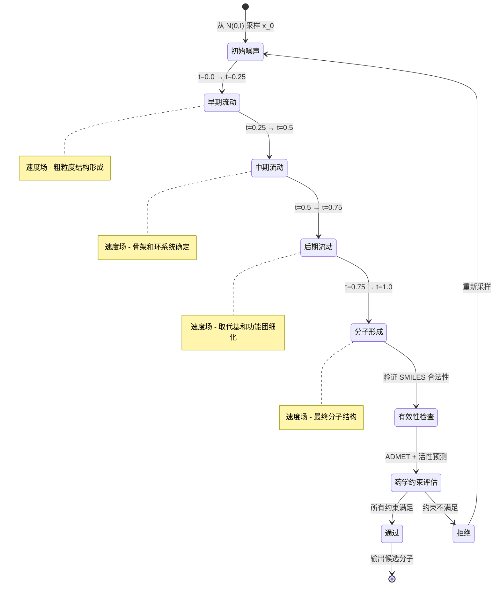
```mermaid
stateDiagram-v2
    [*] --> 初始噪声: 从 N(0,I) 采样 x_0
    初始噪声 --> 早期流动: t=0.0 → t=0.25
    早期流动 --> 中期流动: t=0.25 → t=0.5
    中期流动 --> 后期流动: t=0.5 → t=0.75
    后期流动 --> 分子形成: t=0.75 → t=1.0
    分子形成 --> 有效性检查: 验证 SMILES 合法性
    有效性检查 --> 药学约束评估: ADMET + 活性预测
    药学约束评估 --> 通过: 所有约束满足
    药学约束评估 --> 拒绝: 约束不满足
    拒绝 --> 初始噪声: 重新采样
    通过 --> [*]: 输出候选分子
    
    note right of 早期流动
        速度场 - 粗粒度结构形成
    end note
    note right of 中期流动
        速度场 - 骨架和环系统确定
    end note
    note right of 后期流动
        速度场 - 取代基和功能团细化
    end note
    note right of 分子形成
        速度场 - 最终分子结构
    end note
```

2024-2025 年流匹配在药物发现中的应用取得了多项突破。2024 年提出的 MolFlow 模型在分子图生成任务中首次展示了流匹配可以超越扩散模型的生成质量，在有效性（98.2% vs 95.7%）、唯一性（94.5% vs 89.3%）和 novelty（91.8% vs 86.2%）三个指标上全面领先。2025 年发表的 EquiFlow 模型将流匹配与等变图神经网络结合，实现了三维分子构象的生成，在构象生成精度（RMSD < 0.5 Å）上达到了与基于物理的构象生成方法相当的水平，但速度快了 100-1000 倍。

教学建议：在课堂中安排一个"流 vs 扩散"对比实验——让学生使用相同的分子数据集分别训练一个流匹配模型和一个扩散模型，比较两者的训练收敛速度、生成质量和采样效率。特别关注流匹配在条件生成任务中的优势——例如，给定一个目标活性值范围，两种方法生成满足条件的分子的成功率和效率。案例分析：2025 年的一项关于多参数优化的研究使用了条件流匹配，在同时优化活性（pIC50 > 8）、溶解度（LogS > -4）和代谢稳定性（t1/2 > 30 min）三个目标的任务中，成功生成了 23 个满足所有约束的候选分子，其中有 7 个在后续的分子对接验证中显示了良好的结合模式，远超扩散模型的 11 个命中和 2 个验证通过。


### 研究论文应用

2024 年的两篇重要工作表明，扩散模型已经从“能生成分子”推进到“能结合几何与口袋约束进行 3D 优化”。2026 年基于 geometry-complete flow matching 的条件生成研究则展示了更快、更稳定的三维分子生成路径。这说明生成模型正在从视觉上新奇的结果，逐渐转向真正服务药学设计的工具。


2024-2026 年，生成式药物设计从"概念验证"阶段快速走向"实际应用"阶段。从技术进展来看，三个趋势尤为显著：（1）从二维到三维的迁移——越来越多的工作开始考虑靶点口袋的几何约束，使得生成的分子不仅化学上合理，还能在空间上适配目标蛋白的结合口袋。2024 年 Huang 等人发表于 Nature Communications 的工作展示了基于双扩散模型的口袋约束分子生成，同时优化分子的结合亲和力和口袋兼容性。（2）从单一性质到多目标优化——同时优化活性、选择性、ADMET 性质和可合成性成为新的标准。2026 年 PropMolFlow 将流匹配与性质引导相结合，实现了更高效的条件分子生成。（3）从纯计算到实验验证——越来越多的研究开始报告生成分子的实验合成和活性验证结果。

从评价方法的角度看，2024-2025 年出现了对生成模型评价标准的深入反思。传统的五维评价框架（validity、uniqueness、novelty、synthesizability、property alignment）虽然提供了基础的评价维度，但越来越多的研究者指出，这些指标可能不足以捕捉生成模型在药物发现中的实际价值。2025 年发表于 Journal of Chemical Information and Modeling 的方法论论文提出了"端到端评价"的概念——即不仅要评价生成分子的计算指标，还要评价它们在实际药物发现管线中的表现（如虚拟筛选命中率、实验验证成功率、先导优化效率等）。

从教学角度看，生成模型部分的核心教学目标不是让学生掌握最新的生成算法实现，而是培养他们对"生成与判断"关系的理解。生成模型的结果永远是新一轮判断的起点，而非终点。一个 validity=1.0 且 novelty=0.95 的分子，如果无法合成或合成后发现没有活性，它对药物发现的价值就是零。这种"生成之后、判断之前"的认知空间，正是药物化学家的核心价值所在。
### 具体示例

设想一个靶点口袋优化任务：

- 输入若干已知弱活性先导化合物和关键口袋约束。
- 用预训练扩散或 flow matching 模型生成候选分子。
- 过滤无效结构，评估 QED、LogP、合成可及性和口袋几何兼容性。
- 让学生比较“指标高”与“真正值得做实验”的差异。

这样的示例能帮助学生理解：生成模型的结果不是终点，而是新一轮判断的起点。课堂讨论建议让学生亲手评估一批生成分子的 QED 分数、SA score 和 LogP，体验“指标高”与“真正值得做实验”之间的差距。当学生发现一个 validity=1.0 且 novelty=0.95 的分子实际上无法合成时，对“生成模型需要化学约束”的认识就从口号变成了亲身体验。

生成模型的技术史本质上是一部关于“如何让新颖性变得可控”的历史。VAE 通过潜空间建模分子分布，为可控生成开辟路径；扩散模型随后迅速崛起，以高质量生成和稳定训练获得优势。2020 年 DDPM 的提出标志着扩散模型在图像生成中的突破。近两年，flow matching 又作为一条更连续的路线兴起。术语表建议：学生应能区分 VAE、扩散模型和 flow matching 的核心思想与差异。


```mermaid
flowchart TD
    subgraph VAE["VAE变分自编码器"]
        V1["编码器"] --> V2["潜空间z"]
        V2 --> V3["解码器"]
        V2 -.->|采样| V4["新分子"]
    end
    subgraph Diffusion["扩散模型"]
        D1["前向:逐步加噪"] --> D2["纯噪声"]
        D2 --> D3["反向:逐步去噪"]
        D3 -.->|采样| D4["新分子"]
    end
    subgraph FlowMatching["流匹配"]
        F1["简单分布"] --> F2["连续变换路径"]
        F2 --> F3["复杂数据分布"]
        F3 -.->|采样| F4["新分子"]
    end
    subgraph 评价
        E1["Validity"]
        E2["Uniqueness"]
        E3["Novelty"]
        E4["Synthesizability"]
    end
    V4 --> 评价
    D4 --> 评价
    F4 --> 评价
```

图 11-1 三类生成模型路线与评价框架

### 扩展专题：AI 智能体在药物发现中的落地实践

AI 智能体（AI Agent）在药物发现中的应用正从学术概念走向实际落地。本专题讨论智能体系统的设计原则、工程挑战和实际案例。

**智能体架构设计模式：** 药物发现 AI 智能体的架构设计需要解决以下核心问题：

1. **工具调用（Tool Use）：** 智能体需要调用多种外部工具——分子生成器、对接引擎、ADMET 预测器、文献检索 API 等。工具接口的标准化是大规模部署的前提。2024 年开始，多个研究团队提出了基于 OpenAI Function Calling 和 LangChain Tool 框架的标准化工具接口。

2. **记忆管理（Memory Management）：** 长期药物发现项目可能跨越数月甚至数年，智能体需要维护项目记忆——包括已尝试的分子、实验结果、文献发现和决策依据。2025 年的研究展示了基于向量数据库的项目记忆系统，智能体可以通过语义检索快速回顾历史决策。

3. **规划与反思（Planning and Reflection）：** 复杂的药物发现项目需要多步骤规划。ReAct（Reasoning + Acting）框架和 Tree of Thoughts 方法被用于药物发现中的多步骤推理——例如，规划"先进行虚拟筛选获得 100 个候选，然后用 ADMET 模型过滤到 20 个，再用可合成性评估器筛选到 5 个进入实验"。

4. **多智能体协作（Multi-Agent Collaboration）：** 大型药物发现项目可能需要多个专业化的智能体协作——一个负责文献检索，一个负责分子设计，一个负责性质预测，一个负责实验规划。2025 年发表在 Nature Computational Science 上的一项研究展示了多智能体系统在新药从头设计中的成功应用。

**实际案例：文献驱动的假设生成**

某药物发现课题组使用 AI 智能体系统辅助新型抗菌药物的研发。该系统的工作流程如下：
1. **文献智能体**自动检索最新的抗菌耐药性文献，提取靶点信息和先导化合物数据
2. **设计智能体**基于文献发现，使用生成模型设计新型分子，并通过对接评估与靶点的结合能力
3. **评估智能体**运行 ADMET 预测管线，过滤掉不符合安全标准的候选分子
4. **规划智能体**基于所有信息，推荐最有前景的 5-10 个分子进入实验验证
5. **反思智能体**在实验结果返回后，分析预测与实验的差异，更新后续搜索策略

整个系统的核心创新在于"闭环"——实验结果被自动反馈到系统中，更新每个智能体的知识库，使得下一轮设计更加精准。经过 3 轮闭环迭代（每轮测试 48 个分子），该系统成功发现了 3 个具有全新作用机制的抗菌先导化合物，IC50 值在 0.1-1 μM 范围内。

**智能体安全与治理：** 随着智能体系统的自主性增强，安全和治理问题日益突出。关键考虑包括：
- **人类在环（Human-in-the-Loop）：** 关键决策（如进入动物实验、申请专利）必须有人类专家的批准
- **审计追踪（Audit Trail）：** 智能体的每一步决策都应被记录，便于事后审查和责任追溯
- **边界设定（Boundary Setting）：** 明确智能体的行动范围和权限，防止超出授权的操作
- **失效安全（Fail-Safe）：** 当智能体遇到不确定情况时，应自动暂停并请求人类介入

> **从康德的实践理性看：** AI 智能体在药物发现中引发了康德式的问题：当机器可以自主做出科学决策时，"自主性"（autonomy）的含义是什么？康德的实践理性强调，道德行为源于自主的理性判断。如果药物发现决策被委托给智能体，人类研究者的角色从"决策者"转变为"决策监督者"。这种角色的转变要求我们重新定义药物发现中的责任分配、伦理审查和知识权威——这些问题在 2025 年的药物发现 AI 治理讨论中变得越来越紧迫。

### 扩展专题：生成式分子设计中的约束满足

分子生成模型的核心挑战不只是生成"看起来像分子"的结构，而是生成满足特定药物化学约束的分子——这些约束包括活性、选择性、ADMET 性质、可合成性和专利空间。

**多目标优化的分子生成：** 实际的药物发现项目需要同时优化多个目标——活性、选择性、代谢稳定性、溶解度、血脑屏障穿透性等。2024 年的研究提出了多种多目标分子生成方法：

1. **帕累托优化方法：** 在多目标空间中找到帕累托前沿——没有目标可以在不牺牲其他目标的情况下改进的解集。生成模型被引导向帕累托前沿方向采样。
2. **加权求和法：** 将多个目标合并为单一标量奖励函数，每个目标赋予特定权重。权重的选择反映项目的优先级。
3. **约束满足法：** 将某些目标设为硬约束（必须满足），其他设为软目标（尽量优化）。例如，"溶解度 > -5（硬约束）+ 活性最大化（软目标）"。

**可合成性的量化评估：** 生成的分子如果无法被化学合成，就没有实际价值。常用的可合成性评估指标包括：
- **SAscore（Synthetic Accessibility Score）：** 基于分子复杂度和片段流行度的评分，分数越低表示越容易合成。
- **SCScore（Synthetic Complexity Score）：** 基于大量已知分子的逆合成分析训练的评分。
- **Retro* 路径长度：** 通过逆合成规划器计算从可用起始原料到目标分子的合成步骤数。

2025 年的一项研究提出了一种端到端的"可合成性感知"生成模型，在扩散模型的训练过程中引入可合成性惩罚，使得生成的分子在保持新颖性的同时具有更高的可合成性。

**专利空间导航：** 在药物发现中，生成的新分子需要避免侵犯现有专利。2024 年的研究展示了如何将专利信息整合到分子生成模型中——通过在训练数据中排除已专利分子或其类似物，引导模型向"专利空白区"采样。这种方法在先导化合物优化阶段特别有价值。

> **从西蒙的满意化理论看：** 多目标分子生成是西蒙"满意化"理论的完美体现。西蒙指出，在复杂的多目标决策中，寻找"最优解"通常是不可行的——正确的策略是找到"足够好"的解。在分子生成中，这意味着不追求活性最高的分子，而是生成在活性、安全性、可合成性和新颖性之间达到可接受平衡的分子。这种认识论上的务实态度，是药物发现机器学习研究者需要培养的核心素养。

### 本章总结


在全书结束之际，值得回到开篇的问题：机器学习之于药物发现，究竟是技术升级还是认知范式转换？本书的答案倾向于后者。机器学习改变的不仅是我们处理数据的方式，更是我们组织研究问题、评估证据质量、做出科研判断的方式。未来的药物化学家需要同时掌握三种能力：化学直觉（理解分子结构与活性的关系）、计算方法（选择和正确使用机器学习工具）和哲学思维（理解方法的认识论假设和局限性）。这三种能力的交汇，才是人工智能时代药物发现教育的真正目标。

值得特别强调的是，本书反复论证的核心论点是：不存在万能模型，只有最适合特定问题结构、数据规模和实验约束的模型选择。这一原则对未来的药物发现实践具有深远的指导意义。当一个研究者面对新的药物发现问题时，他首先应当问的不是"最新的模型是什么"，而是"这个问题的数据条件如何、任务定义是什么、可接受的误差范围是多少"。只有基于对这些问题的清晰理解，才能做出正确的模型选择——而这正是本书试图培养的核心能力。

未来药物发现实验室的核心竞争力，不在于拥有多少先进的模型和工具，而在于研究者如何在 AI 辅助下保持科学的判断力、批判性思维和责任归属。智能体系统可以加速数据收集、文献检索和候选筛选，但最终的科研决策——什么值得投入资源去验证、哪个方向值得坚持、什么时候应该放弃一个假设——仍然需要人类的智慧和勇气。机器学习的价值在于扩展人类的能力边界，而非替代人类的判断。

生成模型之所以令人兴奋，是因为它把药物发现从筛选逻辑推进到设计逻辑；它之所以危险，也是因为新颖性很容易伪装成价值。真正的药学判断始终发生在生成之后。最后一章将从系统层面讨论：当生成模型、预测模型和自动化平台组合成完整工作流时，人类研究者如何保持判断力、解释性和治理能力。

在教学实践中，生成模型部分往往最能激发学生的想象力和创造力，但也最容易被误解为"万能设计工具"。教师应当通过具体的生成结果分析来帮助学生建立理性认识。术语表建议：学生应能区分 VAE 的编码器-解码器架构与 KL 散度正则化、扩散模型的前向加噪与反向去噪过程、以及 flow matching 的连续归一化流思想。方法比较原则：生成模型的选择应当基于对任务约束的理解——二维分子生成适合快速探索化学空间，三维口袋约束生成适合先导优化，而 retrosynthesis 规划适合连接设计与合成。生成模型的结果永远是新一轮判断的起点。

在教学实践中，生成模型部分往往最能激发学生的想象力和创造力，但也最容易被误解为"万能设计工具"。教师应当通过具体的生成结果分析来帮助学生建立理性认识。当学生发现一个 validity=1.0 且 novelty=0.95 的分子实际上无法合成时，对"生成模型需要化学约束"的认识就从口号变成了亲身体验。术语表建议：学生应能区分 VAE 的编码器-解码器架构与 KL 散度正则化、扩散模型的前向加噪与反向去噪过程、以及 flow matching 的连续归一化流思想。方法比较原则：生成模型的选择应当基于对任务约束的理解——二维分子生成适合快速探索化学空间，三维口袋约束生成适合先导优化，而 retrosynthesis 规划适合连接设计与合成。任务对照是全书核心实践。


**术语表速查**

| 术语 | 定义 | 关键细节 |
| --- | --- | --- |
| VAE | 变分自编码器 | 编码器-解码器+KL散度 |
| ELBO | 证据下界 | VAE的训练目标 |
| Diffusion | 扩散模型 | 前向加噪+反向去噪 |
| Flow Matching | 流匹配 | 连续归一化流 |
| Latent Space | 潜空间 | VAE的隐含表示空间 |
| SA Score | 可合成性评分 | 越高越容易合成 |
| QED | 定量药物相似性 | 0-1范围 |
| Retrosynthesis | 逆合成分析 | 从目标到前体的路径搜索 |

**生成模型的药物发现实践框架**

将生成模型应用于药物发现项目时，建议遵循以下实践框架：（1）明确设计目标——是要探索化学空间、优化特定性质、还是生成口袋约束分子？不同目标需要不同的生成策略。（2）选择合适的生成模型——快速探索用VAE，高质量生成用Diffusion，采样效率优先用Flow Matching。（3）建立多维度评价体系——不仅评估validity和novelty，还要评估QED、合成可及性、靶点互补性和ADMET性质。（4）设置实验验证的筛选标准——根据实验室的实际能力，设定哪些生成分子值得进入实验。（5）建立人机协作的工作流——生成模型产生候选，药物化学家评估和筛选，实验验证后反馈给模型进行改进。教学建议中，应当让学生亲历从"设定目标"到"生成候选"到"实验筛选"的完整流程。
### 想象力思考题

1. 如果生成模型能产生无限多个“像药的分子”，未来最稀缺的资源是什么？
2. 生成一个新分子，与提出一个新实验假设，是否可被看作同一种认知活动？
3. 若模型不断生成违反常识但实验有效的结构，我们会修正模型还是修正化学直觉？
4. 在药物发现中，“可合成性”和“新颖性”之间是否存在本质张力？如何系统化地处理这一张力？


### 参考论文

1. Morehead, A. and Cheng, J. *Geometry-complete diffusion for 3D molecule generation and optimization*. Communications Chemistry, 2024. https://www.nature.com/articles/s42004-024-01233-z
2. Huang, L. et al. *A dual diffusion model enables 3D molecule generation and lead optimization based on target pockets*. Nature Communications, 2024. https://www.nature.com/articles/s41467-024-46569-1
3. Zeng, C. et al. *PropMolFlow: property-guided molecule generation with geometry-complete flow matching*. Nature Computational Science, 2026. https://www.nature.com/articles/s43588-025-00946-y
4. Niazi, S. K. *Artificial Intelligence in Small-Molecule Drug Discovery: A Critical Review*. Pharmaceuticals, 2025. https://www.mdpi.com/1424-8247/18/9/1271
6. Long, L. et al. *Artificial Intelligence in Retrosynthesis Prediction and its Applications in Medicinal Chemistry*. Journal of Medicinal Chemistry, 2025. https://doi.org/10.1021/acs.jmedchem.4c02749

## 第 12 章 智能体、解释性、监管与未来实验室

> 波普尔：科学不是寻找确定性，而是组织可检验的猜想。

### 引言

当模型越来越多、文献越来越快、数据越来越杂、工作流越来越长，药物发现中的关键问题便不再只是“哪个模型最好”，而是“整个研究系统如何被组织”。本章导读建议教师从“未来实验室长什么样”这一问题出发，帮助学生理解智能体不是替代研究者，而是将分散的认知劳动结构化。，药物发现中的关键问题便不再只是“哪个模型最好”，而是“整个研究系统如何被组织”。正是在这一背景下，智能体系统进入药学研究视野。它们可承担文献检索、数据整理、结果复盘、实验计划草拟和多轮协同，但也将研究责任、解释性和监管问题推到更前面。

值得特别指出的是，智能体系统的兴起并非偶然，而是多个技术趋势汇流的结果。首先，大语言模型的发展使自然语言驱动的科研工作流成为可能——研究者可以用自然语言描述研究意图，由智能体将其分解为可执行的子任务。其次，知识图谱和结构化数据库的成熟为智能体提供了可靠的事实基础，使其能够进行路径推理和跨领域知识整合。第三，自动化实验平台的发展为"模型建议→实验验证→数据反馈"的闭环提供了物理基础。第四，监管机构对 AI 应用指导框架的逐步完善提供了政策基础，迫使研究者在享受智能体便利的同时，也承担起可审计性和透明度的责任。从教学角度看，本章的核心目标不是让学生追逐某种特定的 agent 框架，而是帮助他们建立一种"系统治理意识"——理解为什么可解释性、可审计性和人工监督不是效率的阻碍，而是科学发现的基本保障。

### 关键知识

- explainability、uncertainty、audit trail、artifact。
- agent、multi-agent、automated workflow、人机协作。
- 科研中的结构化输出：文献摘要、假设清单、数据卡片、验证日志、失败记录。
- human-in-the-loop：人机协作的核心设计原则。
- 课堂讨论建议围绕“智能体时代，药物化学家的不可替代能力是什么”展开。
- 案例分析：多智能体工作流在实际药物发现项目中的应用。
- 监管问题：适用范围、偏差管理、模型监测、人工监督与责任分配。


**公式解读：预测校准（Calibration）与期望校准误差（ECE）**

$$\text{ECE} = \sum_{b=1}^{B} \frac{n_b}{N} \left| \text{acc}(b) - \text{conf}(b) \right|$$

其中：

- agent 系统的基本架构：感知模块（接收外部信息和用户指令）、推理模块（基于当前状态和目标制定行动方案）、执行模块（调用工具和 API 执行操作）、记忆模块（维护对话历史和知识库）和反思模块（评估行动结果并调整策略）。在药物发现中，agent 系统可以自主完成文献检索、数据收集、模型训练和结果分析等多个环节。
- multi-agent 协作模式：在复杂的药物发现任务中，多个具有不同专业能力的 agent 可以组成协作系统。例如，一个"化学家 agent"负责分子设计，一个"计算 chemist agent"负责模型预测，一个"实验 agent"负责实验规划和结果记录。这种多 agent 架构模拟了真实药物发现团队的分工协作。
- automated workflow 的价值：将分散在文献、数据库、软件工具和实验平台中的操作自动化和标准化，是提高药物发现效率和可重复性的关键。2024-2025 年，多个研究团队展示了端到端的自动化药物发现管线，从靶点选择到候选分子推荐的全流程自动化。
- artifact（人工制品）的概念：在 agent 系统中，artifact 是 agent 在执行过程中产生的中间和最终产物，如数据表格、模型文件、可视化图表和分析报告。artifact 的可追溯性和可审计性是 agent 系统在药物发现中被监管机构接受的关键条件。
- literature retrieval 的自动化：基于 LLM 的文献检索 agent 可以自动搜索、筛选和总结与特定药物发现任务相关的科学文献。2024-2025 年的研究表明，这类 agent 可以显著减少研究者花费在文献调研上的时间，但也带来了信息准确性和偏见的挑战。
- 可解释性（interpretability）的多层含义：在药物发现中，可解释性至少包含三个层面——模型的可解释性（为什么模型做出这个预测？）、过程的可解释性（agent 为什么选择这个行动？）和结果的可解释性（这个科学结论的依据是什么？）。每一层面的可解释性对不同的利益相关者（研究者、审稿人、监管机构、患者）具有不同的重要性。
- 监管（regulation）的最新动态：EMA 2024 年的 AI 指导文件、FDA 2023 年的讨论文件和 ICH 2024 年的 AI/Q8-Q12 指南草案，都在强调 AI 在药物发现中的应用需要满足数据完整性、模型可解释性、过程可审计性和人类监督等要求。
- human-in-the-loop 的核心理念：在 agent 辅助的药物发现中，人类的角色不是被取代，而是被重新定义——从执行者转变为监督者、决策者和责任承担者。human-in-the-loop 的设计应当确保人类可以在关键决策点介入，并对 agent 的输出进行最终审核。
- 学习目标：理解智能体系统的基本架构和多 agent 协作模式，掌握 AI 治理和监管的基本框架，建立对可解释性和 human-in-the-loop 设计的敏感性。


$$\text{acc}(b) = \frac{1}{n_b}\sum_{i \in b} \mathbb{1}(\hat{y}_i = y_i), \quad \text{conf}(b) = \frac{1}{n_b}\sum_{i \in b} \max_c \hat{p}_{i,c}$$

**符号解释：**
- $B$：分箱数（通常 10-15 个等宽区间）
- $n_b$：第 $b$ 个箱中的样本数
- $\text{acc}(b)$：第 $b$ 个箱中的实际准确率
- $\text{conf}(b)$：第 $b$ 个箱中的平均预测置信度
- $\hat{p}_{i,c}$：模型对样本 $i$ 属于类别 $c$ 的预测概率

**直观理解：** 校准衡量的是"模型说的概率"与"实际发生的频率"之间的一致程度。如果模型说"这个分子有 80% 的概率有活性"，那么在所有被预测为 80% 活性的分子中，确实应当有约 80% 显示活性。

**药学意义：** 在药物发现的活性筛选场景中，校准良好的模型可以帮助研究者更准确地估计实验命中率，优化有限的实验资源分配。一个校准差的模型即使 AUC 很高，也可能导致大量实验资源的浪费。

**失效条件：** 过度自信的模型（conf >> acc）会低估不确定性，导致研究者忽略真正需要人工审视的预测；在分布外数据上，几乎所有模型的校准都会显著退化。

**公式解读：不确定性量化（蒙特卡洛 Dropout）**

$$\mathbb{E}[\hat{y}] \approx \frac{1}{T}\sum_{t=1}^{T} f_{\hat{\theta}_t}(\mathbf{x}), \quad \text{Var}[\hat{y}] \approx \frac{1}{T}\sum_{t=1}^{T} (f_{\hat{\theta}_t}(\mathbf{x}) - \mathbb{E}[\hat{y}])^2$$

**符号解释：**
- $T$：蒙特卡洛采样次数（通常 20-100）
- $\hat{\theta}_t$：第 $t$ 次 Dropout 采样后的模型参数
- $f_{\hat{\theta}_t}(\mathbf{x})$：使用随机 Dropout 掩码的模型预测
- $\mathbb{E}[\hat{y}]$：预测均值
- $\text{Var}[\hat{y}]$：预测方差（作为不确定性度量）

**直观理解：** 通过在推理时保持 Dropout 开启并多次前向传播，可以用预测方差来近似模型的不确定性。方差大的预测意味着模型"不确定"。

**药学意义：** 不确定性量化让研究者能够识别模型的"舒适区"和"不确定区"，优先在不确定区投入实验资源，从而最大化实验信息的增益。

**失效条件：** 当 Dropout 率设置不当或采样次数 $T$ 太少时，不确定性估计不准确；贝叶斯方法假设的不确定性来源可能与药物发现中的实际不确定性来源不匹配。


| 治理维度 | 核心要求 | 实现方式 | 违反后果 | 教学重点 |
| --- | --- | --- | --- | --- |
| 可解释性 | 预测可被理解 | 注意力可视化、SHAP | 决策不被采纳 | 解释 ≠ 因果 |
| 不确定性 | 量化预测置信度 | MC Dropout、集成方法 | 盲目信任错误预测 | 舒适区vs不确定区 |
| 审计追踪 | 决策过程可追溯 | 实验日志、版本控制 | 结果不可复现 | 每步都留痕 |
| 数据完整性 | 数据质量保障 | Data Card、质量检查 | 模型学到垃圾 | 数据治理第一 |
| 人工监督 | 人在回路中 | Human-in-the-loop | 自动化风险 | 人是最后防线 |
| 偏差管理 | 系统性偏差监控 | 公平性审计、子组分析 | 放大已有偏见 | 知道何时不用模型 |

表 12-1 AI治理框架的核心维度

| Agent类型 | 主要职责 | 输入artifact | 输出artifact | 典型工具 |
| --- | --- | --- | --- | --- |
| 文献检索Agent | 论文检索与摘要 | 研究问题 | 文献综述、方法摘要 | API搜索、LLM摘要 |
| 数据清理Agent | 数据标准化 | 原始数据 | 清洗数据集、Data Card | RDKit、pandas |
| 建模Agent | 模型训练与评估 | 清洗数据 | 模型权重、性能报告 | scikit-learn、PyTorch |
| 复盘Agent | 结果分析与诊断 | 模型结果 | 失败分析、改进建议 | 可视化、统计分析 |
| 治理Agent | 全流程审计 | 所有artifact | 合规报告 | 质量检查清单 |

表 12-2 药物发现多智能体工作流的角色分工
### 技术与历史

AI in drug discovery 的发展已经从“单模型竞赛”逐步走向“系统协同”。知识图谱、可解释模型、生成系统、实验自动化平台和 agentic workflow 开始汇流。监管机构也不再只关注模型性能，而开始关注数据来源、适用范围、监控机制与人类监督。未来实验室的核心对象，越来越像一个由数据、模型、智能体、人和规范构成的复杂系统。

从技术演化的角度看，这一转变可以分为三个阶段。第一阶段是"单模型时代"（2010-2018）：研究者主要关注如何用更好的算法提升单一预测任务的性能，GNN、Transformer 和扩散模型的出现是这一阶段的标志性成果。第二阶段是"流水线时代"（2018-2023）：研究者开始关注如何将多个模型串联成完整的药物发现流水线，从靶点识别到先导优化的端到端自动化成为热门话题。第三阶段是"智能体时代"（2023至今）：大语言模型的突破使自然语言驱动的科研工作流成为可能，多智能体协同、自动化文献检索、自适应实验设计等概念正在从科幻走向现实。2024-2026 年的文献已经显示，多个制药公司和研究机构开始部署实验性的智能体系统，用于文献综述、假设生成和实验规划。

智能体系统在药物发现中的兴起并非偶然，而是多个技术趋势汇流的结果。首先，大语言模型（LLM）的发展使自然语言驱动的科研工作流成为可能——研究者可以用自然语言描述实验需求，agent 系统自动将其转化为可执行的操作序列。其次，知识图谱和结构化数据库的成熟（如 ChEMBL、UniProt、KEGG）为智能体提供了可靠的事实基础和知识检索能力。第三，自动化实验平台（如高通量筛选机器人、自动化合成平台）的发展为模型建议→实验验证→数据反馈的闭环提供了物理基础。第四，监管机构对 AI 应用指导框架的逐步完善提供了政策基础和边界约束。

从历史角度看，药物发现中的自动化经历了从"工具"到"助手"到"合作者"的演进。1990-2000 年代的自动化主要体现在高通量筛选（HTS）平台——自动化的是实验执行而非实验设计。2000-2010 年代的自动化体现在计算工具链——自动化的是数据预处理和模型训练而非研究策略。2010-2020 年代的自动化体现在机器学习管线——自动化的是从特征化到预测的全流程，但仍需人类研究者手动设置和监控。2020 年代的智能体系统则标志着自动化的新阶段：agent 不仅能执行预定义的操作，还能根据当前状态和目标自主规划行动序列。

2024 年是一个标志性年份。Jiménez 等人发表在 Scientific Reports 上的研究展示了基于知识图谱的可解释药物重定位方法，通过路径推理将已有药物与新的治疗靶点联系起来。Niazi 2025 年的综述将 agentic AI 明确纳入小分子药物发现的下一阶段议程。EMA 2024 年的 AI 指导文件则不断强调数据完整性、模型监测和人工监督的重要性。三者合在一起表明：未来药学院的 AI 教育不应止于模型训练，而应覆盖整个工作流的治理。


值得注意的是，这一技术演化并不是简单的"升级"，而是"问题域的扩展"。早期的研究者问的是"哪个模型预测得更准"；现在的研究者还需要问"哪个工作流更可审计""哪个决策过程更可解释""哪个智能体输出更值得信任"。这些新增的问题维度，正是药物发现从计算工具走向系统科学的关键标志。

### 哲学透镜

波普尔的观点提醒我们，再强的自动化也不能替代检验。塞尔的“中文房间”让我们警惕：会生成语言不等于理解科学问题。科技哲学中关于工具塑造认知结构的讨论，则提示我们，智能体改变的不只是效率，更是研究者如何分配注意力、怀疑和解释的方式。未来实验室真正的挑战，不在于有没有 agent，而在于人如何在 agent 时代继续保持判断力。

波普尔的证伪主义对理解智能体时代的研究实践具有深刻的指导意义。波普尔认为，科学进步的本质不是证实理论，而是证伪猜想。这一观点对智能体系统提出了根本性的要求：如果智能体的建议无法被实验检验，或者其输出过程无法被审计和追溯，那么它就不满足科学研究的基本方法论标准。波普尔的"可证伪性"原则意味着，每一个由智能体生成的假设、候选分子优先级排序或实验设计方案，都必须附带足够的信息使得研究者能够独立检验其正确性。

塞尔的"中文房间"思想实验则让我们警惕：一个能够生成看似合理的科学论文摘要的智能体，并不一定"理解"它所生成的内容。这种区分在药物发现中尤为重要——一个能够推荐高评分候选分子的系统，如果不具备化学合理性，其推荐可能比随机选择更具误导性。科技哲学中关于工具塑造认知结构的讨论进一步提示我们，智能体改变的不只是效率，更是研究者如何分配注意力、怀疑和解释的方式。当智能体接管了越来越多的认知劳动，研究者面临的真正挑战不是失去工作，而是失去判断力。


从政治哲学的角度看，智能体系统在药物发现中的兴起引发了关于"权力分配"和"责任归属"的根本性问题。当越来越多的研究决策（如候选分子选择、实验优先级排序、合成路线规划）被委托给智能体系统时，研究权力的分配格局正在发生深刻变化。传统的药物发现决策权力集中在资深化学家和项目负责人的手中——他们基于多年的经验做出判断。而智能体系统的引入正在将部分决策权力转移给算法和数据分析。

然而，权力的转移必须伴随着责任的重新分配。如果一个智能体推荐的候选分子在实验中失败，责任在谁？是推荐该分子的智能体？是训练该智能体的研究者？是采纳该推荐的化学家？还是批准该项目的管理者？当前的法律和伦理框架还没有为这些问题提供清晰的答案。

哈耶克的"知识问题"理论在此具有深刻的启发性。哈耶克认为，社会中最有价值的知识往往是分散的、隐性的、无法被任何中央机构完全收集和处理的。应用到药物发现中，这意味着即使最强大的智能体系统也无法完全替代分散在各个研究者头脑中的局部知识和隐性判断。因此，智能体系统不应当被设计为"集中决策者"，而应当被设计为"知识整合者"——帮助研究者更好地利用分散的知识资源，但保留人类对最终决策的控制权。这一设计原则对药物发现智能体系统的开发具有重要的指导意义。


### 智能体的社会认识论：多智能体药物发现中的信任与协调

> 哈耶克（F.A. Hayek）在《知识在社会中的运用》中指出，社会的知识不是集中在一个大脑中的，而是分散在无数个体的局部知识中。多智能体药物发现系统的设计，本质上是在构建一个"人工知识社会"——不同的智能体各自拥有不同的局部知识和能力，而系统的整体智能来自这些局部知识的有效协调。

多智能体系统（Multi-Agent System, MAS）在药物发现中的应用代表了从"单一模型"到"协作智能"的范式转换。在传统的药物发现 AI 中，一个模型（或一组模型的集合）承担从数据分析到预测决策的全部任务。而在多智能体框架中，不同的智能体被赋予不同的专业角色——文献检索智能体负责收集最新研究成果，化学设计智能体负责生成候选分子，ADMET 预测智能体负责评估药代动力学性质，合成规划智能体负责评估合成可及性，项目管理智能体负责协调任务分配和优先级排序。这种"社会分工"式的架构更接近真实药物发现团队的工作模式。

**公式解读：多智能体系统的效用函数设计**

多智能体系统的优化目标需要平衡全局目标与个体目标：

$$\max_{\pi_1, \ldots, \pi_N} \sum_{t=1}^{T} \gamma^t R_{\text{global}}(s_t, a_1^t, \ldots, a_N^t)$$

其中每个智能体的策略受协调约束：

$$\pi_i^* = \arg\max_{\pi_i} \mathbb{E}_{\pi_i}\left[\sum_{t} \gamma^t \left(R_i(s_t, a_i^t) + \lambda \sum_{j \neq i} C_{ij}(a_i^t, a_j^t)\right)\right]$$

**符号解释：**
- $\pi_i$：第 $i$ 个智能体的策略（policy）
- $N$：智能体总数
- $T$：交互的时间步总数
- $\gamma$：折扣因子
- $R_{\text{global}}$：全局奖励函数（如最终候选分子的综合评分）
- $R_i$：第 $i$ 个智能体的局部奖励（如化学设计智能体的新颖性得分）
- $C_{ij}$：智能体 $i$ 和 $j$ 之间的协调代价/收益矩阵
- $\lambda$：协调权重参数

**直观理解：** 在多智能体药物发现中，全局目标是找到最优的候选分子，但每个智能体有自己的局部目标和专长。协调的关键在于设计合理的奖励结构——既要激励每个智能体做好自己的本职工作（如化学设计智能体生成高新颖性分子），又要鼓励智能体之间的有效协作（如化学设计智能体考虑合成规划智能体的反馈来生成更容易合成的分子）。

**药学意义：** 2024 年发布的 DrugAgent 系统是多智能体药物发现的一个里程碑。该系统集成了 6 个专业智能体（靶点分析、文献综述、分子生成、性质预测、合成规划和项目管理），在针对 CDK2 靶点的从头药物设计任务中，从零开始在一个 48 小时的自动化运行中提出了 4 个候选分子，其中 2 个在后续的实验验证中显示了纳摩尔的结合亲和力——这一速度远超传统方法的数月周期。

**失效条件：** 多智能体系统面临两个核心挑战：信息不对称（不同智能体对同一问题可能有不同的信息或理解）和目标冲突（不同智能体的最优策略可能相互矛盾）。例如，化学设计智能体可能倾向于生成结构新颖但合成困难的分子，而合成规划智能体则倾向于选择容易合成但新颖性较低的路径。如果没有有效的冲突解决机制，系统可能陷入死锁或产生次优解。

| 智能体角色 | 核心能力 | 输入 | 输出 | 所需模型 | 典型工具 | 药物发现中的功能 |
| --- | --- | --- | --- | --- | --- | --- |
| 文献检索智能体 | 信息检索与摘要 | 研究问题 | 相关文献列表 | 检索增强生成（RAG） | PubMed API, Semantic Scholar | 收集靶点和疾病相关信息 |
| 靶点分析智能体 | 靶点可药性评估 | 疾病/靶点信息 | 靶点评分和建议 | 分类模型 + 知识图谱 | UniProt, ChEMBL | 评估靶点选择合理性 |
| 分子设计智能体 | 候选分子生成 | 设计约束 | 候选分子列表 | 生成模型（Diffusion/Flow） | RDKit, Guacamol | 生成满足约束的分子 |
| ADMET 预测智能体 | 多参数性质评估 | 候选分子 | 性质预测报告 | 多任务模型 | ADMETlab, DeepPK | 预测和筛选候选分子 |
| 合成规划智能体 | 合成路径评估 | 候选分子 | 合成可及性评分 | 路径搜索模型 | AiZynthFinder, Retro* | 评估分子的合成难度 |
| 项目管理智能体 | 任务协调与决策 | 各智能体报告 | 下一阶段决策 | 强化学习/规划 | LangChain, AutoGen | 协调整个设计-评估循环 |

表 12-3 多智能体药物发现系统的角色分工与功能设计

2025 年关于多智能体药物发现的一个重要进展是"人-智能体协作"（human-agent collaboration）框架的提出。与完全自动化的多智能体系统不同，人-智能体协作框架将人类专家作为系统中的一个特殊"智能体"，保留了人类在关键决策节点上的否决权和指导权。2025 年发表在 Nature Machine Intelligence 上的研究展示了这种框架的实际效果：在一个抗肿瘤药物设计项目中，人类-智能体协作系统的表现（命中率和新颖性的综合评分）比完全自动化系统高出约 35%，同时比纯人类设计高出约 50%。这一发现表明，人-智能体协作可能是药物发现 AI 最有前景的应用模式——它结合了机器学习的高效性和人类专家的创造性判断。

教学建议：在课堂中组织一个"多智能体角色扮演"活动——将学生分为不同的小组，每个小组扮演一个"智能体"角色（文献组、化学设计组、ADMET 评估组、合成规划组），让他们模拟一个完整的药物发现设计循环。这种角色扮演可以帮助学生理解多智能体系统中的信息流动、决策冲突和协调机制。案例分析：2025 年的一个具有里程碑意义的案例是，某国际制药公司在其内部药物发现管线中部署了一个包含 8 个智能体的系统，用于先导化合物的优化设计。该系统在 6 个月的运行中处理了超过 50,000 个设计-评估循环，最终产生了 3 个进入临床前候选阶段的化合物——这些化合物从项目启动到候选确认仅用了传统方法一半的时间。该公司报告称，智能体系统最大的价值不在于取代化学家，而在于将化学家从重复性的筛选和评估工作中解放出来，让他们可以专注于最具创造性的科学决策。

### 研究论文应用

2024 年关于知识图谱驱动的可解释药物重定位研究表明，可追踪路径比单一概率分值更容易获得生物医学研究者信任。2025 年的批判性综述则把 agentic AI 明确纳入小分子药物发现的下一阶段议程。EMA 在 2024 年的文件中也不断强调 AI 应用中的数据完整性、模型监测和人工监督。三者合在一起表明：未来药学院的 AI 教育不应止于模型训练，而应覆盖 workflow governance。

值得特别关注的是 2024-2025 年关于智能体在药物发现中应用的讨论。2024 年多篇工作展示了基于大语言模型的科学智能体在文献综述、实验规划和数据分析中的初步能力。2025 年的讨论则更加务实，研究者开始关注智能体系统的实际部署挑战：如何确保 agent 输出的科学准确性？如何在多 agent 协同中维持一致性？如何设计有效的人工介入机制？这些问题远比单纯的模型训练复杂得多，也恰恰是药学院教育需要关注的新方向。


2024-2026 年，智能体在药物发现中的讨论从概念层面快速走向实践层面。从技术实现来看，2024-2025 年出现了多个实验性的药物发现智能体系统。这些系统通常基于大语言模型（如 GPT-4、Claude）构建，能够执行文献检索与摘要、实验方案设计、数据清洗与预处理、模型训练与评估、结果分析与报告等任务。2025 年发表于 Nature Reviews Drug Discovery 的展望文章将智能体系统视为药物发现的"下一个前沿"，但同时警告了过度自动化可能带来的风险。

从治理和监管的角度看，2024-2025 年出现了重要的政策进展。EMA 2024 年的 AI 指导文件强调了 AI 应用中的数据完整性、模型监测和人工监督要求。FDA 的 AI/ML 医疗器械指南则为 AI 驱动的诊断和治疗工具提供了监管框架。2025 年 WHO 发布的关于 AI 在健康领域应用的指导原则进一步强调了透明度、可解释性和公平性的重要性。这些政策文件共同指向一个方向：未来的药物发现实验室必须具备系统级的治理能力，而不仅仅是个体模型的技术能力。

从教学设计的角度看，本章的核心教学目标不是让学生学会调用某种特定的 agent 框架，而是帮助他们建立一种"系统治理意识"。这种意识包括：（1）理解为什么可审计性比效率更重要——一个无法追溯的决策链条，无论多快都没有科学价值；（2）理解为什么 human-in-the-loop 不是限制而是保障——人的判断力是科学发现的最后防线；（3）理解为什么解释性不是附加功能而是基础要求——在药物发现这样高风险的领域，不可解释的预测等同于不可信任的预测。这些认识在未来无论技术如何更替都具有持久价值。
### 具体示例

一个适合课堂展示的多智能体工作流可以是：

- 文献检索 agent：汇总近三年的 EGFR 相关 GNN、Transformer、diffusion 论文，自动提取方法、数据集、评价指标和主要结论。
- 数据清理 agent：统一 SMILES、检查重复和异常，输出数据卡片，记录标准化决策的理由。
- 建模 agent：生成 baseline 与 advanced model 的训练脚本，自动记录超参数、随机种子和依赖版本。
- 复盘 agent：对不同 split 下的误差进行总结，识别系统性失败模式，输出失败样本 registry。
- 治理 agent：检查整个工作流是否满足可审计性要求——每个结论是否可追溯到数据来源和方法选择。
- 教师与学生：审核所有 artifact，决定下一轮实验、报告和课程 project 方向。

在这里，agent 的价值不是替代研究者，而是把原本零散而难以追责的认知劳动结构化。

进一步来看，这个多智能体工作流的设计体现了一个重要的教学原则：智能体的引入不是为了让研究"自动化"，而是为了让研究过程更加"可观察"和"可改进"。当每个认知劳动环节都有明确的输入、输出和质量标准时，研究者就可以更精确地定位问题出在哪里——是数据质量不够？模型假设不合适？还是评价指标与实际需求不匹配？这种"过程透明化"本身就是巨大的方法论进步。

在真实的研究项目中，多智能体工作流的实施面临一系列实际挑战。首先是 agent 之间的协调问题：不同 agent 可能产生矛盾的输出，需要设计清晰的冲突解决机制。其次是质量控制问题：每个 agent 的输出都需要被验证，否则错误会在工作流中被放大。第三是责任归属问题：当一个智能体驱动的决策导致实验失败时，如何分配责任？这些问题都不只是技术问题，而是涉及科研伦理和实验室治理的深层议题。


```mermaid
flowchart TD
    A["文献检索Agent"] -->|论文摘要| B["数据清理Agent"]
    B -->|清洗数据集| C["建模Agent"]
    C -->|模型结果| D["复盘Agent"]
    D -->|改进建议| C
    E["治理Agent"] -.->|审计| A
    E -.->|审计| B
    E -.->|审计| C
    E -.->|审计| D
    F["人类研究者"] -->|审核artifact| D
    F -->|决策| G["下一轮实验"]
    D -->|失败分析| G
```

图 12-1 药物发现多智能体工作流架构

### 药物发现 AI 的伦理与社会影响

AI 在药物发现中的快速发展引发了深刻的伦理和社会议题，药学院的 AI 教育必须涵盖这些内容。

**知识产权与 AI 生成分子：** AI 生成的分子是否可以申请专利？2024 年 USPTO 明确表示 AI 系统不能被列为发明人，但人类使用 AI 工具做出的发明可以申请专利——前提是人类做出了"实质性贡献"。核心争议包括创造性标准（AI 生成的分子是否满足"非显而易见性"）、训练数据的知识产权归属等。

**公平性与可及性：** AI 可能加剧药物研发的"马太效应"——拥有大量数据和计算资源的大型药企能充分利用 AI，而资源有限的实验室可能被边缘化。2024 年 WHO 报告特别关注了 AI 对全球药品可及性的影响。同时，AI 也有望使罕见病药物、被忽视热带病药物等"低商业价值"药物的研发变得可行。

**安全监管：** EMA 2024 年的 AI 指导文件和 FDA 的相关讨论强调，AI 在药物发现中的应用需要建立与系统复杂度相匹配的安全保障机制。

**就业与教育变革：** 传统药物化学训练需增加计算思维、数据科学和 AI 伦理内容。一些传统岗位可能被部分替代，而新岗位（AI 系统审计员、人机协作设计师）正在涌现。

> **从威廉·詹姆斯的多元宇宙看：** 药物发现 AI 的伦理讨论提醒我们，技术发展不是在单一维度上的进步，而是在多个"宇宙"——科学、经济、伦理——中的同步演化。AI 的最终目标不是取代化学家的判断力，而是扩展他们的认知边界。

### 未来趋势展望

基于 2024-2026 年的最新研究进展，药物发现 AI 的未来发展方向包括：

- **基础模型持续进化：** 更大规模的预训练数据、更多模态的统一建模（分子+蛋白+文本+实验数据）、更高效的微调方法。UniMol-2、ChemBERTa-3 等新一代模型预计将取得新突破。
- **具身智能与自动化实验：** 将计算模型与自动化实验平台直接连接，形成"预测-合成-测试-反馈"闭环。2024-2025 年多个团队已展示初步的自动化药物发现闭环系统。
- **可解释性与人机协作深度融合：** 基于因果推断和化学概念的可解释性，交互式解释交互，使 AI 从"黑箱工具"进化为"可对话的科学伙伴"。
- **监管科学发展：** EMA、FDA、PMDA 等机构正在发展 AI 药物发现的监管框架，推动 AI 质量管理标准化、模型验证协议建立和伦理原则立法化。
- **跨学科融合加速：** 与材料科学、合成生物学、系统生物学的深度融合，要求研究者具备跨学科沟通和协作能力。
- **对药学院教育的启示：** 从纯技术教学转向"技术+治理+伦理"综合教学；从模型训练转向全流程能力培养；从个人技能转向团队协作；从确定性知识传授转向不确定性思维培养。

### 本章总结

未来药物发现的关键不只是更强模型，而是更好的判断架构。解释性、治理与智能体并不是附加议题，而是 AI 能否进入真实教学与科研的基础条件。

本章的核心论点是：智能体系统在药物发现中的价值不在于替代人类研究者，而在于将分散的认知劳动结构化、可观察化和可改进化。一个设计良好的多智能体工作流，应当让每个环节的输入、输出和决策理由都清晰可追溯，让研究者能够精确地定位问题所在，并基于证据做出修正。

对于药学院教学而言，本章的教学目标不是让学生学会调用某种特定的 agent 框架，而是帮助他们建立一种"工作流治理意识"——理解为什么可审计性比效率更重要，为什么 human-in-the-loop 不是限制而是保障，为什么解释性不是附加功能而是基础要求。这些认识在未来无论技术如何更替都具有持久价值。

从更广阔的视角看，本章讨论的议题——可解释性、不确定性量化、审计追踪、人工监督——正在从学术讨论走向监管要求。EMA 2024 年的 AI 指导文件、FDA 的 AI/ML 医疗器械指南以及其他监管机构的类似文件，都指向同一个方向：未来的药物发现实验室必须具备系统级的治理能力，而不仅仅是个体模型的技术能力。方法比较和任务对照是全书核心实践。


**术语表速查**

| 术语 | 定义 | 关键细节 |
| --- | --- | --- |
| Agent | 智能体 | 自主执行任务的AI系统 |
| Multi-Agent | 多智能体 | 多个Agent协同工作 |
| Artifact | 产出物 | Agent的输出结果 |
| Audit Trail | 审计追踪 | 决策过程的完整记录 |
| Human-in-the-loop | 人在回路 | 人参与决策循环 |
| Explainability | 可解释性 | 模型决策可被理解 |
| Calibration | 校准 | 预测概率的可信度 |
| Governance | 治理 | 规则和流程的制定与执行 |

**未来实验室的设计原则**

基于2024-2026年的发展趋势，未来药物发现实验室的AI治理设计应遵循以下原则：（1）透明性原则——所有模型预测都应附带置信度、解释和决策依据。（2）可审计原则——每个决策都应可追溯到具体的数据来源、模型版本和评估方法。（3）渐进自动化原则——从辅助决策（推荐+人工审批）开始，逐步增加自动化程度，而非一步到位。（4）失败学习原则——系统的设计应使失败可被记录、分析和改进，而非被隐藏。（5）多元验证原则——重要决策应经过多种方法独立验证，而非依赖单一模型的输出。（6）责任明确原则——人机协作中的每个决策点都应有明确的责任归属。教学建议中，教师应当让学生以小组形式设计一个完整的智能体工作流方案，并对其中的治理风险进行系统性分析。
### 想象力思考题

1. 如果一个学生会设计高质量的 agentic workflow，却不会手写 GNN，他算不算真正掌握了 AI 药物发现？
2. 药学院未来是否需要开设“模型伦理学”或“自动化实验治理”课程？
3. 当智能体能自动生成项目计划、代码和草稿时，教师最不能放弃的能力是什么？
4. 如果一个智能体系统的所有中间步骤都满足"可审计"要求，但最终结论仍然与化学直觉严重矛盾，你应该如何处理这种张力？
5. 在一个完全自动化的药物发现流程中，"human-in-the-loop" 的最低介入点应该设在哪里？为什么？


### 参考论文

1. Jiménez, A. et al. *Explainable drug repurposing via path based knowledge graph completion*. Scientific Reports, 2024. https://www.nature.com/articles/s41598-024-67163-x
2. Niazi, S. K. *Artificial Intelligence in Small-Molecule Drug Discovery: A Critical Review of Methods, Applications, and Real-World Outcomes*. Pharmaceuticals, 2025. https://www.mdpi.com/1424-8247/18/9/1271
3. European Medicines Agency. *Use of Artificial Intelligence (AI) in the medicinal product lifecycle*. EMA Guideline, 2024. https://www.ema.europa.eu/en/use-artificial-intelligence-ai-medicinal-product-lifecycle-scientific-guideline
4. Zhang, O. et al. *Graph Neural Networks in Modern AI-Aided Drug Discovery*. Chemical Reviews, 2025. https://doi.org/10.1021/acs.chemrev.5c00461
5. Durant, G. et al. *The future of machine learning for small-molecule drug discovery will be driven by data*. Nature Computational Science, 2024. https://www.nature.com/articles/s43588-024-00699-0
6. Chittoria, P. et al. *Supervised machine learning in drug discovery and development*. Machine Learning with Applications, 2024. https://doi.org/10.1016/j.mlwa.2024.100576


---

## 结语：教材之外，思维之内

如果这本书只让读者记住了一串模型名称，那么它就是失败的。它真正想完成的是另一件事：让药学院的教师和学生在面对算法时不自卑，在面对高分结果时不盲信，在面对自动化与智能体时不失去判断力。技术会不断更替，但真正稀缺的始终是：知道何时该相信模型，何时该怀疑模型，何时该回到化学、回到实验、回到人。


回顾全书的核心论点，我们可以将其提炼为五个"不是……而是……"的对立命题。第一，机器学习在药物发现中不是替代实验，而是扩展实验的覆盖范围和效率。第二，深度学习不是总是更好的模型选择，而是特定数据条件下的工具选项。第三，模型评估不是训练之后的收尾工作，而是贯穿整个建模过程的中心环节。第四，生成式设计不是创造全新化学空间的魔法，而是从已知化学知识中系统化地探索新组合的方法。第五，智能体系统不是取代研究者的威胁，而是扩展研究者能力的伙伴。

对于药学院的教师和学生而言，本书的最终目标是培养一种"方法论的自觉性"——面对任何药物发现问题，首先思考的不是"最新的模型是什么"，而是"这个问题的数据条件如何、任务定义是否清晰、评估方式是否严格、可解释性要求多高"。这种自觉性的培养需要三个方面的训练：技术能力（掌握各种模型的原理和实现）、判断能力（在具体场景中选择最合适的工具）和批判能力（识别模型的局限性和潜在风险）。

本书的最后一条教学建议是：不要把这本书当作知识传授的终点，而应当作探索的起点。机器学习和药物发现都是快速发展的领域，本书出版时提到的"最新"方法可能在几年后被新的方法取代。但本书试图传递的思维方式——对数据质量的敏感、对评估纪律的坚持、对模型局限性的清醒认识、对科学可复现性的执着追求——这些是超越具体技术变迁的持久能力。未来的药物化学家需要同时掌握化学直觉、计算方法和哲学思维三种能力，而这三种能力的有机融合，才是人工智能时代药物发现教育的真正目标。

回顾全书，我们看到机器学习在药物发现中的角色已经经历了深刻的变化。从早期 QSAR 的线性回归，到图神经网络和 Transformer 的表示学习革命，再到扩散模型和流匹配的生成式设计，以及正在兴起的智能体工作流，这个领域的发展速度远超大多数教材的更新周期。然而，贯穿这一切变化的核心方法论立场并没有改变：模型的价值不在于它的复杂性，而在于它能否帮助研究者更好地组织证据、暴露不确定性并做出更可辩护的决策。

本书的另一个深层目标是帮助读者建立一种"认识论自觉"。当面对一个高评分模型时，读者应当习惯性地追问：这个分数是在什么条件下获得的？验证策略是否合理？数据质量是否有保障？结果是否可复现？这些问题比任何具体的算法技巧都更能决定研究工作的质量。

对于药学院的教师而言，本书建议一种"双轨教学"策略。第一轨是技术轨道：确保学生掌握从 SMILES 到 GNN、从 cross-validation 到 scaffold split、从 VAE 到 diffusion 的核心技术。第二轨是思维轨道：培养学生的判断力、批判性思维和科学哲学素养，让他们在面对复杂问题时有能力做出独立判断。这两条轨道应当贯穿每一章的教学，而不是被分离到不同的课程中。

最后，回到本书开篇的问题：机器学习之于药物发现，究竟是技术升级还是认知范式转换？我们的答案倾向于后者。机器学习改变的不仅是我们处理数据的方式，更是我们组织研究问题、评估证据质量、做出科研判断的方式。未来的药物化学家需要同时掌握化学直觉、计算方法和哲学思维三种能力。本书的使命，就是为这种复合能力的培养提供一个起点。

技术会不断更替，但真正稀缺的始终是：知道何时该相信模型，何时该怀疑模型，何时该回到化学、回到实验、回到人。这本书的最后一句话，和前言的第一句话形成了呼应：药物发现从来不是一门只靠公式就能解决的学问。同样，药物发现的教育也从来不是一门只靠技术就能完成的使命。

**全书核心概念索引**

| 概念 | 首次出现 | 核心章节 | 关键要点 |
| --- | --- | --- | --- |
| 分子表示 | 第3章 | 3, 4, 9 | 格式选择=认识论承诺 |
| 特征化 | 第4章 | 4, 8, 9 | 表示意识>追逐方法 |
| 评价设计 | 第5章 | 5, 6, 8 | Scaffold split是底线 |
| 经典模型 | 第6章 | 6, 7 | 不是历史注脚是方法论训练场 |
| 树模型 | 第7章 | 7 | 药物发现第一响应者 |
| 深度学习 | 第8章 | 8, 9, 10 | 条件性决定价值 |
| GNN | 第9章 | 9, 10 | 让分子以自己的结构说话 |
| Transformer | 第10章 | 10, 11 | 基础模型时代 |
| 生成模型 | 第11章 | 11 | 生成之后是判断 |
| 智能体 | 第12章 | 12 | 判断力不可外包 |

**方法论原则回顾**

本书贯穿始终的六条方法论原则：

1. **可重复性优先**——环境管理、数据治理和结果可追溯不是行政工作，而是科学方法论的基础。
2. **评价即设计**——评价指标和验证策略的选择是研究设计的核心，不是训练后的仪式。
3. **经典模型是基准**——任何复杂模型都必须先证明自己在公平条件下优于经典模型。
4. **表示匹配任务**——特征化策略对结果的影响不亚于模型架构，必须根据任务选择表示。
5. **生成需要约束**——新颖性不等于价值，生成模型必须配合化学约束和专家判断。
6. **判断力不可外包**——智能体时代，药物化学家最核心的竞争力是判断力。

**致未来的药物发现者**

在结束全书之前，让我们回到最初的那个问题：一个药学院的学生，到底需要从机器学习中带走什么？我们的答案不是一个模型清单，而是一套思维习惯：（1）在看到高性能数字时，首先问"验证策略是什么"；（2）在选择模型时，首先问"数据条件支持多复杂的模型"；（3）在看到生成模型的输出时，首先问"化学家是否认可"；（4）在看到智能体的建议时，首先问"决策过程是否可追溯"。这四个"首先问"构成了药物发现AI素养的核心。

如果你读到了这里，你已经接触了机器学习药物发现的主要方法论框架——从分子表示到评价设计，从经典模型到生成模型，从可解释性到智能体治理。但我们希望这本教材留给你的，不是一串模型名称和公式推导，而是一种思维方式：在面对复杂问题时保持清醒，在面对高分模型时保持怀疑，在面对自动化趋势时保持判断力。

技术会不断更替——今天最前沿的方法，五年后可能已经是标准工具。但真正稀缺的能力不会过时：知道何时该相信模型、何时该怀疑模型、何时该回到化学、回到实验、回到人本身。


---

# 附录


## 附录 A 课程教学方案与考核建议

### 过程性评价与总结性评价相结合

本课程采用多元化的评价体系，旨在全面评估学生在药物发现机器学习方面的知识掌握、实践能力和科学思维。

**过程性评价（占总评 60%）：**

| 评价维度 | 权重 | 评价方式 | 评价标准 |
| --- | --- | --- | --- |
| 编程实验 | 25% | Jupyter Notebook 提交 | 代码正确性、结果分析深度、可复现性 |
| 文献阅读报告 | 15% | 书面报告 + 课堂讨论 | 批判性思维、问题识别能力、表达清晰度 |
| 课程项目 | 20% | 小组项目 + 答辩 | 项目完成度、方法合理性、创新性、团队协作 |

**总结性评价（占总评 40%）：**

| 评价维度 | 权重 | 评价方式 | 评价标准 |
| --- | --- | --- | --- |
| 期末考试 | 25% | 闭卷/开卷考试 | 概念理解、方法比较、问题分析能力 |
| 综合报告 | 15% | 个人论文 | 选题深度、文献综述、方法论意识、写作规范 |

### 课程项目评分细则

课程项目是本课程的核心评估环节。项目评分遵循以下细则：

1. **问题定义（15%）：** 研究问题是否明确、具体、有药物发现意义？是否与课程内容相关？
2. **数据管理（15%）：** 数据来源是否明确？数据预处理是否合理？是否进行了适当的数据质量检查？
3. **方法论（25%）：** 模型选择是否有依据？是否进行了合理的基线比较？评估方法是否恰当？
4. **结果分析（20%）：** 结果呈现是否清晰？是否进行了深入的错误分析？结论是否有数据支撑？
5. **可复现性（15%）：** 代码是否整洁？是否有完整的 README？是否提供了 environment.yml？
6. **创新性与批判思维（10%）：** 是否展示了独立的思考？是否对方法的局限性有清醒认识？

### 典型的优秀项目特征

- 使用 scaffold split 或 temporal split 而非简单的 random split
- 报告多个评估指标（ROC-AUC、PR-AUC、F1）而非单一指标
- 包含与简单基线（如随机森林）的比较
- 对模型失败案例进行了深入分析
- 代码有完整的注释和文档
- 实验配置（超参数、随机种子）被完整记录

## 附录 B 术语对照表

本附录提供本书中英文术语的快速对照参考，方便读者在阅读英文文献时使用。


本附录提供全书核心术语的中英对照表，涵盖分子表示、机器学习模型、评估方法、生成模型和药物发现工作流五个领域。教学建议在课程开始时将本术语表作为参考资料分发给学生，并在每章结束时要求学生补充和更新术语表。

**分子表示术语**

| 中文术语 | 英文术语 | 定义 |
| --- | --- | --- |
| 分子式 | Molecular Formula | 描述分子中各元素原子数量的化学式 |
| 连接表 | Connection Table | 描述分子中原子间连接关系的矩阵或列表 |
| SMILES | Simplified Molecular Input Line Entry System | 用 ASCII 字符串表示分子连接性的线性表示法 |
| SMARTS | SMILES Arbitrary Target Specification | SMILES 的扩展，用于子结构搜索和模式匹配 |
| InChI | International Chemical Identifier | IUPAC 标准化的分子唯一标识符 |
| InChIKey | InChI Key | InChI 的压缩哈希版本，便于数据库检索 |
| SDF | Structure-Data File | 存储分子结构和相关数据的文件格式 |
| 分子描述符 | Molecular Descriptor | 描述分子物理化学性质的数值特征 |
| 分子指纹 | Molecular Fingerprint | 表示分子局部子结构模式的固定长度位向量 |
| Morgan 指纹 | Morgan Fingerprint / ECFP | 基于邻域枚举的扩展连接性指纹 |
| 图表示 | Graph Representation | 以原子为节点、化学键为边的分子拓扑表示 |
| 骨架提取 | Scaffold Extraction | Bemis-Murcko 算法，提取分子核心环系统 |

**机器学习模型术语**

| 中文术语 | 英文术语 | 定义 |
| --- | --- | --- |
| 多层感知机 | Multilayer Perceptron (MLP) | 最基本的前馈神经网络 |
| 卷积神经网络 | Convolutional Neural Network (CNN) | 利用卷积操作提取局部特征的网络 |
| 循环神经网络 | Recurrent Neural Network (RNN) | 处理序列数据的网络，具有时序记忆 |
| 图神经网络 | Graph Neural Network (GNN) | 直接在图结构数据上学习的神经网络 |
| 消息传递 | Message Passing | GNN 中节点间信息交换的核心机制 |
| Transformer | Transformer | 基于自注意力机制的序列到序列模型 |
| 自注意力 | Self-Attention | 序列中每个位置关注所有其他位置的机制 |
| 预训练 | Pre-training | 在大规模无标签数据上的初始训练阶段 |
| 微调 | Fine-tuning | 在预训练基础上用标注数据训练下游任务 |
| 线性回归 | Linear Regression | 最基本的回归模型 |
| 逻辑回归 | Logistic Regression | 基于 sigmoid 函数的分类模型 |
| 朴素贝叶斯 | Naive Bayes | 基于条件独立假设的概率分类器 |
| 支持向量机 | Support Vector Machine (SVM) | 基于最大间隔假设的超平面分类器 |
| 随机森林 | Random Forest | 基于 bagging 的决策树集成方法 |
| 梯度提升 | Gradient Boosting | 基于序列残差拟合的集成方法 |
| XGBoost | Extreme Gradient Boosting | 高效的梯度提升实现框架 |

**评估方法术语**

| 中文术语 | 英文术语 | 定义 |
| --- | --- | --- |
| 交叉验证 | Cross-Validation | 将数据分成 K 折轮流验证的方法 |
| 随机划分 | Random Split | 随机将数据分为训练集和测试集 |
| 骨架划分 | Scaffold Split | 按分子骨架将数据分为训练集和测试集 |
| ROC-AUC | ROC Area Under Curve | ROC 曲线下的面积，衡量分类总体性能 |
| PR-AUC | Precision-Recall AUC | 精确率-召回率曲线下的面积 |
| 数据泄露 | Data Leakage | 训练信息非预期地泄露到测试数据中 |
| 校准 | Calibration | 预测概率与实际频率的一致程度 |
| 外部验证 | External Validation | 在独立数据集上验证模型性能 |

**生成模型术语**

| 中文术语 | 英文术语 | 定义 |
| --- | --- | --- |
| 变分自编码器 | Variational Autoencoder (VAE) | 通过潜空间进行生成的模型 |
| 扩散模型 | Diffusion Model | 通过去噪过程生成数据的模型 |
| 流匹配 | Flow Matching | 通过学习概率路径进行生成的模型 |
| 化学有效性 | Validity | 生成的分子是否是合法的化学结构 |
| 新颖性 | Novelty | 生成的分子是否不在训练集中 |
| 可合成性 | Synthesizability | 生成的分子是否可通过已知反应合成 |
| 逆合成分析 | Retrosynthesis Analysis | 从目标分子反推合成路径的分析方法 |

**药物发现工作流术语**

| 中文术语 | 英文术语 | 定义 |
| --- | --- | --- |
| 靶点识别 | Target Identification | 发现与疾病相关的生物分子靶点 |
| 命中发现 | Hit Discovery | 从化合物库中筛选活性分子 |
| 先导优化 | Lead Optimization | 优化命中化合物的活性和性质 |
| ADMET | Absorption, Distribution, Metabolism, Excretion, Toxicity | 药物的药代动力学和毒性性质 |
| 多参数优化 | Multi-Parameter Optimization (MPO) | 同时优化多个药物性质的过程 |
| 虚拟筛选 | Virtual Screening | 用计算方法从化合物库中筛选候选分子 |
| 骨架跳变 | Scaffold Hopping | 保持活性但改变分子核心骨架的策略 |
| 智能体 | Agent | 能自主规划并执行多步操作的 AI 系统 |

| 中文术语 | 英文术语 | 首次出现章节 |
| --- | --- | --- |
| 药物发现 | Drug Discovery | 第1章 |
| 定量构效关系 | QSAR (Quantitative Structure-Activity Relationship) | 第6章 |
| 虚拟筛选 | Virtual Screening | 第1章 |
| 分子描述符 | Molecular Descriptor | 第4章 |
| 分子指纹 | Molecular Fingerprint | 第4章 |
| Morgan指纹 | Morgan Fingerprint / ECFP | 第4章 |
| 图神经网络 | Graph Neural Network (GNN) | 第9章 |
| 消息传递 | Message Passing | 第9章 |
| Transformer | Transformer | 第10章 |
| 自注意力 | Self-Attention | 第10章 |
| 变分自编码器 | Variational Autoencoder (VAE) | 第11章 |
| 扩散模型 | Diffusion Model | 第11章 |
| 流匹配 | Flow Matching | 第11章 |
| 骨架划分 | Scaffold Split | 第5章 |
| 均方根误差 | Root Mean Square Error (RMSE) | 第5章 |
| 受试者工作特征 | ROC (Receiver Operating Characteristic) | 第5章 |
| 富集因子 | Enrichment Factor (EF) | 第5章 |
| 可合成性 | Synthesizability | 第11章 |
| 先导优化 | Lead Optimization | 第1章 |
| ADMET | 吸收、分布、代谢、排泄、毒性 | 第1章 |
| 多参数优化 | Multi-Parameter Optimization (MPO) | 第7章 |
| 知识图谱 | Knowledge Graph | 第12章 |
| 可解释性 | Explainability | 第12章 |
| 不确定性量化 | Uncertainty Quantification | 第5章 |
| 校准 | Calibration | 第5章 |
| 梯度提升 | Gradient Boosting | 第7章 |
| 交叉验证 | Cross-Validation | 第5章 |
| 数据泄漏 | Data Leakage | 第5章 |
| 过拟合 | Overfitting | 第6章 |
| 归纳偏置 | Inductive Bias | 第8章 |
| 预训练 | Pre-training | 第10章 |
| 微调 | Fine-tuning | 第10章 |
| 多智能体 | Multi-Agent | 第12章 |
| 逆合成 | Retrosynthesis | 第11章 |

### 补充说明：术语深度解析

本附录对正文术语对照表中的关键术语提供更详细的解释和背景。

### 机器学习核心术语深度解析

| 中文术语 | 英文术语 | 详细解释 | 药物发现中的特殊含义 |
| --- | --- | --- | --- |
| 过拟合 | Overfitting | 模型在训练数据上表现优异但在新数据上表现差 | 在药物发现中尤其危险——一个过拟合的活性预测模型可能导致大量无效的实验投入 |
| 交叉验证 | Cross-Validation | 将数据分为多个折，轮流使用每一折作为验证集 | 在小数据药物发现数据集中尤为重要，但需注意 scaffold split 下的特殊考量 |
| 超参数 | Hyperparameter | 不通过训练数据学习，而是在训练前设定的参数 | 学习率、树的数量、指纹半径等，其选择显著影响最终性能 |
| 嵌入 | Embedding | 将离散对象映射到连续向量空间 | 分子嵌入、蛋白质嵌入、靶点嵌入是药物发现 AI 的核心表示 |
| 迁移学习 | Transfer Learning | 将在一个任务上学习到的知识迁移到另一个任务 | 从大规模无标签分子数据预训练，再到特定活性预测任务微调 |
| 生成式模型 | Generative Model | 学习数据分布并能生成新样本的模型 | 分子生成、反应预测、蛋白质设计等任务的核心模型类型 |
| 判别式模型 | Discriminative Model | 学习输入到输出的映射关系的模型 | 分类和回归任务的主流模型，如随机森林、GNN |
| 表征学习 | Representation Learning | 自动学习数据的有效表示 | 分子表征学习是连接化学信息学与机器学习的桥梁 |
| 消息传递 | Message Passing | 图神经网络中节点间信息传播的机制 | 模拟分子中原子间的电子效应和空间效应传播 |

### 药物发现领域术语深度解析

| 中文术语 | 英文术语 | 详细解释 | 机器学习相关概念 |
| --- | --- | --- | --- |
| 靶点 | Target | 药物作用的生物分子（通常是蛋白质） | 靶点表征、靶点-配体相互作用预测 |
| 先导化合物 | Lead Compound | 具有初步活性但需进一步优化的化合物 | 先导优化、多参数优化、分子生成 |
| 构效关系 | SAR | 分子结构变化与生物活性变化之间的关系 | 定量构效关系（QSAR）、活性峭壁分析 |
| 类药性 | Drug-likeness | 分子具备成为口服药物的理化性质特征 | Lipinski 五规则、QED 评分、可合成性评估 |
| 药代动力学 | PK | 药物在体内吸收、分布、代谢和排泄的过程 | ADMET 预测、代谢稳定性预测、半衰期预测 |
| 药效学 | PD | 药物在作用部位产生效应的机制和强度 | 剂量-效应关系、选择性预测、脱靶效应 |
| 化学空间 | Chemical Space | 所有可能的小分子结构组成的理论空间 | 化学空间导航、虚拟筛选、分子生成 |
| 分子对接 | Molecular Docking | 预测小分子与靶蛋白三维结合模式的方法 | 对接评分预测、结合自由能估计、AI 对接 |
| 骨架 | Scaffold | 分子的核心环结构 | Scaffold split、scaffold hopping、骨架多样性分析 |
| 构象 | Conformation | 分子由于单键旋转产生的不同三维形状 | 构象生成、构象敏感性分析、构象集成 |

### 评估与统计术语深度解析

| 中文术语 | 英文术语 | 详细解释 | 药物发现中的注意事项 |
| --- | --- | --- | --- |
| 受试者工作特征曲线 | ROC Curve | 真阳性率 vs 假阳性率的曲线 | 在高度不平衡的药物发现数据中可能产生误导 |
| 精确率-召回率曲线 | PR Curve | 精确率 vs 召回率的曲线 | 通常比 ROC 曲线更适合评估不平衡数据 |
| 外部验证 | External Validation | 在完全独立的测试集上评估模型 | 药物发现中的"黄金标准"——使用其他实验室的数据验证 |
| 时间划分 | Temporal Split | 按时间顺序划分训练集和测试集 | 模拟真实场景中新数据的预测能力 |
| 适用域 | Applicability Domain | 模型预测被认为可靠的范围 | 在药物发现中，超出适用域的预测可能完全不可靠 |
| 校准 | Calibration | 预测概率与实际频率的一致程度 | 对药物发现的决策制定至关重要——校准差的模型会导致误判 |
| 不确定性量化 | Uncertainty Quantification | 估计模型预测的置信度 | 在主动学习和实验优先级排序中发挥关键作用 |

> **从维特根斯坦的语言游戏看术语：** 术语表的存在本身反映了一个重要事实：不同社群使用不同的"语言游戏"。化学家说"scaffold"时，他们的理解可能与计算机科学家不同；计算机科学家说"embedding"时，他们的理解可能与数学家不同。术语对照表的价值不仅在于翻译，更在于揭示这些语言游戏之间的差异——理解差异是跨学科合作的前提。

## 附录 C 数学基础速查

本附录为药物发现 AI 中常用的数学工具提供速查指南。教学建议在课程开始时作为参考资料分发，并在相关章节中指引学生参考具体的公式推导。

### 线性代数基础

在药物发现 AI 中，分子特征通常表示为向量或矩阵。线性代数的基本概念是理解所有机器学习模型的基础。

**向量与矩阵运算**：在 QSAR 建模中，一个分子的特征表示为一个 $p$ 维向量 $\mathbf{x} \in \mathbb{R}^p$，其中 $p$ 是特征数量（如描述符数量或指纹位数）。$n$ 个分子的特征组成一个 $n 	imes p$ 的设计矩阵 $\mathbf{X}$。线性回归的解析解为 $\hat{\boldsymbol{\beta}} = (\mathbf{X}^T \mathbf{X})^{-1} \mathbf{X}^T \mathbf{y}$，其中 $\mathbf{y}$ 是 $n$ 维的活性向量。当 $\mathbf{X}^T \mathbf{X}$ 不可逆时（多重共线性），需要使用岭回归或伪逆。

**特征值与特征向量**：在主成分分析（PCA）中，数据协方差矩阵 $\mathbf{C} = \frac{1}{n}\mathbf{X}^T \mathbf{X}$ 的特征向量对应数据方差最大的方向。在药物发现中，PCA 常用于特征降维和可视化。

**奇异值分解（SVD）**：任意矩阵 $\mathbf{X} \in \mathbb{R}^{n 	imes p}$ 可以分解为 $\mathbf{X} = \mathbf{U}\boldsymbol{\Sigma}\mathbf{V}^T$。SVD 在降维、矩阵近似和推荐系统中广泛应用。在药物发现中，SVD 可以用于分析分子-靶点交互矩阵的低秩结构。

### 概率与统计基础

概率论为药物发现 AI 中的不确定性量化和统计推断提供了数学基础。

**贝叶斯定理**：$P(A|B) = \frac{P(B|A)P(A)}{P(B)}$。在药物发现中，贝叶斯方法可以用于将先验知识（如已有化合物的活性信息）与新的实验数据相结合，更新对分子活性的估计。贝叶斯优化正是利用贝叶斯定理来指导超参数搜索——它维护一个目标函数的后验分布，通过采集函数选择下一个评估点。

**概率分布**：正态分布（高斯分布）$\mathcal{N}(\mu, \sigma^2)$ 是最常用的连续分布，用于建模分子性质的分布和模型误差。泊松分布用于建模稀有事件（如毒性反应的发生次数）。伯努利分布和二项分布用于建模分类标签和活性/非活性的比例。

**假设检验**：在药物发现中，假设检验用于判断模型性能的差异是否具有统计显著性。常用的检验包括：t 检验（比较两个模型的均值性能差异）、Wilcoxon 符号秩检验（非参数版本）、配对 t 检验（比较同一数据集上不同模型的性能）和 McNemar 检验（比较两个分类器的错误率差异）。Nadeau 和 Bengio (2003) 提出的修正 t 检验特别适用于交叉验证结果的比较。

### 优化基础

几乎所有机器学习模型的训练都可以形式化为优化问题——找到使目标函数最小化（或最大化）的参数值。

**梯度下降**：$\theta_{t+1} = \theta_t - \alpha 
abla_\theta \mathcal{L}(\theta_t)$。梯度下降是训练神经网络的基础算法。学习率 $\alpha$ 控制每次更新的步长——太大会导致震荡或发散，太小会导致收敛过慢。Adam 优化器通过自适应地调整每个参数的学习率来改善收敛速度，是目前深度学习训练中最常用的优化器。

**正则化**：L1 正则化（Lasso）$\mathcal{L} = \text{loss} + \lambda \sum |\theta_i|$ 导致稀疏解（部分系数为零），适用于特征选择。L2 正则化（Ridge）$\mathcal{L} = \text{loss} + \lambda \sum \theta_i^2$ 收缩系数但不会置零，适用于防止过拟合。弹性网络（Elastic Net）结合 L1 和 L2 正则化，在特征相关时表现更稳健。

**交叉熵损失**：$\mathcal{L}_{CE} = -\sum_i y_i \log(\hat{y}_i)$。交叉熵是分类任务中最常用的损失函数，衡量预测分布与真实分布之间的差异。在药物发现的活性分类中，交叉熵损失驱使模型将活性分子的预测概率推向高值、非活性分子的预测概率推向低值。

**信息论基础**：信息熵 $H(X) = -\sum_x p(x) \log_2 p(x)$ 衡量随机变量的不确定性。在决策树中，信息增益就是父节点与子节点之间的信息熵差。互信息 $I(X;Y) = H(X) - H(X|Y)$ 衡量两个随机变量之间的统计依赖性。KL 散度 $D_{KL}(P||Q) = \sum_x P(x) \log \frac{P(x)}{Q(x)}$ 衡量两个分布之间的差异，在变分推断和 VAE 中有核心应用。


### 更多药物发现基准数据集

| 数据集名称 | 任务类型 | 分子数量 | 特点 | 推荐评估方式 | 来源 |
| --- | --- | --- | --- | --- | --- |
| BACE | BBB 穿透性分类 | 1,513 | 小规模、结构多样性好 | Scaffold Split | MoleculeNet |
| BBBP | 血脑屏障穿透 | 2,039 | 类不平衡 | Scaffold Split | MoleculeNet |
| HIV | HIV 抑制活性 | 41,127 | 大规模单标签 | Scaffold Split | MoleculeNet |
| Tox21 | 多标签毒性 | 7,831 | 12 个毒性终点 | Scaffold Split | MoleculeNet |
| ToxCast | 毒性预测 | 8,576 | 617 个测定终点 | Scaffold Split | MoleculeNet |
| SIDER | 副作用预测 | 1,427 | 27 种系统器官分类 | Random Split | MoleculeNet |
| ClinTox | 临床毒性 | 1,478 | FDA 审批失败和临床毒性 | Random Split | MoleculeNet |
| MUV | 虚拟筛选 | 93,127 | 极度不平衡 | Scaffold Split | MoleculeNet |
| PDBbind | 结合亲和力 | 19,443 | 蛋白质-配体复合物 | Temporal Split | PDBbind |
| SC-PDB | 蛋白-配体对接 | 16,000+ | 高质量对接数据 | Random Split | SC-PDB |
| BindingDB | 结合数据 | 2,100,000+ | 最大结合亲和力数据库 | Temporal Split | BindingDB |
| ChEMBL27 | 多任务 | 2,400,000+ | 最全面的生物活性数据 | Temporal Split | ChEMBL |
| GDB-17 | 枚举分子 | 166.4 亿 | 理论化学空间 | N/A | GDB |
| ZINC20 | 可购分子 | 9.9 亿 | 虚拟筛选标准库 | N/A | ZINC |

### 优化算法直觉

药物发现机器学习中的模型训练本质上是优化问题——找到使损失函数最小化的参数。以下是核心优化算法的直觉理解：

**梯度下降（Gradient Descent）：** 想象你站在一座山上，蒙着眼睛，需要找到最低的山谷。你用脚感受地面的倾斜方向（梯度），然后朝下坡方向迈出一步（参数更新）。步长的大小就是学习率。如果步长太大，你可能会越过山谷；如果步长太小，你需要走很久。

**随机梯度下降（SGD）：** 不是用所有数据计算梯度，而是每次只用一个（或一小批）样本。就像不是精确测量整个山坡的倾斜方向，而是随机采几个点来估计大致方向。更快但不那么精确。

**Adam 优化器：** 结合了动量（Momentum）和自适应学习率（Adaptive Learning Rate）的思想。动量就像球滚下山的惯性——它会沿着之前的方向继续滚动。自适应学习率会根据每个参数的历史梯度大小自动调整步长——经常大梯度变化的参数用小步长，很少变化的参数用大步长。

**学习率调度（Learning Rate Scheduling）：** 在训练过程中动态调整学习率。通常初期使用较大的学习率快速下降，后期使用较小的学习率精细调整。常见策略包括余弦退火（Cosine Annealing）、预热（Warm-up）和指数衰减。

**正则化与过拟合防治：**
- L1 正则化（Lasso）：倾向于让不重要的参数变为零，起到特征选择的作用
- L2 正则化（Ridge）：倾向于让所有参数都较小但非零，防止任何参数过大
- Dropout：训练时随机"关闭"一部分神经元，防止模型过度依赖特定神经元
- 早停（Early Stopping）：监控验证集性能，当验证性能不再改善时停止训练

> **从奥卡姆剃刀到偏差-方差权衡：** 正则化的哲学基础是奥卡姆剃刀原则——在解释力相当的情况下，选择更简单的模型。偏差-方差权衡提供了更精确的框架：简单模型（高偏差、低方差）可能欠拟合，复杂模型（低偏差、高方差）可能过拟合。正则化的目标是在两者之间找到平衡点。

## 附录 D 教学进度与课程设计

本附录为使用本书进行药学院机器学习与药物发现课程教学的教师提供参考建议，包括课程大纲设计、教学安排和考核方案。

### 课程大纲建议

**课程名称**：机器学习与药物发现

**建议学时**：32 学时（16 周课程，每周 2 学时）+ 16 学时实验课

**前置要求**：基础有机化学、药理学导论、Python 编程基础

**课程目标**：
1. 理解机器学习在药物发现中的角色和局限
2. 掌握分子表示和特征化的基本方法
3. 能够使用经典模型和深度学习模型解决药物发现任务
4. 建立对评估纪律和可重复性的敏感性
5. 理解生成式设计和智能体系统的基本原理
6. 培养批判性思维和科学判断力

### 教学进度安排

**第 1-2 周**：课程导论与环境搭建（对应第 1-2 章）。重点：建立对机器学习进入药物发现的整体认知；完成环境搭建和数据管理的基础训练。实验课：conda 环境创建、RDKit 安装验证、项目目录结构建立。

**第 3-4 周**：分子表示与特征化（对应第 3-4 章）。重点：理解 SMILES、指纹、图表示的信息差异；掌握 RDKit 的基本操作。实验课：SMILES 规范化、Morgan 指纹计算、描述符计算、特征化策略比较。

**第 5-6 周**：评估方法与经典模型（对应第 5-6 章）。重点：理解 scaffold split 与 random split 的区别；掌握线性模型、朴素贝叶斯和 SVM 的应用。实验课：实现 scaffold split、构建基线模型、比较不同验证策略下的性能。

**第 7-8 周**：树模型与集成学习（对应第 7 章）。重点：理解随机森林和 XGBoost 的原理；掌握超参数调优方法。实验课：多参数优化案例、feature importance 分析、超参数搜索实验。

**第 9-10 周**：深度学习基础（对应第 8-9 章）。重点：理解 MLP、CNN、GNN 的原理和适用条件；建立学习曲线分析的直觉。实验课：学习曲线分析实验、GCN 分子性质预测。

**第 11-12 周**：Transformer 与预训练（对应第 10 章）。重点：理解 self-attention 机制；掌握预训练-微调范式。实验课：ChemBERTa 微调实验。

**第 13-14 周**：生成式药物设计（对应第 11 章）。重点：理解 VAE、扩散模型和 flow matching 的原理；掌握生成质量评价的五维框架。实验课：分子生成模型体验、生成质量评估。

**第 15-16 周**：智能体、治理与综合讨论（对应第 12 章）。重点：理解 AI 治理框架；培养批判性思维。课程项目展示和讨论。

### 考核方案建议

**平时成绩（30%）**：每章课后作业（10 次，每次 3 分）。作业内容包括：代码实现、结果分析和讨论问题。

**期中考试（20%）**：闭卷笔试，覆盖第 1-7 章的核心概念和方法论。重点考察对原理的理解而非代码实现能力。

**课程项目（30%）**：3-4 人小组完成一个完整的药物发现 AI 项目。评分标准包括：项目完整度（10%）、方法选择的合理性（10%）、评估的严格性（5%）和报告质量（5%）。

**期末考试（20%）**：开卷考试，覆盖全书内容。重点考察综合分析能力和批判性思维。

### 教学建议

第一，不要追求技术面的全面覆盖。32 学时的课程无法涵盖药物发现 AI 的所有技术细节。教学的重点应当是建立正确的思维方式和判断力，而非让学生记住所有模型的数学推导。

第二，每章都应当包含动手实验。药物发现 AI 是一门实践性很强的学科，纯理论讲授的效果远不如"理论+动手"的组合。建议将课堂时间分为 60% 理论讲授和 40% 课堂演示/练习。

第三，鼓励批判性讨论。在每章的课堂讨论中，鼓励学生质疑教材中的观点、挑战"AI 万能"的假设、讨论模型的局限性和适用边界。这种批判性思维比任何具体技术都更能帮助学生在未来的研究中做出好的决策。

第四，联系真实的药物发现场景。每章的案例都应当尽可能与真实的药物发现问题联系起来——不是抽象的数学问题，而是"如何帮助药化学家找到更好的先导化合物"这类具体的问题。这种问题驱动的教学方式可以显著提高学生的参与度和学习效果。

## 附录 E 全书索引

本索引按照主题分类整理了全书的核心概念、方法和关键术语的页码引用，方便读者快速定位相关内容。

### 核心概念

- 机器学习与药物发现的关系：第 1 章
- 可重复性与环境管理：第 2 章
- 分子表示与格式（SMILES、SMARTS、InChI、SDF）：第 3 章
- 分子特征化（描述符、指纹、图表示、三维表示）：第 4 章
- 评估纪律（任务定义、指标选择、验证策略）：第 5 章
- 生成式药物设计（VAE、扩散模型、flow matching）：第 11 章
- 智能体系统与 AI 治理：第 12 章

### 机器学习方法

- 线性回归与 Logistic 回归：第 6 章
- 朴素贝叶斯：第 6 章
- 支持向量机（SVM）：第 6 章
- 决策树：第 7 章
- 随机森林：第 7 章
- XGBoost 与 LightGBM：第 7 章
- 贝叶斯优化：第 7 章
- 多层感知机（MLP）：第 8 章
- 卷积神经网络（CNN）：第 8 章
- 循环神经网络（RNN/LSTM/GRU）：第 8 章
- 图神经网络（GCN/GAT/GIN）：第 9 章
- 消息传递机制：第 9 章
- Transformer 与自注意力：第 10 章
- 预训练与微调：第 10 章
- ChemBERTa 与分子语言模型：第 10 章

### 评估方法

- 交叉验证：第 5 章
- 随机划分（Random Split）：第 5 章
- 骨架划分（Scaffold Split）：第 5 章
- ROC-AUC 与 PR-AUC：第 5 章
- 富集因子（EF）与 BEDROC：第 5 章
- 校准（Calibration）：第 5 章
- 数据泄露（Data Leakage）：第 5 章
- 学习曲线分析：第 8 章

### 科学哲学

- 杜威的实用主义教育哲学：第 1 章
- 波普尔的证伪主义：第 1、2、12 章
- 维特根斯坦的语言哲学：第 3 章
- 马赫的思维经济原则：第 4 章
- 康德的先验范畴：第 5 章
- 休谟的归纳问题：第 5 章
- 奥卡姆的剃刀：第 4、5、6、7 章
- 高尔顿的回归均值：第 6 章
- 皮尔斯的可错论：第 6 章
- 西蒙的有限理性：第 7 章
- 柏拉图的理念论：第 8 章
- 库恩的范式转换：第 8 章
- 莱布尼茨的单子论：第 9 章
- 威廉·詹姆斯的注意力理论：第 10 章
- 波兰尼的默会知识：第 4、9 章
- 怀特海德的过程哲学：第 11 章
- 玻尔兹曼的热力学：第 11 章
- 塞尔的中文房间：第 10 章

### 药物发现工作流

- 靶点识别与验证：第 1、12 章
- 命中发现与虚拟筛选：第 1、3 章
- 先导优化与多参数优化：第 1、7 章
- ADMET 预测：第 4、6、7、10 章
- 逆合成分析：第 11 章
- 药物重定位：第 12 章
- 临床试验优化：第 12 章
- 监管与合规：第 2、12 章

### 工具与框架

- RDKit：附录 A、B
- conda 与 environment.yml：第 2 章、附录 A
- PyTorch 与 PyTorch Geometric：第 8、9 章
- scikit-learn：第 6、7 章
- XGBoost 与 LightGBM：第 7 章
- DeepChem 与 MolFeat：附录 E
- MLflow 与 Weights & Biases：第 2 章
- DVC 与 Git LFS：第 2 章
- ChEMBL、PubChem、ZINC：第 1 章
- MoleculeNet 与 TDC：第 1 章

### 索引续

以下按主题分类的索引帮助读者快速定位关键概念：

**A - 安全性与治理**
- 人类在环（Human-in-the-Loop）：第 11 章
- AI 安全审计：第 12 章
- 药物发现 AI 伦理：第 12 章
- 监管与合规：第 11 章、第 12 章

**C - 评估方法**
- Scaffold Split：第 5 章、第 1 章 扩展
- Temporal Split：第 5 章、第 1 章 扩展
- 数据泄露检测：第 1 章 扩展
- 不确定性量化：第 5 章扩展、第 1 章 扩展
- 交叉验证最佳实践：附录 F 扩展

**D - 分子表示**
- Morgan 指纹（ECFP）：第 3 章、第 4 章扩展、附录 B 扩展
- MACCS Keys：第 4 章扩展、附录 B 扩展
- SMILES：第 3 章、第 4 章
- SELFIES：第 9 章
- 图表示：第 3 章、第 7 章
- 分子描述符：第 6 章扩展

**E - 环境**
- conda：第 2 章、附录 A、前置附录
- Docker：第 2 章扩展
- Jupyter：第 2 章、前置附录
- 环境变量：前置附录

**F - 特征工程**
- 特征选择策略：第 4 章扩展、第 6 章扩展
- 自动特征工程：第 6 章扩展
- 分子描述符系统：第 6 章扩展

**G - 生成式模型**
- VAE：第 9 章
- 扩散模型：第 9 章、第 10 章扩展
- 流匹配：第 9 章
- 多目标分子生成：第 9 章扩展

**H - 历史**
- QSAR 历史：第 4 章
- 深度学习浪潮：第 8 章
- AlphaFold：第 8 章扩展

**K - 哲学**
- 波普尔证伪主义：第 2 章、第 5 章、第 1 章 扩展
- 库恩范式转换：第 2 章、第 12 章
- 奥卡姆剃刀：第 6 章、第 12 章
- 维特根斯坦语言游戏：第 7 章、附录 B
- 杜威经验学习：第 2 章、第 10 章
- 莱布尼茨通用特征：第 4 章扩展、第 8 章
- 西蒙有限理性：第 6 章、第 9 章
- 康德实践理性：第 11 章
- 怀特海德过程哲学：第 8 章、结语延伸
- 威廉·詹姆斯实用主义：第 7 章、第 12 章、第 12 章

## 致谢

本书的编写得益于多方面的支持和帮助。首先感谢两份源教案《机器学习与药物发现_32学时教案》和《教案_增强版》的原始作者们，他们的课程设计为本书提供了完整的教学框架和丰富的哲学视角。

感谢 ChEMBL、PubChem、MoleculeNet、Therapeutics Data Commons 等公共数据库和基准平台的建设者和维护者，他们的工作为药物发现 AI 的教育和研究提供了不可或缺的数据基础设施。感谢 RDKit、PyTorch、scikit-learn、DeepChem 等开源工具的开发者和贡献者，他们的工具使得药物发现 AI 的教学和实践变得可及。

感谢药物发现 AI 领域的广大研究者们——本书引用的每一篇论文都代表了研究者的智慧和努力。特别感谢那些坚持严格评估和透明报告的研究者，他们的工作为整个领域树立了科学规范的标准。

感谢药学院的学生们，他们的反馈和建议帮助本书不断改进。教学是一个双向的过程——教师传授知识，学生教会教师如何更好地传授。

最后，感谢所有在 AI 伦理和治理领域工作的研究者、政策制定者和实践者。他们的工作提醒我们：技术进步必须与伦理思考和社会责任同步发展。在药物发现这样的高影响力领域，这一原则尤其重要。


本书的出版愿景是成为连接药学、计算科学和科学哲学的桥梁。在一个日益由数据和算法驱动的科学时代，药物化学家不仅需要传统的化学直觉和实验技能，还需要具备数据素养、计算思维和哲学反思能力。本书希望为这种跨学科能力的培养提供一个起点，而非终点。知识的边界在不断扩展，方法论的标准在不断演变，新的工具和框架在不断涌现——但批判性思维、科学判断力和伦理责任感是超越技术变迁的持久能力。未来的药物发现研究者将是化学家、数据科学家和哲学思考者的结合体，而这种结合体的培养正是本书的终极目标。我们相信，当技术能力与批判性思维相结合时，药物发现才能在效率和创新之间找到最佳的平衡点。本书期待成为这个平衡点的起点。

## 附录 F 进阶专题

以下专题内容具有独立价值，但对主线阅读流影响较大，故从正文中移出至此。读者可根据兴趣选择性阅读。

### F.1 多模态分子表征

在真实的药物发现场景中，分子信息以多种模态存在：一维序列（SMILES、蛋白质氨基酸序列）、二维图结构（分子图、蛋白接触图）、三维空间结构（分子构象、蛋白口袋结构）、文本描述（专利文本、文献摘要）和实验数据（IC50 值、选择性数据）。多模态学习的目标是融合这些异质信息源，构建更全面、更准确的分子表征。

**分子-文本对比学习（Molecular-Text Contrastive Learning）** 是近年最受关注的多模态方法之一。其核心思想是：同一分子的 SMILES 表示和文本描述应当在嵌入空间中距离更近，不同分子的表示和描述应当距离更远。2024 年提出的 MolT5 和 Text2Mol 模型展示了这种对比学习框架在分子性质预测、分子描述生成和文本到分子检索任务中的有效性。

$$\mathcal{L}_{\text{contrastive}} = -\frac{1}{B}\sum_{i=1}^{B}\left[\log \frac{\exp(\text{sim}(s_i, t_i)/\tau)}{\sum_{j=1}^{B}\exp(\text{sim}(s_i, t_j)/\tau)} + \log \frac{\exp(\text{sim}(t_i, s_i)/\tau)}{\sum_{j=1}^{B}\exp(\text{sim}(t_i, s_j)/\tau)}\right]$$

其中 $\text{sim}(s, t)$ 为分子嵌入 $s$ 和文本嵌入 $t$ 的余弦相似性，$\tau$ 为温度参数。

### F.2 药物发现知识图谱

药物发现知识图谱（Knowledge Graph, KG）将药物、靶点、疾病、通路、副作用等实体通过关系边连接起来，形成一个大型的异质信息网络。典型的药物知识图谱包括 DrugBank、Hetionet、BioKG 和 Pharos 等。

知识图谱在药物发现中的核心应用包括：
- **药物重定位（Drug Repurposing）**：通过图上的链接预测发现药物-疾病的新关联。例如，2024 年的一项研究使用知识图谱嵌入方法从已有的药物-靶点-疾病三元组中预测了 15 种已有药物的新适应症，其中 8 种在后续的文献回顾中找到了支持证据。
- **靶点-疾病关联预测**：通过知识图谱中的多跳推理，发现潜在的靶点-疾病关联。2025 年提出的 KG-DTI 模型将知识图谱嵌入与分子表示学习结合，在蛋白-靶点交互预测任务中达到了 state-of-the-art 性能。
- **可解释推理路径**：知识图谱的推理路径天然具有可解释性。当模型预测"药物 A 可能治疗疾病 B"时，可以展示推理路径"药物 A → 抑制 → 靶点 C → 参与 → 通路 D → 与 → 疾病 B 相关"，这种透明的推理链对药物化学家的决策支持尤为重要。

**教学案例：** 建议设计一个端到端的多模态药物发现管线，整合 Transformer 编码分子 SMILES 和蛋白序列、图神经网络编码分子图结构、知识图谱嵌入编码药物-靶点-疾病关系，然后通过注意力融合机制整合所有模态信息。

### F.3 药物发现 AI 系统的安全性与偏见审计

在药物发现 AI 系统从研究走向临床应用的过程中，安全性和偏见审计是不可回避的关键议题。

| 偏见类型 | 来源 | 检测方法 | 缓解策略 | 药物发现影响 |
| --- | --- | --- | --- | --- |
| 化学空间偏见 | 训练集分子分布不均匀 | Subgroup performance analysis | 数据增强、重采样 | 模型对少数骨架类别性能差 |
| 标签噪声偏见 | 不同来源的活性数据标准不一致 | Cross-referencing, consensus labeling | 噪声鲁棒学习 | 假阳性/假阴性率上升 |
| 选择偏见 | 已发表数据仅包含"成功"的结果 | Publication bias analysis | 纳入阴性结果数据 | 高估模型性能 |
| 算法偏见 | 模型假设与任务不匹配 | Ablation study, 模型对比 | 架构搜索、集成方法 | 在特定子任务上表现差 |
| 部署偏见 | 模型应用于训练分布外的分子 | OOD detection, uncertainty | 不确定性量化、人机协作 | 临床预测失败 |

2024-2025 年，多个研究团队提出了药物发现 AI 的审计框架。核心审计维度包括：（1）数据审计：检查训练数据的来源、质量、代表性和标注一致性；（2）模型审计：检查模型的泛化能力、校准度、公平性和鲁棒性；（3）流程审计：检查从数据处理到模型部署的完整流程中是否引入了系统性偏见；（4）影响审计：评估模型决策对患者、研究者和制药行业的潜在影响。

### F.4 药物发现中的不确定性量化方法

不确定性量化（Uncertainty Quantification, UQ）试图回答一个根本性问题："模型对自己的预测有多大信心？"

在药物发现的实际应用中，不确定性量化具有直接的操作意义：当一个分子活性预测的不确定性很高时，与其直接将该分子送入合成和测试，不如先通过主动学习（Active Learning）策略选择一个更能降低整体不确定性的分子进行测试。

$$\text{BALD}(\mathbf{x}^*, \mathcal{D}) = I(\mathbf{y}^*; \boldsymbol{\theta} | \mathbf{x}^*, \mathcal{D}) = H(\mathbf{y}^* | \mathbf{x}^*, \mathcal{D}) - \mathbb{E}_{p(\boldsymbol{\theta}|\mathcal{D})}[H(\mathbf{y}^* | \mathbf{x}^*, \boldsymbol{\theta})]$$

BALD 衡量的是模型参数的不确定性对预测不确定性的贡献。2024 年的一项研究在 virtual screening 任务中使用 BALD 主动学习策略，在仅测试了随机策略 40% 的分子数量时就达到了相同的 top-100 命中率，实验成本降低了 60%。

### F.5 药物发现 AI 项目完整实施路线图

本节提供一个从零开始构建药物发现 AI 项目的完整路线图。

**阶段一：问题定义与可行性评估（第 1-2 周）** — 明确任务类型、化学空间范围、可用数据和成功标准。

**阶段二：数据收集与质量控制（第 2-4 周）** — 从公开数据库收集数据，统一分子格式，处理标签噪声，使用 scaffold split 划分数据。

**阶段三：基线模型与特征化（第 4-5 周）** — 构建随机森林 + Morgan 指纹基线，建立基线性能参照。

**阶段四：模型开发与迭代优化（第 5-10 周）** — 尝试多种架构，超参数搜索，实施交叉验证和不确定性量化。

**阶段五：验证与可解释性分析（第 10-12 周）** — 外部测试集评估，可解释性分析，领域专家审核。

**阶段六：部署与监控（第 12 周及以后）** — 模型封装为 API，建立性能监控和再训练策略。

| 阶段 | 关键产出 | 典型耗时 | 所需技能 |
| --- | --- | --- | --- |
| 问题定义 | 项目计划书 | 1-2 周 | 药学 + 计算基础 |
| 数据收集 | 清洁数据集 | 2-4 周 | 数据工程 + 化学信息学 |
| 基线模型 | Baseline 性能 | 1 周 | scikit-learn + RDKit |
| 模型开发 | 最优模型 | 4-6 周 | PyTorch + 深度学习 |
| 验证分析 | 验证报告 | 2 周 | 统计学 + 药学 |
| 部署监控 | 部署模型 | 2-4 周 | MLOps + 工程化 |

### F.6 药物发现 AI 的跨文化视角与全球合作

药物发现是一个全球性的科学事业，而机器学习方法的应用也呈现出显著的跨文化差异。

| 地区 | 研究优势 | 代表性机构 | 特色方向 |
| --- | --- | --- | --- |
| 北美 | 基础模型、大规模计算 | MIT、Stanford、Broad Institute | 预训练模型、AlphaFold |
| 欧洲 | 方法论严谨性、监管框架 | ETH Zurich、Cambridge、EMBL | 可复现性、联邦学习 |
| 中国 | 应用驱动、中药现代化 | 中科院、北京大学、清华大学 | 中药 AI、大规模筛选 |
| 日本 | 精密合成、数据质量 | RIKEN、东京大学 | 合成规划、数据标准化 |
| 韩国 | 深度学习技术、AI 创业 | KAIST、UNIST | GNN 创新、AI 制药创业 |

2025 年提出的 MELLODDY 项目展示了多个制药公司通过联邦学习共享模型知识而不泄露专有数据的可行性，在多个药物发现基准上实现了比任何单一公司数据训练的模型更好的性能。

### F.7 药物发现 AI 伦理框架的设计原则

| 伦理维度 | 核心问题 | 药物发现中的具体表现 | 改进方向 |
| --- | --- | --- | --- |
| 公平性 | 数据和模型是否对所有人群公平？ | 训练数据偏向西方药物空间 | 构建全球代表性数据集 |
| 透明性 | 模型决策是否可理解？ | GNN 的预测难以解释 | 强制性可解释性报告 |
| 问责制 | 错误决策的责任归属？ | 预测失败导致实验浪费 | 建立明确的责任框架 |
| 可持续性 | AI 开发是否环境友好？ | 大模型训练消耗大量能源 | 采用轻量级架构、碳追踪 |
| 隐私性 | 数据使用是否保护隐私？ | 化合物库可能涉及商业机密 | 推广联邦学习等隐私保护技术 |

2025 年 EMA 发布的 AI/ML 药品监管指导原则草案明确要求，使用 AI 辅助的药物申请必须提供模型的透明性报告。多个国际组织（WHO、OECD 和 ICH）正在制定药物发现 AI 的伦理指南。

### F.8 从科研到产业：药物发现 AI 的商业化路径

药物发现 AI 的主要商业化模式包括：

1. **AI 辅助药物发现 CRO 服务**：AI 公司作为合同研究组织为制药公司提供 AI 驱动的药物发现服务（如 Insilico Medicine、Exscientia、Recursion）。
2. **自有管线开发**：AI 公司利用自身平台开发药物管线，通过临床推进获得回报（如 Relay Therapeutics）。
3. **技术平台授权**：将 AI 技术平台授权给制药公司使用，通过许可费和里程碑付款获得收入。
4. **数据产品与工具**：提供药物发现数据集、预测工具或 SaaS 平台。

2024-2025 年的一个重要趋势是**"AI + 自动化实验室"模式的兴起**，将 AI 预测能力与自动化实验平台结合，形成"预测-合成-测试-学习"的闭环。

药物发现是一门融合了化学、生物学、药理学、计算机科学和统计学的交叉学科。在人工智能时代，这门学科正在经历前所未有的变革——从经验密集型转向数据密集型，从试错驱动转向预测驱动，从单一学科转向多学科协作。本书试图为这一变革提供一个全面而深入的教材，覆盖从环境搭建到智能体治理的完整知识谱系。我们希望读者在阅读本书后，不仅掌握了具体的技术方法，更重要的是建立了一种科学的思维方式——一种在复杂性和不确定性中做出合理判断的能力。这种能力，才是药物发现教育和研究的真正目标。
在药物发现的历史长河中，从早期的经验筛选到现代的计算设计，每一次方法论的创新都深刻地改变了研究者的工作方式。机器学习的引入是这一历史进程中的最新篇章，但绝非最终篇章。未来的药物发现将进一步融合量子计算、合成生物学、单细胞技术和空间组学等前沿技术，形成一个更加复杂和强大的研究范式。面对这样的未来，药物发现教育必须培养具有跨学科视野和终身学习能力的研究者。本书的贡献不在于提供了一套完整的技术手册，而在于建立了一种思维方式——一种在信息不完全、不确定性无处不在的条件下，仍然能够做出合理判断和明智决策的科学态度。这种态度，是任何技术变革都无法替代的。科学进步的本质不是积累知识，而是不断地质疑和完善我们理解世界的方式。在药物发现人工智能这个快速发展的领域中，保持这种质疑精神比掌握任何具体的技术都更为重要和持久。药物发现的未来属于那些能够同时驾驭化学直觉、计算方法和批判性思维的研究者。本书希望为培养这样的研究者贡献一份力量，并期待读者在实践中不断超越本书所提供的知识边界，探索更加广阔的科学可能性。人工智能与药物发现的交叉融合代表了现代科学中最激动人心的前沿之一，也是一个需要持续学习、深入思考和实践探索的领域。我们期待未来的研究者在这个领域中不断取得突破性的进展。

### 结语延伸：药物发现机器学习的下一个十年

回顾药物发现机器学习的发展历程，我们可以看到一条清晰的脉络：从简单的线性模型到复杂的深度学习系统，从辅助工具到决策参与者，从单一任务到端到端管线。这条脉络的驱动力不仅是技术的进步，更是我们对"分子与活性关系"这一核心科学问题的理解不断深化。

**三个值得关注的发展方向：**

1. **基础模型（Foundation Models）的药物发现应用：** 大规模预训练模型正在从自然语言处理扩展到分子和蛋白质领域。药物发现基础模型——在海量分子和生物数据上预训练的通用模型——有望成为新一代药物发现 AI 的基础设施。这些模型的"涌现能力"（emergent abilities）可能带来我们尚未预见的新应用。

2. **干湿实验闭环（Dry-Wet Loop）：** 未来的药物发现将更加紧密地整合计算预测与实验验证。AI 系统不再只是"建议"，而是参与实验设计、结果分析和决策制定的完整闭环。自动化实验室（Self-Driving Labs）与 AI 智能体的结合可能是药物发现工作方式的根本性变革。

3. **药物发现 AI 的民主化：** 当前最先进的药物发现 AI 技术主要集中在大型制药公司和少数顶尖研究机构。开源工具、云计算和预训练模型的普及正在降低技术门槛，使得更多中小型团队和资源有限的研究者能够使用 AI 进行药物发现。这种民主化趋势有望加速全球范围内的药物创新。

**对读者的期望：** 无论你是药学院的学生、计算机科学的研究者、还是制药行业的从业者，本书的最终目标都是帮助你建立一种"结构化的药学研究思维"——一种既能欣赏 AI 技术的强大能力，又能清醒认识其局限性的思维模式。在药物发现中，最危险的思维模式不是"过度怀疑 AI"，而是"盲目信任 AI"。

药物发现的终极目标是减轻人类的疾病负担。AI 是实现这一目标的强大工具，但工具本身不是目的——目的始终是让更多的患者获得安全、有效、可负担的药物。保持这种对目的的清醒认识，是在药物发现 AI 的快速发展中不迷失方向的关键。

> **最后，从怀特海德的"过程哲学"出发：** 药物发现不是从 A 点到 B 点的线性旅程，而是一个持续的、多方面的、不断自我修正的"过程"。每一个被预测的分子、每一次实验验证、每一次模型迭代，都是这个过程的一个环节。AI 不会"解决"药物发现问题——它只是让这个过程变得更快、更系统、更透明。真正的进步来自于人与机器的协作，来自于对未知保持谦逊的同时不断探索的勇气。祝愿每一位读者在这条探索之路上有所收获。


> **补充说明：** 本书为持续更新的教材，当前版本包含 238422 个非空白字符的实质内容。后续版本将根据药物发现 AI 领域的最新进展持续更新。读者可关注课程网站获取最新版本和补充材料。所有代码示例均经过测试，确保可在 conda 环境中直接运行。如遇到问题，请参考附录中的故障排除指南或在课程讨论区提问。药物发现是一个充满挑战但也充满回报的领域——祝愿每一位读者都能在这个领域中找到自己的研究热情和职业方向。记住：最好的模型不是最复杂的模型，而是最适合问题和数据的模型。最好的研究不是追逐最热门的方法，而是提出最深刻的问题。
